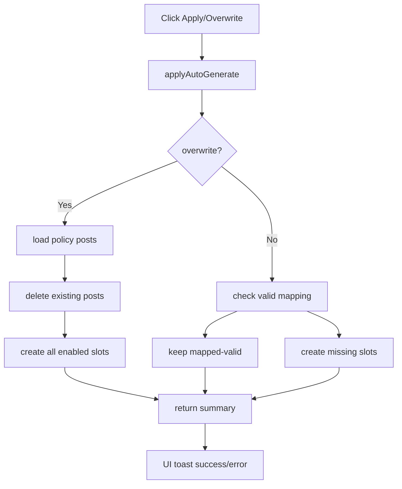

# I. Primer

## 1. TL;DR kiểu Feynman
- Cả hai nút `Áp dụng` và `Ghi đè` đều có vấn đề về contract + feedback.
- `Áp dụng` hiện tại không luôn tạo bài; nhiều case chỉ gắn mapping nên user thấy như “không làm gì”.
- `Ghi đè` về code có đi vào nhánh xoá và tạo lại, nhưng UI không bắt lỗi, không toast, không summary, nên nếu fail hoặc create xong user cũng không được báo gì.
- Có thêm một điểm rủi ro: nhánh `Ghi đè` xoá theo category `Chính sách`, rồi tạo lại toàn bộ trust pages, nhưng toàn bộ kết quả chỉ trả về âm thầm và dialog đóng luôn.
- Đề xuất: sửa backend contract cho `Áp dụng`, giữ semantics mạnh của `Ghi đè`, và bắt buộc thêm feedback/result rõ ràng cho cả hai nút.

## 2. Elaboration & Self-Explanation
User đang mô tả rất rõ một symptom thực tế: bấm `Sinh tự động từ dữ liệu thực` rồi bấm `Áp dụng` hoặc `Ghi đè`, nhưng không thấy bài nào được tạo và cũng không có thông báo gì.

Qua audit code, có hai lớp vấn đề:

### a) Vấn đề hành vi thực tế của `Áp dụng`
`Áp dụng` không phải “cứ bấm là tạo bài”. Nó chỉ tạo bài khi slot rơi vào nhánh `draft`. Nếu slot bị hệ thống xếp vào `suggested` hoặc `mapped`, mutation chỉ update setting mapping và dừng.

### b) Vấn đề observability của cả `Áp dụng` lẫn `Ghi đè`
Frontend gọi mutation trong `try/finally` nhưng không có `catch`, không `toast`, không summary. Nên:
- nếu mutation throw, user không được giải thích rõ;
- nếu mutation thành công nhưng kết quả không như kỳ vọng, user cũng không biết hệ thống đã làm gì;
- dialog chỉ đóng lại, tạo cảm giác “ấn không tác dụng”.

### c) Với `Ghi đè`
Nhánh backend hiện tại đúng là có logic:
1. lấy category `Chính sách`,
2. liệt kê post trong category,
3. xoá từng post bằng `PostsModel.remove(..., { cascade: true })`,
4. tạo lại post cho mọi slot enabled.

Nghĩa là về code-path, `Ghi đè` có ý định “xoá và tạo lại toàn bộ”. Nhưng vì frontend không hề surface kết quả/error, nên symptom user thấy vẫn là “không tạo ra gì đâu, không báo gì luôn”.

Nói ngắn gọn: một phần là bug semantics ở `Áp dụng`, một phần là bug UX/observability ở cả hai nút, và đây là lý do user cảm nhận như hỏng hoàn toàn.

## 3. Concrete Examples & Analogies
### a) Ví dụ sát repo
Slot `/privacy` chưa có mapping tay, nhưng trong category `Chính sách` đã có một bài cũ tên gần giống `Chính sách bảo mật`.

- `previewAutoGenerate` có thể xếp slot đó thành `suggested`.
- Bấm `Áp dụng` thì backend chỉ lưu `trust_page_privacy_post_id = existingPostId`.
- Không có `PostsModel.create(...)`.
- UI đóng dialog, không báo `đã gắn 1 bài`, cũng không báo `0 bài được tạo`.
- User nhìn vào danh sách và kết luận là hệ thống hỏng.

### b) Ví dụ với `Ghi đè`
Bấm `Ghi đè` thì backend sẽ cố xoá các bài trong category `Chính sách` rồi tạo lại 7 bài trust pages.

- Nếu thành công: hiện tại UI vẫn không báo `đã tạo 7 bài`.
- Nếu có lỗi giữa chừng: hiện tại UI cũng không báo `lỗi khi xoá/tạo`.

### c) Analogy đời thường
Giống nút `Khôi phục mặc định` trên điện thoại: nếu bấm xong màn hình chỉ tự đóng mà không báo thành công hay lỗi, người dùng sẽ mặc định nghĩ là nút bị hỏng, kể cả khi bên trong có chạy một phần logic.

# II. Audit Summary (Tóm tắt kiểm tra)
- Route admin: `E:\NextJS\study\admin-ui-aistudio\system-vietadmin-nextjs\app\admin\trust-pages\page.tsx`
- Mutation backend: `E:\NextJS\study\admin-ui-aistudio\system-vietadmin-nextjs\convex\trustPages.ts`
- Post create/remove thực tế:
  - `E:\NextJS\study\admin-ui-aistudio\system-vietadmin-nextjs\convex\model\posts.ts`

## Evidence chính
### 1. Nút UI
- `Sinh tự động từ dữ liệu thực` mở preview modal: `app/admin/trust-pages/page.tsx:273-275`.
- `Ghi đè` gọi `handleApplyAutoGenerate(true)`: `app/admin/trust-pages/page.tsx:387-388`.
- `Áp dụng` gọi `handleApplyAutoGenerate(false)`: `app/admin/trust-pages/page.tsx:390-391`.

### 2. Frontend handler thiếu feedback
- `handleApplyAutoGenerate` chỉ:
  - set loading,
  - await mutation,
  - sync `pageMappings`,
  - đóng modal,
  - rồi `finally` tắt loading.
- Không có `catch`, không `toast.success`, không `toast.error`, không hiển thị summary: `app/admin/trust-pages/page.tsx:220-234`.

### 3. `Áp dụng` không luôn tạo bài
- Với `overwrite=false`:
  - `mapped`/`suggested` => chỉ update mapping, không create: `convex/trustPages.ts:601-618`.
  - chỉ `draft` mới create: `convex/trustPages.ts:620-635`.

### 4. `Ghi đè` có xoá và tạo lại thật ở code path
- `overwrite=true`:
  - lấy toàn bộ bài trong category `Chính sách`: `convex/trustPages.ts:565-566`.
  - xoá từng bài bằng `PostsModel.remove(ctx, { cascade: true, id: post._id })`: `convex/trustPages.ts:567-569`.
  - sau đó với mỗi slot enabled sẽ build payload và `PostsModel.create(...)`: `convex/trustPages.ts:578-597`.
- `PostsModel.remove` thực sự `ctx.db.delete(id)` sau khi xoá comments nếu `cascade=true`: `convex/model/posts.ts:272-291`.
- `PostsModel.create` thực sự `ctx.db.insert('posts', ...)`: `convex/model/posts.ts:145-202`.

# III. Root Cause & Counter-Hypothesis (Nguyên nhân gốc & Giả thuyết đối chứng)
## 1. Root Cause Confidence
- High.

## 2. Trả lời 8 câu audit
### a) Triệu chứng quan sát được là gì (expected vs actual)?
- Expected: bấm `Áp dụng` hoặc `Ghi đè` phải tạo ra bài trust pages, ít nhất phải báo đã tạo hay báo lỗi.
- Actual: user không thấy bài được tạo và cũng không thấy thông báo nào.

### b) Phạm vi ảnh hưởng?
- Admin `/admin/trust-pages`.
- Query preview và mutation `applyAutoGenerate`.
- Tất cả slot trust pages.

### c) Có tái hiện ổn định không? điều kiện tái hiện tối thiểu?
- Theo code, symptom “không báo gì” là tái hiện ổn định 100% vì handler không có feedback.
- Symptom “Áp dụng không tạo bài” tái hiện ổn định khi slot bị classify thành `suggested`/`mapped`.
- Symptom “Ghi đè không thấy tạo gì” có thể tái hiện về mặt cảm nhận ngay cả khi mutation thành công, vì UI không báo kết quả.

### d) Mốc thay đổi gần nhất?
- Chưa có evidence commit cụ thể cho flow này trong audit hiện tại.
- Nhưng code path hiện hành đã đủ giải thích triệu chứng, không cần giả định thêm regression khác.

### e) Dữ liệu nào đang thiếu để kết luận chắc chắn hơn?
- Result payload thực tế của mutation khi user bấm `Ghi đè`.
- Snapshot posts/category hiện có trước và sau thao tác trên local user.
- Có hay không lỗi runtime từ Convex/network tại thời điểm bấm.

### f) Có giả thuyết thay thế hợp lý nào chưa bị loại trừ?
- Có:
  1. Mutation bị throw ở giữa quá trình xoá/tạo.
  2. Category `Chính sách` hoặc feature flag có trạng thái bất thường theo dữ liệu thật.
  3. UI list/query đang stale nên create xong nhưng danh sách chưa phản ánh ngay.
- Nhưng dù giả thuyết nào đúng, bug feedback vẫn tồn tại chắc chắn.

### g) Rủi ro nếu fix sai nguyên nhân là gì?
- Nếu chỉ sửa toast mà không sửa contract `Áp dụng`, user vẫn bấm `Áp dụng` mà không có bài mới.
- Nếu chỉ sửa contract backend mà không thêm feedback, `Ghi đè` vẫn cho trải nghiệm “không biết đã làm gì”.

### h) Tiêu chí pass/fail sau khi sửa?
- `Áp dụng`: slot chưa có valid mapping thì phải tạo post mới.
- `Ghi đè`: phải xoá + tạo lại toàn bộ slot enabled.
- Cả hai nút phải báo rõ số bài đã tạo/giữ/xoá hoặc lỗi cụ thể nếu fail.

## 3. Root cause tách theo từng nút
### a) Root cause của `Áp dụng`
- Logic hiện tại ưu tiên reuse/mapping thay vì create, nên không khớp kỳ vọng user.

### b) Root cause của `Ghi đè`
- Chưa có evidence rằng backend không chạy nhánh xoá+tạo.
- Root cause chắc chắn hiện có là frontend không surface bất kỳ kết quả hay lỗi nào, nên user không thể biết `Ghi đè` đã chạy gì.
- Ngoài ra, mutation hiện tại cũng không trả summary tách bạch `deletedCount/createdCount`, nên frontend không có contract tốt để hiển thị.

## 4. Counter-Hypothesis
- Counter-hypothesis 1: Backend `Ghi đè` thật ra chạy thành công, chỉ là UI không báo gì.
  - Khả năng: High.
  - Evidence: code path create/delete có tồn tại và rõ ràng.
- Counter-hypothesis 2: Backend `Ghi đè` fail giữa chừng nên user không thấy bài nào.
  - Khả năng: Medium.
  - Evidence thiếu vì UI không `catch` và audit chưa có runtime log.
- Decision: phải sửa cả contract result + feedback UI, đồng thời khi implement sẽ kiểm tra static flow để đảm bảo `overwrite` trả summary đủ giàu.

# IV. Proposal (Đề xuất)
## 1. Hướng xử lý đề xuất
- `Áp dụng`:
  - đổi semantics thành `slot enabled mà chưa có mapping hợp lệ thì tạo bài mới`;
  - không auto-reuse `suggested` theo cách im lặng nữa.
- `Ghi đè`:
  - giữ semantics hiện tại `xoá và tạo lại toàn bộ slot enabled`;
  - bổ sung summary rõ ràng từ backend để frontend hiển thị kết quả.
- Cả hai nút:
  - thêm `catch` + `toast.error`;
  - thêm `toast.success` hoặc summary text với số lượng thao tác thực tế.

## 2. Cụ thể ở backend
### a) `convex/trustPages.ts`
- Mở rộng return của `applyAutoGenerate` để có summary tách bạch, ví dụ:
  - `deletedCount`
  - `createdCount`
  - `mappedCount`
  - `disabledCount`
  - `mode: 'apply' | 'overwrite'`
- Với `overwrite=true`:
  - đếm số bài đã xoá;
  - đếm số bài đã tạo;
  - trả về danh sách `results` rõ hơn để UI có thể hiển thị.
- Với `overwrite=false`:
  - create cho slot chưa có valid mapping;
  - giữ nguyên cho slot đã mapped-valid.

### b) Bảo toàn thay đổi nhỏ
- Không thêm schema.
- Không refactor PostsModel.
- Chỉ sửa đúng flow auto-generate trust-pages.

## 3. Cụ thể ở frontend
### a) `app/admin/trust-pages/page.tsx`
- Import toast theo pattern sẵn có (`sonner`).
- Bọc `applyAutoGenerate` trong `try/catch/finally`.
- Sau khi mutation xong:
  - nếu `overwrite`: báo kiểu `Đã xóa X bài và tạo lại Y bài trust pages`;
  - nếu `apply`: báo kiểu `Đã tạo X bài mới, giữ Y mapping`.
- Nếu lỗi: `toast.error(error instanceof Error ? error.message : 'Có lỗi xảy ra')`.
- Có thể giữ đóng dialog sau thành công, nhưng không được đóng “im lặng”.

## 4. Mermaid flowchart

# V. Files Impacted (Tệp bị ảnh hưởng)
## 1. Server
- `Sửa: E:\NextJS\study\admin-ui-aistudio\system-vietadmin-nextjs\convex\trustPages.ts`
  - Vai trò hiện tại: build preview plan và apply auto-generate/overwrite.
  - Thay đổi: sửa semantics của `Áp dụng`, bổ sung summary cho cả `Áp dụng` và `Ghi đè`.

## 2. UI
- `Sửa: E:\NextJS\study\admin-ui-aistudio\system-vietadmin-nextjs\app\admin\trust-pages\page.tsx`
  - Vai trò hiện tại: render modal preview, gọi mutation, đóng modal.
  - Thay đổi: thêm error handling, toast/success summary, đồng bộ copy/badge với behavior mới.

# VI. Execution Preview (Xem trước thực thi)
1. Đọc lại `applyAutoGenerate` và xác định chính xác nhánh `overwrite`/`apply` cần sửa.
2. Chỉnh mutation result để trả summary dùng được cho UI.
3. Sửa semantics `apply(false)` để tạo post cho slot chưa có valid mapping.
4. Giữ `overwrite(true)` xoá+tạo lại, nhưng trả summary số lượng rõ ràng.
5. Sửa `page.tsx` để bắt lỗi và hiện toast/success summary.
6. Tự review tĩnh typing + shape result.
7. Trước commit, chạy `bunx tsc --noEmit` theo rule repo vì có sửa TS code.
8. Commit local, không push.

# VII. Verification Plan (Kế hoạch kiểm chứng)
## 1. Audit Summary
- Đã xác định được vì sao `Áp dụng` không tạo bài trong nhiều case và vì sao cả `Áp dụng`/`Ghi đè` đều cho cảm giác “ấn không có gì xảy ra”.

## 2. Root Cause Confidence
- High cho bug feedback.
- High cho bug semantics của `Áp dụng`.
- Medium cho giả thuyết `Ghi đè` có lỗi runtime bổ sung, vì chưa có log runtime.

## 3. Verification steps
- Static verify sau sửa:
  - `apply(false)` có nhánh create cho slot missing/invalid mapping.
  - `overwrite(true)` vẫn delete rồi create cho toàn bộ slot enabled.
  - return validator `returns(...)` khớp payload summary mới.
  - UI đọc được summary và hiển thị đúng thông điệp.
- Trước commit: `bunx tsc --noEmit`.
- Không chạy lint/unit test/build vì repo instruction cấm.

# VIII. Todo
1. Audit xong semantics của `Áp dụng` và `Ghi đè`.
2. Sửa `convex/trustPages.ts` cho contract đúng và có summary.
3. Sửa `app/admin/trust-pages/page.tsx` để có toast/error handling.
4. Tự review tĩnh + `bunx tsc --noEmit`.
5. Commit local.

# IX. Acceptance Criteria (Tiêu chí chấp nhận)
- Bấm `Áp dụng` khi trust pages đang trống hoặc mapping invalid sẽ tạo bài mới thay vì im lặng reuse.
- Bấm `Ghi đè` sẽ xoá các bài policy cũ trong scope trust-pages và tạo lại toàn bộ slot enabled.
- Sau mỗi thao tác, admin thấy thông báo rõ số lượng đã xoá/tạo/giữ.
- Nếu mutation lỗi, admin thấy lỗi rõ ràng thay vì dialog chỉ đóng hoặc loading tắt.
- Diff chỉ chạm flow trust-pages liên quan trực tiếp đến vấn đề này.

# X. Risk / Rollback (Rủi ro / Hoàn tác)
- Rủi ro: `Ghi đè` có thể xoá nhiều bài hơn mong muốn nếu scope category `Chính sách` đang chứa bài không phải trust-pages.
- Khi implement cần rà kỹ scope hiện tại trước khi giữ nguyên hay siết hẹp phạm vi xoá.
- Rollback: revert commit vì thay đổi khu trú ở trust-pages UI + mutation.

# XI. Out of Scope (Ngoài phạm vi)
- Không redesign toàn bộ module posts/categories.
- Không sửa route site public trừ khi phát hiện bug trực tiếp do trust-page mapping.
- Không thêm UI wizard mới.

# XII. Open Questions (Câu hỏi mở)
- Một câu cần confirm khi implement: nhánh `Ghi đè` hiện đang xoá toàn bộ bài trong category `Chính sách`, không chỉ 7 bài trust-pages. Nếu repo đang dùng category này cho các bài policy khác, cần quyết định có siết phạm vi xoá theo mapping/slot hay giữ nguyên semantics hiện tại.