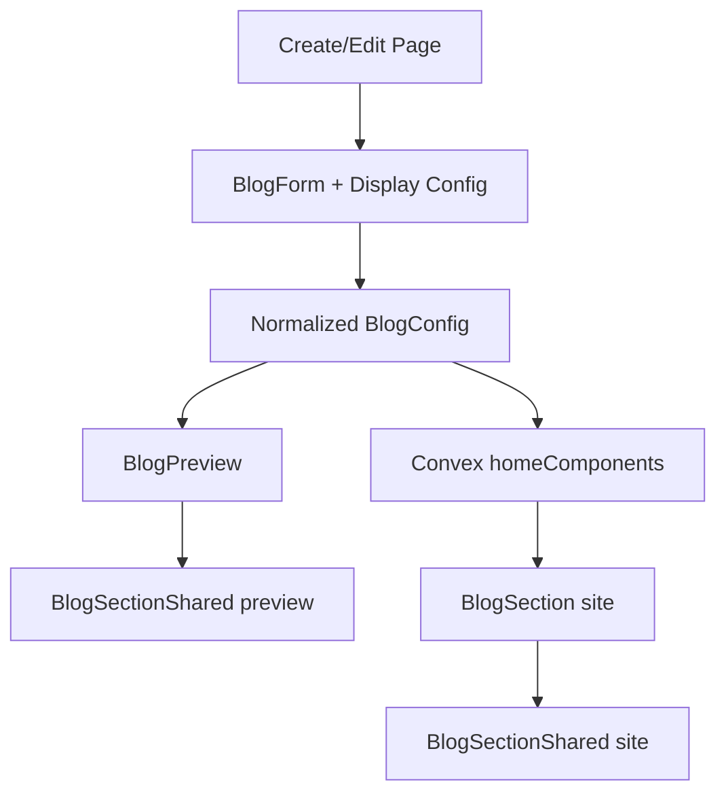

# I. Primer
## 1. TL;DR kiểu Feynman
- Hiện blog đang có 6 style ở admin preview và site render, nhưng code bị tách đôi: preview tự render một bộ, site tự render một bộ khác.
- Hai home-component bạn vừa sửa trước đó (testimonials, faq) đã đi theo pattern tốt hơn: gom layout thật vào shared section để preview và site bám cùng một xương.
- Source ngoài `C:\Users\VTOS\Downloads\blog-homecomponent` có 6 layout mới và nhiều control UI hơn như subtitle, showDate, showExcerpt, showAuthor.
- Kế hoạch tốt nhất là thay toàn bộ 6 layout blog theo source, đồng thời chuẩn hóa config + shared renderer để create/edit/site/preview đi chung một cơ chế.
- Mục tiêu không chỉ “đổi giao diện”, mà còn tránh lệch preview với site trong các lần sửa sau.

## 2. Elaboration & Self-Explanation
- Quan sát hiện tại: `app/admin/home-components/blog/_components/BlogPreview.tsx` đang tự chứa gần như toàn bộ layout preview. Trong khi `components/site/BlogSection.tsx` cũng tự chứa toàn bộ layout site. Nghĩa là cùng một component blog nhưng đang có 2 nơi tự dựng giao diện riêng.
- Vấn đề của cách này là mỗi lần đổi layout sẽ phải sửa đôi. Nếu quên một bên, preview ở admin nhìn một kiểu nhưng site ra kiểu khác.
- Ở testimonials và faq, repo đã vừa chuyển sang cách làm tốt hơn: tạo `*SectionShared.tsx` để chứa “xương giao diện” chung, rồi preview/site chỉ đóng vai trò bọc shell, query data và truyền props. Đó là cơ chế nên áp sang blog.
- Source ngoài lại đang cung cấp đúng thứ cần dùng cho đợt này: 6 layout rõ ràng, có controls đi kèm, có responsive preview theo device. Nhưng source là một app demo riêng, nên không thể copy nguyên xi; cần map nó vào contract hiện có của repo: Convex data, type color override, type font override, sticky footer, create/edit route, site renderer.
- Vì bạn muốn làm luôn create + edit + site render + preview, và muốn mang toàn bộ control từ source vào, nên scope hợp lý là: mở rộng `BlogConfig`, chuẩn hóa layer normalize, tách shared renderer, rồi wiring đồng bộ ở create/edit/site.

## 3. Concrete Examples & Analogies
- Ví dụ cụ thể trong repo:
  - `app/admin/home-components/testimonials/_components/TestimonialsSectionShared.tsx` là nơi giữ layout thật.
  - `app/admin/home-components/testimonials/_components/TestimonialsPreview.tsx` chỉ lo preview wrapper + device/style switch.
  - Đây là mẫu trực tiếp để blog làm theo.
- Ví dụ cụ thể với blog:
  - Thay vì để `BlogPreview.tsx` có `renderGrid/renderList/renderFeatured/...`, sẽ chuyển các khối này sang `BlogSectionShared.tsx`.
  - `components/site/BlogSection.tsx` sẽ không còn dựng từng style riêng bằng một bộ code khác, mà dùng cùng shared renderer với `context="site"`.
- Analogy đời thường:
  - Hiện tại preview và site giống như có 2 đầu bếp nấu cùng một món theo 2 công thức khác nhau. Mỗi lần đổi vị phải nhắc cả 2. Pattern shared section là quay về một công thức gốc, còn mỗi đầu bếp chỉ thay cách bày đĩa.

# II. Audit Summary (Tóm tắt kiểm tra)
- Observation:
  - Local branch đang có các commit chưa push tập trung vào home-components, đặc biệt testimonials/faq:
    - `d4a88ac1 feat(testimonials): upgrade showcase layouts`
    - `ac7d3ede feat(faq): refresh admin layouts from showcase patterns`
    - `8e276c06 fix(faq): align preview layouts with showcase parity`
    - cùng các commit fix custom color override.
  - `app/admin/home-components/create/blog/page.tsx` hiện chỉ proxy sang `ProductListCreateShared`, tức create blog chưa có flow riêng theo blog.
  - `app/admin/home-components/blog/_components/BlogPreview.tsx` đang monolithic, tự render đủ 6 style preview.
  - `components/site/BlogSection.tsx` cũng đang monolithic và render 6 style site riêng biệt.
  - `app/admin/home-components/blog/[id]/edit/page.tsx` đã có logic color/font override, selected posts, sort mode, style, sticky footer.
  - Source `C:\Users\VTOS\Downloads\blog-homecomponent` có 6 layout mới trong `components/NewsLayouts.tsx`, kèm các controls UI ở `app/page.tsx`: title, subtitle, showAuthor, showExcerpt, showDate, preview device.
- Inference:
  - Blog đang là component còn “lệch pattern” so với testimonials/faq sau đợt refactor gần đây.
  - Source ngoài phù hợp để thay layout, nhưng cần chuyển hóa sang contract nội bộ thay vì bê nguyên demo app.
- Decision:
  - Chọn hướng refactor blog theo pattern testimonials/faq và map 6 layout source vào style blog hiện tại.

# III. Root Cause & Counter-Hypothesis (Nguyên nhân gốc & Giả thuyết đối chứng)
## 1. Root Cause Confidence
- High.
- Lý do: Có evidence rõ ở file path và commit gần đây rằng preview/site parity của repo đang được chuẩn hóa bằng shared section, trong khi blog chưa theo pattern đó.

## 2. Root Cause
1. Triệu chứng quan sát được là gì (expected vs actual)?
   - Expected: create/edit/preview/site của blog dùng cùng cơ chế render như testimonials/faq, dễ thay layout mà không lệch nhau.
   - Actual: blog đang có preview renderer và site renderer tách đôi, create còn dùng shared của product-list.
2. Phạm vi ảnh hưởng?
   - User admin chỉnh blog component ở `/admin/home-components/create/blog` và `/admin/home-components/blog/[id]/edit`.
   - Site render qua `components/site/BlogSection.tsx`.
3. Có tái hiện ổn định không?
   - Có, đọc code thấy ổn định: 2 bề mặt đang render bằng 2 implementation riêng.
4. Mốc thay đổi gần nhất?
   - Testimonials và faq vừa được chuẩn hóa ở các commit local chưa push; blog chưa được kéo theo đợt chuẩn hóa đó.
5. Dữ liệu nào đang thiếu?
   - Chưa có runtime visual verification vì theo rule repo không tự chạy lint/test/runtime. Nhưng evidence code đủ để lập plan triển khai.
6. Có giả thuyết thay thế hợp lý nào chưa bị loại trừ?
   - Có thể chỉ đổi layout preview thôi. Nhưng user đã xác nhận muốn sửa cả create + edit + site render + preview, nên giả thuyết đó bị loại cho scope hiện tại.
7. Rủi ro nếu fix sai nguyên nhân?
   - Nếu chỉ copy UI source vào preview mà không chuẩn hóa shared renderer/config, lần sau lại lệch site với preview.
8. Tiêu chí pass/fail sau khi sửa?
   - 6 layout mới hiện ở create/edit/preview/site; config mới lưu/đọc ổn; color/font override không vỡ; manual/auto selection vẫn hoạt động.

## 3. Counter-Hypothesis (Giả thuyết đối chứng)
- Giả thuyết A: Chỉ cần copy 6 layout mới vào `BlogPreview.tsx` là đủ.
  - Bị loại vì `components/site/BlogSection.tsx` vẫn là code khác; parity không được đảm bảo.
- Giả thuyết B: Chỉ sửa site render, giữ admin như cũ.
  - Bị loại vì bạn yêu cầu làm cả create + edit + preview + site.
- Giả thuyết C: Tạo style mới thay vì map đè style cũ.
  - Không phù hợp hiện tại vì sẽ nở config/API hơn mức cần thiết; user muốn áp 6 layout từ source vào blog hiện có.

# IV. Proposal (Đề xuất)
## 1. Hướng thực hiện đề xuất
- Option A (Recommend) — Confidence 90%: Giữ 6 style key hiện tại (`grid`, `list`, `featured`, `magazine`, `carousel`, `minimal`), nhưng thay implementation UI bằng 6 layout mới gần nhất theo source; đồng thời refactor sang shared section + mở rộng config blog.
  - Vì sao tốt nhất: ít đổi contract bên ngoài nhất, không phải migrate style ids, vẫn đạt mục tiêu đổi giao diện và parity toàn bộ surfaces.
  - Tradeoff: cần chạm khá nhiều file blog nhưng vẫn gói trong phạm vi component blog.
- Option B — Confidence 65%: Đổi hẳn naming/style contract sang `layout1..layout6` theo source.
  - Phù hợp khi muốn bám source tuyệt đối và chấp nhận migrate config cũ.
  - Tradeoff: tốn thêm normalize/migration, rủi ro backward compatibility cao hơn.

## 2. Implementation concept
- Tạo shared renderer cho blog giống pattern testimonials/faq:
  - `BlogSectionShared` nhận `context`, `device`, `style`, `items`, `tokens`, `title`, `subtitle`, và các flags hiển thị.
- Preview admin:
  - `BlogPreview` chỉ giữ wrapper card, style toggle, device toggle, warning/colors info.
  - Phần layout thật render qua `BlogSectionShared`.
- Site render:
  - `components/site/BlogSection.tsx` chỉ lo query data, chuẩn hóa posts, route/link, rồi gọi `BlogSectionShared` với `context="site"`.
- Config:
  - Mở rộng `BlogConfig` để thêm các control từ source: `subtitle`, `showAuthor`, `showExcerpt`, `showDate`.
  - Nếu source cần field nào chỉ mang tính demo và không có dữ liệu thật trong repo, sẽ map tối thiểu hoặc degrade gracefully.
- Create/Edit:
  - Tách create blog khỏi `ProductListCreateShared` để có form riêng giống edit page.
  - Reuse `BlogForm` và bổ sung khối config heading/display options.
  - Giữ nguyên flow type color override/type font override.
- Normalize:
  - Thêm helper normalize config/style trong `blog/_types` hoặc `_lib` để create/edit/site cùng đọc một contract.

## 3. Mermaid diagram

# V. Files Impacted (Tệp bị ảnh hưởng)
## 1. UI admin
- Sửa: `E:\NextJS\study\admin-ui-aistudio\system-vietadmin-nextjs\app\admin\home-components\create\blog\page.tsx`
  - Vai trò hiện tại: chỉ bridge sang `ProductListCreateShared`.
  - Thay đổi: thay bằng create flow riêng cho blog để support toàn bộ config/layout/control mới.
- Sửa: `E:\NextJS\study\admin-ui-aistudio\system-vietadmin-nextjs\app\admin\home-components\blog\[id]\edit\page.tsx`
  - Vai trò hiện tại: edit blog data, style, manual selection, color/font override.
  - Thay đổi: thêm state + persist cho subtitle/showAuthor/showExcerpt/showDate và dùng preview mới.
- Sửa: `E:\NextJS\study\admin-ui-aistudio\system-vietadmin-nextjs\app\admin\home-components\blog\_components\BlogForm.tsx`
  - Vai trò hiện tại: quản lý data source auto/manual và chọn bài viết.
  - Thay đổi: mở rộng để chứa display config/heading config từ source, nhưng vẫn tách biệt với preview renderer.
- Sửa: `E:\NextJS\study\admin-ui-aistudio\system-vietadmin-nextjs\app\admin\home-components\blog\_components\BlogPreview.tsx`
  - Vai trò hiện tại: render đầy đủ 6 layout preview trong một file.
  - Thay đổi: rút gọn còn preview shell + style/device toggle + color info/warnings.
- Thêm: `E:\NextJS\study\admin-ui-aistudio\system-vietadmin-nextjs\app\admin\home-components\blog\_components\BlogSectionShared.tsx`
  - Vai trò mới: source of truth cho 6 layout blog, dùng chung cho preview/site.

## 2. Shared types/lib
- Sửa: `E:\NextJS\study\admin-ui-aistudio\system-vietadmin-nextjs\app\admin\home-components\blog\_types\index.ts`
  - Vai trò hiện tại: định nghĩa `BlogStyle`, `BlogConfig`, preview item.
  - Thay đổi: mở rộng config mới và thêm helper normalize/persist nếu đặt tại đây.
- Sửa: `E:\NextJS\study\admin-ui-aistudio\system-vietadmin-nextjs\app\admin\home-components\blog\_lib\constants.ts`
  - Vai trò hiện tại: default config + sorting helpers.
  - Thay đổi: cập nhật default config cho control mới, map labels/layout contract nếu cần.
- Có thể sửa: `E:\NextJS\study\admin-ui-aistudio\system-vietadmin-nextjs\app\admin\home-components\blog\_lib\colors.ts`
  - Vai trò hiện tại: tokens màu cho blog.
  - Thay đổi: chỉ chỉnh nếu layout source cần thêm token mới; ưu tiên tái dùng token hiện có để giảm scope.

## 3. Site render
- Sửa: `E:\NextJS\study\admin-ui-aistudio\system-vietadmin-nextjs\components\site\BlogSection.tsx`
  - Vai trò hiện tại: query dữ liệu và tự render 6 style site.
  - Thay đổi: giữ phần query/sort/link, nhưng render giao diện qua `BlogSectionShared`.

## 4. Có thể cần chạm nhẹ shared admin surface
- Có thể sửa: `E:\NextJS\study\admin-ui-aistudio\system-vietadmin-nextjs\app\admin\home-components\create\shared.tsx` hoặc file shared liên quan nếu create page cần reuse layout shell hiện có.
  - Vai trò hiện tại: shared helper cho create pages.
  - Thay đổi: chỉ chạm nếu cần để giữ trải nghiệm create đồng bộ; không refactor ngoài scope.

# VI. Execution Preview (Xem trước thực thi)
1. Đọc kỹ create blog hiện tại và các helper shared liên quan để xác định có thể tái dùng gì.
2. Tạo `BlogSectionShared.tsx` bằng cách map 6 layout từ source vào token/data contract của repo.
3. Refactor `BlogPreview.tsx` để chỉ còn wrapper preview và gọi shared section với `context="preview"`.
4. Refactor `components/site/BlogSection.tsx` để gọi shared section với `context="site"`, vẫn giữ query/link/sort hiện có.
5. Mở rộng `BlogConfig` + defaults + normalize helpers cho `subtitle`, `showAuthor`, `showExcerpt`, `showDate`.
6. Cập nhật `BlogForm.tsx` để quản các controls mới nhưng không nhét layout logic vào form.
7. Thay `create/blog/page.tsx` từ shared generic sang flow create riêng cho blog, bám edit page hiện có.
8. Cập nhật `blog/[id]/edit/page.tsx` để load/save/snapshot/hasChanges đúng với config mới.
9. Static self-review: typing, backward compatibility config cũ, null-safety, manual/auto selection, color/font override dirty-state.
10. Khi hoàn tất code sẽ chạy `bunx tsc --noEmit` trước commit theo rule repo, rồi commit local không push.

# VII. Verification Plan (Kế hoạch kiểm chứng)
- Static verification:
  - `bunx tsc --noEmit` vì có thay đổi TS/code.
- Repro checklist thủ công để đối chiếu sau khi code xong:
  - `/admin/home-components/create/blog`: chọn đủ 6 style, đổi device preview, đổi title/subtitle, toggle showAuthor/showExcerpt/showDate.
  - `/admin/home-components/blog/[id]/edit`: load config cũ không vỡ; sửa config mới thấy `hasChanges` hoạt động đúng; save xong state reset đúng.
  - Site: component blog render đúng layout tương ứng, manual/auto selection đúng thứ tự/số lượng.
  - Type color override và type font override vẫn áp dụng được.
- Pass/fail focus:
  - Không lệch style giữa preview và site.
  - Config mới lưu và đọc lại được.
  - Config cũ thiếu field mới vẫn có default an toàn.

# VIII. Todo
1. Tạo shared section cho blog theo pattern testimonials/faq.
2. Map 6 layout từ source vào style contract blog hiện tại.
3. Mở rộng `BlogConfig` với subtitle/showAuthor/showExcerpt/showDate.
4. Refactor preview admin sang dùng shared renderer.
5. Refactor site render sang dùng shared renderer.
6. Tách create blog sang flow riêng và nối form/config mới.
7. Cập nhật edit page để load/save/snapshot đúng.
8. Tự review tĩnh, chạy `bunx tsc --noEmit`, rồi commit local.

# IX. Acceptance Criteria (Tiêu chí chấp nhận)
- 6 style blog hiện tại hiển thị giao diện mới gần với 6 layout trong source ngoài.
- Preview admin và site render dùng cùng một shared renderer, không còn 2 bộ layout tách rời.
- Create blog không còn dùng generic `ProductListCreateShared`; có đầy đủ controls blog-specific.
- Edit blog load được config cũ và config mới, không mất backward compatibility cơ bản.
- Các control mới `subtitle`, `showAuthor`, `showExcerpt`, `showDate` lưu/đọc được ở create + edit + site + preview.
- Manual/auto selection, sortBy, itemCount vẫn hoạt động.
- Type color override và type font override không bị regress.
- `bunx tsc --noEmit` pass trước khi commit.
- Có commit local, không push.

# X. Risk / Rollback (Rủi ro / Hoàn tác)
- Rủi ro 1: Scope chạm nhiều file blog nên dễ làm lệch config cũ.
  - Giảm thiểu: normalize default rõ ràng, field mới luôn có fallback.
- Rủi ro 2: Source ngoài có field demo không map hoàn hảo vào dữ liệu posts thật.
  - Giảm thiểu: degrade gracefully, ví dụ author chỉ hiển thị khi dữ liệu có hoặc dùng fallback phù hợp nếu contract cho phép.
- Rủi ro 3: Dirty-state save logic ở edit page dễ bị sót khi thêm config mới.
  - Giảm thiểu: cập nhật snapshot `initialState/currentState` đồng bộ với config mới.
- Rollback:
  - Vì thay đổi gói trong blog home-component, có thể rollback bằng commit revert nếu layout mới không đạt kỳ vọng.

# XI. Out of Scope (Ngoài phạm vi)
- Không refactor testimonials/faq hoặc các home-component khác.
- Không đổi schema business ngoài những field config cần thiết cho blog component.
- Không thêm docs/readme.
- Không push remote.

# XII. Open Questions (Câu hỏi mở)
- Không còn ambiguity lớn sau khi bạn đã chốt: áp 6 layout gần source nhất, làm toàn bộ create + edit + site render + preview, và mang toàn bộ control từ source vào.