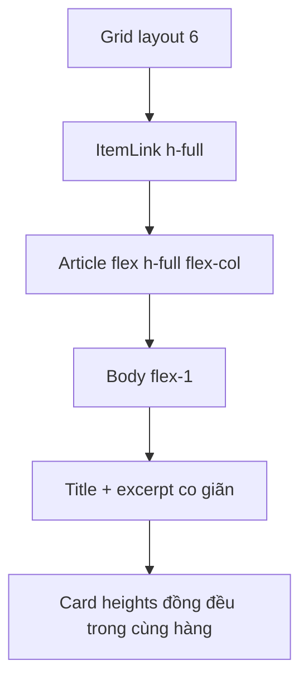

# I. Primer
## 1. TL;DR kiểu Feynman
- Layout 6 đang để mỗi card tự cao theo lượng chữ thật của bài viết.
- Vì bài ngắn bài dài khác nhau nên hàng card bị lệch đáy, nhìn không đều.
- Layout 1 đã có pattern tốt hơn: card `h-full`, phần body `flex-1`, nội dung cuối được neo xuống đáy.
- Hướng xử lý: áp lại pattern đó cho layout 6.
- User đã chốt áp dụng ở tất cả breakpoint, không chỉ desktop.
- Sửa 1 chỗ trong `BlogSectionRuntime` thì create/edit/site cùng đồng bộ.

## 2. Elaboration & Self-Explanation
Ở layout 6, mỗi item hiện được render bằng một `article` có border + shadow, nhưng wrapper card chưa được ép `h-full flex flex-col`, còn phần content bên trong cũng chưa được cho `flex-1` để tự kéo giãn theo chiều cao lớn nhất của grid row. Kết quả là nếu card A có title/excerpt ngắn hơn card B, card A sẽ thấp hơn và cả hàng nhìn bị lượn sóng.

Layout 1 giải quyết việc này bằng cách dùng card dạng cột với `h-full`, rồi bọc content trong một vùng `flex flex-1 flex-col`; phần text/excerpt chiếm phần co giãn, còn phần cuối giữ vị trí ổn định. Ta không cần thêm JS hay đo chiều cao runtime. Chỉ cần sửa cấu trúc flex/CSS ở layout 6 là đủ vì CSS Grid mặc định có thể stretch item khi phần tử con cho phép cao đầy đủ.

Vì `BlogPreview` và `components/site/BlogSection.tsx` đều dùng chung `BlogSectionRuntime`, thay đổi này sẽ tự lan sang create, edit và site mà không cần chạm thêm file khác.

## 3. Concrete Examples & Analogies
Ví dụ cụ thể:
- Card 1 có title 1 dòng + excerpt 1 dòng.
- Card 2 có title 2 dòng + excerpt 3 dòng.
- Trước khi sửa: card 1 thấp hơn card 2, đáy 2 card không thẳng hàng.
- Sau khi sửa: cả 2 card cao bằng nhau trong cùng hàng; card ngắn vẫn có khoảng trống hợp lý ở phần body nhưng khung ngoài bằng nhau.

Analogy đời thường:
- Giống một dãy kệ trưng bày. Dù món đồ bên trong cao thấp khác nhau, mặt ngoài của các ô kệ vẫn nên thẳng hàng để nhìn gọn và cao cấp.

# II. Audit Summary (Tóm tắt kiểm tra)
- Observation: `app/admin/home-components/blog/_components/BlogSectionRuntime.tsx` ở nhánh cuối của layout 6 đang render mỗi item bằng `article` chưa có `h-full flex flex-col`.
- Observation: phần body layout 6 (`div` bọc title/excerpt) đang chỉ có padding, chưa có `flex-1` hay cấu trúc đẩy nội dung để card stretch đều.
- Observation: layout 1 trong cùng file đã dùng pattern card cân bằng tốt hơn với `article` dạng `flex h-full flex-col` và body `flex flex-1 flex-col`.
- Observation: create/edit preview và site đều dùng chung `BlogSectionRuntime`, nên bug UI này có phạm vi cả preview và site.
- Inference: nguyên nhân chính là contract flex height của layout 6 chưa hoàn chỉnh, không phải do grid hoặc dữ liệu.

# III. Root Cause & Counter-Hypothesis (Nguyên nhân gốc & Giả thuyết đối chứng)
- Root cause chính — Confidence High:
  - Layout 6 thiếu các class flex cần thiết để card kéo cao đồng đều theo hàng grid.
  - Body content chưa được cấu trúc để phần excerpt chiếm vùng co giãn ổn định như layout 1.
- Counter-hypothesis 1:
  - Có thể do ảnh khác tỷ lệ nên card lệch.
  - Đã loại trừ phần lớn vì ảnh đang bị khóa cùng `aspect-[16/10]`; chênh lệch thấy rõ đến từ vùng text.
- Counter-hypothesis 2:
  - Có thể cần JS đo chiều cao từng card.
  - Không cần, vì layout 1 đã chứng minh chỉ cần flex/grid đúng là đủ.
- Counter-hypothesis 3:
  - Có thể chỉ nên sửa desktop.
  - User đã chốt áp dụng cho tất cả breakpoint.

# IV. Proposal (Đề xuất)
- Chọn Option A (Recommend) — Confidence 90%.
- Sửa tối thiểu trong layout 6 của `BlogSectionRuntime`:
  1. Đổi `ItemLink` của layout 6 thành wrapper có `h-full` để item trong grid được stretch ổn định.
  2. Đổi `article` thành `flex h-full flex-col`.
  3. Đổi phần body content thành `flex flex-1 flex-col`.
  4. Nếu có excerpt, cho block excerpt nhận `flex-1` hoặc ít nhất neo phần dưới bằng `mt-auto`/cấu trúc tương đương để chiều cao card cân bằng như layout 1.
  5. Giữ nguyên nav/pagination layout 6 vừa làm, không thay logic đó.
- Không mở rộng scope:
  - Không sửa layout 1/2/3/4/5.
  - Không thay đổi line clamp hiện tại nếu không bắt buộc.
  - Không thêm JS đo chiều cao.

# V. Files Impacted (Tệp bị ảnh hưởng)
- Sửa: `E:\NextJS\study\admin-ui-aistudio\system-vietadmin-nextjs\app\admin\home-components\blog\_components\BlogSectionRuntime.tsx`
  - Vai trò hiện tại: renderer dùng chung cho tất cả blog layouts ở preview/site.
  - Thay đổi: chuẩn hóa cấu trúc flex của card layout 6 để item cao đều theo pattern layout 1.
- Rà soát, dự kiến không cần sửa: `E:\NextJS\study\admin-ui-aistudio\system-vietadmin-nextjs\app\admin\home-components\blog\_components\BlogPreview.tsx`
  - Vai trò hiện tại: truyền dữ liệu preview vào runtime.
  - Thay đổi: không đổi logic, chỉ hưởng lợi từ runtime sau khi sửa.
- Rà soát, dự kiến không cần sửa: `E:\NextJS\study\admin-ui-aistudio\system-vietadmin-nextjs\components\site\BlogSection.tsx`
  - Vai trò hiện tại: lấy data published và render runtime cho site.
  - Thay đổi: không đổi logic, chỉ verify parity sau sửa runtime.

# VI. Execution Preview (Xem trước thực thi)
1. Đọc lại block render layout 6 trong `BlogSectionRuntime.tsx`.
2. So sánh nhanh với pattern `h-full/flex-1` của layout 1.
3. Chỉnh wrapper `ItemLink` và `article/body` của layout 6 để stretch full height.
4. Review tĩnh để chắc rằng excerpt/title vẫn clamp đúng và nav layout 6 không bị ảnh hưởng.
5. Verify parity create/edit/site, rồi chạy typecheck theo rule repo.

# VII. Verification Plan (Kế hoạch kiểm chứng)
- Audit Summary:
  - Soát static markup của layout 6 trước/sau để bảo đảm card có `h-full` và body có `flex-1`.
- Root Cause Confidence:
  - High, vì evidence nằm trực tiếp ở cấu trúc class/layout giữa layout 1 và layout 6.
- Verification Plan:
  - Typecheck: chạy `bunx tsc --noEmit` sau khi được phép thực thi vì có sửa TSX.
  - Repro checklist:
    - Create preview layout 6 với 3 bài có độ dài title/excerpt khác nhau: đáy card phải thẳng hàng.
    - Edit preview layout 6: đổi bài ngắn/dài vẫn giữ chiều cao đồng đều.
    - Site layout 6: card trong cùng hàng cao đều như preview.
    - Mobile/tablet/desktop: đều áp dụng behavior cân bằng chiều cao như user chốt.
  - Static review:
    - Đảm bảo không phá line clamp.
    - Đảm bảo nav layout 6 vừa làm vẫn hoạt động và không lệch vị trí.

# VIII. Todo
- [ ] Chuẩn hóa wrapper/item layout 6 sang `h-full`.
- [ ] Chuẩn hóa `article` và body layout 6 sang pattern `flex flex-col` + `flex-1`.
- [ ] Rà soát visual parity với layout 1 về nguyên tắc cân bằng chiều cao.
- [ ] Verify create/edit/site và chạy typecheck sau khi được phép thực thi.

# IX. Acceptance Criteria (Tiêu chí chấp nhận)
- Layout 6 có card cao đều trong cùng hàng khi title/excerpt dài ngắn khác nhau.
- Hành vi này áp dụng ở mobile, tablet và desktop.
- Preview create, preview edit và site có cùng behavior.
- Nav/pagination của layout 6 không bị regress.
- Không có thay đổi ngoài scope ở các layout khác.

# X. Risk / Rollback (Rủi ro / Hoàn tác)
- Rủi ro:
  - Nếu đặt `flex-1` sai chỗ, spacing nội dung trong card có thể giãn không đẹp.
  - Nếu wrapper ngoài không nhận `h-full`, card vẫn có thể không stretch như mong muốn.
- Hoàn tác:
  - Chỉ cần revert phần markup/class của layout 6 trong `BlogSectionRuntime.tsx`.

# XI. Out of Scope (Ngoài phạm vi)
- Không redesign layout 6.
- Không đổi số dòng clamp của title/excerpt trừ khi bắt buộc để giữ cấu trúc hiện tại.
- Không sửa layout 1/2/3/4/5.
- Không thêm equal-height bằng JS.

# XII. Open Questions (Câu hỏi mở)
- Không còn. User đã chốt áp dụng cho tất cả breakpoint.