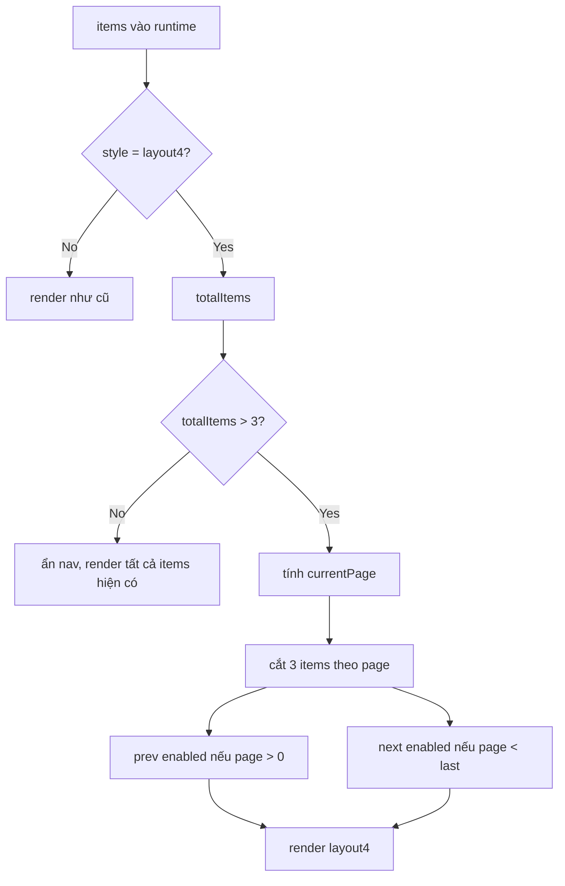

# I. Primer
## 1. TL;DR kiểu Feynman
- Layout 4 đang vẽ sẵn 2 nút mũi tên nhưng chưa có logic chuyển trang thật.
- Vì vậy ở create/edit preview nhìn như click được, nhưng thực tế chỉ là UI cứng.
- Hướng chốt: chia dữ liệu layout 4 theo trang 3 bài.
- Nút trái/phải chỉ bật khi còn trang trước/sau.
- Nếu tổng số bài chỉ có 3 hoặc ít hơn thì ẩn hẳn cụm nút cho gọn.
- Sửa trong runtime dùng chung nên preview admin và site sẽ đồng bộ hành vi.

## 2. Elaboration & Self-Explanation
Hiện `BlogSectionRuntime` là nơi render tất cả layout blog cho cả `preview` và `site`. Ở nhánh `style === 'layout4'`, header đang có 2 nút mũi tên render cố định, không phụ thuộc số lượng bài và không có `onClick` hay state trang. Điều đó tạo ra cảm giác “có carousel” nhưng thật ra không chạy.

Cách xử lý an toàn nhất là thêm state phân trang cục bộ ngay trong `BlogSectionRuntime` cho riêng layout 4. Khi có hơn 3 bài, component sẽ tính `currentPage`, cắt danh sách theo `pageSize = 3`, rồi điều khiển prev/next bằng điều kiện biên. Khi đang ở trang đầu, nút prev disable; ở trang cuối, nút next disable. Nếu chỉ có tối đa 3 bài thì không cần nav vì không có gì để lật.

Vì `BlogPreview` và `components/site/BlogSection.tsx` đều đi qua `BlogSectionRuntime`, sửa 1 chỗ sẽ giữ parity giữa create, edit, preview và site.

## 3. Concrete Examples & Analogies
Ví dụ cụ thể:
- Có 2 bài: layout 4 chỉ hiện 2 card, không hiện cụm mũi tên.
- Có 3 bài: hiện đủ 3 card, vẫn không hiện cụm mũi tên.
- Có 4 bài: trang 1 hiện bài 1-3, nút prev disable, nút next clickable; bấm next sang trang 2 hiện bài 4, nút next disable.
- Có 7 bài: có 3 trang; prev/next bật tắt tùy `currentPage`.

Analogy đời thường:
- Giống nút thang máy. Nếu không còn tầng để đi lên thì nút lên phải mờ/không bấm; nếu chỉ có một tầng thì không cần hiện cụm nút đó.

# II. Audit Summary (Tóm tắt kiểm tra)
- Observation: `app/admin/home-components/blog/_components/BlogSectionRuntime.tsx:530-545` render 2 nút arrow cố định trong layout 4.
- Observation: 2 nút này không có `onClick`, không có state trang, không dựa vào `items.length`.
- Observation: danh sách card layout 4 đang luôn lấy `visibleItems.slice(0, 3)` tại `BlogSectionRuntime.tsx:549-581`.
- Observation: `visibleItems` lại bị giới hạn bởi `getBlogVisibleItemLimit(style, context, device)` với layout 4 là 3 item tại `BlogSectionRuntime.tsx:34-40`, nên runtime hiện không thể dùng item > 3 cho layout 4.
- Observation: `BlogPreview.tsx` dùng `BlogSectionRuntime` cho create/edit preview.
- Observation: `components/site/BlogSection.tsx` cũng dùng `BlogSectionRuntime` cho site.
- Inference: root issue không chỉ là hard-code nút, mà còn do pipeline dữ liệu đang cắt layout 4 còn tối đa 3 item trước khi render, khiến nav không có dữ liệu để hoạt động.

# III. Root Cause & Counter-Hypothesis (Nguyên nhân gốc & Giả thuyết đối chứng)
- Root cause chính — Confidence High:
  - Layout 4 được thiết kế với UI nav giả lập nhưng chưa có state/phân trang thật.
  - Đồng thời `visibleItems` đang cắt cứng còn 3 item cho layout 4, nên dù thêm click vào nút cũng không có trang sau nếu không điều chỉnh nguồn item dùng cho layout này.
- Counter-hypothesis 1:
  - Có thể user chỉ muốn ẩn mũi tên, không cần pagination.
  - Đã loại trừ vì user chốt rõ: “nút nào click được thì clickable không thì disable” và đã chọn phương án paginate 3 bài.
- Counter-hypothesis 2:
  - Có thể chỉ preview bị hard-code, site không bị.
  - Đã loại trừ vì cả preview và site đều đi qua cùng `BlogSectionRuntime`.

# IV. Proposal (Đề xuất)
- Chọn Option A (Recommend) — Confidence 90%.
- Sửa tối thiểu trong runtime dùng chung:
  1. Tách logic item cho layout 4 khỏi `visibleItems` cắt cứng 3 bài.
  2. Tính `layout4PageSize = 3`, `layout4TotalPages`, `layout4CurrentPage`, `layout4PagedItems`.
  3. Chỉ render cụm nav khi `items.length > 3`.
  4. Nút prev/next có `onClick` ở `preview`, và ở `site` vẫn dùng state client nội bộ vì file là client component.
  5. Thêm style disabled rõ ràng: giảm opacity, bỏ hover, `disabled` thật.
  6. Khi `items` thay đổi hoặc style đổi khỏi layout 4, reset/truncate `currentPage` để không lệch trang.
- Giữ nguyên scope:
  - Không đụng layout 1/2/3/5/6.
  - Không thêm thư viện.
  - Không đổi schema/config.

# V. Files Impacted (Tệp bị ảnh hưởng)
- Sửa: `E:\NextJS\study\admin-ui-aistudio\system-vietadmin-nextjs\app\admin\home-components\blog\_components\BlogSectionRuntime.tsx`
  - Vai trò hiện tại: renderer dùng chung cho blog preview/site của toàn bộ layouts.
  - Thay đổi: thêm phân trang cục bộ cho layout 4, logic show/hide/disable nav, và cắt item theo trang thay vì hard-code chỉ hiển thị 3 item đầu mãi mãi.
- Rà soát, dự kiến không cần sửa: `E:\NextJS\study\admin-ui-aistudio\system-vietadmin-nextjs\app\admin\home-components\blog\_components\BlogPreview.tsx`
  - Vai trò hiện tại: bọc preview admin và truyền `items` vào runtime.
  - Thay đổi: không đổi logic, chỉ verify parity sau khi runtime đổi.
- Rà soát, dự kiến không cần sửa: `E:\NextJS\study\admin-ui-aistudio\system-vietadmin-nextjs\components\site\BlogSection.tsx`
  - Vai trò hiện tại: lấy dữ liệu published posts và truyền xuống runtime cho site.
  - Thay đổi: không đổi logic nếu runtime xử lý đủ.

# VI. Execution Preview (Xem trước thực thi)
1. Đọc lại nhánh `layout4` trong `BlogSectionRuntime.tsx` và điểm cắt `visibleItems`.
2. Thêm state/page calculations riêng cho layout 4.
3. Đổi nguồn render card layout 4 từ `visibleItems.slice(0, 3)` sang `layout4PagedItems`.
4. Thêm điều kiện ẩn nav khi tổng item <= 3.
5. Gắn `onClick` + `disabled` + class trạng thái cho prev/next.
6. Review tĩnh để tránh ảnh hưởng layout khác và tránh page out-of-range khi item count đổi.

# VII. Verification Plan (Kế hoạch kiểm chứng)
- Audit Summary:
  - Kiểm tra tĩnh các nhánh render layout 4, giới hạn item, và state reset khi dữ liệu đổi.
- Root Cause Confidence:
  - High, vì đã xác định đúng 2 điểm evidence: nav hard-code và dữ liệu bị cắt cứng còn 3 item trước render.
- Verification Plan:
  - Typecheck: dự kiến chạy `bunx tsc --noEmit` sau khi user duyệt spec vì có thay đổi TS/TSX.
  - Repro checklist:
    - Create blog với layout 4, manual 2-3 bài: không hiện nav.
    - Create blog với layout 4, manual 4+ bài: hiện nav, prev disable ở trang đầu, next clickable.
    - Edit blog với layout 4, đổi item count/manual selection: nav cập nhật theo số bài.
    - Site blog section layout 4: parity với preview, nút chuyển trang hoạt động tương tự.
  - Static review:
    - Đảm bảo layout khác không thay đổi markup/hành vi.
    - Đảm bảo không tạo hydration mismatch do state phụ thuộc props không ổn định.

# VIII. Todo
- [ ] Cập nhật logic item source cho layout 4 để không bị chặn ở 3 item đầu cố định.
- [ ] Thêm pagination cục bộ 3 bài/trang cho layout 4.
- [ ] Ẩn nav khi tổng item <= 3.
- [ ] Disable đúng prev/next theo trang hiện tại.
- [ ] Review parity create/edit/site và chạy typecheck theo rule của repo sau khi được phép thực thi.

# IX. Acceptance Criteria (Tiêu chí chấp nhận)
- Layout 4 không còn hiển thị 2 nút mũi tên cố định trong trường hợp chỉ có 3 bài hoặc ít hơn.
- Khi có nhiều hơn 3 bài, layout 4 hiển thị đúng 3 bài mỗi trang.
- Nút prev chỉ clickable khi có trang trước; nếu không thì disabled thật và có style disabled rõ.
- Nút next chỉ clickable khi có trang sau; nếu không thì disabled thật và có style disabled rõ.
- Create preview, edit preview và site render giống nhau về hành vi nav của layout 4.
- Không có thay đổi ngoài scope ở layout 1/2/3/5/6.

# X. Risk / Rollback (Rủi ro / Hoàn tác)
- Rủi ro:
  - Nếu sửa nhầm `visibleItems` dùng chung, có thể ảnh hưởng layout khác.
  - Nếu không reset page khi item count giảm, có thể rơi vào trang rỗng.
- Hoàn tác:
  - Rollback chỉ cần revert thay đổi trong `BlogSectionRuntime.tsx`.

# XI. Out of Scope (Ngoài phạm vi)
- Không thêm swipe/drag carousel.
- Không thêm autoplay.
- Không thay đổi data fetching, schema, hay admin form.
- Không chuẩn hóa nav của layout 5/6 trong task này.

# XII. Open Questions (Câu hỏi mở)
- Không còn. User đã chốt phương án paginate 3 bài/trang cho layout 4.