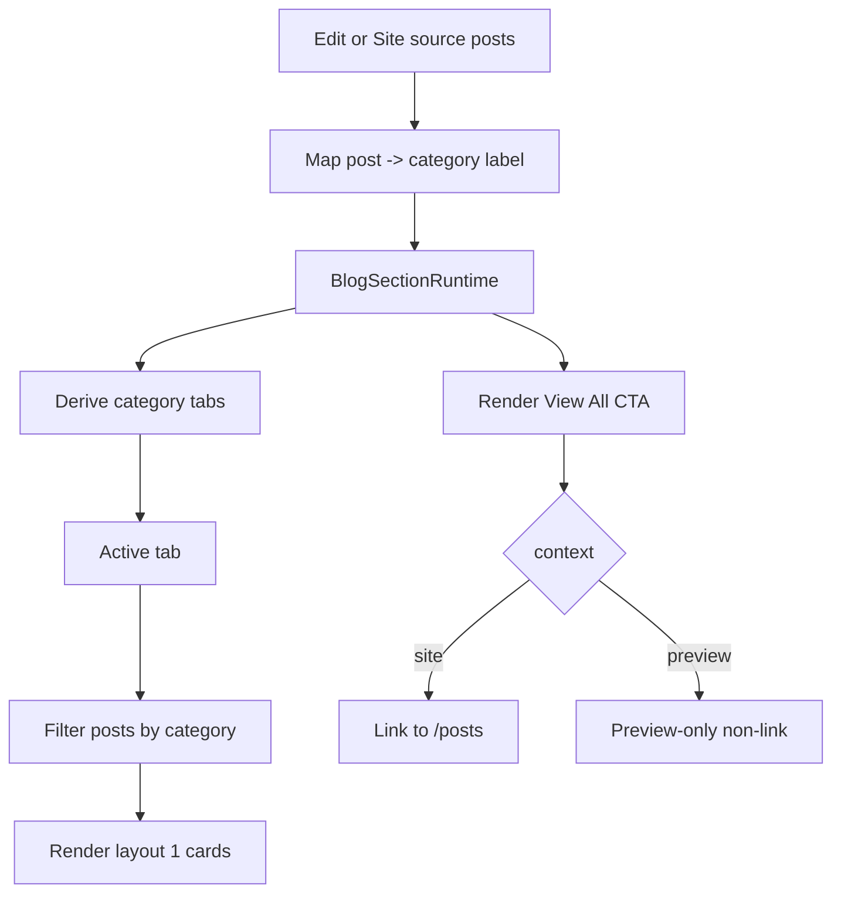

# I. Primer
## 1. TL;DR kiểu Feynman
- Layout 1 đang có 2 tab danh mục viết cứng là “Mẹo hay” và “Món ngon”, nên không phản ánh đúng bài viết thật đã chọn.
- Dữ liệu danh mục thật của từng bài đã có sẵn ở cả preview admin và site runtime; chỉ là renderer chưa dùng nó để tạo tab động.
- Nút “Xem tất cả” ở cả 6 layout đang chủ yếu là `div`/`span`/`button` giả giao diện, nên không click sang `/posts` được.
- Cách sửa gọn nhất là chỉnh shared renderer `BlogSectionRuntime.tsx`, vì cả preview và site đều đi qua file này.
- Với layout 1, tab sẽ sinh từ danh mục thật của các bài đang được feed vào component; bấm tab nào thì lọc bài theo tab đó.
- Với cả 6 layout, “Xem tất cả” sẽ dùng cùng contract `viewAllHref`, khi ở site thì là link thật tới `/posts`, khi ở preview thì giữ dạng non-interactive preview như hiện tại.

## 2. Elaboration & Self-Explanation
Hiện tại blog home-component đã có sẵn dữ liệu bài viết và tên danh mục thật. Trang edit lấy posts + categories từ Convex, trang preview map mỗi post sang object có field `category`, còn site runtime cũng map category name tương tự trước khi truyền vào renderer dùng chung.

Vấn đề nằm ở chỗ renderer layout 1 không đọc các category đó để dựng tab. Nó đang vẽ thẳng 2 nút cố định. Vì vậy dù user chọn bài viết thuộc danh mục nào, giao diện vẫn chỉ hiện 2 nhãn giả.

Tương tự, nút “Xem tất cả” ở nhiều layout chỉ là phần tử trang trí để mô phỏng UI. Chúng không đi qua helper `renderViewAll(...)` hoặc không được bọc bằng `Link`, nên trên site không bấm được.

Do `BlogSectionRuntime.tsx` là source of truth chung cho preview và site, sửa đúng file này sẽ tạo parity tốt nhất: preview thấy đúng cấu trúc mới, site dùng đúng hành vi mới, không phải chắp vá nhiều nơi.

## 3. Concrete Examples & Analogies
### a) Ví dụ cụ thể theo task này
Giả sử user chọn 5 bài gồm:
- 2 bài category = `SEO`
- 2 bài category = `Thiết kế web`
- 1 bài không có category

Sau khi sửa, layout 1 sẽ sinh tab theo dữ liệu thật, ví dụ:
- `SEO`
- `Thiết kế web`
- `Tin tức` (fallback cho bài không có category)

Khi bấm `Thiết kế web`, grid chỉ hiện các bài thuộc `Thiết kế web`, tối đa theo giới hạn layout. Khi bấm `Xem tất cả`, site sẽ sang `/posts`.

### b) Analogy đời thường
Giống quầy sách trong siêu thị: nếu biển ngăn kệ luôn ghi sẵn “Sách hay” và “Món ngon” bất kể bên dưới đang trưng sách gì thì người dùng sẽ bị sai hướng. Cách đúng là nhìn đúng nhóm sách đang có rồi tạo nhãn kệ tương ứng.

# II. Audit Summary (Tóm tắt kiểm tra)
## 1. Observation (Quan sát)
### a) Hardcode tab layout 1
- `app/admin/home-components/blog/_components/BlogSectionRuntime.tsx:302-303`
- Có 2 nút cố định: `Mẹo hay`, `Món ngon`.

### b) Preview đã có category thật trên từng bài
- `app/admin/home-components/blog/_components/BlogPreview.tsx:188-214`
- `displayPosts` map `category` từ `categoryMap[post.categoryId]` hoặc fallback `'Tin tức'`.
- `BlogPreview.tsx:261-273` truyền `items={displayPosts}` vào `BlogSectionRuntime`.

### c) Site cũng đã có category thật trên từng bài
- `components/site/BlogSection.tsx:108-118`
- Mỗi post được map `category: categoryMap.get(post.categoryId) ?? 'Tin tức'` trước khi truyền vào `BlogSectionRuntime`.
- `viewAllHref` hiện đã truyền `/posts` ở `components/site/BlogSection.tsx:126` nhưng renderer chưa dùng nhất quán cho mọi layout.

### d) Nút “Xem tất cả” của nhiều layout đang không phải link thật
- Layout 1: `div` ở cuối section.
- Layout 2: `span`.
- Layout 4: `div`.
- Layout 5: `div`.
- Layout 6: `div`.
- Layout 3 có dùng `renderViewAll(...)` ở header, nhưng chưa có CTA cuối layout như các layout khác; yêu cầu mới là bảo đảm nút “Xem tất cả” cho cả 6 layout click được đúng behavior.

## 2. Root-cause checklist theo protocol
### a) Triệu chứng observed vs expected
- Expected: layout 1 hiển thị tab theo danh mục thật của bài viết đã chọn; nút “Xem tất cả” ở 6 layout click được sang `/posts` trên site.
- Actual: layout 1 hiện 2 nhãn hardcode; nhiều CTA “Xem tất cả” chỉ là UI giả, không click được.

### b) Phạm vi ảnh hưởng
- Ảnh hưởng preview admin và site runtime của blog home-component.
- Phạm vi chủ yếu nằm trong renderer shared cho 6 layout.

### c) Tái hiện
- Tái hiện ổn định: chỉ cần mở create/edit blog home-component hoặc site dùng component blog.

### d) Mốc thay đổi gần nhất
- Chưa thấy evidence trực tiếp commit gây ra bug này; nhưng code hiện tại cho thấy hardcode và non-link là nguyên nhân trực tiếp.

### e) Dữ liệu đang thiếu
- Không thiếu dữ liệu quan trọng để chốt hướng sửa tối thiểu.

### f) Giả thuyết thay thế chưa loại trừ
- Không phải do Convex không trả category.
- Không phải do page edit/site không truyền `viewAllHref`.
- Không phải do thiếu dữ liệu selected posts.

### g) Rủi ro nếu fix sai nguyên nhân
- Nếu sửa ở edit page/site page mà không sửa shared runtime, preview-site parity sẽ lệch.
- Nếu thêm config mới không cần thiết, scope sẽ phình không cần thiết.

### h) Tiêu chí pass/fail sau sửa
- Layout 1 sinh tab động từ category thật trong source posts.
- Click tab đổi được nhóm bài hiển thị.
- CTA “Xem tất cả” ở cả 6 layout đi `/posts` khi context=`site`.
- Preview vẫn render đúng nhưng không cần navigation thật.

# III. Root Cause & Counter-Hypothesis (Nguyên nhân gốc & Giả thuyết đối chứng)
## 1. Root Cause Confidence
- High.
- Lý do: evidence chỉ ra dữ liệu category và `viewAllHref` đã có upstream, nhưng `BlogSectionRuntime.tsx` không sử dụng đúng cho layout 1 tabs và nhiều CTA cuối section.

## 2. Root cause chính
### a) Layout 1
- Renderer hardcode 2 tab trong `BlogSectionRuntime.tsx` thay vì derive từ `items[].category`.

### b) 6 layout CTA
- CTA “Xem tất cả” không được chuẩn hóa qua 1 helper/link contract thống nhất; nhiều layout dùng phần tử trình bày thay vì link thật.

## 3. Counter-hypothesis (Giả thuyết đối chứng)
### a) “Có thể preview/site chưa có category thật”
- Bị loại trừ bởi evidence ở `BlogPreview.tsx` và `components/site/BlogSection.tsx`.

### b) “Có thể site chưa truyền href”
- Bị loại trừ bởi `viewAllHref="/posts"` đã có ở `components/site/BlogSection.tsx`.

### c) “Có thể phải thêm schema/config mới”
- Chưa cần. Payload hiện tại đã đủ để sửa theo scope user yêu cầu.

# IV. Proposal (Đề xuất)
## 1. Hướng đề xuất
- Sửa tập trung tại `app/admin/home-components/blog/_components/BlogSectionRuntime.tsx`.
- Không đổi schema, không thêm config mới, không sửa query Convex.
- Tận dụng đúng `items`, `context`, `viewAllHref`, `getItemHref` đang có.

## 2. Hành vi mới cho layout 1 theo kiểu SaaS lớn
### a) Dynamic tabs từ dữ liệu thật
- Derive danh sách tab từ `items[].category` theo thứ tự xuất hiện.
- Normalize category label bằng `trim()`.
- Fallback category rỗng về `Tin tức` để khớp logic preview/site hiện tại.

### b) Default active tab
- Chọn tab đầu tiên làm mặc định.
- Nếu active tab không còn tồn tại khi data đổi, reset về tab đầu tiên hợp lệ.

### c) Filtering behavior
- Khi bấm tab nào, chỉ hiển thị các post thuộc tab đó.
- Sau khi filter mới áp giới hạn card của layout 1.
- Không tự bù bài từ category khác, vì user muốn bám đúng category thật của các bài đã chọn.

### d) Single-category behavior
- Nếu chỉ có 1 category, ẩn hẳn thanh tab để UI gọn hơn.
- Đây là hành vi gần với pattern SaaS/content blocks lớn: chỉ hiện segmentation khi thật sự có nhiều nhóm để chuyển.

## 3. Hành vi mới cho nút “Xem tất cả” ở 6 layout
### a) Chuẩn hóa helper CTA
- Dùng 1 helper chung để render CTA “Xem tất cả”.
- `context === 'site'`: bọc bằng `Link href={viewAllHref}`.
- `context === 'preview'`: render non-interactive visual như hiện tại để tránh điều hướng trong admin preview.

### b) Áp dụng cho cả 6 layout
- Layout 1, 2, 4, 5, 6: thay CTA cuối section hiện tại bằng helper clickable.
- Layout 3: giữ header CTA hiện có nhưng chuẩn hóa để chắc chắn click được theo đúng contract; nếu file hiện chưa có CTA cuối layout thì không thêm mới nếu không cần, tránh nở scope. Mục tiêu là mọi “Xem tất cả” hiện diện trong 6 layout đều dùng contract clickable đúng.

## 4. Vì sao đây là phương án tốt nhất trong ngữ cảnh này
- Ít file nhất, rollback dễ nhất.
- Giữ preview/site parity vì cùng sửa shared runtime.
- Không làm phình cấu hình component.
- Bám đúng source of truth hiện có thay vì tạo dữ liệu phụ.

# V. Files Impacted (Tệp bị ảnh hưởng)
## 1. UI shared
### a) Sửa: `app/admin/home-components/blog/_components/BlogSectionRuntime.tsx`
- Vai trò hiện tại: renderer dùng chung cho preview admin và site runtime của cả 6 blog layouts.
- Thay đổi: bỏ hardcode 2 tab layout 1, derive tab động từ `items[].category`, thêm state/filter cho active category, và chuẩn hóa CTA “Xem tất cả” clickable cho các layout đang dùng UI giả.

## 2. Khả năng không cần sửa thêm file khác
### a) Giữ nguyên: `app/admin/home-components/blog/_components/BlogPreview.tsx`
- Vai trò hiện tại: chuẩn bị `displayPosts` cho preview, đã map category thật.
- Thay đổi dự kiến: không cần nếu runtime đủ dùng.

### b) Giữ nguyên: `components/site/BlogSection.tsx`
- Vai trò hiện tại: fetch posts/categories và truyền `viewAllHref="/posts"` vào runtime.
- Thay đổi dự kiến: không cần nếu runtime dùng đúng contract hiện có.

# VI. Execution Preview (Xem trước thực thi)
## 1. Thứ tự thay đổi chính
### a) Đọc lại đoạn layout 1 trong `BlogSectionRuntime.tsx`
- Xác định đúng vùng derive `visibleItems` và CTA helper hiện có.

### b) Thêm logic category tabs cho layout 1
- Tạo helper normalize category label.
- Tạo `categories` unique từ source `items`.
- Tạo `activeCategory` state + sync khi `items` đổi.
- Tạo `layout1Items` sau filter rồi mới render grid.

### c) Chuẩn hóa CTA “Xem tất cả”
- Tạo helper render CTA cuối section theo variant cần thiết.
- Thay các `div/span/button` giả bằng helper dùng `viewAllHref` cho layout 1/2/4/5/6 và chuẩn hóa layout 3 nếu cần.

### d) Review tĩnh
- Soát type safety, branch preview/site, edge cases 0 category / 1 category / uncategorized.

# VII. Verification Plan (Kế hoạch kiểm chứng)
## 1. Static verification
- Soát TypeScript logic bằng đọc luồng prop/state và bảo đảm không tạo branch undefined.
- Theo rule repo, không tự chạy lint/build/test.

## 2. Repro checklist
### a) Layout 1 category tabs
- Mở create/edit blog home-component với selected posts thuộc nhiều category.
- Expected: tab hiển thị đúng danh mục thật thay vì “Mẹo hay / Món ngon”.
- Bấm từng tab, bài đổi đúng theo category.

### b) Single category
- Chỉ chọn bài thuộc 1 category.
- Expected: tab row được ẩn hoặc chỉ còn trạng thái gọn, không gây nhiễu.

### c) Uncategorized fallback
- Có bài không có category.
- Expected: xuất hiện dưới tab `Tin tức`.

### d) View all CTA
- Trên site, CTA “Xem tất cả” của các layout dẫn tới `/posts`.
- Trong preview admin, CTA vẫn hiển thị đúng nhưng không điều hướng thật.

# VIII. Todo
1. Đọc lại shared runtime để khóa đúng điểm chèn logic category tabs và CTA helper.
2. Sửa layout 1 để derive tab động từ category thật của source posts.
3. Thêm active-category filtering cho layout 1, giữ fallback `Tin tức`.
4. Chuẩn hóa CTA “Xem tất cả” dùng `viewAllHref` cho cả 6 layout.
5. Tự review tĩnh các edge cases và bảo đảm preview/site parity.

# IX. Acceptance Criteria (Tiêu chí chấp nhận)
## 1. Pass
- Layout 1 không còn text hardcode `Mẹo hay` và `Món ngon`.
- Tabs của layout 1 lấy từ category thật của các bài đang được feed vào component.
- Click tab đổi tập bài hiển thị theo category tương ứng.
- Nếu chỉ có 1 category, UI không hiển thị tab switching thừa.
- CTA “Xem tất cả” ở các layout blog dẫn sang `/posts` khi ở site runtime.
- Preview admin không bị điều hướng thật nhưng vẫn hiển thị đúng hình thức CTA.
- Không đổi schema/config/query nếu không cần.

## 2. Fail
- Còn bất kỳ layout nào hiển thị CTA “Xem tất cả” nhưng không click được trên site.
- Layout 1 vẫn hardcode tên tab hoặc tab không khớp source posts.
- Preview và site cho ra hành vi khác nhau vì sửa lệch nhiều file.

# X. Risk / Rollback (Rủi ro / Hoàn tác)
## 1. Rủi ro
- Vì `BlogPreviewItem` hiện chỉ có `category` dạng label, nếu có 2 category khác ID nhưng trùng tên thì tab sẽ gộp chung theo tên.
- Khi active tab có ít bài hơn giới hạn card, layout sẽ hiển thị ít card hơn; đây là expected theo source hiện tại.

## 2. Rollback
- Rollback rất đơn giản vì thay đổi tập trung chủ yếu ở 1 file shared runtime.
- Có thể revert riêng commit nếu UI behavior không phù hợp.

# XI. Out of Scope (Ngoài phạm vi)
- Không thêm bộ lọc category vào config form admin.
- Không thay đổi schema hoặc payload Convex để phân biệt category theo ID ở renderer.
- Không thêm route mới ngoài `/posts`.
- Không refactor các layout khác ngoài phần CTA “Xem tất cả” user yêu cầu.

# XII. Open Questions (Câu hỏi mở)
- Không có ambiguity quan trọng; yêu cầu đã đủ rõ để triển khai theo hướng tối thiểu, an toàn và bám parity preview/site.