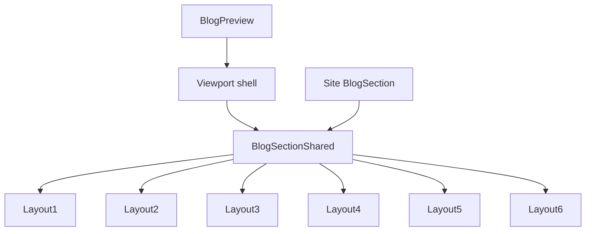

# I. Primer
## 1. TL;DR kiểu Feynman
- Hiện Blog dùng chung `BlogSectionShared` cho cả site thật và admin preview, nhưng 5 layout còn lại vẫn còn nhánh render phụ thuộc `context="preview"` hoặc `device`, nên preview và site có thể cùng dùng một component mà vẫn ra UI khác nhau.
- `layout4` đã gần đúng vì nó có contract rõ hơn: preview chỉ lo shell/viewport, còn bản thân layout render gần như cùng một cấu trúc với site.
- Hướng sửa là cho `layout1,2,3,5,6` đi theo cùng chuẩn đó: `BlogSectionShared` trở thành source of truth cho markup/layout, còn `BlogPreview` chỉ đóng vai trò giả lập viewport/device.
- Tức là: site và preview phải “mặc cùng một bộ quần áo”, chỉ khác “khung màn hình” đang nhìn vào.
- Sẽ giữ thay đổi nhỏ: gom logic parity vào shared layer, bỏ các nhánh preview-only không cần thiết, và đồng bộ create/edit cùng dùng một preview contract.

## 2. Elaboration & Self-Explanation
- Vấn đề user mô tả là: `layout4` đã đúng site thực và preview, còn `layout1,2,3,5,6` thì preview đang đúng nhưng site thực sai hoặc hai bên đang không cùng một chuẩn ổn định.
- Sau khi audit code, phần site runtime đang render qua `components/site/BlogSection.tsx`, và phần admin preview render qua `app/admin/home-components/blog/_components/BlogPreview.tsx`. Cả hai cùng gọi `BlogSectionShared.tsx`.
- Tuy nhiên `BlogSectionShared.tsx` hiện chưa thật sự “shared tuyệt đối”. File này vẫn có nhiều decision branch theo `context` và `device`, ví dụ:
  - `getPreviewLimit(style, device)` chỉ cắt item cho preview.
  - `getOuterShellClassName(style, context, device)` đổi shell theo preview/site.
  - `layout4` có grid class riêng cho preview desktop.
- Khi một shared renderer còn chứa nhiều branch kiểu này, chỉ cần preview shell hoặc site shell thay đổi nhẹ là từng layout sẽ drift. `layout4` hiện đúng vì nó đã được tinh chỉnh riêng nhiều vòng, còn các layout khác chưa được đưa về cùng contract.
- Đề xuất là chuẩn hóa lại theo một nguyên tắc: preview không được tự “sửa layout”, preview chỉ cung cấp viewport width và số item demo; còn markup/grid/spacing/outer shell của từng layout phải do một nguồn duy nhất quyết định.

## 3. Concrete Examples & Analogies
- Ví dụ cụ thể trong repo:
  - `components/site/BlogSection.tsx` gọi `BlogSectionShared(... context="site")`.
  - `BlogPreview.tsx` gọi `BlogSectionShared(... context="preview", device=...)`.
  - Bên trong `BlogSectionShared.tsx`, `layout4` đang có nhánh `context === 'preview' && device === 'desktop' ? 'grid-cols-3' : responsive grid...`.
  - Nếu `layout1,2,3,5,6` cũng còn các khác biệt shell/grid ẩn tương tự, preview và site sẽ không còn là một nguồn sự thật thống nhất.
- Analogy đời thường:
  - Cùng một bộ nội thất nhưng nhà mẫu và nhà thật đang dùng hai bản vẽ hơi khác nhau. `layout4` đã được sửa để cả hai cùng nhìn theo một bản vẽ. Việc cần làm bây giờ là bắt `layout1,2,3,5,6` cũng quay về đúng bản vẽ đó, thay vì mỗi nơi tự kê lại bàn ghế.

# II. Audit Summary (Tóm tắt kiểm tra)
- Observation:
  - `BlogPreview.tsx` đang render preview bằng `PreviewWrapper -> BrowserFrame -> viewport wrapper -> BlogSectionShared`.
  - `components/site/BlogSection.tsx` render site thật trực tiếp bằng `BlogSectionShared` với `context="site"`.
  - `BlogSectionShared.tsx` đang chứa logic layout cho toàn bộ `layout1..layout6`.
  - File này vẫn có các điểm phân nhánh theo preview/site:
    - `getPreviewLimit(style, device)`.
    - `getOuterShellClassName(style, context, device)`.
    - `layout4GridClassName` đổi theo `context` + `device`.
- Inference:
  - Drift không còn chỉ là lỗi shell riêng của layout4 như các lần fix trước; root issue là contract preview/site chưa được chuẩn hóa đồng đều cho toàn bộ 6 layout.
  - `layout4` hiện là layout gần đạt “single source of truth” nhất nên phù hợp làm baseline pattern.
- Decision:
  - Spec sẽ dùng `layout4` làm reference contract, sau đó áp cùng nguyên tắc cho `layout1,2,3,5,6`.

# III. Root Cause & Counter-Hypothesis (Nguyên nhân gốc & Giả thuyết đối chứng)
## Root Cause Confidence
- Medium-High.
- Lý do: evidence trực tiếp nằm trong code shared renderer và luồng gọi preview/site. Chưa có screenshot diff tự động, nhưng cấu trúc code đã cho thấy drift vector rõ ràng.

## Trả lời 8 câu audit bắt buộc
1. Triệu chứng quan sát được là gì?
   - Expected: preview và site thực của từng layout blog phải cùng một cấu trúc/spacing/grid behavior.
   - Actual: `layout4` đã đúng, còn `layout1,2,3,5,6` chưa được chuẩn hóa theo cùng contract nên có nguy cơ lệch preview/site hoặc site sai so với chuẩn mong muốn.
2. Phạm vi ảnh hưởng?
   - User admin khi create/edit Blog home-component.
   - Runtime site section Blog dùng `components/site/BlogSection.tsx`.
   - Ảnh hưởng cả create và edit như user đã chỉ rõ.
3. Có tái hiện ổn định không?
   - Có ở mức code-path: preview và site đi qua cùng shared file nhưng bị branch khác nhau theo `context`/`device`.
4. Mốc thay đổi gần nhất?
   - Git history gần nhất tập trung fix `layout4` preview parity (`47a4085e`, `9cfc324f`, `013d24b1`, `ee121b27`).
5. Dữ liệu nào còn thiếu?
   - Chưa có matrix screenshot side-by-side cho 6 layout trên desktop/tablet/mobile.
6. Có giả thuyết thay thế hợp lý nào chưa bị loại trừ?
   - Có: site thực sai do `components/site/BlogSection.tsx` nạp data khác preview.
   - Nhưng hypothesis này yếu hơn vì drift user mô tả bám mạnh vào layout contract, trong khi data mapping giữa preview/site khá thẳng và không đụng grid/shell.
7. Rủi ro nếu fix sai nguyên nhân?
   - Có thể làm preview đẹp hơn nhưng site vẫn lệch, hoặc ngược lại làm vỡ `layout4` vốn đang đúng.
8. Tiêu chí pass/fail sau khi sửa?
   - Mỗi layout `1,2,3,4,5,6` phải render theo cùng cấu trúc giữa preview và site, chỉ khác dữ liệu runtime và giới hạn viewport/device demo.

## Counter-Hypothesis (Giả thuyết đối chứng)
### a) Nguyên nhân nằm ở data khác nhau giữa preview và site
- Evidence phản biện:
  - `BlogPreview.tsx` map dữ liệu demo sang shape rất gần site runtime.
  - `components/site/BlogSection.tsx` cũng map sang cùng `BlogPreviewItem` shape trước khi đưa vào `BlogSectionShared`.
  - Sai khác user báo là “preview và site thực của layout”, nghiêng về shell/grid/spacing hơn là content.
- Kết luận:
  - Không phải nguyên nhân chính.

### b) Chỉ cần sửa riêng từng layout theo kiểu chắp vá
- Evidence phản biện:
  - Cách này đã từng xảy ra với `layout4` và dẫn đến nhiều commit fix liên tiếp.
  - Nếu tiếp tục sửa từng layout không có contract chung, drift sẽ quay lại.
- Kết luận:
  - Không recommend.

# IV. Proposal (Đề xuất)
## Option A (Recommend) — Confidence 88%
Chuẩn hóa `BlogSectionShared` thành renderer gần như context-agnostic cho `layout1,2,3,5,6`, theo pattern layout4 hiện tại.

### Ý chính
- `BlogPreview.tsx` chỉ chịu trách nhiệm:
  - giả lập device width,
  - giữ browser/frame shell,
  - truyền `device` để demo viewport khi thật sự cần,
  - truyền danh sách item preview.
- `BlogSectionShared.tsx` chịu trách nhiệm duy nhất cho:
  - outer shell/layout contract,
  - grid/list/card spacing,
  - typography hierarchy,
  - view-all/button placement,
  - responsive behavior nội tại của từng layout.
- Giảm tối đa các nhánh `context === 'preview'` trong từng layout; nếu cần khác biệt, chỉ cho phép ở tầng shell wrapper chung và phải có lý do rõ ràng như giới hạn số item preview.

### Cụ thể sẽ làm
- Audit lại `getOuterShellClassName` và đổi sang contract thống nhất kiểu `layout shell resolver` theo style, không chia nhánh preview/site trừ trường hợp bất khả kháng.
- Tách rõ 2 loại khác biệt:
  - `content difference`: preview limit item.
  - `layout difference`: không cho phép khác giữa preview/site trừ viewport width thật.
- Đưa `layout1,2,3,5,6` về cùng nguyên tắc mà `layout4` đang theo:
  - cùng outer shell,
  - cùng grid/list structure,
  - cùng button placement,
  - không có class chỉ dành cho preview nếu site cũng cần cùng kết quả.
- Review create/edit pages để chắc chắn cả hai đều dùng cùng `BlogPreview` contract sau refactor.

### Tradeoff
- Ưu điểm: bền, ít drift về sau, đúng yêu cầu “viết đúng 1 chuẩn để đồng bộ và tránh lệch”.
- Nhược điểm: cần chạm vào shared renderer, nên phải review kỹ để không làm regress layout4.

## Option B — Confidence 63%
Giữ `BlogSectionShared` như hiện tại, chỉ sửa `BlogPreview.tsx` shell để bắt chước site cho từng layout 1,2,3,5,6.
- Phù hợp khi muốn patch cực nhanh.
- Tradeoff: dễ lặp lại tình trạng layout4 trước đây, không giải quyết triệt để “1 chuẩn”.
- Không recommend vì trái với mục tiêu user nêu.

## Mermaid flow

# V. Files Impacted (Tệp bị ảnh hưởng)
## UI / shared
- Sửa: `E:\NextJS\study\admin-ui-aistudio\system-vietadmin-nextjs\app\admin\home-components\blog\_components\BlogSectionShared.tsx`
  - Vai trò hiện tại: shared renderer cho cả preview và site của toàn bộ 6 layout.
  - Thay đổi: chuẩn hóa outer shell + responsive/layout contract cho `layout1,2,3,5,6` theo pattern parity của `layout4`, giảm branch preview-only.

- Sửa: `E:\NextJS\study\admin-ui-aistudio\system-vietadmin-nextjs\app\admin\home-components\blog\_components\BlogPreview.tsx`
  - Vai trò hiện tại: dựng khung preview admin và bọc `BlogSectionShared`.
  - Thay đổi: giữ preview shell ở mức viewport/browser frame, bỏ các ép layout không cần thiết để shared renderer làm source of truth.

## UI / create-edit entry
- Sửa: `E:\NextJS\study\admin-ui-aistudio\system-vietadmin-nextjs\app\admin\home-components\blog\[id]\edit\page.tsx`
  - Vai trò hiện tại: màn edit blog home-component, truyền config sang preview.
  - Thay đổi: chỉ chỉnh nếu cần để giữ contract props sạch và đồng bộ sau refactor.

- Sửa: `E:\NextJS\study\admin-ui-aistudio\system-vietadmin-nextjs\app\admin\home-components\create\blog\page.tsx`
  - Vai trò hiện tại: màn create blog home-component, dùng chung preview.
  - Thay đổi: chỉ chỉnh nếu cần để create bám cùng contract như edit.

## Runtime reference
- Review tĩnh: `E:\NextJS\study\admin-ui-aistudio\system-vietadmin-nextjs\components\site\BlogSection.tsx`
  - Vai trò hiện tại: site runtime entry cho Blog section.
  - Thay đổi: ưu tiên không sửa; dùng làm chuẩn runtime để đối chiếu parity.

# VI. Execution Preview (Xem trước thực thi)
1. Đọc lại `BlogSectionShared.tsx`, map rõ chỗ nào là content-limit, chỗ nào là layout drift.
2. Chuẩn hóa helper shell/responsive để preview và site dùng cùng layout contract.
3. Refactor `layout1,2,3,5,6` bỏ nhánh preview-only không cần thiết, giữ `layout4` làm baseline.
4. Chỉnh `BlogPreview.tsx` nếu còn wrapper override làm lệch contract.
5. Soát create/edit pages để chắc chắn cùng dùng một preview path.
6. Tự review tĩnh TypeScript/null-safety và diff theo đúng scope.
7. Chuẩn bị commit local theo quy tắc repo sau khi user duyệt spec và implementation hoàn tất.

# VII. Verification Plan (Kế hoạch kiểm chứng)
- Vì repo instruction cấm tự chạy lint/unit test, sẽ không chạy lint/build/test.
- Verification tĩnh bắt buộc:
  - Soát type compatibility của `BlogPreview`, `BlogSectionShared`, create/edit pages.
  - Soát từng layout `1,2,3,4,5,6` để đảm bảo preview không còn markup/outer-shell drift ngoài viewport shell.
  - Soát `components/site/BlogSection.tsx` để bảo đảm runtime vẫn gọi shared renderer bằng cùng contract.
- Repro/inspection checklist sau khi code xong:
  - `/admin/home-components/blog/[id]/edit` và `/admin/home-components/create/blog`.
  - Chuyển 6 layout và xem preview desktop/tablet/mobile.
  - Đối chiếu với site thật của từng layout theo cùng config.
- Nếu có thay đổi code TypeScript, trước commit sẽ chạy `bunx tsc --noEmit` theo rule repo; không chạy lint/build.

# VIII. Todo
1. Chuẩn hóa shared parity contract cho blog layouts 1,2,3,5,6.
2. Giữ `layout4` nguyên vai trò baseline, tránh regress.
3. Giảm branch preview-only trong `BlogSectionShared.tsx`.
4. Tinh chỉnh `BlogPreview.tsx` để chỉ còn viewport shell.
5. Soát create/edit cùng dùng đúng preview contract.
6. Review tĩnh và chuẩn bị commit local khi implementation xong.

# IX. Acceptance Criteria (Tiêu chí chấp nhận)
- `layout4` tiếp tục đúng như hiện tại, không bị regress.
- `layout1,2,3,5,6` dùng cùng một chuẩn parity với `layout4`: preview không tự render khác site ngoài giới hạn viewport/device demo.
- `components/site/BlogSection.tsx` vẫn reuse `BlogSectionShared` mà không cần patch riêng từng layout.
- Trang create và edit Blog cho cùng kết quả preview khi cùng config.
- Diff chỉ chạm đúng scope blog preview/site parity, không lan sang component khác.

# X. Risk / Rollback (Rủi ro / Hoàn tác)
- Rủi ro chính:
  - Làm vỡ `layout4` vốn đang đúng.
  - Vô tình đổi spacing/site runtime của một layout khi đang cố đồng bộ preview.
- Giảm rủi ro:
  - Dùng `layout4` làm baseline bất biến.
  - Sửa theo từng helper/layout block thay vì rewrite toàn file.
  - Giữ `components/site/BlogSection.tsx` tối đa không đổi.
- Rollback:
  - Vì thay đổi tập trung ở blog shared renderer + preview wrapper, có thể rollback theo commit nếu parity không đạt.

# XI. Out of Scope (Ngoài phạm vi)
- Không đổi content/data query của posts.
- Không redesign lại giao diện blog layouts ngoài phần cần để parity đúng site/preview.
- Không mở rộng sang testimonials/faq hay home-components khác.
- Không chạy lint/build/unit test theo rule hiện tại của repo.

# XII. Open Questions (Câu hỏi mở)
- Không có blocker lớn. Có thể triển khai trực tiếp theo Option A nếu bạn duyệt spec này.