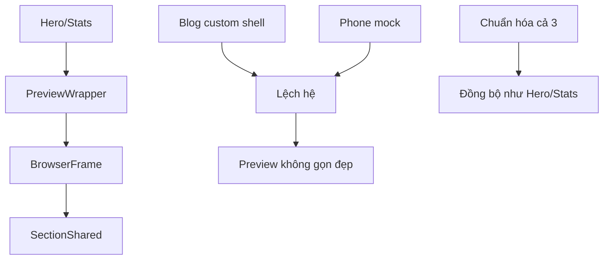

# I. Primer

## 1. TL;DR kiểu Feynman
- Lỗi không chỉ là “bị cắt”, mà là 3 preview `Blog`, `Testimonials` và `FAQ` đang dùng contract preview khác chuẩn đẹp/gọn của `Hero` và `Stats`.
- `Hero/Stats` nhìn gọn vì dùng cùng pattern: `PreviewWrapper` + `BrowserFrame` + không giả lập khung điện thoại nặng tay.
- `Blog` hiện là lệch nhất: còn tự dựng shell desktop riêng, còn mô phỏng điện thoại mobile, nên nhìn cồng kềnh và không đồng bộ.
- `FAQ` và `Testimonials` gần chuẩn hơn, nhưng vẫn cần rà lại để đồng bộ hẳn về wrapper/header/url bar/spacing và bỏ mô phỏng mobile nếu còn.
- Hướng fix nên là xử đúng root cause ở tầng preview shell của cả 3 component, không vá từng layout con.

## 2. Elaboration & Self-Explanation
Vấn đề chính ở đây là “preview contract” không thống nhất.

Một preview home-component đẹp/gọn trong repo này thường có 3 tầng rõ ràng:
1. `PreviewWrapper` lo card ngoài, switch style/device, info line.
2. `BrowserFrame` lo browser shell nhẹ, đồng bộ với các component khác.
3. `*SectionShared` lo render nội dung component theo `device`.

`Hero` và `Stats` đang bám pattern đó khá sạch, nên nhìn gọn, dễ đọc, ít noise thị giác.

Còn 3 component user nêu:
- `BlogPreview`: đang lệch mạnh nhất vì có custom desktop canvas và còn mô phỏng điện thoại mobile bằng bo góc lớn, ring, notch giả, sticky top/bottom; đây là nguyên nhân trực tiếp làm preview nhìn nặng và khác hệ.
- `TestimonialsPreview`: nhìn gần chuẩn hơn, nhưng cần đồng bộ hẳn theo tiêu chuẩn Hero/Stats nếu muốn “giống hệt” về cảm giác preview.
- `FaqPreview`: cũng dùng wrapper chung, nhưng cần chuẩn hóa theo cùng tiêu chí và bỏ hoàn toàn tư duy mobile-phone mock.

Tức là root cause không nằm ở nội dung FAQ/testimonial/blog section trước tiên, mà nằm ở việc 3 preview này chưa cùng một “ngôn ngữ hiển thị preview”.

## 3. Concrete Examples & Analogies
### Ví dụ bám task
- `HeroPreview` và `StatsPreview` chỉ render trong `PreviewWrapper` + `BrowserFrame`, nhìn như preview của 1 web section.
- `BlogPreview` lại thêm shell desktop riêng và khung mobile giả lập điện thoại (`rounded-[3rem]`, `ring-[14px]`, `h-[844px]`, notch top/bottom).
- Khi cùng ở trang admin home-components, sự khác biệt đó làm blog/faq/testimonials trông “không cùng họ”.

### Analogy đời thường
Giống như 10 sản phẩm trưng trong cùng showroom, nhưng 3 món lại đặt trên bục riêng, đèn riêng, khung riêng. Dù bản thân sản phẩm không xấu, tổng thể vẫn lệch hệ.

# II. Audit Summary (Tóm tắt kiểm tra)
- Observation:
  - User muốn `Blog`, `Testimonials`, `FAQ` preview gọn đẹp giống `Hero`, `Stats`.
  - User xác nhận không muốn mô phỏng điện thoại ở mobile preview.
  - `BlogPreview` đang có custom shell khác hệ, còn mock thiết bị mobile rõ rệt.
  - `TestimonialsPreview` và `FaqPreview` đã dùng `PreviewWrapper` + `BrowserFrame`, nhưng vẫn cần chuẩn hóa để cảm giác hiển thị thống nhất với Hero/Stats.
- Evidence:
  - `app/admin/home-components/hero/_components/HeroPreview.tsx`
    - dùng `PreviewWrapper` + `BrowserFrame`, không mô phỏng phone frame nặng.
  - `app/admin/home-components/stats/_components/StatsPreview.tsx`
    - cùng pattern gọn như Hero.
  - `app/admin/home-components/blog/_components/BlogPreview.tsx`
    - có `w-[390px] h-[844px] rounded-[3rem] ring-[14px] ...`
    - có top/bottom phone chrome giả (`sticky top`, `sticky bottom`)
    - có custom desktop canvas riêng.
  - `app/admin/home-components/testimonials/_components/TestimonialsPreview.tsx`
    - đã bám `PreviewWrapper` + `BrowserFrame`.
  - `app/admin/home-components/faq/_components/FaqPreview.tsx`
    - đã bám `PreviewWrapper` + `BrowserFrame`.
- Expected vs actual:
  - Expected: 3 preview này cùng style shell với Hero/Stats, gọn, sạch, không phone mock.
  - Actual: Blog lệch hệ rõ rệt; FAQ/Testimonials tuy gần chuẩn nhưng chưa được chốt như một nhóm đồng bộ chung.

# III. Root Cause & Counter-Hypothesis (Nguyên nhân gốc & Giả thuyết đối chứng)
## Root Cause Confidence (Độ tin cậy nguyên nhân gốc): High
Lý do: evidence nằm trực tiếp ở chính file preview wrappers, không phải suy đoán từ layout runtime.

## Nguyên nhân gốc
Ba preview này chưa được chuẩn hóa cùng một preview-shell contract như `Hero/Stats`:
- `BlogPreview` có custom wrapper/canvas/mobile frame riêng nên phá đồng bộ mạnh nhất.
- `TestimonialsPreview` và `FaqPreview` tuy đã dùng wrapper chuẩn, nhưng chưa được review như một nhóm “same family” với `Hero/Stats` để chốt đồng bộ hoàn toàn về shell behavior, spacing và device presentation.
- Root cause cấp hệ là: thiếu một quy ước nhất quán rằng preview mobile trong admin là “web section responsive”, không phải “thiết bị điện thoại giả lập”.

## Counter-Hypothesis (Giả thuyết đối chứng)
### a) Lỗi do từng layout con trong Blog/FAQ/Testimonials
- Confidence: Low
- Lý do: user đang phản ánh cảm giác preview tổng thể và shell, không phải bug riêng từng layout nội dung.

### b) Chỉ cần bỏ viền điện thoại là xong
- Confidence: Medium
- Lý do: đúng một phần, nhưng nếu không chuẩn hóa luôn desktop shell/wrapper/info line thì 3 preview vẫn chưa “giống hệt Hero/Stats”.

### c) Chỉ Blog cần sửa, FAQ/Testimonials không cần
- Confidence: Low
- Lý do: user đã chỉ rõ muốn fix cả 3 cho đồng bộ, nên scope là consistency chứ không chỉ bug cục bộ.

# IV. Proposal (Đề xuất)
## Hướng đề xuất duy nhất (Recommend) — Confidence 92%
Chuẩn hóa `BlogPreview`, `TestimonialsPreview`, `FaqPreview` về cùng preview-shell pattern của `Hero/Stats`, với nguyên tắc:
- không mô phỏng điện thoại ở mobile preview,
- không giữ custom desktop shell lệch hệ nếu không thật sự bắt buộc,
- preview chỉ mô phỏng section trong browser frame nhẹ.

## Cách làm cụ thể
### a) BlogPreview
1. Gỡ bỏ toàn bộ mobile phone mock:
   - bỏ `rounded-[3rem]`, `ring-[14px]`, `h-[844px]`, sticky notch/top-bottom chrome.
2. Bỏ custom desktop shell/canvas đang làm preview khác hệ.
3. Đưa `BlogPreview` về cùng pattern với Hero/Stats:
   - `PreviewWrapper`
   - `BrowserFrame`
   - inner section wrapper gọn, không giả lập thiết bị.
4. Nếu một số layout blog cần fit-width khác nhau, xử ở tầng section responsive/spacing, không dựng shell riêng kiểu “special case preview engine”.

### b) TestimonialsPreview
1. Giữ nền tảng hiện tại vì đã dùng `PreviewWrapper` + `BrowserFrame`.
2. Rà lại shell/spacing/info để đồng bộ với Hero/Stats:
   - title/info line
   - url usage
   - inner wrapper classes nếu đang thừa.
3. Đảm bảo mobile preview chỉ là responsive section trong browser frame, không có bất kỳ phone mock behavior ngầm nào.

### c) FaqPreview
1. Giữ pattern nền hiện tại vì gần chuẩn.
2. Chuẩn hóa lại presentation để bám cảm giác Hero/Stats:
   - spacing wrapper
   - info line consistency
   - no phone simulation.
3. Review các `device === 'mobile'` branches để chắc rằng chỉ đổi content density/layout, không dựng “thiết bị”.

### d) Shared principle cho cả 3
- Admin preview là “responsive website preview”, không phải “phone hardware preview”.
- `device` chỉ điều khiển content/layout/visible-count/breakpoint logic.
- Mọi lớp mô phỏng hardware (notch, ring, fake device chrome, sticky phone bars) sẽ bị loại bỏ.

# V. Files Impacted (Tệp bị ảnh hưởng)
- Sửa: `app/admin/home-components/blog/_components/BlogPreview.tsx`
  - Vai trò hiện tại: preview blog trong admin, hiện đang là file lệch hệ mạnh nhất.
  - Thay đổi: bỏ custom desktop/mobile shell, đưa về pattern giống Hero/Stats.

- Sửa: `app/admin/home-components/testimonials/_components/TestimonialsPreview.tsx`
  - Vai trò hiện tại: preview đánh giá trong admin, đã gần chuẩn.
  - Thay đổi: chuẩn hóa presentation/wrapper behavior để đồng bộ tuyệt đối với Hero/Stats.

- Sửa: `app/admin/home-components/faq/_components/FaqPreview.tsx`
  - Vai trò hiện tại: preview FAQ trong admin, đã gần chuẩn.
  - Thay đổi: chuẩn hóa presentation và loại bỏ mọi khác biệt không cần thiết so với pattern chuẩn.

- Tham chiếu, không sửa nếu không cần: `app/admin/home-components/hero/_components/HeroPreview.tsx`
  - Vai trò hiện tại: baseline preview pattern đẹp/gọn.
  - Dùng làm chuẩn đối chiếu.

- Tham chiếu, không sửa nếu không cần: `app/admin/home-components/stats/_components/StatsPreview.tsx`
  - Vai trò hiện tại: baseline preview pattern đẹp/gọn.
  - Dùng làm chuẩn đối chiếu.

# VI. Execution Preview (Xem trước thực thi)
1. Đọc lại 5 file preview liên quan để chốt pattern chuẩn từ Hero/Stats.
2. Refactor `BlogPreview` về shell chuẩn, bỏ mọi phone mock.
3. Chuẩn hóa `TestimonialsPreview` theo cùng contract hiển thị.
4. Chuẩn hóa `FaqPreview` theo cùng contract hiển thị.
5. Review tĩnh lại consistency của title, info, BrowserFrame, device handling.
6. Chuẩn bị commit sau khi verify trực quan.

# VII. Verification Plan (Kế hoạch kiểm chứng)
- Kiểm tra 3 component: Blog / Testimonials / FAQ.
- Với mỗi component, kiểm tra desktop/tablet/mobile preview.
- Pass nếu:
  1. Không còn khung điện thoại giả lập.
  2. Preview nhìn gọn và cùng hệ với Hero/Stats.
  3. Device switch vẫn hoạt động đúng ở mức content/layout responsive.
  4. Không có crop/scroll ngang thừa do shell preview.
  5. Info line/title/url bar đồng nhất với pattern chuẩn.

# VIII. Todo
1. Xác nhận baseline pattern từ Hero/Stats.
2. Refactor BlogPreview bỏ shell lệch hệ.
3. Chuẩn hóa TestimonialsPreview theo cùng contract.
4. Chuẩn hóa FaqPreview theo cùng contract.
5. Review tĩnh consistency toàn bộ nhóm preview.
6. Commit local sau khi kiểm chứng trực quan.

# IX. Acceptance Criteria (Tiêu chí chấp nhận)
- `Blog`, `Testimonials`, `FAQ` preview nhìn giống hệ `Hero/Stats`.
- Không còn mô phỏng điện thoại ở mobile preview.
- Không còn custom shell khiến preview 1 component lệch hẳn khỏi các home-component còn lại.
- Device switch vẫn có tác dụng lên responsive layout/content density.
- Không đổi logic runtime của site, chỉ chỉnh admin preview contract.

# X. Risk / Rollback (Rủi ro / Hoàn tác)
- Rủi ro chính: bỏ shell cũ của Blog có thể làm một số layout cần chỉnh lại spacing cho fit đẹp.
- Rủi ro phụ: FAQ/Testimonials vốn gần chuẩn nên nếu chỉnh quá tay có thể tạo thay đổi không cần thiết; cần giữ thay đổi thật surgical.
- Rollback tương đối dễ vì thay đổi tập trung ở 3 file preview.

# XI. Out of Scope (Ngoài phạm vi)
- Không refactor toàn bộ preview infra của mọi home-component.
- Không chỉnh logic site runtime của Blog/Testimonials/FAQ.
- Không đổi nội dung, data shape, schema hoặc style tokens nếu không cần cho preview shell.

# XII. Open Questions (Câu hỏi mở)
- Không còn ambiguity quan trọng: bạn đã chốt muốn 3 preview giống hệt Hero/Stats và không mô phỏng điện thoại. Nếu bạn duyệt spec này, bước tiếp theo sẽ là refactor đồng bộ cả 3 file preview theo đúng contract đó.