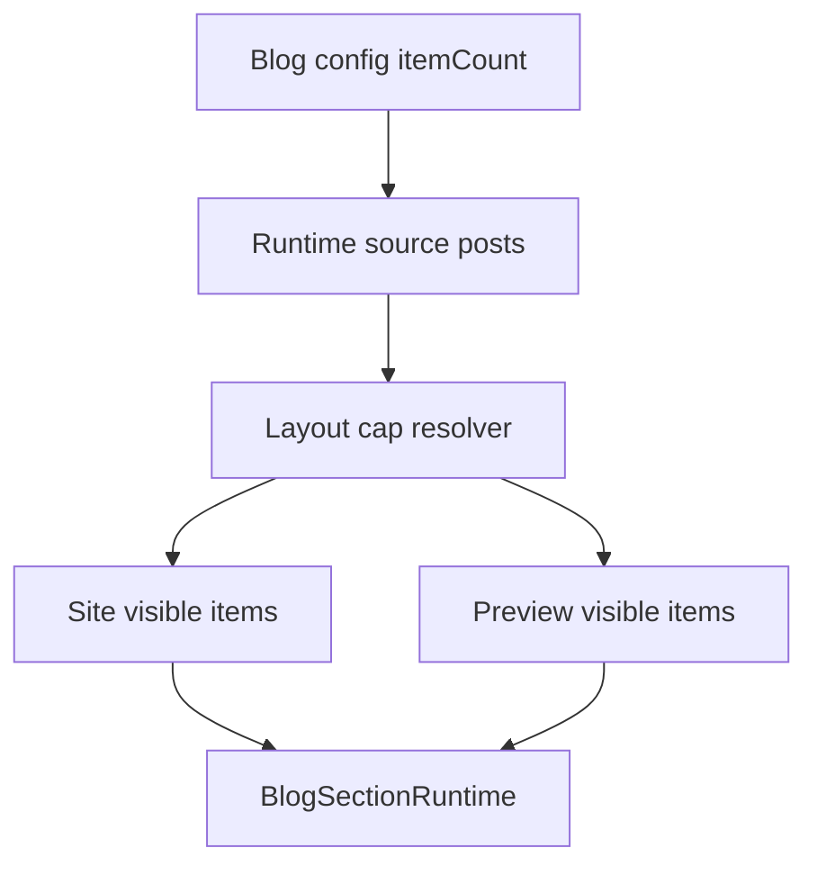

# I. Primer
## 1. TL;DR kiểu Feynman
- Đúng, hiện tại preview đang đúng hơn site ở một điểm rất quan trọng: preview có rule giới hạn số item theo từng layout, còn site thì chưa.
- Vì vậy cùng một layout, preview nhìn gọn đúng bố cục nhưng site lại render nhiều item hơn, làm layout bị lệch.
- Sau khi audit, root cause không còn nằm ở admin create/edit nữa mà nằm ở runtime site path của Blog.
- User đã chốt rõ baseline mới: **site phải học theo preview cap theo layout**.
- Cách sửa đúng là đưa rule cap-layout từ preview sang runtime site, để site và preview cùng dùng một contract visible-items duy nhất.

## 2. Elaboration & Self-Explanation
- Hiện Blog runtime đã đi qua `components/site/BlogSection.tsx` rồi render tiếp xuống `BlogSectionRuntime.tsx`.
- Trong `BlogSectionRuntime.tsx`, logic đang là:
  - `context === 'preview'` thì dùng `getPreviewLimit(style, device)` để cắt số item theo layout.
  - `context === 'site'` thì không cắt theo layout, mà giữ toàn bộ `itemCount` runtime từ `BlogSection.tsx`.
- Điều này tạo ra drift rõ ràng:
  - Preview `layout1` chỉ hiện 4 card nên grid 4 cột trông “đúng mẫu”.
  - Site `layout1` có thể hiện 8 hoặc 10 card, làm section kéo dài xuống thêm hàng, spacing/hierarchy nhìn khác hẳn preview.
- Tức là dù markup card giống nhau, “contract số item được phép hiển thị” giữa preview và site vẫn khác nhau, nên user thấy lệch là đúng.
- Root cause mới vì vậy là **visible-items contract drift**, không phải create/edit drift.

## 3. Concrete Examples & Analogies
- Ví dụ ngay trong code hiện tại:
  - `BlogSectionRuntime.tsx`
    - `layout1` / `layout2` preview cap = 4
    - `layout3` preview cap = 5
    - `layout4` / `layout6` preview cap = 3
    - `layout5` preview cap = 8
  - Nhưng `components/site/BlogSection.tsx` vẫn lấy `itemCount` rồi đưa toàn bộ list đó vào runtime.
- Kết quả:
  - Preview layout4 có 3 cards đúng mẫu.
  - Site layout4 nếu config `itemCount=8` thì runtime vẫn có thể feed nhiều hơn logic preview mong đợi ở section level.
- Analogy đời thường:
  - Preview giống bản trưng bày chỉ bày đúng số món để kệ đẹp.
  - Site lại mang tất cả hàng trong kho lên cùng một kệ. Kệ vẫn là kệ đó, nhưng nhìn không còn giống bản mẫu nữa.

# II. Audit Summary (Tóm tắt kiểm tra)
- Observation:
  - `app/admin/home-components/blog/_components/BlogPreview.tsx` render preview qua `BlogSectionRuntime` với `context="preview"`.
  - `components/site/BlogSection.tsx` render site qua `BlogSectionRuntime` với `context="site"`.
  - `BlogSectionRuntime.tsx` hiện chỉ áp `getPreviewLimit(style, device)` cho preview, không áp cho site.
  - `HomePageClient -> HomeComponentRenderer -> home registry -> BlogSection` path của site đã rõ, không thấy một renderer bí mật khác cho Blog.
- Inference:
  - Site/path wiring hiện không phải vấn đề chính.
  - Drift chính nằm ở quy tắc visible-items khác nhau giữa preview và site runtime.
- Decision:
  - Sẽ dùng preview cap-layout làm source of truth cho site runtime, đúng theo user chốt.

# III. Root Cause & Counter-Hypothesis (Nguyên nhân gốc & Giả thuyết đối chứng)
## Root Cause Confidence
- High.
- Lý do: đã có evidence trực tiếp trong code path runtime và user cũng xác nhận expected behavior là “site phải giống preview cap theo layout”.

## Trả lời 8 câu audit bắt buộc
1. Triệu chứng quan sát được là gì?
   - Expected: site thực nhìn giống preview.
   - Actual: preview đúng, site lệch.
2. Phạm vi ảnh hưởng?
   - Site Blog section runtime trên homepage/site pages.
   - Không còn trọng tâm ở create/edit UI.
3. Có tái hiện ổn định không?
   - Có. Chỉ cần `itemCount` lớn hơn cap-preview của layout là site sẽ lệch preview.
4. Mốc thay đổi gần nhất?
   - Blog đã được refactor sang `BlogSectionRuntime`, nhưng contract visible-items chưa được đồng bộ sang site.
5. Dữ liệu nào đang thiếu?
   - Không thiếu gì quan trọng để chốt hướng sửa này.
6. Có giả thuyết thay thế hợp lý nào chưa bị loại trừ?
   - Có: site shell khác preview shell nên nhìn lệch.
   - Nhưng hypothesis này yếu hơn vì khác biệt số lượng item đã đủ gây lệch lớn ngay cả khi shell giống nhau.
7. Rủi ro nếu fix sai nguyên nhân là gì?
   - Có thể làm site vẫn lệch dù preview/runtime dùng chung renderer, vì mismatch item count tiếp tục tồn tại.
8. Tiêu chí pass/fail sau khi sửa?
   - Với cùng style, site và preview phải dùng cùng visible-items cap, không còn render số item khác nhau ngoài chủ đích.

## Counter-Hypothesis (Giả thuyết đối chứng)
### a) Site đang đi qua renderer khác preview
- Evidence phản biện:
  - `HomePageClient -> HomeComponentRenderer -> home registry -> BlogSection -> BlogSectionRuntime` đã rõ.
  - `ComponentRenderer.tsx` legacy cũng trỏ vào `BlogSection` cùng file.
- Kết luận:
  - Không phải nguyên nhân chính.

### b) Chỉ do shell/container width
- Evidence phản biện:
  - Khác số lượng item theo layout tự nó đã làm khác bố cục section.
  - Đây là drift về content density contract, không chỉ width contract.
- Kết luận:
  - Có thể còn yếu tố phụ, nhưng không phải root cause chính ở vòng này.

# IV. Proposal (Đề xuất)
## Option A (Recommend) — Confidence 95%
Đưa visible-items cap theo layout vào runtime site để site học theo preview.

### Cụ thể sẽ làm
- Tách helper limit dùng chung trong Blog runtime, ví dụ theo style:
  - `layout1`, `layout2` => 4
  - `layout3` => 5
  - `layout4`, `layout6` => 3
  - `layout5` => 8
- Áp helper này cho site runtime path trong `components/site/BlogSection.tsx` trước khi truyền items vào `BlogSectionRuntime`, hoặc áp ngay trong `BlogSectionRuntime` theo contract chung cho cả `preview` và `site`.
- Ưu tiên cách giữ source-of-truth ở một nơi duy nhất để không drift lại.
- Review lại empty state / manual selection để không bị vượt cap ngoài ý muốn.

### Vì sao recommend
- Khớp trực tiếp với yêu cầu user: “preview đang đúng”, “site phải giống preview cap theo layout”.
- Thay đổi nhỏ, đúng root cause, dễ rollback.
- Không cần mở rộng scope sang redesign layout khác.

## Option B — Confidence 61%
Cho admin cấu hình riêng `maxVisibleItemsPerLayout` thay vì hardcode theo preview.
- Linh hoạt hơn.
- Nhưng mở rộng scope và trái với baseline user vừa chốt.
- Không recommend ở vòng này.

## Mermaid flow

# V. Files Impacted (Tệp bị ảnh hưởng)
- Sửa: `E:\NextJS\study\admin-ui-aistudio\system-vietadmin-nextjs\app\admin\home-components\blog\_components\BlogSectionRuntime.tsx`
  - Vai trò hiện tại: renderer dùng chung cho preview/site.
  - Thay đổi: chuẩn hóa visible-items contract để preview/site không lệch do số item khác nhau.

- Sửa: `E:\NextJS\study\admin-ui-aistudio\system-vietadmin-nextjs\components\site\BlogSection.tsx`
  - Vai trò hiện tại: runtime entry, query + sort + map posts.
  - Thay đổi: áp cap-layout cho site runtime trước khi render, hoặc gọi helper limit thống nhất.

- Có thể sửa nhẹ: `E:\NextJS\study\admin-ui-aistudio\system-vietadmin-nextjs\app\admin\home-components\blog\_components\BlogPreview.tsx`
  - Vai trò hiện tại: preview shell admin.
  - Thay đổi: chỉ nếu cần đồng bộ chỗ gọi helper/source limit chung, tránh duplicate logic.

# VI. Execution Preview (Xem trước thực thi)
1. Xác định nơi tốt nhất để đặt shared helper cap-layout.
2. Đồng bộ preview/site cùng dùng helper đó.
3. Áp cap-layout cho runtime site path của Blog.
4. Review manual/auto selection để cap không phá thứ tự bài viết.
5. Review tĩnh diff, đảm bảo không lan sang component khác.

# VII. Verification Plan (Kế hoạch kiểm chứng)
- Không chạy lint/unit test/build theo rule repo.
- Verification tĩnh:
  - Soát preview/site cùng dùng một visible-items contract.
  - Soát `HomePageClient -> HomeComponentRenderer -> BlogSection -> BlogSectionRuntime` không còn mismatch item count.
  - Soát mỗi layout với expected cap tương ứng.
- Repro checklist:
  - Chọn `itemCount` lớn hơn cap của từng layout.
  - Xác nhận preview và site cùng số item hiển thị.
  - Xác nhận manual selection vẫn giữ thứ tự nhưng bị cap đúng mức.
- Nếu có thay đổi TS/TSX, trước commit chỉ chạy `bunx tsc --noEmit` theo rule repo.

# VIII. Todo
1. Tách helper cap-layout dùng chung.
2. Cho site runtime học đúng cap của preview.
3. Soát manual/auto selection sau cap.
4. Review tĩnh diff và parity preview/site.

# IX. Acceptance Criteria (Tiêu chí chấp nhận)
- Preview và site dùng cùng visible-items cap cho từng layout Blog.
- Site không còn render nhiều item hơn preview khi cùng style/config.
- Manual selection vẫn giữ thứ tự đúng nhưng không vượt cap-layout.
- Thay đổi chỉ tập trung vào Blog runtime parity.

# X. Risk / Rollback (Rủi ro / Hoàn tác)
- Rủi ro:
  - Một số user có thể thấy site hiển thị ít bài hơn trước với cùng `itemCount` lớn.
- Giảm rủi ro:
  - Đây là hành vi user vừa chốt rõ: site phải học theo preview cap.
- Rollback:
  - Có thể rollback theo commit vì thay đổi tập trung ở Blog runtime path.

# XI. Out of Scope (Ngoài phạm vi)
- Không redesign lại visual từng layout.
- Không đổi các component home khác.
- Không productize rule cap thành setting mới ở vòng này.

# XII. Open Questions (Câu hỏi mở)
- Không còn ambiguity lớn. Có thể triển khai trực tiếp theo Option A.