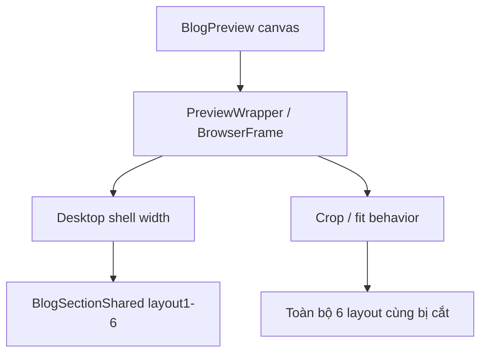

# I. Primer

## 1. TL;DR kiểu Feynman
- Lỗi không chỉ ở `layout4`; cả 6 layout đều đang bị cùng một bệnh: khung preview blog bị thiết kế sai contract bề rộng.
- Nghĩa là cái “hộp preview” đang quyết định cách hiển thị trước khi từng layout blog được render, nên fix riêng từng layout sẽ không hết bệnh.
- Cách đúng là sửa `BlogPreview` ở tầng wrapper/canvas desktop, để mọi layout 1→6 đều được render trong cùng một contract hợp lý.
- Mục tiêu đã chốt: cân bằng giữa giống site thật và fit full trong khung admin.
- Cách xử lý được chọn: `auto scale để fit`, nhưng scale phải áp ở đúng tầng canvas desktop của `BlogPreview`, không phải scale chắp vá bên trong từng layout.

## 2. Elaboration & Self-Explanation
Vấn đề cốt lõi là preview blog hiện có 2 tầng trách nhiệm bị trộn vào nhau:

1. Tầng `BlogSectionShared` chịu trách nhiệm render layout blog thật.
2. Tầng `BlogPreview` chịu trách nhiệm dựng “môi trường preview” trong admin.

Hiện lỗi crop xuất hiện ở cả 6 layout, nên đây là dấu hiệu rất rõ rằng lỗi nằm ở tầng môi trường preview, không nằm trong từng layout riêng lẻ.

Nếu một layout sai còn 5 layout đúng, ta mới nghi layout-specific. Nhưng ở đây cả 6 layout cùng bị cắt, nghĩa là mọi layout đều đang bị đặt vào một canvas/wrapper desktop không phù hợp.

Nói chậm hơn:
- `BlogSectionShared` sinh ra nội dung đúng kiểu site.
- `BlogPreview` bọc nội dung đó trong `PreviewWrapper` + `BrowserFrame` + device shell.
- Khi contract width/overflow/scale ở lớp bọc này sai, thì layout nào bên trong cũng bị sai theo.

Vì vậy, sửa `layout4` là chưa đủ. Cần sửa `BlogPreview` như một preview engine riêng cho Blog desktop, rồi để 6 layout cùng chạy trên engine đó.

## 3. Concrete Examples & Analogies
### Ví dụ bám task
Hiện tượng bạn chụp cho thấy:
- header preview vẫn còn
- nhưng phần nội dung blog bị thu/cắt ở mép phải
- lỗi lặp lại với nhiều layout

Điều này cho thấy phần shell preview đang “ép” mọi layout vào một khung desktop không đúng.

### Analogy đời thường
Giống như có 6 mẫu poster khác nhau, nhưng đều bị cắt cùng mép phải khi cho vào một khung kính sai kích thước. Vậy lỗi là ở cái khung kính, không phải ở từng poster.

# II. Audit Summary (Tóm tắt kiểm tra)
- Observation:
  - Preview desktop blog đang bị crop/cắt trong admin.
  - Người dùng xác nhận lỗi ảnh hưởng toàn bộ 6 layout, không riêng `layout4`.
  - Các thử nghiệm trước chỉ chạm vào `layout4` hoặc thay wrapper máy móc nên không giải quyết triệt để.
- Evidence:
  - `app/admin/home-components/blog/_components/BlogPreview.tsx`
    - đang là nơi quyết định device shell, viewport class, frame class, preview wrapper wiring.
  - `app/admin/home-components/_shared/components/PreviewWrapper.tsx`
    - wrapper chung đang tối ưu cho contract desktop chuẩn, không chắc phù hợp với shell preview riêng của Blog.
  - `app/admin/home-components/_shared/components/BrowserFrame.tsx`
    - có `overflow-hidden`, nên nếu inner contract sai thì toàn bộ layout đều bị crop.
- Expected vs actual:
  - Expected: cả 6 layout blog đều fit full trong preview card, không crop, không scroll ngang dư thừa, vẫn gần site thật.
  - Actual: preview desktop đang cắt nội dung; fix cục bộ theo `layout4` không đủ vì lỗi là global theo BlogPreview.

# III. Root Cause & Counter-Hypothesis (Nguyên nhân gốc & Giả thuyết đối chứng)
## Root Cause Confidence (Độ tin cậy nguyên nhân gốc): High
Lý do: lỗi ảnh hưởng đồng loạt 6 layout, nên nguyên nhân nhiều khả năng nằm ở wrapper/canvas desktop chung của BlogPreview thay vì trong render từng layout.

## Nguyên nhân gốc
`BlogPreview.tsx` đang dùng contract preview desktop không phù hợp cho blog:
- shared wrapper ngoài và browser frame đang giới hạn/cắt nội dung theo cách không tương thích với desktop shell mà Blog cần;
- các layout blog đều dùng chung lớp bọc này, nên tất cả cùng bị crop;
- việc scale trước đó sai tầng, nên tạo thêm side effect như scroll ngang hoặc crop mới.

## Counter-Hypothesis (Giả thuyết đối chứng)
### a) Từng layout có bug riêng
- Confidence: Low
- Lý do: cả 6 layout cùng lỗi theo cùng pattern crop.

### b) `BlogSectionShared` grid/card spacing sai
- Confidence: Low
- Lý do: nếu lỗi ở từng layout section, biểu hiện phải khác nhau nhiều hơn; hiện tại symptom là shell/canvas bị cắt chung.

### c) `BrowserFrame` một mình là thủ phạm
- Confidence: Medium
- Lý do: `BrowserFrame` góp phần gây crop do `overflow-hidden`, nhưng bản chất sâu hơn là contract giữa outer wrapper, browser frame và desktop shell của Blog không khớp.

# IV. Proposal (Đề xuất)
## Quyết định đã chốt từ bạn
- Scope: `Sửa riêng BlogPreview`
- Priority: `Cân bằng cả hai`
- Desktop behavior: `Auto scale để fit`

## Đề xuất thực thi
Sửa `BlogPreview.tsx` theo hướng preview-engine riêng cho Blog desktop, thay vì vá từng layout.

### Cách làm cụ thể
1. Tách logic desktop preview ra khỏi contract shared wrapper hiện tại.
2. Dựng một desktop canvas riêng cho Blog trong `BlogPreview.tsx`:
   - có width desktop reference thống nhất cho cả 6 layout;
   - có fit-scale tính ở tầng canvas ngoài;
   - không để scroll ngang thật trong preview desktop.
3. Áp scale ở đúng tầng shell chung của Blog preview, không scale riêng từng layout và không scale sau khi đã bị crop.
4. Giữ `BlogSectionShared` nguyên trạng để mọi layout 1→6 tiếp tục render như site logic hiện có.
5. Tablet/mobile giữ flow hiện tại nếu chưa có evidence lỗi cùng bản chất; tập trung fix desktop preview contract trước.

## Thiết kế logic đề xuất
### a) Desktop preview contract mới
- `reference desktop width`: một desktop shell cố định cho Blog preview.
- `fit canvas width`: lấy theo bề rộng card admin thực tế.
- `scale factor`: tính để shell desktop tự co vừa khung mà không overflow ngang.
- `transform-origin`: top center hoặc top left nhất quán để không lệch căn chỉnh.
- `overflow`: outer canvas ẩn phần dư logic nhưng không tạo horizontal scroll.

### b) Những gì sẽ bỏ
- Không fix riêng `layout4` nữa.
- Không giữ `min-w` + wrapper crop theo kiểu hiện tại.
- Không dùng scale chắp vá trong khi vẫn để browser frame hoặc inner shell rộng vượt canvas.

### c) Những gì sẽ giữ
- `BlogSectionShared` và toàn bộ rendering logic 6 layout.
- Device switching và style switching.
- Color tokens, mock data, font props.

## Vì sao đây là hướng tốt nhất
- Giải quyết đúng scope “cả 6 layout”.
- Không lan thay đổi sang shared infra toàn hệ thống khi user đã chọn sửa riêng `BlogPreview`.
- Rollback nhỏ, rõ, dễ chứng minh pass/fail.

# V. Files Impacted (Tệp bị ảnh hưởng)
- Sửa: `app/admin/home-components/blog/_components/BlogPreview.tsx`
  - Vai trò hiện tại: dựng toàn bộ preview wrapper/canvas/device shell cho blog trong admin.
  - Thay đổi: refactor contract desktop preview để auto-scale fit đúng cho toàn bộ 6 layout, bỏ crop/scroll ngang.

- Không sửa mặc định: `app/admin/home-components/blog/_components/BlogSectionShared.tsx`
  - Vai trò hiện tại: render các layout blog thật.
  - Giữ nguyên vì lỗi hiện tại được audit là nằm ở preview shell, không phải layout renderer.

- Không sửa mặc định: `app/admin/home-components/_shared/components/PreviewWrapper.tsx`
  - Vai trò hiện tại: shared wrapper cho nhiều home-component.
  - Không đụng nếu chưa có evidence rằng cần chuẩn hóa toàn hệ thống.

- Không sửa mặc định: `app/admin/home-components/_shared/components/BrowserFrame.tsx`
  - Vai trò hiện tại: browser shell chung.
  - Chỉ cân nhắc nếu trong lúc implement phát hiện desktop canvas blog không thể fit đúng nếu không bỏ/đổi lớp bọc này.

# VI. Execution Preview (Xem trước thực thi)
1. Đọc lại `BlogPreview.tsx` để map rõ desktop/tablet/mobile path hiện tại.
2. Xác định desktop canvas chung cho mọi layout blog.
3. Rework wrapper desktop của BlogPreview để auto-scale fit đúng khung admin.
4. Đảm bảo 6 layout cùng đi qua contract desktop mới.
5. Review tĩnh lại overflow, width, scale, alignment và imports.
6. Sau khi bạn duyệt spec mới tiến hành sửa code.

# VII. Verification Plan (Kế hoạch kiểm chứng)
## Tiêu chí kiểm chứng bắt buộc
- Kiểm tra desktop preview cho đủ cả 6 layout.
- Mỗi layout phải đạt đủ các điểm sau:
  1. Không bị cắt mép phải hoặc mép dưới bất thường.
  2. Không xuất hiện scroll ngang thừa trong preview desktop.
  3. Nội dung fit full trong khung preview card.
  4. Tỷ lệ hiển thị vẫn đủ gần site thật, không bị co méo khó đọc.

## Repro/pass-fail
- Repro hiện tại: vào `/admin/home-components/blog/[id]/edit`, đổi qua lần lượt layout 1→6 ở desktop preview, quan sát đều bị crop ở cùng tầng shell.
- Pass: cả 6 layout đều fit full sau refactor `BlogPreview`.
- Fail: chỉ hết ở 1 vài layout, hoặc hết crop nhưng còn scroll ngang, hoặc scale làm preview quá nhỏ/khó đọc.

# VIII. Todo
1. Refactor `BlogPreview` theo contract desktop preview chung cho toàn bộ 6 layout.
2. Áp auto-scale fit ở đúng tầng canvas desktop.
3. Giữ nguyên `BlogSectionShared` trừ khi có evidence mới.
4. Review tĩnh 6 layout path qua cùng wrapper mới.
5. Commit local sau khi verify trực quan.

# IX. Acceptance Criteria (Tiêu chí chấp nhận)
- Cả 6 layout blog desktop preview đều không còn bị cắt.
- Không còn scroll ngang không cần thiết trong preview desktop.
- Preview vẫn đủ gần site thật về cấu trúc và cảm giác hiển thị.
- Không cần sửa riêng từng layout để đạt kết quả.
- Site runtime không bị thay đổi.

# X. Risk / Rollback (Rủi ro / Hoàn tác)
- Rủi ro chính: scale fit đúng nhưng preview quá nhỏ, hoặc căn lề/top spacing bị lệch.
- Rủi ro phụ: tablet/mobile dùng chung wrapper có thể bị ảnh hưởng nếu refactor không tách path rõ.
- Rollback dễ vì scope chính chỉ ở `BlogPreview.tsx`.

# XI. Out of Scope (Ngoài phạm vi)
- Không refactor shared preview infra cho toàn bộ home-components.
- Không chỉnh site runtime hoặc data logic của Blog.
- Không tối ưu visual khác ngoài lỗi crop/fit contract của preview.

# XII. Open Questions (Câu hỏi mở)
- Không còn ambiguity lớn sau khi bạn đã chốt scope/piority/desktop behavior. Nếu bạn OK spec này thì bước tiếp theo sẽ là implement trực tiếp trên `BlogPreview.tsx` để sửa dứt điểm cho cả 6 layout.