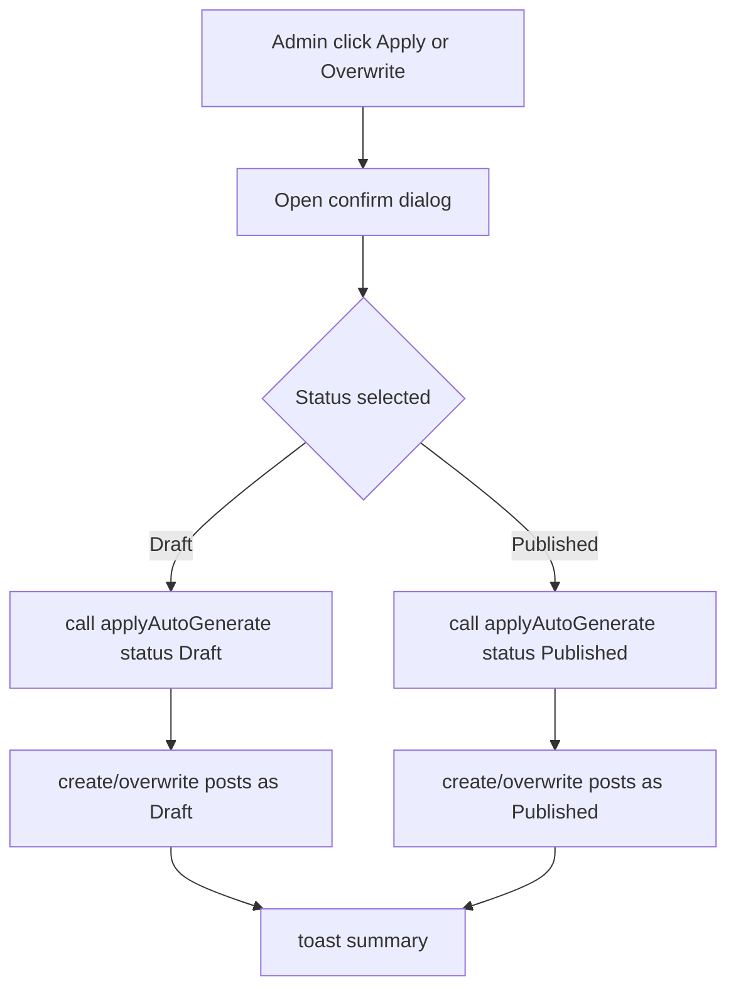

# I. Primer

## 1. TL;DR kiểu Feynman
- Ở `/admin/trust-pages`, hiện có nhiều mục đang tắt nên auto-generate không tạo bài cho các mục đó nếu chưa bật lại.
- Đề xuất thêm một nút bulk action để bật nhanh toàn bộ mục đang tắt, khỏi phải tick từng cái.
- Khi bấm `Áp dụng` hoặc `Ghi đè`, sẽ hỏi thêm một bước: tạo các bài chính sách ở trạng thái `Bản nháp` hay `Đã xuất bản`.
- Theo yêu cầu đã chốt, nếu chọn `Đã xuất bản` thì mọi bài được tạo ra trong thao tác đó đều publish luôn cho dễ hiểu.
- Nút `Lưu thay đổi` sẽ chuyển sang sticky footer theo pattern đã có ở các trang admin khác như product edit.

## 2. Elaboration & Self-Explanation
Vấn đề gốc ở đây không còn là bug “nút không chạy”, mà là trải nghiệm quản trị đang chậm và dễ gây hiểu nhầm.

### a) Với các mục trust page đang tắt
Mỗi slot trust page có một checkbox riêng. Nếu checkbox đang tắt thì backend coi slot đó là `disabled` và sẽ bỏ qua khi auto-generate. Điều đó đúng về logic, nhưng thao tác bật lại từng mục bằng tay khá mất thời gian.

Giải pháp hợp lý là thêm một nút bulk action kiểu `Bật tất cả mục đang tắt`. Nút này chỉ sửa local state của các checkbox trong trang, không đụng tới mapping bài viết. Admin có thể bật nhanh toàn bộ slot rồi mới bấm lưu hoặc auto-generate.

### b) Với hành vi `Áp dụng` / `Ghi đè`
Hiện tại auto-generate đã có preview dialog và gọi mutation `applyAutoGenerate({ overwrite })`. Nhưng chưa có bước hỏi rõ: các bài mới tạo sẽ là `Draft` hay `Published`.

Vì user muốn `public lẹ hơn`, nên flow cần rõ ràng như sau:
1. Bấm `Áp dụng` hoặc `Ghi đè`.
2. Hiện thêm một dialog xác nhận.
3. Trong dialog đó, chọn `Bản nháp` hoặc `Đã xuất bản`.
4. Nếu chọn `Đã xuất bản`, toàn bộ bài được tạo trong thao tác đó sẽ publish luôn.

Cách này rõ hơn nhiều so với việc ngầm mặc định một trạng thái mà user không kiểm soát.

### c) Với nút lưu thay đổi
Trang trust-pages hiện đặt nút `Lưu thay đổi` ở cuối page. Trên các màn edit admin khác, pattern sticky footer đã có sẵn và quen thuộc hơn: kéo xuống đâu vẫn thấy nút lưu.

Vì vậy nên reuse sticky footer đã có, thay vì tự viết pattern mới.

## 3. Concrete Examples & Analogies
### a) Ví dụ sát repo
Giả sử đang có 7 trust pages, trong đó 5 mục đang tắt.

Hiện tại:
- Admin phải tick từng checkbox.
- Sau đó mới bấm `Lưu thay đổi`.
- Khi bấm `Áp dụng`, chưa có bước chọn trạng thái bài viết.

Sau khi sửa:
- Admin bấm `Bật tất cả mục đang tắt` một lần.
- Sticky footer hiện sẵn `Lưu thay đổi` ở dưới cùng màn hình.
- Khi bấm `Áp dụng`, dialog hỏi thêm:
  - `Bản nháp`
  - `Đã xuất bản`
- Nếu chọn `Đã xuất bản`, tất cả bài mới sinh ra trong lần đó sẽ public luôn.

### b) Analogy đời thường
Giống một bảng điều khiển có nhiều công tắc đang off. Thay vì bật tay từng công tắc, sẽ có nút `Bật tất cả`. Sau đó khi nhấn `Tạo hồ sơ`, hệ thống hỏi thêm: `Tạo bản nháp hay xuất bản luôn?`.

# II. Audit Summary (Tóm tắt kiểm tra)
- Route cần sửa: `E:\NextJS\study\admin-ui-aistudio\system-vietadmin-nextjs\app\admin\trust-pages\page.tsx`
- Backend mutation liên quan: `E:\NextJS\study\admin-ui-aistudio\system-vietadmin-nextjs\convex\trustPages.ts`
- Pattern sticky footer nên reuse: `E:\NextJS\study\admin-ui-aistudio\system-vietadmin-nextjs\app\admin\home-components\_shared\components\HomeComponentStickyFooter.tsx`
- Reference UI sticky footer đang dùng: `E:\NextJS\study\admin-ui-aistudio\system-vietadmin-nextjs\app\admin\products\[id]\edit\page.tsx`
- Reference chọn trạng thái Published/Draft: `E:\NextJS\study\admin-ui-aistudio\system-vietadmin-nextjs\app\admin\posts\create\page.tsx`

## Observation
- `trust-pages/page.tsx` đang giữ state local cho toggle/mapping và có preview dialog cho auto-generate.
- Nút save hiện là nút thường ở cuối page, không sticky.
- `applyAutoGenerate` backend hiện chỉ nhận `{ overwrite }`, chưa nhận trạng thái publish.
- Backend hiện tạo bài draft ở nhánh apply và nhánh overwrite chỉ preserve status cũ hoặc rơi về draft.

## Inference
- Muốn hỏi thêm `Draft`/`Published`, cần đổi cả frontend flow lẫn args/logic của mutation `applyAutoGenerate`.
- Bulk enable all disabled chỉ là thay đổi UI/local state, rủi ro thấp.
- Sticky footer có thể reuse component sẵn có, không cần phát minh pattern mới.

## Decision
- Reuse `HomeComponentStickyFooter` cho nút lưu.
- Thêm bulk action ngay trong trang trust-pages để bật nhanh các mục đang tắt.
- Thêm confirm dialog riêng cho `Áp dụng` / `Ghi đè` để chọn `Draft` hoặc `Published`.
- Theo answer đã chốt: nếu chọn `Published`, áp dụng cho toàn bộ bài được tạo ra trong thao tác đó, kể cả apply hay overwrite.

# III. Root Cause & Counter-Hypothesis (Nguyên nhân gốc & Giả thuyết đối chứng)
## 1. Root Cause Confidence
- High.
- Lý do: code hiện tại cho thấy rõ slot `disabled` sẽ bị bỏ qua, save button chưa sticky, và mutation chưa có đầu vào điều khiển publish mode.

## 2. Trả lời 8 câu audit
### a) Triệu chứng quan sát được là gì (expected vs actual)?
- Expected: bật nhiều mục nhanh hơn, tạo bài nhanh hơn, và có thể chọn public luôn cho tiện.
- Actual: phải tick thủ công từng mục, save button ở cuối trang, và chưa có bước chọn trạng thái bài viết khi auto-generate.

### b) Phạm vi ảnh hưởng?
- UI admin `/admin/trust-pages`.
- Mutation `convex/trustPages.ts -> applyAutoGenerate`.
- Flow apply/overwrite của trust pages.

### c) Có tái hiện ổn định không? điều kiện tái hiện tối thiểu?
- Có.
- Chỉ cần có slot đang tắt là auto-generate sẽ bỏ qua slot đó.
- Chỉ cần dùng trang hiện tại là luôn thấy save button không sticky.

### d) Mốc thay đổi gần nhất?
- Không cần mốc regression để giải thích; đây là khoảng trống feature/UX hiện hữu trong code path hiện tại.

### e) Dữ liệu nào đang thiếu để kết luận chắc chắn?
- Không còn thiếu gì lớn để lên plan implementation.
- Publish behavior mong muốn đã được user chốt: chọn public là publish hết các bài được tạo ra trong thao tác.

### f) Có giả thuyết thay thế hợp lý nào chưa bị loại trừ?
- Có thể dùng mặc định `Published` không cần hỏi lại.
- Nhưng đã bị loại vì user yêu cầu “hỏi 1 câu nữa là có publish không hay để bản nháp”, nên cần explicit choice.

### g) Rủi ro nếu fix sai nguyên nhân là gì?
- Nếu chỉ thêm UI dialog mà backend không nhận/truyền status đúng, user sẽ chọn `Published` nhưng bài vẫn thành draft.
- Nếu sticky footer viết tay thay vì reuse pattern sẵn có, dễ lệch UI với các trang admin khác.

### h) Tiêu chí pass/fail sau khi sửa?
- Có nút bật nhanh toàn bộ mục đang tắt.
- `Áp dụng`/`Ghi đè` hỏi thêm `Draft` hay `Published`.
- Chọn `Published` thì tất cả bài mới được tạo trong thao tác đó phải ở trạng thái published.
- Nút lưu đổi sang sticky footer giống pattern admin khác.

## 3. Counter-Hypothesis
- Counter-hypothesis 1: Không cần dialog, cứ mặc định Published là nhanh hơn.
  - Không chọn, vì user muốn có bước hỏi lại để chủ động quyết định từng lần.
- Counter-hypothesis 2: Chỉ sửa frontend copy là đủ.
  - Không đúng, vì publish mode cần backend support thật.

# IV. Proposal (Đề xuất)
## 1. Hướng xử lý chính
### a) Bulk action bật nhanh slot đang tắt
- Thêm nút `Bật tất cả mục đang tắt` ở phần header hoặc ngay trên danh sách trust pages.
- Handler sẽ chỉ set các `pageToggles[slot.iaKey]` đang `false` thành `true`.
- Không đụng `pageMappings`.

### b) Sticky footer cho save
- Bỏ block save button cuối page hiện tại.
- Reuse `HomeComponentStickyFooter`.
- Dùng `onClickSave={handleSave}`, `hasChanges={hasChanges}`, `isSubmitting={isSaving}`.
- Nếu cần, có thể thêm child text ngắn kiểu `Có thay đổi chưa lưu` / `Đã lưu`, nhưng không bắt buộc nếu muốn giữ thay đổi nhỏ.

### c) Confirm dialog cho Apply/Overwrite
- Tách flow hiện tại từ “click là gọi mutation ngay” thành 2 bước:
  1. click `Áp dụng` hoặc `Ghi đè`
  2. mở confirm dialog chọn `Draft` hoặc `Published`
  3. confirm mới gọi mutation
- Dùng `Dialog` primitives sẵn có trong admin UI.
- Dùng radio native hoặc select đơn giản để chọn trạng thái; radio dễ scan hơn trong confirm dialog.

### d) Backend support publish mode
- Mở rộng args của `applyAutoGenerate` từ:
  - `{ overwrite?: boolean }`
- thành dạng:
  - `{ overwrite?: boolean, status?: 'Draft' | 'Published' }`
- Logic create post trong mutation sẽ dùng `status` được truyền vào cho mọi bài được tạo trong thao tác hiện tại.
- Với `Published`, truyền thêm `publishImmediately: true` khi cần để `PostsModel.create` set `publishedAt` đúng pattern hiện tại.

## 2. Mermaid flowchart

# V. Files Impacted (Tệp bị ảnh hưởng)
## 1. UI
- `Sửa: E:\NextJS\study\admin-ui-aistudio\system-vietadmin-nextjs\app\admin\trust-pages\page.tsx`
  - Vai trò hiện tại: render toàn bộ trust pages admin page, toggle slot, mapping, preview modal, save button.
  - Thay đổi: thêm bulk enable action, thêm confirm dialog chọn publish mode, đổi save button sang sticky footer, cập nhật flow apply/overwrite.

- `Sửa: E:\NextJS\study\admin-ui-aistudio\system-vietadmin-nextjs\app\admin\home-components\_shared\components\HomeComponentStickyFooter.tsx` (chỉ khi thật sự cần)
  - Vai trò hiện tại: sticky footer tái sử dụng cho nhiều trang admin.
  - Thay đổi: dự kiến không cần sửa; chỉ reuse. Nếu phát sinh thiếu prop rất nhỏ thì mới chỉnh tối thiểu.

## 2. Server
- `Sửa: E:\NextJS\study\admin-ui-aistudio\system-vietadmin-nextjs\convex\trustPages.ts`
  - Vai trò hiện tại: preview và apply/overwrite auto-generate trust pages.
  - Thay đổi: nhận `status` từ frontend và dùng status đó khi tạo bài mới cho apply/overwrite.

# VI. Execution Preview (Xem trước thực thi)
1. Đọc lại `trust-pages/page.tsx` để chốt vị trí đặt bulk action và sticky footer.
2. Reuse `HomeComponentStickyFooter` thay cho save button cuối page.
3. Thêm state local cho confirm dialog:
   - action mode (`apply` | `overwrite`)
   - desired status (`Draft` | `Published`)
   - open/close confirm dialog
4. Đổi click handler của `Áp dụng` / `Ghi đè` để mở confirm dialog trước.
5. Sửa mutation `applyAutoGenerate` nhận thêm `status` và apply cho mọi post được tạo.
6. Đồng bộ toast summary và copy dialog cho dễ hiểu.
7. Tự review tĩnh typing/null-safety.
8. Chạy `bunx tsc --noEmit` trước commit theo rule repo khi có đổi TS code.
9. Commit local, không push.

# VII. Verification Plan (Kế hoạch kiểm chứng)
## 1. Audit Summary
- Đã xác định được 3 khoảng trống UX/chức năng: bulk bật slot đang tắt, chọn publish mode khi auto-generate, và sticky footer cho save.

## 2. Root Cause Confidence
- High.
- Vì cả 3 điểm đều hiện diện rõ trong code hiện tại và có pattern repo để bám theo.

## 3. Verification steps
- Static verify sau sửa:
  - bulk action chỉ bật các slot đang tắt, không sửa mapping.
  - sticky footer gọi đúng `handleSave` và phản ánh `hasChanges/isSaving`.
  - click `Áp dụng` / `Ghi đè` không gọi mutation ngay, mà mở confirm dialog trước.
  - `applyAutoGenerate` nhận `status` và dùng đúng status cho các post được tạo.
  - nếu chọn `Published`, các lời gọi `PostsModel.create` có `status: 'Published'` và `publishImmediately: true`.
- Trước commit: `bunx tsc --noEmit`.
- Không chạy lint/unit test/build vì repo instruction cấm.

# VIII. Todo
1. Thêm bulk action bật tất cả mục đang tắt trong `/admin/trust-pages`.
2. Đổi save button sang sticky footer theo pattern admin hiện có.
3. Thêm confirm dialog chọn `Draft`/`Published` cho `Áp dụng` và `Ghi đè`.
4. Mở rộng `convex/trustPages.ts` để nhận và áp dụng publish mode.
5. Tự review tĩnh + `bunx tsc --noEmit`.
6. Commit local.

# IX. Acceptance Criteria (Tiêu chí chấp nhận)
- Trong `/admin/trust-pages` có nút bulk để bật nhanh toàn bộ mục đang tắt.
- Nút `Lưu thay đổi` trở thành sticky footer, bám pattern như các trang admin khác.
- Khi bấm `Áp dụng` hoặc `Ghi đè`, có thêm bước chọn `Bản nháp` hoặc `Đã xuất bản`.
- Nếu chọn `Đã xuất bản`, tất cả bài được tạo trong thao tác đó phải ở trạng thái published.
- Thay đổi bám pattern sẵn có, không mở rộng sang refactor ngoài scope.

# X. Risk / Rollback (Rủi ro / Hoàn tác)
- Rủi ro chính là backend có thể chưa truyền đúng publish mode vào tất cả nhánh tạo post nếu sửa không đều giữa apply và overwrite.
- Có rủi ro nhỏ về UX nếu confirm dialog lồng với preview dialog gây rối; sẽ giữ flow đơn giản, chỉ thêm một bước confirm rõ ràng.
- Rollback dễ: revert commit vì thay đổi giới hạn trong trust-pages page và trustPages mutation.

# XI. Out of Scope (Ngoài phạm vi)
- Không redesign toàn bộ trust-pages UI.
- Không thay đổi semantics mapping ngoài những gì cần cho publish mode.
- Không sửa các trang site public `/about`, `/privacy`, `/terms`, ...
- Không đụng các module admin khác ngoài việc reuse component sticky footer.

# XII. Open Questions (Câu hỏi mở)
- Không còn ambiguity lớn để bắt đầu implement. Contract mong muốn đã đủ rõ: bulk bật slot tắt, sticky footer save, và hỏi publish mode trước khi apply/overwrite.