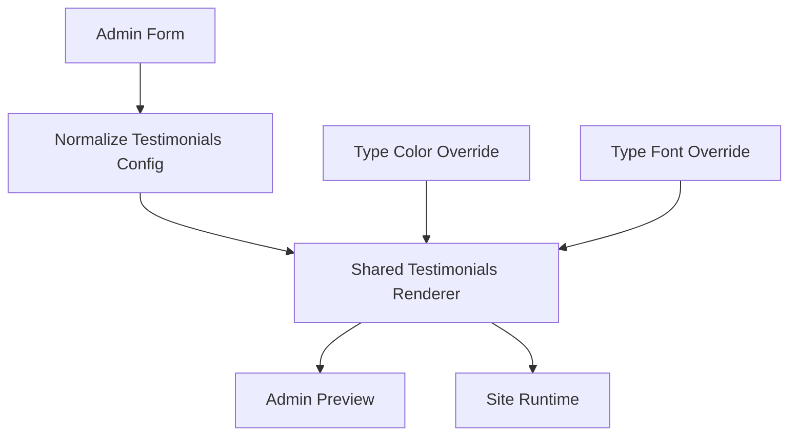

# I. Primer
## 1. TL;DR kiểu Feynman
- Hiện tại component Testimonials của hệ thống đã có 6 style, nhưng đó là 6 style cũ, data nghèo hơn showcase và UI khác khá xa.
- Bộ showcase anh đưa có 6 layout đẹp hơn, nhưng nó cần data giàu hơn: `company`, `avatarType`, `avatarUrl`, `avatarIcon`.
- Để thay đúng tinh thần showcase mà vẫn bám hệ thống VietAdmin, em sẽ thay phần render/layout bằng 6 layout mới, nhưng vẫn giữ wiring hiện có của create/edit/runtime/site.
- Form admin cũng sẽ được nâng cấp để quản lý đầy đủ avatar + company, vì nếu không thì 6 layout mới sẽ bị mất chất lượng hiển thị.
- Runtime site, preview trong create/edit, và dữ liệu lưu Convex sẽ dùng cùng một contract để tránh lệch preview ≠ site.
- Có 2 khoảng trống kỹ thuật cần xử lý: repo chính hiện chưa có dependency `embla-carousel-react` và `motion`, trong khi showcase đang dùng cả 2.

## 2. Elaboration & Self-Explanation
Bài toán này không phải chỉ là “copy giao diện”. Trong hệ thống hiện tại, Testimonials đã có đường đi đầy đủ: form nhập liệu ở admin, preview ở create/edit, và render thật ngoài site qua `ComponentRenderer`. Nhưng dữ liệu hiện tại của nó chỉ có các trường cơ bản như tên, vai trò, nội dung, avatar text và số sao.

Trong khi đó, 6 layout ở showcase được viết đẹp vì chúng dựa trên dữ liệu phong phú hơn và có các shared primitive riêng như avatar đa kiểu, rating stars, section header, animation/tab/marquee/carousel. Nếu chỉ dán HTML/CSS sang mà không nâng data contract và không nối lại vào luồng create/edit/runtime của repo này, kết quả sẽ bị lệch: preview đẹp nhưng site thật khác, hoặc admin không nhập nổi dữ liệu cần thiết.

Vì anh đã chốt:
- nâng cấp đủ data model,
- bám sát showcase tối đa,
- giữ marquee auto-scroll,
- và thay cả form + dữ liệu quản lý,

nên hướng hợp lý nhất là: chuẩn hóa lại contract Testimonials trong repo chính theo showcase, tạo shared render primitives cho 6 layout, rồi dùng lại cùng bộ render đó cho cả admin preview và runtime site.

## 3. Concrete Examples & Analogies
- Ví dụ cụ thể: layout `Showcase` ở bộ ngoài đang cần `company` để render block profile bên phải, và cần `avatarType` để biết là hiện ảnh thật, icon hay initials. Nếu vẫn giữ model cũ của repo chính thì block đó sẽ chỉ hiện được `role`, còn avatar sẽ bị tụt về chữ cái đầu tên, làm mất phần “đẹp mắt” cốt lõi của layout.
- Ví dụ cụ thể: layout `Marquee` đang tự nhân dữ liệu 3 lần để tạo cảm giác chạy vô hạn. Nếu không dùng chung renderer/tokens của hệ thống mà chỉ copy CSS rời, preview admin có thể chạy khác site thật hoặc khác màu custom của type override.
- Analogies: giống như thay 6 bộ áo mới cho một mannequin cũ. Nếu chỉ thay áo mà không chỉnh lại phần khung móc treo, size và phụ kiện, mặc lên sẽ không đúng form. Ở đây “khung” chính là data contract + shared runtime/preview wiring.

# II. Audit Summary (Tóm tắt kiểm tra)
1. Observation:
   a) Testimonials hiện có ở các surface chính:
   - `app/admin/home-components/testimonials/_components/TestimonialsForm.tsx`
   - `app/admin/home-components/testimonials/_components/TestimonialsPreview.tsx`
   - `app/admin/home-components/testimonials/[id]/edit/page.tsx`
   - `app/admin/home-components/create/testimonials/page.tsx`
   - `components/site/ComponentRenderer.tsx`
   b) Contract hiện tại chỉ có:
   - `name`, `role`, `content`, `avatar`, `rating`
   - style enum: `cards | slider | masonry | quote | carousel | minimal`
   c) Runtime site và admin preview hiện đang render 2 bản layout tương tự nhau nhưng tách rời logic.
   d) Showcase ngoài có 6 layout mới:
   - `LayoutMinimal`
   - `LayoutCards`
   - `LayoutSlider`
   - `LayoutMarquee`
   - `LayoutShowcase`
   - `LayoutQuote`
   e) Showcase dùng contract giàu hơn:
   - `company`, `avatarType`, `avatarUrl`, `avatarIcon`
   f) Showcase còn phụ thuộc `embla-carousel-react` và `motion/react`, trong khi `package.json` repo chính hiện chưa có 2 dependency này.
2. Inference:
   a) Nếu chỉ đổi JSX/CSS mà không đổi contract dữ liệu, 6 layout mới sẽ mất avatar/company và không đạt parity với showcase.
   b) Nếu giữ preview và runtime tách riêng, rủi ro lệch create/edit so với site thật là cao.
3. Decision:
   a) Nâng cấp contract dữ liệu Testimonials.
   b) Chuẩn hóa 1 bộ shared render/layout dùng chung cho preview + runtime.
   c) Map style cũ sang 6 style mới để không phá vỡ wiring type hiện có nhiều hơn mức cần thiết.

# III. Root Cause & Counter-Hypothesis (Nguyên nhân gốc & Giả thuyết đối chứng)
Root Cause Confidence: High

1. Nguyên nhân gốc:
   a) Home-component Testimonials hiện được thiết kế quanh data model cũ, nên chỉ đủ cho layout đơn giản.
   b) 6 layout showcase đẹp vì phụ thuộc vào data richness + primitive riêng + animation libs, nhưng các yếu tố đó chưa tồn tại trong contract của repo chính.
   c) Runtime site và admin preview đang duplicate render logic, nên việc thay layout mới nếu không gom lại sẽ dễ sinh drift.

2. Trả lời tối thiểu các câu audit bắt buộc:
   a) Triệu chứng quan sát được là gì?
   - Expected: 6 layout ngoài được áp vào component Đánh giá/Review nhưng vẫn chạy đúng create/edit/site theo hệ thống.
   - Actual: hệ thống hiện chỉ có 6 style cũ, khác giao diện showcase và thiếu field dữ liệu.
   b) Phạm vi ảnh hưởng?
   - User admin cấu hình Testimonials.
   - Preview create/edit.
   - Runtime site render component type `Testimonials`.
   - Convex data cho `homeComponents.config` của loại này.
   c) Có tái hiện ổn định không?
   - Có. Chỉ cần mở route create/edit Testimonials và đối chiếu với code showcase.
   d) Mốc thay đổi gần nhất?
   - Chưa xác định commit gây khác biệt; đây là bài toán nâng cấp feature, không phải regression cụ thể.
   e) Dữ liệu nào đang thiếu?
   - Chưa inspect schema Convex chi tiết ở mức lưu JSON field, nhưng từ code hiện tại có đủ evidence rằng config đang serialize object linh hoạt và form chưa expose company/avatarType.
   f) Giả thuyết thay thế hợp lý nào chưa bị loại trừ?
   - Có thể giữ model cũ và “fake” company/avatarType từ role/avatar text. Nhưng anh đã chọn không đi hướng này vì sẽ làm layout xấu đi.
   g) Rủi ro nếu fix sai nguyên nhân?
   - Có thể render đẹp trong admin nhưng site thật lệch; hoặc lưu data mới nhưng runtime cũ không đọc được.
   h) Tiêu chí pass/fail sau khi sửa?
   - Cùng một config Testimonials phải render đồng nhất ở create, edit và site với 6 layout mới, có support avatar/company đầy đủ.

3. Counter-Hypothesis (Giả thuyết đối chứng):
   a) “Chỉ cần copy CSS/markup showcase vào preview là đủ.”
   - Bị bác bỏ vì runtime site vẫn đang dùng renderer cũ trong `ComponentRenderer.tsx`.
   b) “Giữ nguyên model cũ, nhét company vào role.”
   - Bị bác bỏ vì anh đã yêu cầu nâng cấp đầy đủ form + dữ liệu quản lý, và một số layout showcase phân tách role/company rõ ràng.
   c) “Không cần thêm dependency, viết lại nhẹ hơn.”
   - Không phù hợp với quyết định “bám sát showcase tối đa”.

# IV. Proposal (Đề xuất)
1. Hướng đề xuất (Recommend) — Confidence 90%
   a) Nâng contract Testimonials từ model cũ sang model mở rộng:
   - item gồm `name`, `role`, `company`, `content`, `rating`, `avatarType`, `avatarUrl`, `avatarIcon`
   - vẫn giữ `id` ở UI layer
   b) Đổi style enum sang 6 layout mới, nhưng có chiến lược migration mềm:
   - `cards` -> giữ nguyên tên
   - `slider` -> giữ nguyên tên
   - `masonry` -> đổi render sang `marquee` hoặc map migrate rõ ràng
   - `quote` -> giữ là quote mới
   - `carousel` -> đổi render sang `showcase` hoặc rename contract
   - `minimal` -> giữ minimal mới
   c) Em nghiêng về đổi enum rõ ràng hơn để giảm mơ hồ:
   - `cards | slider | marquee | showcase | quote | minimal`
   d) Thêm normalization/migration layer để đọc config cũ an toàn:
   - config cũ `masonry` sẽ fallback sang `cards` hoặc `minimal` nếu chưa migrate
   - config cũ `carousel` sẽ fallback sang `slider` hoặc `showcase`
   e) Tách shared primitives/layout renderer cho Testimonials, rồi dùng chung ở:
   - admin preview
   - site runtime
   f) Form create/edit sẽ hỗ trợ:
   - nhập company
   - chọn avatarType
   - nhập avatarUrl khi `image`
   - chọn icon khi `icon`
   - drag/drop reorder như cũ
   g) Giữ color/font override của hệ thống hiện tại, adapter màu sang token `--token-primary` / `--token-secondary` mà showcase cần.
   h) Giữ marquee auto-scroll như anh yêu cầu, nhưng đóng gói CSS animation trong renderer riêng để tránh văng style ra ngoài phạm vi component.

2. Vì sao đây là hướng tốt nhất trong ngữ cảnh này?
   a) Đúng yêu cầu “dùng logic của dự án này để thay bằng 6 layout kia”.
   b) Giữ được contract hệ thống: create/edit/site cùng một source of truth.
   c) Cho phép bám sát visual showcase mà vẫn tôn trọng type color override, font override, sticky footer, form wrapper, route hiện có.
   d) Thay đổi đủ nhỏ để rollback theo feature slice Testimonials, không lan ra component khác.

3. Tradeoff:
   a) Sẽ phải đụng vào data contract và migration compatibility.
   b) Cần thêm dependency mới để bám sát showcase.
   c) Cần rà kỹ preview/runtime parity vì đây là điểm dễ lệch nhất.

# V. Files Impacted (Tệp bị ảnh hưởng)
## 1. UI / Admin
- Sửa: `E:\NextJS\study\admin-ui-aistudio\system-vietadmin-nextjs\app\admin\home-components\testimonials\_types\index.ts`
  - Vai trò hiện tại: định nghĩa contract dữ liệu và style cho Testimonials.
  - Thay đổi: mở rộng item shape với `company`, `avatarType`, `avatarUrl`, `avatarIcon`; cập nhật style enum và type normalize tương ứng.

- Sửa: `E:\NextJS\study\admin-ui-aistudio\system-vietadmin-nextjs\app\admin\home-components\testimonials\_lib\constants.ts`
  - Vai trò hiện tại: chứa default config.
  - Thay đổi: cập nhật default item theo contract mới, chọn default style mới hợp lý.

- Sửa: `E:\NextJS\study\admin-ui-aistudio\system-vietadmin-nextjs\app\admin\home-components\testimonials\_components\TestimonialsForm.tsx`
  - Vai trò hiện tại: form nhập danh sách review cơ bản.
  - Thay đổi: thêm field company, avatar type, avatar URL, avatar icon; giữ reorder và validation cơ bản theo pattern cũ.

- Sửa: `E:\NextJS\study\admin-ui-aistudio\system-vietadmin-nextjs\app\admin\home-components\testimonials\_components\TestimonialsPreview.tsx`
  - Vai trò hiện tại: preview 6 style cũ trong create/edit.
  - Thay đổi: chuyển sang dùng shared renderer/layout mới, bỏ duplicate JSX lớn.

- Sửa: `E:\NextJS\study\admin-ui-aistudio\system-vietadmin-nextjs\app\admin\home-components\testimonials\[id]\edit\page.tsx`
  - Vai trò hiện tại: nạp dữ liệu config cũ, submit update Convex, nối preview/form.
  - Thay đổi: normalize data mới + migration fallback từ config cũ, persist đúng shape mới.

- Sửa: `E:\NextJS\study\admin-ui-aistudio\system-vietadmin-nextjs\app\admin\home-components\create\testimonials\page.tsx`
  - Vai trò hiện tại: tạo mới Testimonials với form/preview hiện tại.
  - Thay đổi: seed state mới, submit đúng config mới.

## 2. Shared / Runtime
- Thêm: `E:\NextJS\study\admin-ui-aistudio\system-vietadmin-nextjs\app\admin\home-components\testimonials\_components\TestimonialsSectionShared.tsx`
  - Vai trò mới: shared renderer cho cả preview và runtime, chứa 6 layout mới + primitives `AvatarDisplay`, `RatingStars`, `SectionHeader`.
  - Thay đổi: adapter từ token màu hệ thống sang CSS vars/layout API theo showcase.

- Sửa: `E:\NextJS\study\admin-ui-aistudio\system-vietadmin-nextjs\components\site\ComponentRenderer.tsx`
  - Vai trò hiện tại: render runtime cho mọi home component ngoài site.
  - Thay đổi: route `Testimonials` sang shared renderer mới, đọc contract dữ liệu mới và normalize tương thích dữ liệu cũ.

## 3. Dependency / Config
- Sửa: `E:\NextJS\study\admin-ui-aistudio\system-vietadmin-nextjs\package.json`
  - Vai trò hiện tại: khai báo dependencies project.
  - Thay đổi: thêm `embla-carousel-react` và `motion` nếu chưa có, vì showcase phụ thuộc trực tiếp.

# VI. Execution Preview (Xem trước thực thi)
1. Đọc và chuẩn hóa contract Testimonials hiện có.
2. Thiết kế migration layer từ item cũ -> item mới và style cũ -> style mới/fallback.
3. Tạo shared renderer mới chứa 6 layout showcase, nhưng adapter màu/font theo hệ thống VietAdmin.
4. Nối `TestimonialsPreview` sang shared renderer để preview dùng cùng logic runtime.
5. Nối `ComponentRenderer` sang shared renderer để site dùng cùng logic preview.
6. Nâng cấp `TestimonialsForm` để nhập đầy đủ company/avatar/image/icon.
7. Cập nhật create/edit submit/parse/normalize theo shape mới.
8. Review tĩnh toàn bộ luồng để đảm bảo không có case null/undefined hoặc config cũ bị gãy.

# VII. Verification Plan (Kế hoạch kiểm chứng)
## 1. Static verification
- Chạy `bunx tsc --noEmit` vì có thay đổi code/TS.
- Tự review tĩnh các điểm:
  - config cũ thiếu field mới có fallback không
  - style cũ có normalize/fallback không
  - preview và runtime có dùng cùng renderer không
  - avatarType switching có ẩn/hiện field đúng không

## 2. Repro / UI verification
- Mở route create Testimonials và kiểm tra:
  - đổi qua đủ 6 layout mới
  - thêm/sửa/xóa/reorder item vẫn ổn
  - avatar image/icon/initials hiển thị đúng
- Mở route edit Testimonials hiện có và kiểm tra:
  - record cũ load không crash
  - đổi style, sửa data, preview cập nhật đúng
- Kiểm tra runtime site qua `ComponentRenderer`:
  - cùng config cho ra cùng layout như preview
  - màu custom/font custom vẫn áp đúng
  - marquee auto-scroll chạy và không vỡ layout responsive

## 3. Pass/Fail
- Pass khi create/edit/site đồng nhất với 6 layout mới và không làm gãy config cũ.
- Fail nếu preview đẹp nhưng runtime khác, hoặc form không nhập đủ dữ liệu mà layout cần.

# VIII. Todo
1. Chuẩn hóa types + default config + normalize/migration cho Testimonials.
2. Tạo shared Testimonials renderer với 6 layout showcase.
3. Nâng cấp form admin để quản lý company + avatarType + avatarUrl + avatarIcon.
4. Nối create/edit sang contract và renderer mới.
5. Nối runtime `ComponentRenderer` sang renderer mới.
6. Kiểm tra static bằng TypeScript và rà parity preview/runtime.
7. Commit thay đổi sau khi hoàn tất theo rule repo.

# IX. Acceptance Criteria (Tiêu chí chấp nhận)
1. Admin create/edit Testimonials hiển thị đúng 6 layout mới lấy cảm hứng trực tiếp từ showcase.
2. Form Testimonials quản lý được: tên, vai trò, công ty, nội dung, rating, kiểu avatar, avatar URL, avatar icon.
3. Preview admin và runtime site dùng cùng logic render, không lệch layout chính.
4. Type color override và type font override vẫn hoạt động với Testimonials mới.
5. Config Testimonials cũ không làm màn hình edit/site crash; có fallback hợp lý.
6. Marquee auto-scroll hoạt động trong preview/runtime và không phá responsive chính.

# X. Risk / Rollback (Rủi ro / Hoàn tác)
1. Rủi ro:
   a) Đổi enum style có thể làm config cũ hiển thị sai nếu normalize thiếu case.
   b) Thêm dependency animation/carousel có thể phát sinh khác biệt build/runtime.
   c) Marquee CSS animation nếu đặt sai scope có thể ảnh hưởng component khác.
2. Rollback:
   a) Rollback theo slice Testimonials vì thay đổi chủ yếu nằm trong thư mục testimonials + 1 nhánh ở `ComponentRenderer` + dependencies.
   b) Giữ migration fallback để nếu record cũ chưa được sửa vẫn render được ngay cả sau rollout.

# XI. Out of Scope (Ngoài phạm vi)
1. Không đổi UX/chức năng của home-components khác ngoài Testimonials.
2. Không refactor tổng thể `ComponentRenderer` ngoài phần wiring Testimonials cần thiết.
3. Không productize media picker/upload system mới cho avatar; scope hiện tại chỉ là URL/icon/type theo yêu cầu nâng cấp layout.

# XII. Open Questions (Câu hỏi mở)
- Không còn ambiguity lớn sau khi anh đã chốt data model, animation, marquee và scope.

Audit Summary ngắn:
- Đã đọc đủ create/edit/preview/runtime hiện tại của Testimonials.
- Đã đối chiếu 6 layout showcase và xác nhận contract/data/dependency chênh lệch.
- Nguyên nhân chính không nằm ở CSS, mà ở data model + duplicated render logic.
- Kế hoạch xử lý là nâng contract và gom renderer dùng chung để thay 6 layout mà vẫn bám hệ thống hiện có.