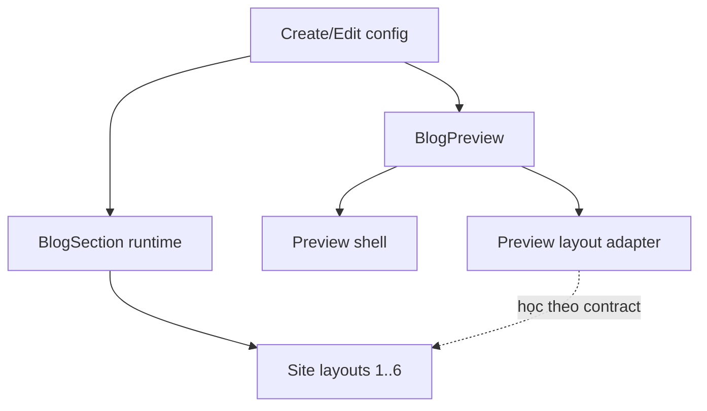

# I. Primer
## 1. TL;DR kiểu Feynman
- Đọc thêm 2 skill làm rõ một điểm rất quan trọng: `create-home-component` mô tả khung tổng quát cũ, còn `refactor-home-component` + Hero reference cho thấy pattern chuẩn hiện tại của repo là tách component thành module riêng theo kiểu Hero.
- Với Blog, lỗi không chỉ là preview lệch; gốc vấn đề là Blog chưa được tổ chức theo pattern chuẩn đó nên runtime, preview, create/edit đang bị dính nhau sai tầng.
- Hướng đúng là lấy **site runtime** làm chuẩn, rồi refactor Blog thành cấu trúc giống Hero: `_types`, `_lib`, `_components`, preview riêng, runtime rõ ràng, mapping create/edit/site 1-1.
- Nếu còn dùng shared phần nào, nó chỉ nên là helper nhỏ hoặc primitive có trách nhiệm hẹp, không phải một file monolithic quyết định cả site lẫn preview.
- Mục tiêu cuối: Blog “chuẩn theo layout”, không lệch vì contract đã được khóa ngay từ cấu trúc code, không phải vá wrapper nhiều vòng nữa.

## 2. Elaboration & Self-Explanation
- `create-home-component` giúp xác nhận các nguyên tắc nền:
  - home-component phải có 6 styles rõ ràng,
  - preview phải dùng `PreviewWrapper + BrowserFrame`,
  - style mapping phải 1-1,
  - fallback style phải ở cuối,
  - create/edit/site phải cùng đọc một config shape.
- Nhưng skill này vẫn nói theo khung cũ có `previews.tsx` tập trung. Trong repo thật hiện nay, `refactor-home-component` và Hero reference mới là bằng chứng mạnh hơn về pattern đang dùng thực tế:
  - mỗi component có module riêng,
  - preview nằm trong `app/admin/home-components/[component]/_components/[Component]Preview.tsx`,
  - edit route riêng,
  - shared utilities dùng từ `_shared`,
  - route cũ chỉ redirect.
- Đối chiếu với Blog hiện tại:
  - Blog có module riêng rồi, nhưng chưa đạt tinh thần chuẩn của Hero.
  - `components/site/BlogSection.tsx` vẫn chỉ là adapter mỏng, còn `BlogSectionShared.tsx` đang ôm quá nhiều trách nhiệm cho cả preview và site.
  - Điều đó làm parity rất khó khóa vì một file đang phải giải quyết cùng lúc runtime layout, preview behavior, content limit, breakpoint behavior.
- Vì user đã chốt “site runtime là source of truth”, nên spec mới cần mạnh tay hơn bản trước:
  - không vá `BlogSectionShared` thêm nữa như giải pháp chính,
  - mà refactor lại Blog theo runtime-first architecture, bám sát pattern Hero/refactor-home-component.

## 3. Concrete Examples & Analogies
- Ví dụ từ skill `refactor-home-component`:
  - Pattern Hero có `HeroPreview.tsx` riêng cho admin preview.
  - Runtime Hero có `HeroRuntimeSection.tsx` riêng cho site.
  - Shared chỉ là utilities/hook/frame, không có một `HeroSectionShared` monolithic ôm toàn bộ concern.
- Ví dụ từ Blog hiện tại:
  - `BlogSectionShared.tsx` đang chứa toàn bộ `layout1..layout6`, lại còn nhận `context` và `device`.
  - Đây là dấu hiệu file đang phải làm nhiều việc hơn mức cần thiết.
- Analogy:
  - Hero giống một nhà máy có dây chuyền riêng cho “hàng demo” và “hàng bán thật”, nhưng cả hai cùng dùng chung bản thông số.
  - Blog hiện tại giống gom cả thiết kế, demo và sản xuất thật vào cùng một máy. Máy này sửa chỗ nào cũng ảnh hưởng dây chuyền khác.

# II. Audit Summary (Tóm tắt kiểm tra)
- Observation:
  - `home-component-parity-guard` yêu cầu khóa source-of-truth parity, map đủ create/edit/preview/site, tránh wrapper hack.
  - `create-home-component` xác nhận các contract nền: 6 styles, style mapping 1-1, preview shell chuẩn, fallback cuối, config nhất quán.
  - `refactor-home-component` + Hero reference cho thấy pattern thực chiến hiện tại của repo là module feature-based theo component, preview riêng, edit route riêng, dùng `_shared` utilities.
  - Blog tuy đã có module riêng nhưng vẫn để một `BlogSectionShared.tsx` gánh quá nhiều concern.
- Inference:
  - Vấn đề của Blog là “đã modularized một phần nhưng chưa modularized đúng tầng”.
  - Muốn hết lệch bền vững thì phải đưa Blog về đúng pattern Hero/refactor-home-component, không chỉ fix bên trong shared file.
- Decision:
  - Spec mới sẽ refactor Blog theo pattern Hero, với site runtime làm nguồn chuẩn duy nhất.

# III. Root Cause & Counter-Hypothesis (Nguyên nhân gốc & Giả thuyết đối chứng)
## Root Cause Confidence
- High.
- Lý do: đã có 3 lớp evidence cùng chiều:
  - user xác nhận site runtime là baseline,
  - skill parity-guard nêu đúng failure mode của Blog,
  - skill refactor-home-component + Hero reference cho thấy pattern chuẩn hiện tại khác với cách Blog đang tổ chức concern.

## Trả lời 8 câu audit bắt buộc
1. Triệu chứng quan sát được là gì?
   - Expected: site thật đúng chuẩn, preview học theo site, code tổ chức chuẩn như home-component tốt trong repo.
   - Actual: site thật vẫn sai; Blog còn drift vì contract kiến trúc chưa khóa đúng tầng.
2. Phạm vi ảnh hưởng?
   - `create/blog`, `blog/[id]/edit`, preview Blog, site Blog runtime.
3. Có tái hiện ổn định không?
   - Có ở mức cấu trúc code và luồng render, không phụ thuộc dữ liệu ngẫu nhiên.
4. Mốc thay đổi gần nhất?
   - Có chuỗi fix Blog parity nhiều vòng; `COMMIT_SIGNALS.md` của parity-guard cũng ghi nhận rõ điều này.
5. Dữ liệu nào đang thiếu?
   - Chưa có side-by-side visual matrix cuối cùng cho từng layout sau refactor.
6. Có giả thuyết thay thế hợp lý nào chưa bị loại trừ?
   - Có: site sai chỉ vì một vài class/layout block, không cần refactor tầng kiến trúc.
   - Nhưng hypothesis này yếu vì repo đã có pattern chuẩn rõ hơn và Blog đã drift nhiều vòng trước đó.
7. Rủi ro nếu fix sai nguyên nhân là gì?
   - Tiếp tục fix cục bộ nhiều lần, parity không bền, regress khi sửa layout sau này.
8. Tiêu chí pass/fail sau khi sửa?
   - Site runtime là chuẩn cho 6 layouts; preview create/edit chỉ mô phỏng theo runtime contract; mapping config/style không mơ hồ.

## Counter-Hypothesis (Giả thuyết đối chứng)
### a) Chỉ cần giữ `BlogSectionShared.tsx` và chỉnh class cẩn thận hơn
- Confidence 38%.
- Có thể xử lý symptom ngắn hạn.
- Không phù hợp với mục tiêu “code chuẩn theo layout” và không tận dụng pattern Hero đã có.

### b) Tách preview riêng nhưng vẫn giữ runtime dựa gần hết vào `BlogSectionShared.tsx`
- Confidence 58%.
- Khá hơn hiện trạng.
- Nhưng vẫn có nguy cơ shared file tiếp tục phình ra và trở thành điểm drift mới.

# IV. Proposal (Đề xuất)
## Option A (Recommend) — Confidence 93%
Refactor Blog theo pattern Hero + parity-guard:
- site runtime là source of truth,
- preview là bề mặt riêng,
- shared layer chỉ giữ phần thật sự dùng chung và nhỏ gọn,
- create/edit/site mapping 1-1 theo config contract.

### Kiến trúc mục tiêu
1. **Runtime-first**
   - `components/site/BlogSection.tsx` trở thành runtime renderer rõ ràng hơn cho 6 layout.
   - Runtime quyết định output thật của site.

2. **Preview riêng đúng pattern repo**
   - `BlogPreview.tsx` chỉ lo admin preview shell + device + style switch + mock/data binding.
   - Preview học từ runtime contract, không tự sáng tác layout khác site.

3. **Shared layer tối giản**
   - Nếu giữ `BlogSectionShared.tsx`, file này sẽ bị thu nhỏ phạm vi rất mạnh.
   - Chỉ giữ helper/render primitive thật sự chung; không để là “bộ não trung tâm” cho cả preview/site nữa.

4. **Config contract khóa 1-1**
   - `_types/index.ts`, create page, edit page, runtime phải cùng hiểu một shape.
   - 6 styles vẫn giữ đúng union type hiện tại.

### Vì sao Option A tốt nhất
- Khớp chính xác baseline user đã chốt: site runtime là nguồn thật.
- Khớp skill `home-component-parity-guard`.
- Khớp pattern thật trong `refactor-home-component` và Hero reference.
- Giảm nguy cơ drift dài hạn tốt hơn fix cục bộ.

## Option B — Confidence 55%
Giữ kiến trúc hiện tại, chỉ tổ chức lại `BlogSectionShared.tsx` theo sub-renderers bên trong file/module.
- Ít thay đổi hơn.
- Nhưng vẫn yếu hơn vì source-of-truth chưa tách dứt khoát khỏi shared layer.

## Mermaid flow

# V. Files Impacted (Tệp bị ảnh hưởng)
## Admin / Blog module
- Sửa: `E:\NextJS\study\admin-ui-aistudio\system-vietadmin-nextjs\app\admin\home-components\blog\_components\BlogPreview.tsx`
  - Vai trò hiện tại: preview admin cho Blog.
  - Thay đổi: đưa về đúng pattern Hero `PreviewWrapper + BrowserFrame + deviceWidths`, chỉ còn concern preview.

- Sửa: `E:\NextJS\study\admin-ui-aistudio\system-vietadmin-nextjs\app\admin\home-components\blog\_components\BlogSectionShared.tsx`
  - Vai trò hiện tại: shared renderer monolithic cho preview/site.
  - Thay đổi: giảm mạnh scope hoặc tách nhỏ; không còn là nơi ôm toàn bộ runtime contract của 6 layouts.

- Sửa: `E:\NextJS\study\admin-ui-aistudio\system-vietadmin-nextjs\app\admin\home-components\blog\[id]\edit\page.tsx`
  - Vai trò hiện tại: edit page cho Blog.
  - Thay đổi: đảm bảo load/save/style/config đúng contract sau refactor.

- Sửa: `E:\NextJS\study\admin-ui-aistudio\system-vietadmin-nextjs\app\admin\home-components\create\blog\page.tsx`
  - Vai trò hiện tại: create page cho Blog.
  - Thay đổi: đảm bảo submit/default state/preview cùng contract với edit + runtime.

## Site runtime
- Sửa: `E:\NextJS\study\admin-ui-aistudio\system-vietadmin-nextjs\components\site\BlogSection.tsx`
  - Vai trò hiện tại: runtime site entry.
  - Thay đổi: trở thành runtime source-of-truth rõ ràng hơn cho từng layout, không chỉ là adapter mỏng đẩy hết vào shared file.

## Types / constants nếu cần
- Có thể sửa: `E:\NextJS\study\admin-ui-aistudio\system-vietadmin-nextjs\app\admin\home-components\blog\_types\index.ts`
  - Vai trò hiện tại: union types + config normalization.
  - Thay đổi: chỉ chỉnh nếu cần làm rõ style/config mapping 1-1.

# VI. Execution Preview (Xem trước thực thi)
1. Map đủ create / edit / preview / site theo checklist parity-guard.
2. Dùng Hero/refactor-home-component làm reference pattern chính.
3. Xác định phần runtime layout của Blog cần đặt lại ở `components/site/BlogSection.tsx`.
4. Thu nhỏ hoặc tách `BlogSectionShared.tsx` để bỏ monolithic concern.
5. Cập nhật `BlogPreview.tsx` để chỉ còn preview concern.
6. Soát create/edit để config shape và style keys vẫn map 1-1.
7. Review tĩnh theo checklist skill trước khi coi là done.

# VII. Verification Plan (Kế hoạch kiểm chứng)
- Không chạy lint/unit test/build vì repo instruction cấm tự chạy lint/unit test.
- Verification tĩnh sẽ bám 4 nguồn:
  1. `home-component-parity-guard/CHECKLIST.md`
  2. `create-home-component` conventions
  3. `refactor-home-component` checklist
  4. Hero reference trong repo
- Checklist bắt buộc sau implementation:
  - đủ map create/edit/preview/site,
  - style keys 1-1,
  - preview shell đúng pattern repo,
  - site runtime là source-of-truth,
  - fallback cuối function,
  - buttons preview có `type="button"`,
  - không drift DOM hierarchy vô cớ,
  - create/edit save-load đúng config.
- Nếu có thay đổi code TS/TSX, trước commit sẽ chỉ chạy `bunx tsc --noEmit` theo rule repo.

# VIII. Todo
1. Audit Blog theo parity-guard + create-home-component + refactor-home-component.
2. Khóa site runtime làm source-of-truth.
3. Refactor Blog về pattern gần Hero.
4. Giảm hoặc tách monolithic shared renderer.
5. Đồng bộ create/edit/preview/site contract.
6. Review tĩnh theo checklist skill trước khi chốt.

# IX. Acceptance Criteria (Tiêu chí chấp nhận)
- Blog tuân theo pattern home-component chuẩn gần Hero hơn hiện trạng.
- Site runtime là nguồn thật cho 6 layouts.
- Preview create/edit không tự render logic lệch site.
- Style/config mapping giữ 1-1, không alias mơ hồ.
- Shared layer nếu còn tồn tại chỉ giữ concern hẹp, không ôm toàn bộ parity.
- Không còn phụ thuộc vào wrapper hack để “đúng tạm”.

# X. Risk / Rollback (Rủi ro / Hoàn tác)
- Rủi ro:
  - Refactor này sâu hơn patch cục bộ, có thể làm thay đổi output của một số layout trước mắt.
  - Nếu tách shared layer chưa đủ triệt để, drift vẫn có thể quay lại.
- Giảm rủi ro:
  - Bám site runtime làm baseline.
  - Bám Hero/reference + parity checklist.
  - Sửa tập trung trong Blog module và runtime entry.
- Rollback:
  - Có thể rollback theo commit vì phạm vi thay đổi tập trung quanh Blog.

# XI. Out of Scope (Ngoài phạm vi)
- Không refactor Hero/Stats; chỉ dùng làm reference.
- Không mở rộng sang component khác như FAQ/Testimonial.
- Không redesign visual ngoài phần cần để đưa Blog về đúng contract chuẩn.

# XII. Open Questions (Câu hỏi mở)
- Không còn ambiguity đáng kể. Sau khi đọc thêm 2 skill, hướng ưu tiên rõ nhất là Option A.