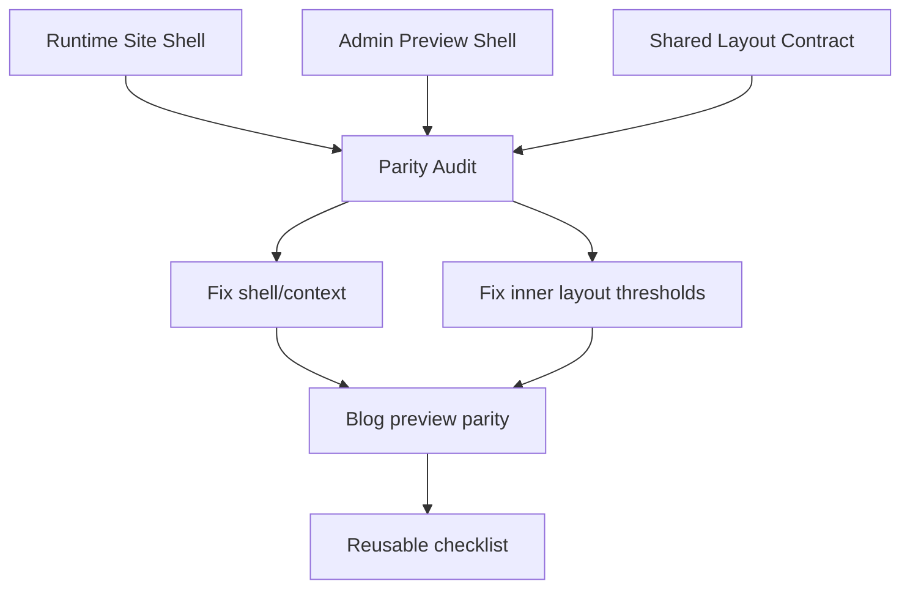

# I. Primer
## 1. TL;DR kiểu Feynman
- Lỗi này không chỉ là “layout code sai”, mà là `preview parity drift` giữa admin preview và runtime/site.
- Cùng một `BlogSectionShared`, nhưng nếu preview shell dùng container/breakpoint/padding/min-width khác runtime thì desktop/tablet/mobile sẽ lệch dù markup đúng.
- Evidence hiện tại cho thấy `BlogPreview.tsx` đang tự dựng shell preview riêng, còn runtime site dùng context khác trong `components/site/BlogSection.tsx` và page thực.
- Đây đã từng lặp lại ở FAQ (`fix(faq): align preview layouts with showcase parity`), nên spec nên chốt theo hướng: sửa blog hiện tại và tạo pattern chống tái phát.
- Scope theo quyết định của anh: `Blog + pattern dùng lại`, ưu tiên `cân bằng cả fix nhanh lẫn chống tái phát`.

## 2. Elaboration & Self-Explanation
- Khi copy UI vào admin preview, có 2 câu hỏi khác nhau:
  1. `layout code có đúng không?`
  2. `preview shell có cùng layout context với runtime không?`
- Vấn đề anh nêu nằm ở câu số 2. Đây là nguyên nhân kiểu “đặt đúng đồ vào sai căn phòng”.
- `BlogSectionShared.tsx` có nhiều layout dùng grid, max-width, và cả container-query style như `@[600px]`, `@[900px]`. Các rule này phản ứng theo **container thực tế**, không chỉ theo viewport.
- `BlogPreview.tsx` hiện tạo một khung preview desktop/tablet/mobile riêng với `min-w`, `max-w`, `px`, `py`, border-top, mobile ring, status bar giả, home indicator giả, và `@container` bọc trong.
- Runtime site (`components/site/BlogSection.tsx`) lại render cùng shared component trong page/container thực của site, không phải trong khung preview admin đó.
- Vì vậy một layout có thể “đúng theo source/shared code” nhưng vẫn lệch khi đặt trong preview shell khác runtime shell. Đây là đúng định nghĩa của parity drift.
- Commit history cũng hỗ trợ hướng này:
  - `9c7b14c2 feat(blog): align admin and site layouts from source`
  - `afb10183 fix(blog): use exact layout1-layout6 mapping`
  - `8e276c06 fix(faq): align preview layouts with showcase parity`
- Tức là repo đã có tiền lệ: port layout đúng chưa đủ, còn phải port **context preview parity**.

## 3. Concrete Examples & Analogies
- Ví dụ 1:
  - `BlogSectionShared.tsx` layout cuối đang dùng `@[600px]:grid-cols-2 @[900px]:grid-cols-3`.
  - Nếu admin preview bọc section trong shell có inner width khác runtime, grid sẽ nhảy cột ở ngưỡng khác dù code y hệt.
- Ví dụ 2:
  - `BlogPreview.tsx` desktop hiện dùng `w-full min-w-[1024px] max-w-7xl ... px-6 md:px-12 lg:px-20` rồi lại bọc thêm `max-w-[1400px] mx-auto` cho inner `@container`.
  - Runtime site không đi qua đúng shell này, nên preview desktop có thể “rộng hơn”, “chặt hơn”, hoặc “nhảy cột sớm hơn” site.
- Ví dụ 3:
  - FAQ đã từng cần commit riêng để “align preview layouts with showcase parity”. Blog đang lặp lại cùng class bug nhưng ở module khác.
- Analogy đời thường:
  - Cùng một bộ bàn ghế đặt ở 2 căn phòng khác kích thước cửa, tường, khoảng lùi thì cảm giác bố cục khác ngay. Preview parity drift chính là: đồ đúng, nhưng phòng đặt sai.

# II. Audit Summary (Tóm tắt kiểm tra)
- Observation:
  - `app/admin/home-components/blog/_components/BlogPreview.tsx` có preview shell riêng cho desktop/tablet/mobile, không dùng `PreviewWrapper` chung.
  - `app/admin/home-components/blog/_components/BlogSectionShared.tsx` là shared renderer cho cả `context="preview"` và `context="site"`.
  - `components/site/BlogSection.tsx` render `BlogSectionShared` ở runtime site với `context="site"`, không chia sẻ cùng shell preview admin.
  - `BlogSectionShared.tsx` đang có nhiều nhánh class khác nhau giữa `preview` và `site`, ví dụ `getOuterShellClassName(...)` trả về `% width / px` cho preview, nhưng `max-w-7xl px-4 sm:px-6 lg:px-8` cho site.
  - FAQ trước đó đã có commit sửa theo đúng nhóm lỗi parity này, cho thấy đây không phải case riêng lẻ.
- Inference:
  - Root cause chính không phải “một layout blog viết sai”, mà là drift giữa preview shell/context và runtime shell/context.
  - Ngoài bug trước mắt ở blog, repo cần một pattern kiểm tra parity để tránh lặp lại ở component khác.
- Decision:
  - Spec sẽ ưu tiên audit + fix theo lớp `shell/context parity` trước, rồi mới chốt các chỉnh sửa layout cụ thể nếu còn cần.

# III. Root Cause & Counter-Hypothesis (Nguyên nhân gốc & Giả thuyết đối chứng)
## 1. Root Cause Confidence (Độ tin cậy nguyên nhân gốc)
- High.
- Reason: evidence khớp trên cả ba mặt: code hiện tại (`BlogPreview.tsx`, `BlogSectionShared.tsx`), runtime consumer (`components/site/BlogSection.tsx`), và lịch sử commit FAQ/blog đã từng xử lý bài toán parity tương tự.

## 2. Root Cause
1. Triệu chứng quan sát được là gì (expected vs actual)?
   - Expected: admin preview và runtime/site phản ứng gần như cùng logic bố cục khi đổi desktop/tablet/mobile.
   - Actual: cùng shared layout nhưng preview desktop có thể lệch grid/container/breakpoint so runtime.
2. Phạm vi ảnh hưởng (user, module, môi trường)?
   - Ảnh hưởng đến blog home-component trong create/edit admin; có giá trị như một pattern bug cho các preview khác.
3. Có tái hiện ổn định không? điều kiện tái hiện tối thiểu?
   - Có. Điều kiện tối thiểu: cùng một layout render trong admin preview shell và runtime site shell khác nhau.
4. Mốc thay đổi gần nhất (commit/config/dependency/data)?
   - Sau các commit align layout blog từ source, parity shell vẫn chưa được formalize thành checklist/rule chung.
5. Dữ liệu nào đang thiếu để kết luận chắc chắn?
   - Thiếu ma trận so sánh có cấu trúc cho từng layout × device giữa preview và runtime.
6. Có giả thuyết thay thế hợp lý nào chưa bị loại trừ?
   - Có thể một vài class riêng trong từng layout còn lệch. Nhưng ngay cả khi vậy, shell/context drift vẫn là nguyên nhân nền cần xử lý trước.
7. Rủi ro nếu fix sai nguyên nhân là gì?
   - Sẽ quay lại kiểu fix bằng mắt từng layout; bug lặp lại lần 3 ở module khác.
8. Tiêu chí pass/fail sau khi sửa?
   - Preview không còn lệch logic container/breakpoint rõ rệt so runtime; có checklist parity dùng lại cho component khác.

## 3. Counter-Hypothesis (Giả thuyết đối chứng)
- Giả thuyết A: chỉ `BlogSectionShared.tsx` sai class từng layout.
  - Không đủ. Không giải thích được vì drift lặp theo pattern preview/runtime context ở nhiều module.
- Giả thuyết B: chỉ `BlogPreview.tsx` sai shell.
  - Gần đúng nhưng chưa đủ. Vì trong `BlogSectionShared.tsx` hiện đã có nhánh class tách `preview`/`site`, nên cần audit cả shell lẫn inner contract.
- Giả thuyết C: runtime site mới là nơi sai.
  - Hiện chưa có evidence mạnh cho giả thuyết này. Runtime đang là source of truth cho trải nghiệm thật; preview mới là lớp mô phỏng dễ drift hơn.

# IV. Proposal (Đề xuất)
## 1. Hướng thực hiện đề xuất
- Option A (Recommend) — Confidence 93%
  - Audit parity drift cho blog theo 3 lớp:
    1. `preview shell`
    2. `shared layout contract`
    3. `runtime shell`
  - Sau đó sửa blog hiện tại và rút ra một pattern/checklist dùng lại cho home-component khác.
  - Tradeoff: tốn thêm chút thời gian audit, nhưng chặn tái phát tốt hơn.
- Option B — Confidence 61%
  - Chỉ vá blog bằng cách chỉnh `BlogPreview.tsx` và vài class ở `BlogSectionShared.tsx` đến khi nhìn đúng.
  - Phù hợp khi cần nóng gấp, nhưng yếu ở phần “đã gặp 2 lần rồi”.

## 2. Proposal chi tiết
### a) Audit matrix cho parity drift
- Lập ma trận kiểm tra theo trục:
  - Layout: `layout1 .. layout6`
  - Device: `desktop / tablet / mobile`
  - Surface: `admin preview / runtime site`
- Với mỗi ô, kiểm tra 5 nhóm evidence:
  1. outer width / max-width / min-width
  2. inner `@container` width thật
  3. breakpoint jump point (số cột, direction, gap)
  4. padding/ring/border gây co nội dung
  5. element density: thumbnail, title line-clamp, meta block

### b) Fix lớp 1: shell/context parity
- Ưu tiên làm cho `BlogPreview.tsx` mô phỏng sát runtime contract hơn, thay vì chỉ “đẹp trong admin”.
- Mục tiêu không phải copy nguyên shell runtime, mà là đảm bảo inner content nhận **layout context tương đương**.
- Có thể cần tách helper shell constants hoặc một contract nhỏ để device width/padding không bị hard-code phân tán.

### c) Fix lớp 2: shared layout contract
- Audit các helper như `getOuterShellClassName(...)` trong `BlogSectionShared.tsx` vì hiện preview/site trả về các width contract khác nhau.
- Chỉ giữ khác biệt nào thực sự cần cho preview UX; những khác biệt làm đổi bố cục phải bị loại hoặc thu hẹp.
- Nếu một layout đang dùng container-query, ưu tiên để preview và site dựa trên cùng inner width threshold, không dùng `%` tùy hứng riêng cho preview.

### d) Pattern chống tái phát
- Chốt một rule ngắn cho repo:
  - “Khi port UI vào admin preview, bắt buộc audit `preview parity drift`: shell, container context, breakpoint jump, grid density.”
- Rule này không cần productize lớn; chỉ cần đủ rõ để áp dụng lại cho FAQ/blog/các preview tiếp theo.

## 3. Mermaid diagram

# V. Files Impacted (Tệp bị ảnh hưởng)
- Sửa: `E:\NextJS\study\admin-ui-aistudio\system-vietadmin-nextjs\app\admin\home-components\blog\_components\BlogPreview.tsx`
  - Vai trò hiện tại: dựng shell preview desktop/tablet/mobile cho blog trong admin.
  - Thay đổi: chuẩn hóa shell để inner content nhận layout context sát runtime hơn; giảm drift do padding/min-width/container.
- Sửa: `E:\NextJS\study\admin-ui-aistudio\system-vietadmin-nextjs\app\admin\home-components\blog\_components\BlogSectionShared.tsx`
  - Vai trò hiện tại: shared renderer cho cả preview và site.
  - Thay đổi: audit/fix các helper class tách `preview` vs `site`, đặc biệt outer shell và container-query thresholds.
- Tham chiếu, không nhất thiết sửa: `E:\NextJS\study\admin-ui-aistudio\system-vietadmin-nextjs\components\site\BlogSection.tsx`
  - Vai trò hiện tại: runtime consumer của `BlogSectionShared`.
  - Mục đích trong spec: làm baseline để so context runtime, tránh vô tình sửa preview lệch khỏi site.
- Tham chiếu pattern, không nhất thiết sửa: `E:\NextJS\study\admin-ui-aistudio\system-vietadmin-nextjs\app\admin\home-components\faq\_components\FaqSectionShared.tsx`
  - Vai trò hiện tại: module đã từng xử lý parity drift tương tự.
  - Mục đích trong spec: học context parity pattern từ commit FAQ cũ.

# VI. Execution Preview (Xem trước thực thi)
1. Đọc lại `BlogPreview.tsx`, `BlogSectionShared.tsx`, `components/site/BlogSection.tsx` để lập parity matrix.
2. Ghi rõ khác biệt shell/context giữa preview và runtime theo từng device.
3. Sửa `BlogPreview.tsx` trước để giảm drift nền từ shell.
4. Sửa `BlogSectionShared.tsx` ở các helper preview/site nếu threshold hoặc outer shell contract còn lệch.
5. Static self-review: rà xem thay đổi nào là do parity, tránh lạc scope.
6. Chạy `bunx tsc --noEmit` vì có thay đổi TS/TSX.
7. Commit local, không push; include `.factory/docs` nếu có spec/doc liên quan cần commit theo rule repo.

# VII. Verification Plan (Kế hoạch kiểm chứng)
- Static verification:
  - `bunx tsc --noEmit`
- Repro / visual verification:
  - Mở blog create/edit trong admin.
  - Test đủ `layout1 .. layout6` trên `desktop / tablet / mobile`.
  - Với mỗi layout, kiểm tra:
    - số cột đúng kỳ vọng
    - gap/padding không bị co hoặc giãn bất thường
    - featured/list/card density không lệch rõ rệt
    - title/excerpt/meta không bị vỡ hàng khác thường do context sai
  - Đối chiếu cùng layout với runtime site consumer để xác nhận parity logic, không chỉ parity “nhìn đẹp”.
- Pass/fail:
  - Pass khi không còn drift rõ rệt về container/breakpoint behavior giữa admin preview và runtime.
  - Pass khi có thể mô tả rule parity ngắn gọn để dùng lại cho preview khác.

# VIII. Todo
1. Lập parity matrix cho blog: layout × device × surface.
2. Sửa shell/context trong `BlogPreview.tsx`.
3. Sửa helper/class parity trong `BlogSectionShared.tsx` nếu còn lệch.
4. Đối chiếu với `components/site/BlogSection.tsx` để tránh fix sai source of truth.
5. Chạy `bunx tsc --noEmit`.
6. Commit local.

# IX. Acceptance Criteria (Tiêu chí chấp nhận)
- Admin preview của blog không còn lệch logic grid/container/breakpoint rõ rệt so runtime site.
- Fix áp dụng cho toàn bộ `layout1 .. layout6`, không chỉ một layout đơn lẻ.
- Có một pattern/checklist parity drift ngắn, đủ dùng lại cho preview khác trong repo.
- Thay đổi bám đúng scope blog + pattern tái sử dụng, không refactor lan man.
- `bunx tsc --noEmit` pass.
- Có commit local, không push.

# X. Risk / Rollback (Rủi ro / Hoàn tác)
- Rủi ro 1: nếu ép preview giống runtime quá mức, UI card preview admin có thể bớt “đẹp” nhưng lại đúng hơn về bố cục.
  - Chấp nhận được vì mục tiêu ở đây là parity, không phải decorative shell.
- Rủi ro 2: sửa shell xong có thể lộ ra một vài sai khác riêng trong từng layout.
  - Giảm thiểu bằng cách sửa theo thứ tự: shell trước, layout sau.
- Rollback:
  - Revert commit local là đủ vì thay đổi tập trung chủ yếu ở 1–2 file blog preview/shared.

# XI. Out of Scope (Ngoài phạm vi)
- Không mở rộng sửa toàn bộ home-components khác trong cùng lượt này.
- Không thay đổi runtime site nếu audit cho thấy runtime đang là baseline đúng.
- Không làm framework/abstraction lớn cho preview system nếu chưa thật sự cần.

# XII. Open Questions (Câu hỏi mở)
- Không còn ambiguity lớn. Điểm mới anh bổ sung về `preview parity drift` đã đủ để chốt nguyên nhân và nâng spec từ “fix layout” lên “fix context + rút pattern chống tái phát”.