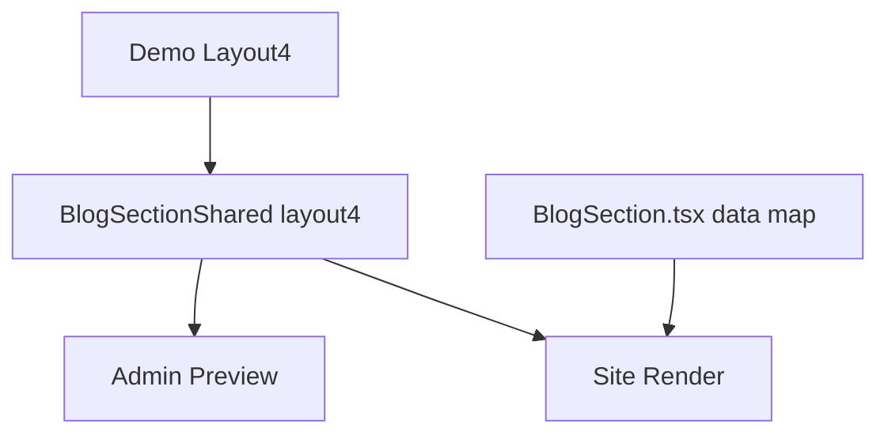

# I. Primer
## 1. TL;DR kiểu Feynman
- `layout4` hiện đang dùng chung cho preview và site qua `BlogSectionShared`, nên lệch ở preview cũng đồng thời lệch ở site thật.
- So với demo `C:\Users\VTOS\Downloads\blog-homecomponent`, `layout4` hiện lệch ở tỷ lệ khối, spacing header, typography, và card width/height.
- Root cause không nằm ở data hay route site; nó nằm ngay trong branch `style === 'layout4'` của `BlogSectionShared.tsx`.
- Hướng sửa an toàn nhất là chỉ chỉnh riêng block `layout4` trong shared component để preview + site cùng về đúng demo.
- Không cần đụng `BlogPreview.tsx` hay `components/site/BlogSection.tsx` trừ khi phát sinh wiring ngoài dự kiến.

## 2. Elaboration & Self-Explanation
Qua ảnh user gửi và đối chiếu với demo code, `layout4` đang bị “lệch form” chứ không phải chỉ lệch màu hay nội dung. Ở web hiện tại, card đầu tiên bị phóng thành một khối rất lớn, làm grid mất cân bằng; trong khi demo chốt hiển thị 3 card đồng đều theo lưới 3 cột desktop, 2 cột tablet, 1 cột mobile.

Điểm quan trọng là preview admin và site thực đều đi qua cùng một shared renderer:
- preview admin: `app/admin/home-components/blog/_components/BlogSectionShared.tsx`
- site thực: `components/site/BlogSection.tsx` import lại chính shared component này.

Điều đó giải thích vì sao user thấy preview và site cùng sai giống nhau. Nếu sửa đúng nhánh `layout4` trong shared component, cả hai surface sẽ cùng trở về đúng demo.

Từ screenshot và code demo `NewsLayouts.tsx`, layout 4 chuẩn có các đặc trưng rất rõ:
- header block với line dashed top, eyebrow “TIN TỨC MỚI NHẤT”, title + subtitle, action arrows bên phải,
- grid 3 card đồng đều trên desktop,
- ảnh card bo lớn `rounded-[2rem]`, badge date đen ở góc dưới phải,
- text block dưới ảnh có title, author, excerpt, CTA `Đọc tiếp › ›`,
- CTA cuối section là pill xanh đậm có icon tròn nền đen.

Code hiện tại của `layout4` tuy nhìn gần giống JSX demo, nhưng kết quả render thực tế đang cho thấy có drift lớn. Evidence mạnh nhất là screenshot web hiện tại có card đầu quá lớn và cột không đều, trong khi branch demo `Layout4` không hề có featured card hay asymmetric layout. Vì vậy cần coi nhánh `layout4` hiện tại là chưa parity hoàn chỉnh dù structure bề ngoài có vẻ gần.

## 3. Concrete Examples & Analogies
### Ví dụ cụ thể bám task
- Screenshot hiện tại `160735.png` và `160745.png` cho thấy card đầu của web đang chiếm gần toàn bộ chiều ngang và đẩy các card còn lại xuống dưới, tạo cảm giác như “1 featured card + các card phụ”.
- Nhưng screenshot demo `160807.png` và code `NewsLayouts.tsx` cho `Layout4` cho thấy desktop phải là 3 card ngang đều nhau, mỗi card cùng nhịp spacing và cùng cấu trúc.
- Nghĩa là chỉ cần logic/card wrapper của `layout4` lệch một chút trong shared component, cả preview lẫn site đều sai form ngay.

### Analogy đời thường
- Demo là bản in mẫu của catalogue 3 ô bằng nhau.
- Web hiện tại đang in ra kiểu ô đầu tiên phóng to như poster, còn 2 ô sau thành phụ đề. Nội dung vẫn đúng, nhưng “dàn trang” sai nên người nhìn thấy lệch ngay.

# II. Audit Summary (Tóm tắt kiểm tra)
## 1. Observation (Quan sát)
- User báo `layout4` lệch nhiều ở cả preview và site thực.
- 6 ảnh được cung cấp cho thấy:
  - ảnh đầu là preview/site hiện tại,
  - ảnh sau là demo chuẩn trong `blog-homecomponent`.
- `components/site/BlogSection.tsx` đang render site thật bằng `BlogSectionShared` từ admin blog.
- Branch `style === 'layout4'` trong `BlogSectionShared.tsx` là nơi quyết định giao diện cho cả preview và site.

## 2. Evidence (Bằng chứng)
### a) Ảnh hiện trạng
- `C:\Users\VTOS\OneDrive\Pictures\Screenshots\Screenshot 2026-04-24 160721.png`
  - preview hiện tại: spacing và grid lệch, card không theo bố cục demo.
- `C:\Users\VTOS\OneDrive\Pictures\Screenshots\Screenshot 2026-04-24 160735.png`
  - site hiện tại desktop: card đầu bị phóng lớn, không phải 3 card ngang đều.
- `C:\Users\VTOS\OneDrive\Pictures\Screenshots\Screenshot 2026-04-24 160745.png`
  - site hiện tại mobile/tablet: flow card tiếp tục lệch so với demo.

### b) Ảnh/demo chuẩn
- `C:\Users\VTOS\OneDrive\Pictures\Screenshots\Screenshot 2026-04-24 160807.png`
  - demo desktop: 3 card đều nhau, header và CTA đúng nhịp.
- `C:\Users\VTOS\OneDrive\Pictures\Screenshots\Screenshot 2026-04-24 160820.png`
  - demo mobile: 1 card/row với spacing rõ ràng, bo góc và typography consistent.
- `C:\Users\VTOS\Downloads\blog-homecomponent\components\NewsLayouts.tsx`
  - `Layout4` trong demo không có featured-card asymmetry; nó dùng `data.slice(0, 3)` trên một grid đều.

### c) Code path thực tế
- `E:\NextJS\study\admin-ui-aistudio\system-vietadmin-nextjs\components\site\BlogSection.tsx`
  - site thật import `BlogSectionShared` trực tiếp.
- `E:\NextJS\study\admin-ui-aistudio\system-vietadmin-nextjs\app\admin\home-components\blog\_components\BlogSectionShared.tsx`
  - branch `if (style === 'layout4')` là shared source of truth hiện tại.

## 3. Phạm vi ảnh hưởng
- Affected:
  - Admin preview layout4
  - Site thực layout4
- Không affected nếu sửa đúng scope:
  - Layout1, Layout2, Layout3, Layout5, Layout6
  - Form config, create/edit shell, data query, route generation

# III. Root Cause & Counter-Hypothesis (Nguyên nhân gốc & Giả thuyết đối chứng)
## 1. Root Cause
### a) Triệu chứng quan sát được là gì (expected vs actual)?
- Expected: `layout4` preview/site giống demo chốt — 3 card ngang đều trên desktop, 2 card trên tablet, 1 card trên mobile, spacing/header/CTA đúng nhịp.
- Actual: `layout4` hiện bị lệch khối lớn nhỏ, spacing và rhythm sai, nhìn như layout bất đối xứng.

### b) Phạm vi ảnh hưởng?
- User-facing ở cả admin preview và homepage/site render.
- Chỉ riêng style `layout4` của Blog home-component.

### c) Có tái hiện ổn định không? điều kiện tối thiểu?
- Có. Chỉ cần chọn `layout4` ở blog component là thấy lệch ở preview; site thật cũng lệch vì dùng cùng shared renderer.

### d) Mốc thay đổi gần nhất?
- Commit gần nhất `9f70d58b fix(blog): align responsive preview with demo shell` có chỉnh `BlogSectionShared.tsx` rộng hơn, nên rất có khả năng layout4 drift xuất hiện hoặc chưa được căn đủ sau commit này.

### e) Dữ liệu nào đang thiếu để kết luận chắc chắn?
- Không thiếu source UI. Demo code + screenshots đã đủ để kết luận layout4 shared branch là điểm cần sửa.

### f) Có giả thuyết thay thế hợp lý nào chưa bị loại trừ?
- Giả thuyết data/query site sai: confidence thấp, vì screenshot lệch là structural, không phải dữ liệu.
- Giả thuyết preview shell sai: confidence thấp, vì site thật cũng lệch giống preview.
- Giả thuyết CSS global khác demo: có thể ảnh hưởng nhẹ, nhưng evidence mạnh nhất vẫn trỏ vào block JSX/layout classes của `layout4`.

### g) Rủi ro nếu fix sai nguyên nhân là gì?
- Sửa `BlogPreview.tsx` hoặc site wrapper ngoài shared component sẽ chỉ vá một surface, surface còn lại vẫn sai.
- Sửa lan sang các layout khác có thể gây regression ngoài scope.

### h) Tiêu chí pass/fail sau khi sửa?
- `layout4` preview và site cùng match demo về grid, card ratio, header, CTA, spacing chính.
- Các layout khác không đổi hành vi.

## 2. Root Cause Confidence
- High
- Reason: evidence thống nhất từ screenshot hiện trạng, screenshot demo, demo source code, và đường render site thực cùng trỏ về một shared branch `layout4`.

## 3. Counter-Hypothesis (Giả thuyết đối chứng)
Có thể nghĩ rằng site thực lệch vì wrapper của `components/site/BlogSection.tsx` hoặc query posts khác preview. Nhưng file này chỉ map data rồi truyền vào `BlogSectionShared`; nó không tự áp layout4 riêng. Vì vậy nếu preview và site cùng lệch, nguyên nhân hợp lý nhất là branch `layout4` trong shared component chưa parity với demo.

# IV. Proposal (Đề xuất)
## 1. Hướng sửa đề xuất
Option A (Recommend) — Confidence 93%
- Chỉ chỉnh riêng branch `layout4` trong `BlogSectionShared.tsx` để bám sát demo.
- Giữ nguyên wiring preview/site hiện có.
- Không đụng các layout khác.

## 2. Cách thực hiện cụ thể
### a) Chuẩn hoá layout4 theo demo
- So từng phần với `NewsLayouts.tsx > Layout4`:
  - header wrapper,
  - eyebrow line + label,
  - title/subtitle spacing,
  - action arrows,
  - grid columns,
  - card image ratio + radius,
  - badge date,
  - text stack dưới ảnh,
  - CTA cuối section.

### b) Giữ 1 source of truth cho preview + site
- Không thêm branch riêng cho preview/site.
- Tiếp tục dùng `context="preview" | "site"` nếu có khác biệt thật sự bắt buộc; nếu không thì dùng cùng markup/class để tránh drift lần nữa.

### c) Không mở rộng scope
- Không sửa `BlogPreview.tsx` nếu audit cuối cho thấy shell vẫn đúng.
- Không sửa `components/site/BlogSection.tsx` nếu chỉ cần data mapping hiện tại.

## 3. Mermaid diagram

# V. Files Impacted (Tệp bị ảnh hưởng)
## 1. Shared UI
- Sửa: `E:\NextJS\study\admin-ui-aistudio\system-vietadmin-nextjs\app\admin\home-components\blog\_components\BlogSectionShared.tsx`
  - Vai trò hiện tại: source of truth cho cả preview và site blog layouts.
  - Thay đổi dự kiến: chỉnh riêng branch `layout4` để parity với demo, không chạm layout khác.

## 2. Site wiring
- Có thể không sửa: `E:\NextJS\study\admin-ui-aistudio\system-vietadmin-nextjs\components\site\BlogSection.tsx`
  - Vai trò hiện tại: map data site rồi truyền vào shared layout.
  - Thay đổi dự kiến: chỉ đụng nếu phát hiện cần normalize field nào đó riêng cho layout4; khả năng thấp.

## 3. Preview shell
- Có thể không sửa: `E:\NextJS\study\admin-ui-aistudio\system-vietadmin-nextjs\app\admin\home-components\blog\_components\BlogPreview.tsx`
  - Vai trò hiện tại: device shell cho preview.
  - Thay đổi dự kiến: không sửa nếu audit cuối xác nhận layout4 lệch không đến từ shell.

# VI. Execution Preview (Xem trước thực thi)
1. Đọc lại `layout4` trong `BlogSectionShared.tsx` cạnh `Layout4` của demo.
2. Sửa markup/classes của `layout4` cho parity desktop/tablet/mobile.
3. Rà `components/site/BlogSection.tsx` để chắc không có data mapping nào làm lệch layout4.
4. Kiểm tra diff chỉ chạm `layout4` branch hoặc tối đa 1–2 file liên quan trực tiếp.
5. Nếu có thay đổi TS/TSX code, chạy `bunx tsc --noEmit`.
6. Review diff, commit local, không push.

# VII. Verification Plan (Kế hoạch kiểm chứng)
## 1. Static verification
- So sánh lại `layout4` code sau sửa với demo source `NewsLayouts.tsx`.
- Đảm bảo các layout khác trong `BlogSectionShared.tsx` không đổi.
- Rà lại `context="preview"` và `context="site"` để tránh branch diverge mới.

## 2. Typecheck
- Chạy `bunx tsc --noEmit` sau khi implement vì có thay đổi TS/TSX.
- Không chạy lint/unit test/build theo AGENTS.md của repo.

## 3. Visual pass checklist
- Desktop: 3 card ngang đều.
- Tablet: 2 card.
- Mobile: 1 card/row.
- Header, badge date, CTA cuối section match demo.
- Preview và site ra cùng một structure.

# VIII. Todo
- [pending] Chỉnh riêng branch `layout4` trong `BlogSectionShared.tsx` theo demo.
- [pending] Rà data mapping site trong `components/site/BlogSection.tsx`.
- [pending] Chạy `bunx tsc --noEmit`.
- [pending] Review diff + commit local, không push.

# IX. Acceptance Criteria (Tiêu chí chấp nhận)
- `layout4` ở admin preview khớp demo về bố cục chính.
- `layout4` ở site thực khớp demo về bố cục chính.
- Desktop/tablet/mobile đều đúng nhịp grid như demo.
- Các layout blog khác không bị thay đổi ngoài ý muốn.
- Không mở rộng scope sang form/create/edit shell.

# X. Risk / Rollback (Rủi ro / Hoàn tác)
## 1. Rủi ro
- Vì `layout4` là shared giữa preview và site, bất kỳ chỉnh sửa nào cũng ảnh hưởng đồng thời cả hai surface.
- Nếu sửa quá rộng trong `BlogSectionShared.tsx`, có thể vô tình tác động layout khác.

## 2. Rollback
- Giữ thay đổi gói gọn trong branch `layout4` để rollback đơn giản bằng 1 commit hoặc vài hunks.
- Nếu phát hiện regressions, có thể revert commit riêng của layout4 mà không động tới phần parity đã ổn của layout khác.

# XI. Out of Scope (Ngoài phạm vi)
- Chỉnh lại toàn bộ blog layouts 1,2,3,5,6.
- Refactor preview shell toàn cục.
- Thay đổi data source hoặc schema posts/categories.

# XII. Open Questions (Câu hỏi mở)
- Không còn ambiguity lớn. Evidence hiện tại đủ để proceed theo hướng sửa tối thiểu chỉ cho `layout4`.