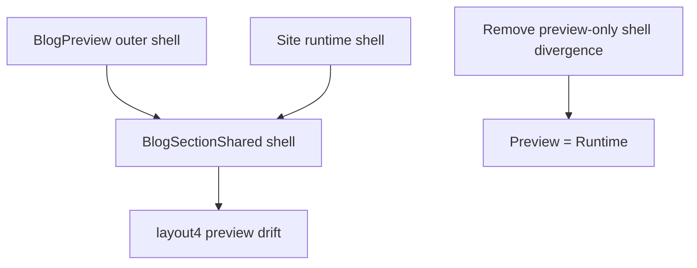

# I. Primer
## 1. TL;DR kiểu Feynman
- Preview hiện vẫn sai không phải vì không dùng code mới, mà vì code mới vẫn còn một nhánh `preview/layout4` riêng trong `BlogSectionShared.tsx`.
- Nhánh này làm preview `layout4` dùng outer shell khác site/runtime, nên dù sửa `BlogPreview.tsx` bao nhiêu lần thì preview vẫn drift.
- Site đúng, preview sai, nghĩa là bug còn lại nằm ở **special-case preview** chứ không nằm ở runtime layout.
- Fix đúng gốc là bỏ divergence này: cho preview `layout4` dùng cùng shell contract với site/runtime.
- Đây là fix dứt điểm hơn các lần trước vì chạm đúng điểm khác biệt cuối cùng còn sót lại.

## 2. Elaboration & Self-Explanation
Lý do user vẫn thấy “không đổi gì” dù đã có nhiều commit là vì các commit trước chủ yếu sửa xung quanh `BlogPreview.tsx` hoặc chỉnh cấu trúc `layout4`, nhưng chưa chạm đúng điểm gây drift cuối cùng.

Audit hiện tại cho thấy create/edit thật sự đang dùng code mới nhất:
- `create/blog/page.tsx` render `BlogPreview`
- `blog/[id]/edit/page.tsx` render `BlogPreview`
- `BlogPreview.tsx` render `BlogSectionShared` với `context="preview"`

Tức là không có chuyện preview đang đọc nhầm file cũ. Vấn đề là trong `BlogSectionShared.tsx`, hàm `getOuterShellClassName()` vẫn có nhánh riêng cho `preview + layout4`:
- site/layout4 dùng shell kiểu `mx-auto max-w-7xl px-4 sm:px-6 lg:px-8 @container`
- preview/layout4 dùng `w-full @container`

Chỉ riêng khác biệt này là đủ để desktop preview ra context khác runtime. Nói cách khác, preview và site vẫn đang sống trong 2 cái “khung ngoài” khác nhau cho cùng một layout4.

Đây là lý do mọi fix trước ở `BlogPreview.tsx` chỉ giải quyết được một phần hoặc tạo hiệu ứng rất nhỏ: vì lớp shell ngoài cùng trong `BlogSectionShared.tsx` vẫn override khác site.

## 3. Concrete Examples & Analogies
### Ví dụ cụ thể bám task
Hiện tại trong `BlogSectionShared.tsx`:
- site/layout4 → `${baseSiteShell} @container`
- preview/layout4 → `w-full @container`

Trong khi demo source `NewsLayouts.tsx` không có logic “preview shell riêng” như vậy cho layout4. Nó assume layout4 chạy trong một container thống nhất.

Nghĩa là preview admin hiện tại đang tự tạo một ngoại lệ cho layout4 mà runtime site không có. Ngoại lệ đó chính là drift cuối cùng.

### Analogy đời thường
- Cùng một tấm poster, nếu đóng khung A thì nhìn cân đối.
- Nếu ở preview lại bỏ poster đó vào khung B hẹp hơn hoặc khác padding, nội dung bên trong vẫn y nguyên nhưng tổng thể nhìn sai.
- Ở đây `layout4` là poster, còn `getOuterShellClassName()` là cái khung.

# II. Audit Summary (Tóm tắt kiểm tra)
## 1. Observation (Quan sát)
- User báo preview ở edit/create vẫn sai dù site đúng.
- Rà commit gần đây cho thấy đã có nhiều vòng fix:
  - `9f70d58b`
  - `a1d901bb`
  - `ee121b27`
  - `594cf7c8`
  - `013d24b1`
  - `923cf1bc`
  - `9cfc324f`
- Nhưng preview vẫn drift vì special-case preview/layout4 chưa bị gỡ bỏ.

## 2. Evidence (Bằng chứng)
### a) Đường chạy thật của preview hiện tại
- `E:\NextJS\study\admin-ui-aistudio\system-vietadmin-nextjs\app\admin\home-components\create\blog\page.tsx`
- `E:\NextJS\study\admin-ui-aistudio\system-vietadmin-nextjs\app\admin\home-components\blog\[id]\edit\page.tsx`
- Cả hai đều dùng `BlogPreview` hiện tại.

### b) Preview shell hiện tại
- `E:\NextJS\study\admin-ui-aistudio\system-vietadmin-nextjs\app\admin\home-components\blog\_components\BlogPreview.tsx`
- `getPreviewViewportClassName()` đã được sửa vài lần, nhưng chỉ là outer preview viewport layer.

### c) Divergence cuối cùng còn lại
- `E:\NextJS\study\admin-ui-aistudio\system-vietadmin-nextjs\app\admin\home-components\blog\_components\BlogSectionShared.tsx`
- `getOuterShellClassName()`:
  - site/layout4: `${baseSiteShell} @container`
  - preview/layout4: `w-full @container`

### d) Demo source of truth
- `C:\Users\VTOS\Downloads\blog-homecomponent\components\NewsLayouts.tsx`
- `Layout4` không có một outer shell riêng cho preview khác runtime.

## 3. Phạm vi ảnh hưởng
- Affected:
  - preview layout4 ở create
  - preview layout4 ở edit
- Không nên ảnh hưởng:
  - runtime site layout4
  - layout1,2,3,5,6
  - data/query/blog selection logic

# III. Root Cause & Counter-Hypothesis (Nguyên nhân gốc & Giả thuyết đối chứng)
## 1. Root Cause
### a) Triệu chứng quan sát được là gì?
- Expected: preview layout4 desktop giống runtime/site.
- Actual: preview layout4 vẫn lệch, dù site đã đúng và các fix shell trước đã được merge.

### b) Phạm vi ảnh hưởng?
- Chỉ preview `layout4`.

### c) Có tái hiện ổn định không?
- Có, vì `getOuterShellClassName()` luôn trả class khác nhau giữa site và preview cho `layout4`.

### d) Mốc thay đổi gần nhất?
- Các commit gần đây chủ yếu sửa `BlogPreview.tsx` và block `layout4`, nhưng chưa xoá nhánh preview/layout4 khác site trong shared shell.

### e) Dữ liệu nào đang thiếu?
- Không thiếu. Code audit + git history đã đủ kết luận.

### f) Có giả thuyết thay thế hợp lý nào chưa bị loại trừ?
- Preview đang dùng file cũ: bị loại trừ.
- Runtime layout còn sai: bị loại trừ vì user xác nhận site đúng.
- Special-case preview/layout4 trong shared shell là root cause: confidence rất cao.

### g) Rủi ro nếu fix sai nguyên nhân?
- Tiếp tục sửa `BlogPreview.tsx` outer shell sẽ chỉ vá thêm một vòng nữa mà không dứt drift.
- Có thể mất thêm nhiều commit mà UI gần như không đổi.

### h) Tiêu chí pass/fail sau khi sửa?
- Preview layout4 create/edit dùng shell contract giống runtime/site.
- User thấy preview desktop thay đổi rõ theo hướng khớp site.

## 2. Root Cause Confidence
- High
- Reason: preview path đã xác nhận dùng code mới nhất; difference cuối cùng còn tồn tại nằm ngay ở `getOuterShellClassName()` của shared component.

## 3. Counter-Hypothesis (Giả thuyết đối chứng)
Nếu nguyên nhân là `BlogPreview.tsx` outer frame, thì các commit `923cf1bc` và `9cfc324f` đã phải sửa được triệt để hơn. Việc user vẫn thấy “vẫn vậy” cho thấy outer frame không phải nguồn sai cuối cùng; shared inner shell mới là điểm divergence thật sự.

# IV. Proposal (Đề xuất)
## 1. Hướng sửa đề xuất
Option A (Recommend) — Confidence 97%
- Sửa `getOuterShellClassName()` trong `BlogSectionShared.tsx` để xoá special-case preview/layout4.
- Cho preview/layout4 dùng cùng shell contract với site/layout4.
- Không mở rộng sang sửa runtime/site nếu không bắt buộc.

## 2. Cách thực hiện cụ thể
### a) Fix đúng chỗ trong shared shell
- Trong `getOuterShellClassName()`:
  - bỏ `return 'w-full @container'` cho `style === 'layout4'` ở preview
  - dùng cùng contract với site/layout4, hoặc normalize về một helper chung cho cả hai context.

### b) Giữ `BlogPreview.tsx` ổn định
- Không đảo thêm nhiều lần ở outer viewport nếu không thật sự cần.
- Chỉ verify create/edit vẫn cùng nhận tác động từ shared fix.

### c) Verify focused
- Kiểm tra preview desktop layout4 ở edit/create.
- Đảm bảo site runtime không bị regress.

## 3. Mermaid diagram

# V. Files Impacted (Tệp bị ảnh hưởng)
## 1. Shared shell
- Sửa: `E:\NextJS\study\admin-ui-aistudio\system-vietadmin-nextjs\app\admin\home-components\blog\_components\BlogSectionShared.tsx`
  - Vai trò hiện tại: quyết định outer shell contract cho preview/site.
  - Thay đổi dự kiến: remove divergence riêng của preview/layout4.

## 2. Preview path
- Có thể chỉ đọc, không sửa: `E:\NextJS\study\admin-ui-aistudio\system-vietadmin-nextjs\app\admin\home-components\blog\_components\BlogPreview.tsx`
  - Vai trò hiện tại: outer preview viewport.
  - Dự kiến: chỉ giữ nguyên nếu shared-shell fix là đủ.

## 3. Surface thụ hưởng
- Không dự kiến sửa:
  - `E:\NextJS\study\admin-ui-aistudio\system-vietadmin-nextjs\app\admin\home-components\create\blog\page.tsx`
  - `E:\NextJS\study\admin-ui-aistudio\system-vietadmin-nextjs\app\admin\home-components\blog\[id]\edit\page.tsx`
  - `E:\NextJS\study\admin-ui-aistudio\system-vietadmin-nextjs\components\site\BlogSection.tsx`

# VI. Execution Preview (Xem trước thực thi)
1. Sửa `getOuterShellClassName()` cho `layout4` trong `BlogSectionShared.tsx`.
2. Rà lại flow create/edit để chắc vẫn dùng chung preview đúng file.
3. Chạy `bunx tsc --noEmit`.
4. Review diff kỹ để bảo đảm chỉ chạm shell parity đúng scope.
5. Commit local, không push.

# VII. Verification Plan (Kế hoạch kiểm chứng)
## 1. Static verification
- Confirm preview/layout4 không còn contract riêng khác site/layout4.
- Confirm các layout khác không đổi logic.

## 2. Typecheck
- Chạy `bunx tsc --noEmit`.
- Không chạy lint/build/test theo AGENTS.md.

## 3. Visual pass checklist
- Edit preview layout4 desktop giống runtime.
- Create preview layout4 desktop giống runtime.
- Site runtime không regress.
- Tablet/mobile không regress.

# VIII. Todo
- [pending] Fix shared shell divergence cho preview/layout4 trong `BlogSectionShared.tsx`.
- [pending] Rà create/edit cùng dùng chung preview path.
- [pending] Chạy `bunx tsc --noEmit`.
- [pending] Review diff + commit local, không push.

# IX. Acceptance Criteria (Tiêu chí chấp nhận)
- Preview layout4 desktop ở edit/create bám runtime/site.
- Không còn special-case shell khác nhau giữa preview/site cho layout4.
- Site runtime không thay đổi ngoài ý muốn.
- Các layout khác không bị regress.

# X. Risk / Rollback (Rủi ro / Hoàn tác)
## 1. Rủi ro
- Nếu unify shell quá tay có thể tác động nhẹ tới preview của layout4 tablet/mobile, nên cần verify focused.

## 2. Rollback
- Vì thay đổi tập trung ở một helper `getOuterShellClassName()`, revert rất đơn giản bằng 1 hunk/1 commit.

# XI. Out of Scope (Ngoài phạm vi)
- Refactor lại toàn bộ blog preview system.
- Chỉnh runtime site thêm lần nữa.
- Chỉnh các layout khác không liên quan.

# XII. Open Questions (Câu hỏi mở)
- Không còn ambiguity lớn; root cause hiện tại đã khá rõ và tập trung ở shared shell divergence.