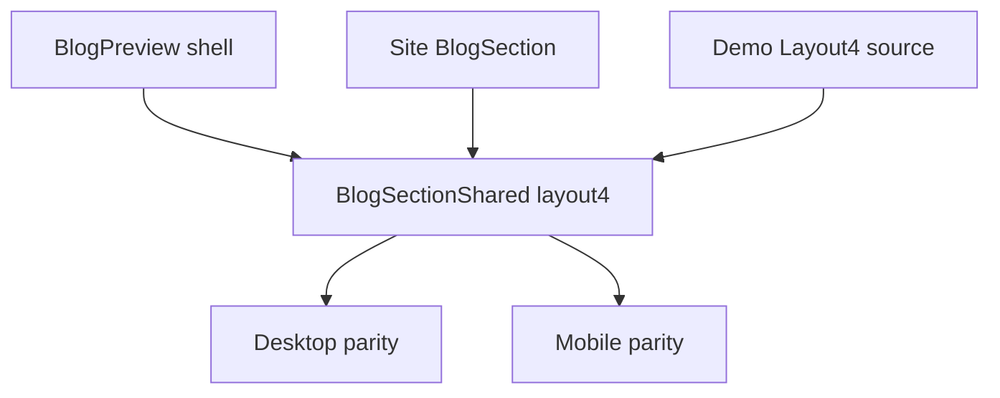

# I. Primer
## 1. TL;DR kiểu Feynman
- `layout4` vẫn chưa giống demo vì mới sửa vài chi tiết bề mặt, nhưng chưa sửa đúng “khung render” của preview/site.
- Demo thật đang render `layout4` trong một container full-width của device frame; code hiện tại vẫn còn bị ảnh hưởng bởi wrapper/padding logic cũ nên bố cục co lại và vỡ nhịp.
- Root cause chính nằm ở `BlogSectionShared.tsx`, không chỉ ở block `layout4` mà còn ở cách `outerShellClassName` và section padding tương tác với preview shell.
- Cần sửa đúng gốc: parity lại `layout4` theo demo source từng lớp wrapper, rồi verify trên cả preview và site.
- Không nên vá tiếp từng icon/text nhỏ; phải làm một lượt đầy đủ cho desktop + mobile.

## 2. Elaboration & Self-Explanation
Nhìn các ảnh user gửi, vấn đề không còn là “một vài class sai”. Vấn đề là layout thực tế đang bị co hẹp, card không chiếm đúng chiều ngang, spacing và nhịp section không bám demo. Điều này giải thích vì sao dù đã thay icon, hover, CTA… giao diện vẫn trông gần như không đổi theo cảm nhận của user.

Demo `blog-homecomponent` có một cấu trúc khá chặt:
- preview shell tạo device frame,
- bên trong có `@container`,
- layout4 dùng grid 1/2/3 cột rõ ràng,
- block header và card stack bám full width của phần content bên trong.

Ở repo hiện tại, nhánh `layout4` trong `BlogSectionShared.tsx` đã gần giống markup demo, nhưng vẫn còn bị “bóp” bởi class shell/wrapper áp vào preview path. Vì preview và site cùng đi qua shared component, bất kỳ sai lệch wrapper nào ở shared path cũng làm cả hai surface cùng lệch.

Nói ngắn gọn: lần trước mới sửa “nội thất” của layout4, còn “khung nhà” vẫn lệch. Lần này cần sửa cả hai phần theo đúng code demo.

## 3. Concrete Examples & Analogies
### Ví dụ cụ thể bám task
- Ảnh demo desktop cho thấy 3 card ngang đều, mỗi card rộng cân bằng.
- Ảnh preview/site hiện tại cho thấy card đầu to hơn nhiều theo cảm nhận thị giác và phần content không bung full width đúng nhịp, nên toàn khối trông co cụm.
- Điều này thường xảy ra khi grid đúng nhưng wrapper ngoài vẫn còn `max-width/padding/sizing` không đúng ngữ cảnh.

### Analogy đời thường
- Demo là một bức tranh treo trong khung chuẩn.
- Mình đã chỉnh màu và chữ trong bức tranh, nhưng khung vẫn nhỏ sai cỡ, nên nhìn tổng thể vẫn lệch.

# II. Audit Summary (Tóm tắt kiểm tra)
## 1. Observation (Quan sát)
- User cung cấp thêm 4 ảnh để chỉ ra rõ:
  - site/preview hiện tại vẫn không giống demo,
  - demo desktop/mobile có bố cục khác rõ rệt.
- `layout4` hiện tại trong repo nằm ở:
  - `app/admin/home-components/blog/_components/BlogSectionShared.tsx`
- Demo source nằm ở:
  - `C:\Users\VTOS\Downloads\blog-homecomponent\components\NewsLayouts.tsx`
- Preview shell nằm ở:
  - `app/admin/home-components/blog/_components/BlogPreview.tsx`

## 2. Evidence (Bằng chứng)
### a) Source demo
`NewsLayouts.tsx` cho `Layout4` có:
- header top dashed line,
- title/subtitle spacing,
- 2 action buttons,
- grid `1 -> 2 -> 3` cột,
- card full-width theo grid,
- CTA cuối với `ArrowUpRight`.

### b) Source repo hiện tại
`BlogSectionShared.tsx` hiện đã có nhiều phần gần demo, nhưng vẫn còn phụ thuộc wrapper logic `outerShellClassName` và preview shell.

### c) Root evidence mới
- `BlogPreview.tsx` desktop shell đang có `px-6 py-10 md:px-12 md:py-16 lg:px-20`.
- `BlogSectionShared.tsx` vẫn dùng `outerShellClassName` như một lớp kiểm soát width/padding nữa.
- Với `layout4`, chỉ sửa branch card mà không chốt lại contract wrapper sẽ tiếp tục làm lệch full-width behavior.

## 3. Phạm vi ảnh hưởng
- Affected:
  - admin preview layout4
  - site thực layout4
- Không nên ảnh hưởng:
  - layout1,2,3,5,6
  - form config/data selection

# III. Root Cause & Counter-Hypothesis (Nguyên nhân gốc & Giả thuyết đối chứng)
## 1. Root Cause
### a) Triệu chứng quan sát được là gì?
- Expected: desktop 3 card đều như demo; mobile đúng flow như demo.
- Actual: vẫn co khung, sai nhịp spacing/width, cảm giác gần như chưa đổi đúng mức.

### b) Phạm vi ảnh hưởng?
- Cả preview và site vì cùng dùng `BlogSectionShared`.

### c) Có tái hiện ổn định không?
- Có, ổn định trên mọi lần render layout4.

### d) Mốc thay đổi gần nhất?
- Các commit vừa rồi sửa từng phần của layout4, nhưng chưa sửa triệt để contract wrapper.

### e) Dữ liệu nào đang thiếu?
- Không thiếu source UI. Demo code + screenshots đã đủ.

### f) Có giả thuyết thay thế hợp lý nào chưa bị loại trừ?
- Giả thuyết data post khác làm lệch layout: Low.
- Giả thuyết chỉ cần sửa icon/text: đã bị loại trừ vì user vẫn thấy gần như không đổi.
- Giả thuyết wrapper/padding contract sai: High, khớp với screenshot và code path.

### g) Rủi ro nếu fix sai nguyên nhân?
- Tiếp tục vá lẻ từng chi tiết, nhưng tổng layout vẫn lệch.
- Mất thêm nhiều vòng mà không cải thiện đáng kể UI.

### h) Tiêu chí pass/fail sau khi sửa?
- Desktop preview/site nhìn ra ngay 3 card cân bằng như demo.
- Mobile preview/site đúng flow như demo.
- Không còn cảm giác “vẫn y chang cũ”.

## 2. Root Cause Confidence
- High
- Reason: evidence từ source demo, screenshots mới, và việc các fix nhỏ trước đó không thay đổi tổng thể đủ mạnh chứng minh lỗi nằm ở wrapper/layout contract chứ không phải chi tiết lẻ.

## 3. Counter-Hypothesis (Giả thuyết đối chứng)
Nếu root cause chỉ là một vài class trong card, thì các commit vừa rồi đã phải tạo thay đổi thấy rõ. Vì user vẫn thấy gần như không đổi, nên nguyên nhân hợp lý hơn là khối wrapper/width đang sai gốc.

# IV. Proposal (Đề xuất)
## 1. Hướng sửa đề xuất
Option A (Recommend) — Confidence 95%
- Re-implement đúng `layout4` theo demo source trong `BlogSectionShared.tsx`, gồm cả wrapper contract cho preview/site.
- Rà lại `getOuterShellClassName()` và chỗ `layout4` dùng shell width trong preview.
- Giữ sửa trong phạm vi tối thiểu nhưng đủ gốc: shared layout + nếu cần 1 chỗ shell liên quan trực tiếp.

## 2. Cách thực hiện cụ thể
### a) Fix đúng gốc ở shared layout
- So lại toàn bộ block `layout4` với demo.
- Đảm bảo wrapper ngoài của `layout4` không bị bó width sai trong preview path.
- Giữ site path dùng shared layout giống preview.

### b) Rà lại contract shell preview
- Kiểm tra cách `BlogPreview.tsx` truyền device frame + `@container`.
- Nếu `layout4` cần bypass/override shell width khác các layout khác, sửa đúng chỗ đó.

### c) Visual parity checklist
- Desktop: 3 card ngang cân đối.
- Tablet: 2 card.
- Mobile: 1 card đúng flow.
- Header/CTA/badge/date/title block đúng demo.

## 3. Mermaid diagram

# V. Files Impacted (Tệp bị ảnh hưởng)
## 1. Shared layout
- Sửa: `E:\NextJS\study\admin-ui-aistudio\system-vietadmin-nextjs\app\admin\home-components\blog\_components\BlogSectionShared.tsx`
  - Vai trò hiện tại: source of truth cho preview/site.
  - Thay đổi dự kiến: parity lại trọn vẹn layout4, bao gồm wrapper contract.

## 2. Preview shell
- Có thể sửa: `E:\NextJS\study\admin-ui-aistudio\system-vietadmin-nextjs\app\admin\home-components\blog\_components\BlogPreview.tsx`
  - Vai trò hiện tại: desktop/tablet/mobile frame.
  - Thay đổi dự kiến: chỉ nếu cần chỉnh contract width/container riêng để layout4 bung đúng như demo.

## 3. Site wiring
- Có thể chỉ đọc, không sửa: `E:\NextJS\study\admin-ui-aistudio\system-vietadmin-nextjs\components\site\BlogSection.tsx`
  - Vai trò hiện tại: map data site vào shared layout.
  - Dự kiến: không cần sửa nếu shared fix đủ.

# VI. Execution Preview (Xem trước thực thi)
1. Đối chiếu từng lớp wrapper `layout4` repo vs demo.
2. Chỉnh `BlogSectionShared.tsx` để parity full desktop/mobile.
3. Nếu cần, chỉnh đúng 1 chỗ shell ở `BlogPreview.tsx` cho layout4.
4. Rà site path qua `components/site/BlogSection.tsx`.
5. Chạy `bunx tsc --noEmit`.
6. Review diff, commit local, không push.

# VII. Verification Plan (Kế hoạch kiểm chứng)
## 1. Static verification
- So source `layout4` sau sửa với demo `NewsLayouts.tsx`.
- Kiểm tra mọi thay đổi đều truy vết trực tiếp tới parity layout4.

## 2. Typecheck
- Chạy `bunx tsc --noEmit` sau khi implement.
- Không chạy lint/build/test theo AGENTS.md.

## 3. Visual verification
- So lại preview/site với các ảnh user vừa gửi.
- Đặc biệt kiểm desktop và mobile.

# VIII. Todo
- [pending] Re-implement đúng gốc layout4 trong `BlogSectionShared.tsx`.
- [pending] Rà preview shell nếu còn bó width cho layout4.
- [pending] Chạy `bunx tsc --noEmit`.
- [pending] Review diff + commit local, không push.

# IX. Acceptance Criteria (Tiêu chí chấp nhận)
- Layout4 preview desktop nhìn ra ngay 3 card ngang đều như demo.
- Layout4 site desktop cũng ra đúng nhịp như demo.
- Mobile preview/site đúng flow như demo.
- User không còn thấy “không thay đổi gì”.
- Layout khác không bị ảnh hưởng ngoài ý muốn.

# X. Risk / Rollback (Rủi ro / Hoàn tác)
## 1. Rủi ro
- Sửa wrapper quá rộng có thể ảnh hưởng các layout khác nếu chạm nhầm shared logic chung.

## 2. Rollback
- Giữ thay đổi tập trung ở `layout4` branch và tối đa 1 điểm shell liên quan, để revert dễ.

# XI. Out of Scope (Ngoài phạm vi)
- Refactor toàn bộ blog home-component.
- Chỉnh các layout khác.
- Thay đổi dữ liệu/posts/categories.

# XII. Open Questions (Câu hỏi mở)
- Không còn ambiguity đáng kể; hướng đúng là sửa lại đúng gốc cho layout4 thay vì tiếp tục vá chi tiết nhỏ.