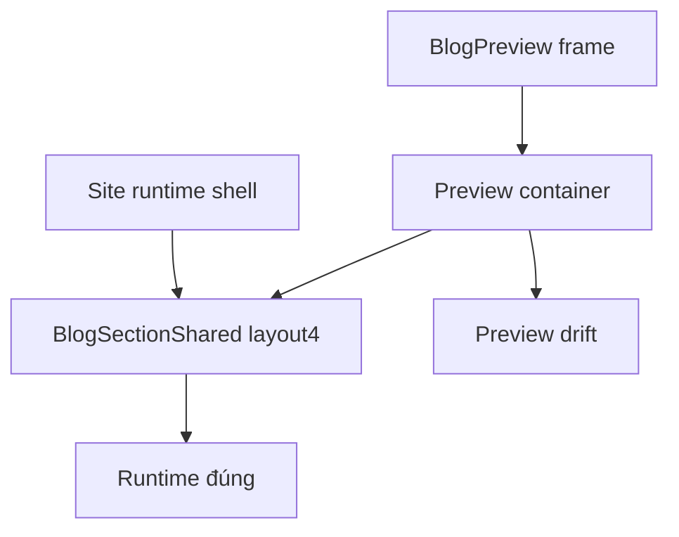

# I. Primer
## 1. TL;DR kiểu Feynman
- Site thực đã đúng vì `layout4` chạy trong runtime container đúng ngữ cảnh.
- Admin preview vẫn lệch vì preview shell đang tạo **container context khác runtime**: có thêm `@container`, `max-w-[1400px]`, device frame padding và `outerShellClassName` riêng.
- Nghĩa là cùng một `layout4` code, nhưng preview đang được render trong “một cái hộp khác”, nên breakpoint/grid ra khác site.
- Hướng đúng là sửa **preview parity drift**, không đụng runtime layout đang đúng.
- Cần chốt contract riêng cho preview path của blog `layout4` để preview context giống runtime hơn.

## 2. Elaboration & Self-Explanation
Hiện tại code layout4 không còn là vấn đề chính nữa. User mô tả rất đúng: “layout code đúng theo source, nhưng khi nhúng vào admin preview shell thì breakpoint/container/grid thực tế khác runtime site”.

Audit code xác nhận điều này:
- `components/site/BlogSection.tsx` render `BlogSectionShared` trực tiếp trong site runtime.
- `app/admin/home-components/blog/_components/BlogPreview.tsx` lại bọc `BlogSectionShared` bằng một preview shell có:
  - device frame,
  - padding lớn ở desktop,
  - `@container`,
  - `max-w-[1400px] mx-auto` ở desktop.
- `BlogSectionShared.tsx` còn tự thêm `@container`/wrapper logic cho `layout4` qua `getOuterShellClassName()`.

Khi 2 lớp wrapper/container chồng nhau, breakpoint thật của grid không còn giống runtime site nữa. Kết quả là preview desktop vẫn drift dù site đã đúng.

Tức là: lần này không nên sửa layout4 runtime thêm nữa. Cần sửa đúng phần preview shell/context để preview mô phỏng runtime chính xác hơn.

## 3. Concrete Examples & Analogies
### Ví dụ cụ thể bám task
- Runtime site: `BlogSectionShared` đi qua `components/site/BlogSection.tsx` và dùng shell site chuẩn.
- Preview admin: cùng `BlogSectionShared`, nhưng bị bọc thêm `max-w-[1400px] mx-auto`, device frame padding, rồi lại thêm `@container` từ shell và từ shared wrapper.
- Hai môi trường render khác nhau sẽ cho ra grid khác nhau dù JSX layout giống nhau.

### Analogy đời thường
- Cùng một cái bàn 3 chân, nếu đặt trên sàn phẳng thì đứng đúng.
- Đặt lên một cái bục nhỏ hơn và có thêm khung chèn ở giữa thì chân bàn vẫn đúng, nhưng hình dáng nhìn sẽ lệch.
- Ở đây layout là cái bàn, preview shell là cái bục.

# II. Audit Summary (Tóm tắt kiểm tra)
## 1. Observation (Quan sát)
- User xác nhận: site thực đúng, chỉ admin preview ở edit/create còn sai.
- Đây là dấu hiệu rất mạnh cho thấy lỗi nằm ở preview container context chứ không nằm ở runtime layout code.

## 2. Evidence (Bằng chứng)
### a) Runtime path
- `E:\NextJS\study\admin-ui-aistudio\system-vietadmin-nextjs\components\site\BlogSection.tsx`
  - render `BlogSectionShared` trực tiếp với `context="site"`

### b) Preview path
- `E:\NextJS\study\admin-ui-aistudio\system-vietadmin-nextjs\app\admin\home-components\blog\_components\BlogPreview.tsx`
  - desktop frame có `px-6 py-10 md:px-12 md:py-16 lg:px-20`
  - wrapper trong có `w-full flex-1 @container`
  - desktop thêm `max-w-[1400px] mx-auto`

### c) Shared wrapper
- `E:\NextJS\study\admin-ui-aistudio\system-vietadmin-nextjs\app\admin\home-components\blog\_components\BlogSectionShared.tsx`
  - `getOuterShellClassName()` hiện trả `w-full @container` cho `layout4` ở preview
  - và `${baseSiteShell} @container` cho `layout4` ở site
- Nghĩa là hiện tại layout4 có thể đang nhận **2 tầng container context** ở preview, nhưng không giống hệt runtime.

### d) Demo source of truth
- `C:\Users\VTOS\Downloads\blog-homecomponent\app\page.tsx`
  - preview shell chỉ có một contract container rõ ràng cho device frame
- `C:\Users\VTOS\Downloads\blog-homecomponent\components\NewsLayouts.tsx`
  - layout4 assume đúng context này để grid 1/2/3 cột.

## 3. Phạm vi ảnh hưởng
- Affected:
  - admin preview blog layout4 ở edit
  - admin preview blog layout4 ở create
- Not affected nếu sửa đúng:
  - site runtime blog layout4
  - layout1,2,3,5,6
  - data logic posts/categories

# III. Root Cause & Counter-Hypothesis (Nguyên nhân gốc & Giả thuyết đối chứng)
## 1. Root Cause
### a) Triệu chứng quan sát được là gì?
- Expected: preview desktop/mobile phải giống runtime layout đã đúng.
- Actual: runtime đúng nhưng preview vẫn sai bố cục.

### b) Phạm vi ảnh hưởng?
- Chỉ preview path trong admin blog create/edit.

### c) Có tái hiện ổn định không?
- Có. Vì shell preview hiện tại cố định nên drift xảy ra ổn định mỗi lần chọn layout4.

### d) Mốc thay đổi gần nhất?
- Runtime/shared layout đã được chỉnh gần đúng; sau đó preview drift còn lại lộ ra rõ vì site đã đúng nhưng preview chưa đúng.

### e) Dữ liệu nào đang thiếu?
- Không thiếu. Code path hiện tại đủ để kết luận.

### f) Có giả thuyết thay thế hợp lý nào chưa bị loại trừ?
- Giả thuyết runtime layout vẫn sai: bị loại trừ vì user xác nhận site đúng.
- Giả thuyết data khác nhau giữa preview và site: confidence thấp; drift user mô tả là layout context drift.
- Giả thuyết preview shell/container context sai: confidence rất cao, khớp hoàn toàn với evidence.

### g) Rủi ro nếu fix sai nguyên nhân?
- Nếu tiếp tục sửa `layout4` runtime/shared branch, site có thể bị regress dù hiện đã đúng.
- Preview vẫn không hết drift nếu preview shell không được sửa.

### h) Tiêu chí pass/fail sau khi sửa?
- Admin preview layout4 ở edit/create bám runtime site.
- Site runtime không đổi.

## 2. Root Cause Confidence
- High
- Reason: user đã xác nhận site đúng nhưng preview sai; code audit cho thấy preview shell có container/breakpoint context khác runtime.

## 3. Counter-Hypothesis (Giả thuyết đối chứng)
Nếu shared layout4 còn sai, thì site thực cũng phải sai. Nhưng user nói site đã đúng. Do đó phần cần sửa tiếp hợp lý nhất là preview shell parity, không phải runtime layout nữa.

# IV. Proposal (Đề xuất)
## 1. Hướng sửa đề xuất
Option A (Recommend) — Confidence 96%
- Chỉ sửa preview parity drift cho blog layout4 trong admin preview path.
- Giữ runtime/site code nguyên trạng nếu không thật sự bắt buộc.
- Mục tiêu: làm preview shell/context giống runtime enough để cùng code ra cùng bố cục.

## 2. Cách thực hiện cụ thể
### a) Chỉnh preview shell contract trong `BlogPreview.tsx`
- Rà `max-w-[1400px] mx-auto`, `@container`, padding frame desktop/tablet/mobile.
- Với `layout4`, áp contract giống demo/runtime thay vì dùng chung 100% với các layout khác nếu cần.

### b) Tối giản container chồng tầng
- Kiểm tra `BlogSectionShared.tsx` + `BlogPreview.tsx` để tránh double container context cho layout4.
- Mỗi axis breakpoint nên có một source of truth rõ ràng.

### c) Bảo vệ runtime
- Không đổi `components/site/BlogSection.tsx` trừ khi audit cuối phát hiện coupling ngoài dự kiến.

## 3. Mermaid diagram

# V. Files Impacted (Tệp bị ảnh hưởng)
## 1. Preview shell
- Sửa: `E:\NextJS\study\admin-ui-aistudio\system-vietadmin-nextjs\app\admin\home-components\blog\_components\BlogPreview.tsx`
  - Vai trò hiện tại: tạo device frame và preview layout context.
  - Thay đổi dự kiến: chỉnh container/breakpoint contract cho layout4 để parity với runtime.

## 2. Shared layout
- Có thể sửa nhẹ: `E:\NextJS\study\admin-ui-aistudio\system-vietadmin-nextjs\app\admin\home-components\blog\_components\BlogSectionShared.tsx`
  - Vai trò hiện tại: shared source of truth preview/site.
  - Thay đổi dự kiến: chỉ giảm/điều chỉnh container logic nếu đang gây double-container cho preview layout4.

## 3. Runtime site
- Không dự kiến sửa: `E:\NextJS\study\admin-ui-aistudio\system-vietadmin-nextjs\components\site\BlogSection.tsx`
  - Vai trò hiện tại: site runtime đã đúng.
  - Lý do: tránh regress runtime.

# VI. Execution Preview (Xem trước thực thi)
1. Audit lại contract container giữa `BlogPreview.tsx` và `BlogSectionShared.tsx` cho riêng layout4.
2. Chỉnh preview shell để layout4 dùng cùng context logic như runtime/demo.
3. Nếu cần, giảm double `@container`/`max-width` ở shared preview path.
4. Rà create/edit cùng dùng chung preview để bảo đảm cả 2 surface được fix.
5. Chạy `bunx tsc --noEmit`.
6. Review diff, commit local, không push.

# VII. Verification Plan (Kế hoạch kiểm chứng)
## 1. Static verification
- So container contract preview trước/sau.
- Kiểm tra site runtime path không bị chạm hoặc không đổi hành vi.

## 2. Typecheck
- Chạy `bunx tsc --noEmit`.
- Không chạy lint/build/test theo AGENTS.md.

## 3. Visual pass checklist
- Edit preview layout4 desktop parity với runtime.
- Create preview layout4 desktop parity với runtime.
- Mobile/tablet preview không regress.
- Site runtime không đổi.

# VIII. Todo
- [pending] Fix preview shell parity cho blog layout4.
- [pending] Giảm double-container context nếu có trong shared preview path.
- [pending] Chạy `bunx tsc --noEmit`.
- [pending] Review diff + commit local, không push.

# IX. Acceptance Criteria (Tiêu chí chấp nhận)
- Preview layout4 ở edit giống runtime site.
- Preview layout4 ở create giống runtime site.
- Runtime site không bị thay đổi ngoài ý muốn.
- Các layout khác không bị regress.

# X. Risk / Rollback (Rủi ro / Hoàn tác)
## 1. Rủi ro
- Nếu chỉnh preview shell quá rộng có thể làm lệch các layout khác.

## 2. Rollback
- Giữ thay đổi tập trung ở contract preview của layout4 để revert dễ.

# XI. Out of Scope (Ngoài phạm vi)
- Sửa runtime blog layout4 lần nữa.
- Chỉnh data/query posts.
- Chỉnh các layout khác nếu không liên quan trực tiếp.

# XII. Open Questions (Câu hỏi mở)
- Không còn ambiguity lớn. Root cause đã rõ là preview parity drift, không phải runtime layout bug nữa.