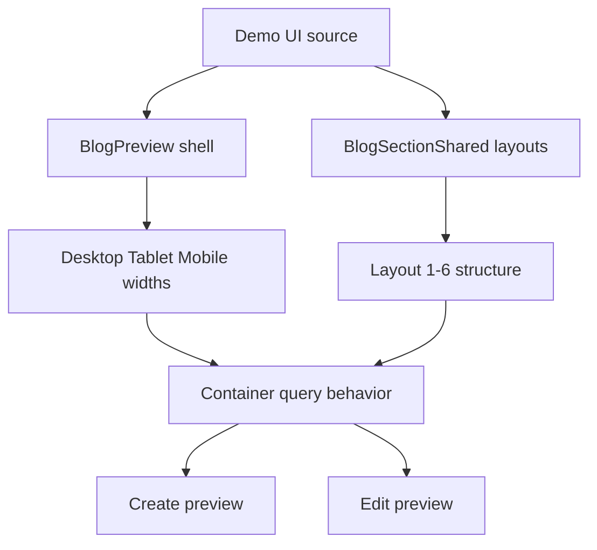

# I. Primer
## 1. TL;DR kiểu Feynman
- Blog preview đang gần đúng về ý tưởng, nhưng chưa bám đúng “khung preview + container query + spacing + item limit” của UI demo nên mobile/tablet bị lệch.
- Demo gốc quyết định layout bằng bề rộng của khung preview, không chỉ bằng viewport. Đây là điểm dễ sai nhất.
- Hướng sửa an toàn nhất là giữ cấu trúc hiện tại, chỉ tinh chỉnh `BlogPreview` và `BlogSectionShared` để parity với demo, không đụng form shell ngoài phạm vi cần thiết.
- Vì `create` và `edit` cùng dùng chung `BlogPreview`, sửa 1 chỗ sẽ đồng thời sửa cả 2 surface.
- Sẽ học theo pattern parity đã dùng ở FAQ/testimonials/blog commits local: shared section + preview shell giống demo + mapping style ổn định.

## 2. Elaboration & Self-Explanation
Hiện tại blog đã đi đúng hướng hơn trước: thay vì mỗi preview tự render riêng, code đã tách `BlogSectionShared.tsx` để preview và site có thể dùng chung skeleton UI. Nhưng phần “khung preview responsive” vẫn chưa bám đủ sát demo chốt ở `C:\Users\VTOS\Downloads\blog-homecomponent`.

Cốt lõi của vấn đề là demo không chỉ là một danh sách card responsive bình thường. Nó là một màn hình giả lập thiết bị: desktop/tablet/mobile có width cố định, có padding, border-top màu thương hiệu, và phần nội dung bên trong dùng container query (`@container`, `@[600px]`, `@[900px]`) để đổi số cột. Nếu khung ngoài không giống, layout bên trong sẽ đổi khác dù JSX nhìn có vẻ tương tự.

Ngoài ra, mỗi layout trong demo có các “luật nhỏ” riêng: layout nào hiện 3 item, layout nào 4, layout nào 8; layout nào có wrapper bo góc; layout nào dùng màu secondary-text; layout nào có spacing/padding khác nhau giữa mobile/tablet/desktop. Chỉ cần gộp các luật này quá tay hoặc dùng breakpoint viewport kiểu `md/lg/xl` thay cho container query là preview drift ngay.

Vì user yêu cầu chỉ sửa preview responsive và muốn thay đổi tối thiểu, hướng tốt nhất là không refactor thêm. Chỉ cần lấy demo làm source of truth, rà từng layout 1–6, rồi sửa đúng những chỗ đang khác trong `BlogPreview` và `BlogSectionShared`.

## 3. Concrete Examples & Analogies
### Ví dụ cụ thể bám task
- Demo `Layout5` hiển thị grid `2 -> 3 -> 4` cột và lấy tối đa 8 item.
- Code hiện tại của admin preview đang giới hạn `layout5` ở `mobile=3`, `tablet=4`, `desktop=6` trong `getPreviewLimit`, nên dù card UI có giống thì số item vẫn sai, làm tổng chiều cao và nhịp lưới khác demo.
- Đây là lệch do logic hiển thị, không phải do data hay do CSS đơn lẻ.

### Analogy đời thường
- Demo giống như một cái khuôn bánh đã chốt. `BlogSectionShared` là phần bột, còn `BlogPreview` là cái khuôn.
- Nếu bột đúng mà khuôn sai kích thước, bánh nở ra vẫn lệch hình. Ở đây preview shell và container width chính là cái khuôn.

# II. Audit Summary (Tóm tắt kiểm tra)
## 1. Observation (Quan sát)
- User báo lỗi responsive mobile/tablet ở `/admin/home-components/blog/[id]/edit` và yêu cầu xem cả create.
- `create/blog/page.tsx` và `[id]/edit/page.tsx` đều dùng chung `BlogPreview`.
- Blog gần đây đã được refactor lớn theo hướng parity:
  - `9c7b14c2 feat(blog): align admin and site layouts from source`
  - `afb10183 fix(blog): use exact layout1-layout6 mapping`
  - `0e77277d fix(blog): reduce preview parity drift`
- Các commit FAQ/testimonials local chưa push cho thấy pattern rõ ràng: đưa layout thật vào `*SectionShared.tsx`, preview chỉ dựng device shell và điều khiển state.

## 2. Evidence (Bằng chứng)
- File admin hiện tại:
  - `app/admin/home-components/blog/_components/BlogPreview.tsx`
  - `app/admin/home-components/blog/_components/BlogSectionShared.tsx`
  - `app/admin/home-components/blog/[id]/edit/page.tsx`
  - `app/admin/home-components/create/blog/page.tsx`
- Demo source of truth:
  - `C:\Users\VTOS\Downloads\blog-homecomponent\app\page.tsx`
  - `C:\Users\VTOS\Downloads\blog-homecomponent\components\NewsLayouts.tsx`
- Demo dùng container query trong preview shell: `@container`, `@[600px]`, `@[900px]`.
- Demo preview shell:
  - desktop: `w-full min-w-[1024px] max-w-7xl` + `max-w-[1400px]` inner + `border-t-4`
  - tablet: `w-[768px]` + `border-t-[6px]`
  - mobile: `w-[390px] h-[844px]` + `border-t-[8px]` + notch/home indicator
- Code hiện tại của admin mới match một phần shell nhưng chưa match đầy đủ padding/border-top/container behavior/item limits của demo.

## 3. Phạm vi ảnh hưởng
- Affected surface: preview responsive của Blog trong create/edit admin.
- Không nằm trong scope hiện tại: thay đổi form shell tổng thể, site renderer rộng hơn, dữ liệu thật Convex.

# III. Root Cause & Counter-Hypothesis (Nguyên nhân gốc & Giả thuyết đối chứng)
## 1. Root Cause
### a) Nguyên nhân gốc chính
Preview shell và layout rules của blog chưa parity hoàn toàn với demo chốt, đặc biệt ở 4 nhóm:
- device frame width/padding/border-top khác demo,
- container query parity chưa đầy đủ,
- item limit theo từng layout/device đang tự suy diễn thay vì bám demo,
- một số spacing/typography/meta wrappers trong `BlogSectionShared` đang dùng viewport breakpoints hoặc structure khác demo.

### b) Triệu chứng quan sát được là gì?
- Expected: mobile/tablet/desktop preview trong admin giống UI demo đã chốt.
- Actual: preview drift ở mobile/tablet; khả năng số cột, nhịp spacing, số item, chiều cao block không khớp demo.

### c) Có tái hiện ổn định không? điều kiện tối thiểu?
- Có, vì create/edit đều dùng chung `BlogPreview`; chỉ cần đổi device mode là khác biệt lộ ra.

### d) Mốc thay đổi gần nhất?
- Blog vừa được refactor bởi 3 commit local chưa push; drift hiện tại xuất hiện sau giai đoạn align-to-source nhưng chưa khép parity hoàn toàn.

### e) Dữ liệu nào đang thiếu?
- Không thiếu về source-of-truth UI; demo code đã đủ rõ.
- Thiếu duy nhất là kiểm chứng runtime cuối cùng, nhưng theo repo instruction thì chưa chạy verification runtime trong spec mode.

### f) Giả thuyết thay thế hợp lý chưa bị loại trừ?
- Giả thuyết 1: lỗi do data/posts từ Convex. Loại trừ ở mức cao vì demo drift xuất hiện ở shell/layout rules, không phải ở data.
- Giả thuyết 2: lỗi do create/edit page khác nhau. Loại trừ ở mức cao vì cả hai dùng cùng `BlogPreview`.
- Giả thuyết 3: lỗi do colors/font override. Có thể khuếch đại khác biệt, nhưng không phải nguyên nhân chính của sai cột/sai spacing/sai device shell.

### g) Rủi ro nếu fix sai nguyên nhân?
- Sửa lan sang form/edit shell nhưng preview vẫn lệch.
- Sửa style rời rạc từng layout mà không sửa khung container, dẫn tới drift tái xuất hiện ở device khác.

### h) Tiêu chí pass/fail sau khi sửa?
- Preview mobile/tablet/desktop của 6 layout khớp demo về structure, số cột, số item, spacing chính, device frame behavior.
- Create và edit cùng cho kết quả giống nhau vì dùng chung preview.

## 2. Counter-Hypothesis (Giả thuyết đối chứng)
Có thể tưởng rằng chỉ cần chỉnh từng card CSS là đủ. Tuy nhiên evidence từ demo cho thấy phần quyết định lớn là preview shell + `@container`. Nếu chỉ vá card spacing mà không bám width/padding/container của shell, drift vẫn còn. Vì vậy confidence rằng nguyên nhân gốc nằm ở parity shell/layout rules là cao.

## 3. Root Cause Confidence
- High
- Reason: Có source demo cụ thể, có code preview hiện tại để đối chiếu, và có precedent gần ngay trong repo từ FAQ/testimonials/blog commits local cùng pattern parity.

# IV. Proposal (Đề xuất)
## 1. Hướng thực hiện được chọn
Option A (Recommend) — Confidence 90%
- Chỉnh tối thiểu trên code hiện tại, giữ `BlogPreview` + `BlogSectionShared` làm hai điểm sửa chính.
- Vì user yêu cầu “chỉ preview responsive” và “chỉnh tối thiểu”, đây là hướng ít rủi ro nhất, rollback đơn giản nhất, và vẫn bám pattern các commit chưa push.

## 2. Các thay đổi dự kiến
### a) Chuẩn hoá `BlogPreview` theo demo shell
- Match lại đầy đủ width/padding/border-top/ring/notch/home-indicator của desktop/tablet/mobile theo demo.
- Thêm đúng inner container behavior (`@container`, desktop inner max width khi cần).
- Giữ style switcher và device switcher như hệ thống hiện tại, nhưng bảo đảm preview shell cho ra cùng bề rộng logic như demo.

### b) Chỉnh `BlogSectionShared` để parity từng layout
- So từng layout 1–6 với `NewsLayouts.tsx` từ demo.
- Điều chỉnh item limit theo layout/device để không tự suy diễn sai.
- Ưu tiên container-query classes tương đương demo ở các grid/list chính.
- Đồng bộ các wrapper đặc trưng của từng layout: section padding, grid columns, image aspect, heading/meta/excerpt spacing, CTA/view-all placement.
- Giữ tuân thủ hệ thống home-component, nghĩa là không copy nguyên xi các quirk vô nghĩa nếu làm sai contract hệ thống; nhưng visual outcome phải khớp demo.

### c) Giữ create/edit parity bằng shared preview
- Không sửa shell form ngoài phạm vi.
- Chỉ cần create/edit tiếp tục gọi cùng `BlogPreview`; hiệu ứng parity sẽ tự lan sang cả hai.

## 3. Mermaid diagram

# V. Files Impacted (Tệp bị ảnh hưởng)
## 1. UI / preview shared
- Sửa: `E:\NextJS\study\admin-ui-aistudio\system-vietadmin-nextjs\app\admin\home-components\blog\_components\BlogPreview.tsx`
  - Vai trò hiện tại: dựng device preview shell, style switcher và truyền data vào shared section.
  - Thay đổi dự kiến: match lại shell responsive với demo, nhất là width/padding/border-top/inner container behavior.

- Sửa: `E:\NextJS\study\admin-ui-aistudio\system-vietadmin-nextjs\app\admin\home-components\blog\_components\BlogSectionShared.tsx`
  - Vai trò hiện tại: chứa 6 layout blog cho preview/site.
  - Thay đổi dự kiến: chỉnh parity layout 1–6 theo demo để mobile/tablet/desktop ra đúng số cột, item count và spacing.

## 2. Shared config / typing
- Sửa nhẹ nếu cần: `E:\NextJS\study\admin-ui-aistudio\system-vietadmin-nextjs\app\admin\home-components\blog\_lib\constants.ts`
  - Vai trò hiện tại: định nghĩa style list, default config, sort helper.
  - Thay đổi dự kiến: chỉ chỉnh khi cần constants cho preview parity như default item behavior; không mở rộng scope nếu không bắt buộc.

## 3. Surface thụ hưởng, có thể không cần sửa
- Có thể không sửa: `E:\NextJS\study\admin-ui-aistudio\system-vietadmin-nextjs\app\admin\home-components\create\blog\page.tsx`
  - Vai trò hiện tại: create page dùng `BlogPreview`.
  - Tác động: nhận preview parity mới tự động nhờ shared component.

- Có thể không sửa: `E:\NextJS\study\admin-ui-aistudio\system-vietadmin-nextjs\app\admin\home-components\blog\[id]\edit\page.tsx`
  - Vai trò hiện tại: edit page dùng `BlogPreview`.
  - Tác động: nhận preview parity mới tự động nhờ shared component.

# VI. Execution Preview (Xem trước thực thi)
## 1. Thứ tự thay đổi chính
1. Đọc lại `BlogPreview.tsx` và `BlogSectionShared.tsx` cạnh demo `app/page.tsx` + `NewsLayouts.tsx`.
2. Chỉnh preview shell để device width/padding/container khớp demo.
3. Chỉnh từng layout 1–6 trong `BlogSectionShared` theo demo, ưu tiên mobile/tablet trước vì đây là bug user nêu.
4. Rà lại create/edit để chắc chắn không cần wiring mới.
5. Static self-review: typing, null-safety, visual contract, backward config normalization.
6. Nếu có thay đổi TS code, chuẩn bị bước verify bằng `bunx tsc --noEmit` theo repo rule sau khi được duyệt spec.

# VII. Verification Plan (Kế hoạch kiểm chứng)
## 1. Static verification
- Đọc diff theo từng file để bảo đảm mỗi thay đổi truy vết trực tiếp tới parity preview.
- Rà type compatibility cho `BlogPreviewProps`, `BlogPreviewItem`, `BlogStyle` và config mapping.
- Kiểm tra create/edit cùng render được preview với cùng prop contract.

## 2. Typecheck
- Sau khi user duyệt spec và chỉ khi có sửa TS/TSX code: chạy `bunx tsc --noEmit`.
- Không chạy lint/build vì AGENTS.md của repo cấm tự chạy lint/unit test và runtime verification do tester phụ trách.

## 3. Repro / pass checks
- Mở blog create và edit, chuyển qua desktop/tablet/mobile.
- Kiểm tra 6 layout với cùng dữ liệu mẫu hoặc data thực có sẵn.
- So với demo theo 4 tiêu chí: device shell, số cột, số item, spacing/CTA chính.

# VIII. Todo
- [pending] Chỉnh `BlogPreview.tsx` để parity preview shell với demo.
- [pending] Chỉnh `BlogSectionShared.tsx` cho layout1–layout6 parity trên mobile/tablet/desktop.
- [pending] Rà create/edit blog sau khi sửa shared preview.
- [pending] Chạy `bunx tsc --noEmit` nếu có thay đổi code TS/TSX.
- [pending] Tự review diff rồi commit local, không push.

# IX. Acceptance Criteria (Tiêu chí chấp nhận)
- Desktop/tablet/mobile preview của blog trong admin khớp demo đã chốt về mặt giao diện chính.
- 6 layout blog không còn drift rõ rệt ở mobile/tablet.
- Create và edit cho ra preview nhất quán vì dùng chung preview component.
- Không mở rộng scope sang refactor form shell hoặc data flow ngoài preview responsive.
- Không phá backward compatibility của config cũ (`grid/list/featured/...` vẫn normalize đúng nếu dữ liệu cũ còn tồn tại).

# X. Risk / Rollback (Rủi ro / Hoàn tác)
## 1. Rủi ro
- Vì `BlogSectionShared` có thể dùng cho cả preview/site, sửa quá tay có thể vô tình làm lệch site renderer nếu component này được dùng lại ở surface khác.
- Container-query classes nếu chỉnh sai có thể làm desktop đúng nhưng tablet/mobile lệch hơn.

## 2. Rollback
- Giữ thay đổi tập trung ở 1–2 file chính để rollback dễ.
- Nếu một layout gây regressions, có thể rollback riêng hunk của layout đó mà không phải bỏ toàn bộ preview parity work.

# XI. Out of Scope (Ngoài phạm vi)
- Refactor toàn bộ create/edit shell theo demo.
- Thay đổi data thật Convex hoặc logic posts beyond preview needs.
- Chỉnh các quirk không ảnh hưởng giao diện hệ thống nếu làm trái contract home-component chung.

# XII. Open Questions (Câu hỏi mở)
- Không còn ambiguity lớn. User đã chốt: ưu tiên giống giao diện demo, vẫn tuân thủ contract hệ thống home-component, chỉ sửa preview responsive, chỉnh tối thiểu trên code hiện tại.