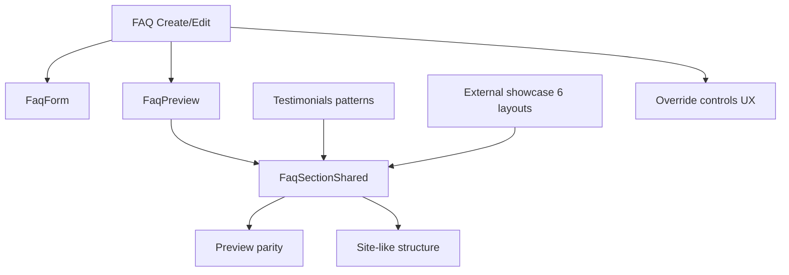
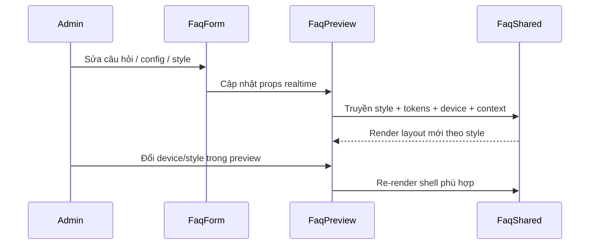

# I. Primer
## 1. TL;DR kiểu Feynman
- FAQ hiện đã có 6 style, nhưng create/edit và preview chưa mang cùng mức polish như bản Testimonials mới nâng cấp.
- Source tham chiếu có 2 nơi: commit chưa push trong repo (`d4a88ac1` và các commit fix sau đó) và project ngoài repo `C:\Users\VTOS\Downloads\testimonials-component-showcase\components\FaqLayouts.tsx`.
- Hướng đề xuất: giữ FAQ là FAQ, nhưng remap mạnh 6 style theo ngôn ngữ UI mới học từ testimonials/faq showcase để preview đẹp hơn và form/edit dễ thao tác hơn.
- Trọng tâm không phải thêm tính năng mới, mà là nâng cấp “khung trình bày + parity preview/edit” theo pattern đã chứng minh hiệu quả ở Testimonials.
- Em sẽ không copy class nguyên xi; em sẽ map từng style FAQ sang pattern phù hợp để tránh lệch semantics và tránh preview bị “zoom giả”.

## 2. Elaboration & Self-Explanation
Bài toán ở đây không phải “làm thêm component FAQ mới”, mà là “làm cho FAQ create/edit hiện tại trông xịn và nhất quán hơn như Testimonials mới”. Hiện FAQ đã có đầy đủ 6 style, form nhập dữ liệu, preview, và edit page. Nhưng phần trải nghiệm quản trị vẫn còn cũ hơn một nhịp so với Testimonials: preview chưa có container tuning sâu theo từng style, phần custom color/font ở edit đang nằm trong cột sticky cùng preview nên dễ chật, và layer warning/quality signal chưa rõ bằng Testimonials.

Qua audit, phần Testimonials mới đã giải quyết đúng các vấn đề này bằng vài pattern quan trọng: dùng shared section làm “xương sống”, cho preview/site đi chung một layout core rồi chỉ khác `context/device`; tinh chỉnh outer shell theo từng style thay vì scale cả preview; và đưa override controls ra vị trí dễ thao tác hơn. FAQ hiện đã có `FaqSectionShared.tsx`, nghĩa là nền tảng để nâng cấp đã có sẵn. Việc cần làm là áp các pattern trưởng thành từ Testimonials vào FAQ và remap 6 style FAQ theo ngôn ngữ UI mới từ showcase ngoài repo.

Nói ngắn gọn: FAQ hiện giống một căn nhà đã xây đủ phòng, nhưng nội thất và cách trưng bày còn thế hệ cũ. Testimonials mới là mẫu nhà vừa được làm lại rất hợp mắt. Ta không đập nhà FAQ đi xây lại; ta thay nội thất, chỉnh mặt tiền, và sắp đồ lại cho cùng chuẩn mới.

## 3. Concrete Examples & Analogies
### a) Ví dụ cụ thể bám task
- `accordion` hiện của FAQ đang là accordion khá chuẩn nhưng còn “flat”. Trong source ngoài repo, `LayoutBrand` và `LayoutFloating` cho thấy cách làm accordion premium hơn: panel tách bạch hơn, icon toggle rõ hơn, active state sang hơn. Em sẽ đề xuất map `accordion` FAQ sang một nhánh visual gần `LayoutBrand/Floating`.
- `two-column` hiện đang là sidebar + list khá cơ bản. Trong source ngoài repo, `LayoutShowcase` cho thấy pattern chọn câu hỏi ở một phía và render câu trả lời nổi bật ở phía còn lại. Em sẽ đề xuất remap `two-column` theo tinh thần đó để nổi khối hơn.
- `cards` hiện đang là grid FAQ cards; có thể học phần spacing, top accent, card depth từ `LayoutGrid` ngoài repo và từ `renderCards()` của Testimonials.

### b) Analogy đời thường
- FAQ hiện giống menu quán ăn đã đủ món nhưng cách bày biện chưa bắt mắt. Testimonials mới giống một menu vừa được thiết kế lại: món vẫn vậy, nhưng cách chia nhóm, căn lề, làm nổi món chính khiến nhìn vào là muốn dùng. Spec này là kế hoạch “trình bày lại menu FAQ” chứ không đổi món.

# II. Audit Summary (Tóm tắt kiểm tra)
## 1. Observation
- Route mục tiêu user nêu rõ: `http://localhost:3000/admin/home-components/create/faq` và “cả edit”.
- Create FAQ hiện dùng `ComponentFormWrapper` + `FaqForm` + `FaqPreview` tại `app/admin/home-components/create/faq/page.tsx`.
- Edit FAQ hiện có layout riêng, trong đó `TypeColorOverrideCard` và `TypeFontOverrideCard` đang nằm trong cột sticky cùng preview tại `app/admin/home-components/faq/[id]/edit/page.tsx`.
- Preview FAQ hiện đã dùng `FaqSectionShared` tại `app/admin/home-components/faq/_components/FaqPreview.tsx`, nhưng mới giới hạn item bằng `maxVisible`; chưa có evidence về tuning outer-shell theo từng style/device như Testimonials.
- Shared render FAQ đã tồn tại tại `app/admin/home-components/faq/_components/FaqSectionShared.tsx` với 6 style: `accordion`, `cards`, `two-column`, `minimal`, `timeline`, `tabbed`.
- Commit chưa push cho Testimonials gồm chuỗi nâng cấp UI: `d4a88ac1`, `061e31ca`, `5352b322`, `5a6f9545`, `e9782232`, `16d8c032`, `bb521932`.
- `d4a88ac1` cho thấy refactor lớn: dồn layout vào `TestimonialsSectionShared.tsx`, giảm logic rải rác ở preview/site.
- Source ngoài repo thực sự tồn tại ở `C:\Users\VTOS\Downloads\testimonials-component-showcase`; file quan trọng là `components\FaqLayouts.tsx` với 6 layout: `LayoutMinimal`, `LayoutFloating`, `LayoutSplit`, `LayoutGrid`, `LayoutShowcase`, `LayoutBrand`.

## 2. Root-cause questionnaire tối thiểu
1. Triệu chứng observed là gì?
   - Expected: FAQ create/edit có level UI/preview parity giống Testimonials mới nâng cấp.
   - Actual: FAQ chạy được nhưng chưa học đủ pattern polish và admin UX từ Testimonials/showcase.
2. Phạm vi ảnh hưởng?
   - Chỉ ảnh hưởng module admin home-components FAQ create/edit/preview và site parity của FAQ render.
3. Có tái hiện ổn định không?
   - Có, đọc code cho thấy structure hiện tại nhất quán ở create/edit/preview.
4. Mốc thay đổi gần nhất?
   - Testimonials vừa được nâng cấp mạnh trong 7 commit ahead of origin/master; FAQ chưa theo kịp nhịp đó.
5. Dữ liệu nào còn thiếu?
   - Chưa có ảnh chụp UI runtime, nhưng code evidence đủ để chốt hướng implementation.
6. Có giả thuyết thay thế chưa bị loại trừ?
   - Có: chỉ cần restyle nhẹ preview mà không đụng form/edit. Em loại trừ vì user yêu cầu “cả edit” và muốn học từ bản nâng cấp UI mới.
7. Rủi ro nếu fix sai nguyên nhân?
   - Có thể làm FAQ đẹp hơn nhưng drift khỏi site render hoặc làm edit form dài/chật hơn.
8. Tiêu chí pass/fail sau sửa?
   - 6 style FAQ đều mang ngôn ngữ UI mới rõ ràng, preview/create/edit đồng bộ, controls custom thao tác ổn, không còn phụ thuộc scale giả để “nhìn vừa”.

# III. Root Cause & Counter-Hypothesis (Nguyên nhân gốc & Giả thuyết đối chứng)
## 1. Root Cause Confidence: High
- Nguyên nhân gốc chính là FAQ đang dùng foundation tốt nhưng chưa hấp thụ các pattern trưởng thành vừa được chứng minh ở Testimonials upgrade.
- Evidence:
  - `FaqPreview.tsx` chưa có `device`-aware shell tuning theo style như `TestimonialsPreview.tsx` + `TestimonialsSectionShared.tsx`.
  - `faq/[id]/edit/page.tsx` vẫn đặt color/font overrides trong sticky preview column, trong khi Testimonials đã dời ra ngoài sau commit `e9782232` để tránh UX bị kẹt.
  - `FaqSectionShared.tsx` hiện có 6 style functional, nhưng visual vocabulary còn khác đáng kể so với source mới ở `components/FaqLayouts.tsx` trong thư mục showcase.

## 2. Counter-Hypothesis (Giả thuyết đối chứng)
- Giả thuyết A: Chỉ cần copy 6 layout từ project ngoài repo vào FAQ là xong.
  - Bác bỏ một phần: copy thẳng sẽ bỏ qua token system, color accessibility, preview/site parity, và conventions hiện có của repo.
- Giả thuyết B: Chỉ cần sửa preview, không cần chỉnh edit.
  - Bác bỏ: user yêu cầu rõ “cả edit”, và audit cho thấy edit UX là nơi Testimonials có bài học giá trị.
- Giả thuyết C: Dùng `scale` để preview “trông giống hơn”.
  - Bác bỏ mạnh: commit history Testimonials cho thấy đây là hướng tạm, đã được thay bằng sửa layout thật (`5352b322` rồi `5a6f9545`).

## 3. Decision
- Chọn hướng: remap mạnh 6 style FAQ theo testimonials/showcase, nhưng giữ semantics FAQ và token/color/accessibility infra của repo.

# IV. Proposal (Đề xuất)
## 1. Hướng thực hiện được đề xuất
### a) Remap 6 style FAQ sang ngôn ngữ UI mới
- Giữ tên style hiện tại để không đổi data contract: `accordion`, `cards`, `two-column`, `minimal`, `timeline`, `tabbed`.
- Map visual/pattern như sau:
  - `accordion` → học từ `LayoutBrand` + `LayoutFloating`: panel premium hơn, toggle rõ hơn, active state nổi hơn.
  - `cards` → học từ `LayoutGrid` + `Testimonials renderCards`: card depth, accent line, spacing, badge/number treatment.
  - `two-column` → học mạnh từ `LayoutShowcase`: danh sách câu hỏi ở một bên, câu trả lời active nổi khối ở bên kia; mobile dùng dropdown/stack hợp lý nếu cần.
  - `minimal` → học từ `LayoutMinimal`: list sạch, typography và divider tinh tế, accordion/list feel cao cấp hơn.
  - `timeline` → giữ semantics timeline nhưng nâng shell/spacing/badges theo system mới từ testimonials spacing language.
  - `tabbed` → giữ tabs nhưng làm tab rail và content card giống độ polish của showcase/testimonials active-state patterns.

### b) Nâng `FaqSectionShared` thành trung tâm layout thật sự
- Tiếp tục để `FaqPreview` và site render dùng chung `FaqSectionShared`.
- Thêm nhánh `context/device` nếu cần để preview fidelity tốt hơn mà không drift khỏi site.
- Bổ sung helper kiểu `getPreviewLimit`, `getOuterShellClassName`, có thể thêm `getGridClassName`/`getShellSpacing` cho từng style tương tự Testimonials.

### c) Nâng UX create/edit form theo bài học từ Testimonials
- Edit FAQ: đưa `TypeColorOverrideCard` và `TypeFontOverrideCard` ra block riêng phía trên preview sticky, thay vì nằm trong cột preview.
- Create FAQ: cân nhắc thêm warning block tóm tắt vấn đề màu/contrast/harmony ở level page, không chỉ nằm dưới preview.
- Không đổi logic save/update data; chỉ nâng tổ chức layout và signal quality.

### d) Giữ infra màu/font hiện có
- Tiếp tục dùng `getFaqColors`, `resolveFaqSecondary`, `getFaqAccessibilityScore`, `calculateFaqAccentBalance`.
- Visual mới phải bám token thay vì hard-code theme lạ.

## 2. Vì sao đây là hướng tốt nhất
- Bám đúng mong muốn của anh: “cân bằng form + preview” và “remap mạnh theo testimonials”.
- Tận dụng foundation FAQ sẵn có, rollback dễ hơn so với viết lại toàn bộ component.
- Học đúng từ commit chưa push và source ngoài repo, nhưng vẫn giữ contract hiện hành của hệ thống.

# V. Files Impacted (Tệp bị ảnh hưởng)
## 1. UI FAQ
- Sửa: `E:\NextJS\study\admin-ui-aistudio\system-vietadmin-nextjs\app\admin\home-components\faq\_components\FaqSectionShared.tsx`
  - Vai trò hiện tại: render 6 style FAQ dùng chung cho preview/site.
  - Thay đổi dự kiến: remap mạnh visual/layout của 6 style, bổ sung shell/device/context helpers theo pattern Testimonials.

- Sửa: `E:\NextJS\study\admin-ui-aistudio\system-vietadmin-nextjs\app\admin\home-components\faq\_components\FaqPreview.tsx`
  - Vai trò hiện tại: bọc preview, chọn device/style, tính token/accessibility.
  - Thay đổi dự kiến: truyền thêm context/device cần thiết, thêm tuning preview shell và có thể nâng warning summary cho parity với Testimonials.

- Sửa: `E:\NextJS\study\admin-ui-aistudio\system-vietadmin-nextjs\app\admin\home-components\faq\_components\FaqForm.tsx`
  - Vai trò hiện tại: form quản lý danh sách câu hỏi và config cho style `two-column`.
  - Thay đổi dự kiến: chỉ chỉnh layout/micro-UX nếu cần để khớp visual mới; không đổi data contract chính.

## 2. Admin route pages
- Sửa: `E:\NextJS\study\admin-ui-aistudio\system-vietadmin-nextjs\app\admin\home-components\create\faq\page.tsx`
  - Vai trò hiện tại: page create FAQ dùng `ComponentFormWrapper`.
  - Thay đổi dự kiến: thêm warning/info surface hợp lý và bảo đảm preview mới được gắn đúng props/layout.

- Sửa: `E:\NextJS\study\admin-ui-aistudio\system-vietadmin-nextjs\app\admin\home-components\faq\[id]\edit\page.tsx`
  - Vai trò hiện tại: page edit FAQ với preview sticky và override cards nằm trong cột preview.
  - Thay đổi dự kiến: đổi bố cục theo bài học Testimonials, tách override cards khỏi sticky preview column.

## 3. Shared / constants
- Sửa nhẹ: `E:\NextJS\study\admin-ui-aistudio\system-vietadmin-nextjs\app\admin\home-components\faq\_lib\constants.ts`
  - Vai trò hiện tại: định nghĩa `FAQ_STYLES`, defaults.
  - Thay đổi dự kiến: chỉ đổi label nếu cần phản ánh UI mới; không đổi ids để tránh ảnh hưởng data cũ.

## 4. Tham chiếu đọc để học pattern, không chỉnh
- Đọc: `E:\NextJS\study\admin-ui-aistudio\system-vietadmin-nextjs\app\admin\home-components\testimonials\_components\TestimonialsSectionShared.tsx`
- Đọc: `E:\NextJS\study\admin-ui-aistudio\system-vietadmin-nextjs\app\admin\home-components\testimonials\_components\TestimonialsPreview.tsx`
- Đọc: `C:\Users\VTOS\Downloads\testimonials-component-showcase\components\FaqLayouts.tsx`

# VI. Execution Preview (Xem trước thực thi)
## 1. Thứ tự thay đổi chính
1. Đọc lại `FaqSectionShared` để xác định từng style đang render ra sao.
2. Remap từng style FAQ sang visual pattern mới từ testimonials/showcase nhưng giữ token contract hiện tại.
3. Bổ sung preview shell/context/device tuning trong `FaqPreview` + `FaqSectionShared`.
4. Chỉnh `faq/[id]/edit/page.tsx` để tách custom color/font controls ra khỏi sticky preview column.
5. Chỉnh create page nếu cần warning/info surface để đồng điệu với Testimonials.
6. Self-review tĩnh: typing, null-safety, keyboard flow, responsive logic, không đổi shape dữ liệu cũ.
7. Nếu có thay đổi code TS, bước verify theo repo rule sẽ là review tĩnh + `bunx tsc --noEmit` trước commit; không chạy lint/build/test.

## 2. Phác thảo interaction flow sau khi nâng cấp

# VII. Verification Plan (Kế hoạch kiểm chứng)
## 1. Theo repo rule
- Không chạy lint/unit test/build.
- Chỉ review tĩnh và, nếu có thay đổi code TypeScript, chạy `bunx tsc --noEmit` trước commit theo rule của repo.

## 2. Pass checklist
- 6 style vẫn render đúng và không đổi `style id` lưu xuống data.
- Create FAQ và Edit FAQ đều hiển thị preview mới nhất quán.
- Preview mobile/tablet/desktop không phải dựa vào scale toàn khung.
- Edit page không còn đặt override cards trong sticky preview column theo cách gây chật/khó thao tác.
- Warnings màu/contrast vẫn hoạt động hoặc được surfacing rõ hơn.
- Không có drift rõ rệt giữa preview shared layout và site shared layout vì cùng bám `FaqSectionShared`.

# VIII. Todo
1. Audit lại chi tiết mapping 6 FAQ styles hiện tại với 6 layouts từ showcase.
2. Refactor `FaqSectionShared` theo pattern testimonials shared renderer.
3. Tinh chỉnh `FaqPreview` cho shell/context/device parity.
4. Chỉnh bố cục `faq/[id]/edit/page.tsx` cho override controls.
5. Rà create page để thêm warning/info surface nếu cần.
6. Tự review tĩnh + `bunx tsc --noEmit` nếu có thay đổi TS.
7. Commit local sau khi hoàn tất theo quy tắc repo.

# IX. Acceptance Criteria (Tiêu chí chấp nhận)
## 1. Pass
- Truy cập `/admin/home-components/create/faq` thấy 6 style FAQ mang visual language mới, rõ ràng học từ testimonials/showcase.
- Truy cập `/admin/home-components/faq/[id]/edit` thấy layout edit gọn hơn, override controls dễ thao tác hơn.
- Preview FAQ trên mobile/tablet/desktop có spacing/container hợp lý theo từng style.
- Data cũ có `style` hiện hành vẫn render được, không cần migration.
- Không thêm scope ngoài FAQ create/edit + shared preview/render liên quan.

## 2. Fail
- Đổi style ids hoặc làm hỏng compatibility dữ liệu FAQ cũ.
- Chỉ đẹp ở preview nhưng site/shared render bị lệch đáng kể.
- Dùng scale workaround thay vì sửa layout thật.
- Làm edit page dài/rối hơn mà không cải thiện thao tác thực tế.

# X. Risk / Rollback (Rủi ro / Hoàn tác)
## 1. Rủi ro
- Remap mạnh có thể làm một vài style FAQ thay đổi cảm giác khá nhiều so với hiện tại.
- `two-column` là style có rủi ro cao nhất vì nếu học `LayoutShowcase` quá tay có thể gần như thành style mới.
- Thêm context/device branches nếu làm quá nhiều dễ khiến component phình to.

## 2. Giảm thiểu
- Giữ nguyên ids/style contract.
- Tách helper nhỏ theo từng style/shell thay vì nhồi hết vào một render block.
- Bám tokens sẵn có và reuse pattern từ Testimonials thay vì sáng tác framework mới.

## 3. Rollback
- Có thể rollback theo file-level, đặc biệt là `FaqSectionShared.tsx`, `FaqPreview.tsx`, `faq/[id]/edit/page.tsx` mà không ảnh hưởng schema/data.

# XI. Out of Scope (Ngoài phạm vi)
- Không tạo style FAQ thứ 7.
- Không đổi schema Convex hay data model home-components.
- Không productize source ngoài repo thành dependency riêng.
- Không động tới home-components khác ngoài FAQ, trừ shared infra thật sự cần thiết.

# XII. Open Questions (Câu hỏi mở)
- Không còn blocker lớn. Điểm cần em tự chốt khi implement là mức “mạnh tay” cụ thể của `two-column` và `tabbed` để vừa học từ showcase vừa không làm mất semantics FAQ hiện tại.

## Audit Summary (ngắn)
- FAQ hiện có foundation tốt nhưng tụt một nhịp so với Testimonials mới.
- External showcase cung cấp 6 layout FAQ rõ ràng để học trực tiếp.
- Commit chưa push trong repo xác nhận pattern nên tái sử dụng: shared render, preview shell tuning, bỏ scale workaround, cải thiện override UX.

## Root Cause Confidence
- High — vì evidence nhất quán ở cả code FAQ hiện tại, commit Testimonials vừa nâng cấp, và source showcase ngoài repo.

## Verification Plan
- Review tĩnh toàn bộ luồng create/edit/preview.
- Nếu có sửa TS: chạy `bunx tsc --noEmit`.
- Không chạy lint/unit test/build theo rule repo.