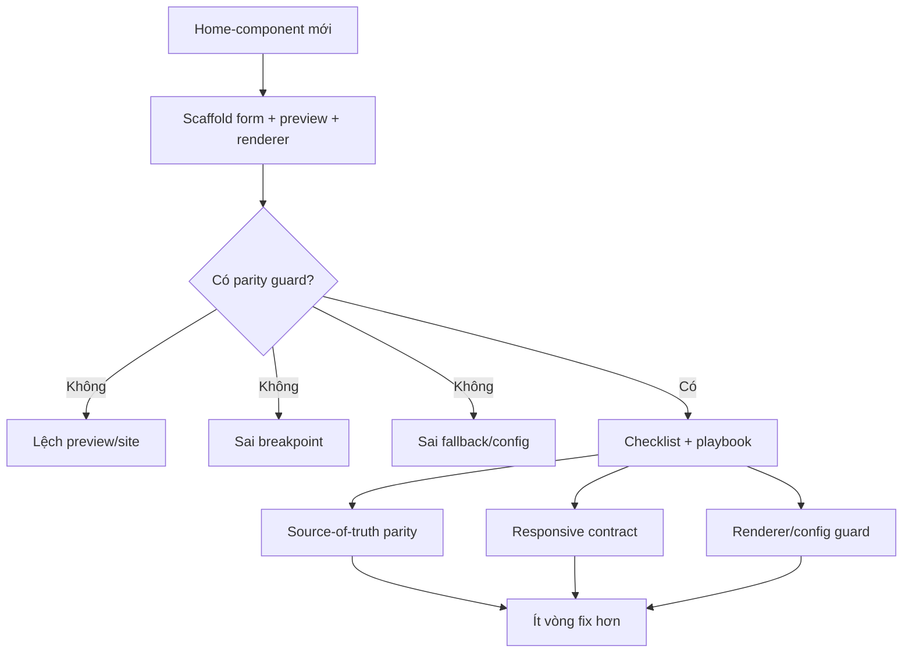

# I. Primer

## 1. TL;DR kiểu Feynman
- Các commit local chưa push cho thấy cùng một nhóm lỗi lặp đi lặp lại: preview lệch site, breakpoint sai, fallback style sai chỗ, wrapper preview không đồng bộ, và form/config của home-component không khóa contract ngay từ đầu.
- Nghĩa là repo đang thiếu một “người gác cổng” cho home-component mới.
- Skill mới nên không quá rộng: chỉ dành cho **home-component mới**, đúng như bạn chọn.
- Format phù hợp nhất là **checklist + playbook**: checklist để chặn lỗi nhanh, playbook để agent biết phải đọc file nào, map parity thế nào, và verify ra sao.
- Tên hợp lý nhất theo mục tiêu và commit history: `home-component-parity-guard`, đặt trong `.factory/skills` như project skill.

## 2. Elaboration & Self-Explanation
Từ lịch sử commit local chưa push, pattern rất rõ:
- Blog phải fix nhiều vòng liên tiếp chỉ vì preview/site không cùng contract.
- Testimonials từng phải chỉnh grid desktop, spacing và container nhiều lần.
- FAQ cũng phải “align preview layouts with showcase parity”.
- Ngoài ra còn các fix về color override state/toggle, nghĩa là contract config/UI/state cũng dễ bị lệch khi thêm component mới.

Điều này nói rằng lỗi không phải do một component cụ thể “xấu số”, mà là do thiếu một quy trình chuẩn bắt buộc khi tạo home-component mới.

Hiện repo đã có các skill liên quan nhưng vẫn thiếu mảnh ghép này:
- `create-home-component`: thiên về tạo component và wiring cơ bản.
- `experience-preview-extractor`: mạnh về trích xương UI thật sang preview parity.
- `system-extension-guideline`: master playbook cross-system, nhưng quá rộng cho bài toán home-component mới.
- `docs-seeker`: tốt để nghiên cứu docs/best practices ngoài repo.
- `skill-writer`: tốt để thiết kế skill structure/frontmatter.

Nói cách khác, repo đang có “công cụ xây nhà” và “công cụ tra cứu”, nhưng thiếu “checklist nghiệm thu nhà trước khi bàn giao”. Skill mới cần lấp đúng chỗ đó.

## 3. Concrete Examples & Analogies
### Ví dụ bám commit chưa push
Các commit local nổi bật:
- `9c7b14c2 feat(blog): align admin and site layouts from source`
- `afb10183 fix(blog): use exact layout1-layout6 mapping`
- `0e77277d fix(blog): reduce preview parity drift`
- `9f70d58b fix(blog): align responsive preview with demo shell`
- `a1d901bb`, `594cf7c8`, `ee121b27`, `013d24b1`, `923cf1bc`, `9cfc324f`, `47a4085e`: chuỗi sửa layout4 preview parity/container/context/shell liên tục
- `d4a88ac1 feat(testimonials): upgrade showcase layouts`
- `061e31ca fix(testimonials): tighten layout containers`
- `5352b322 fix(testimonials): improve preview spacing`
- `5a6f9545 fix(testimonials): match desktop preview grid`
- `ac7d3ede feat(faq): refresh admin layouts from showcase patterns`
- `8e276c06 fix(faq): align preview layouts with showcase parity`

=> Đây là evidence rất mạnh rằng skill mới phải tập trung vào 4 nhóm guardrails:
1. source-of-truth parity,
2. preview contract,
3. responsive/breakpoint contract,
4. config + fallback contract.

### Analogy đời thường
Giống như đội thi công cứ xây xong mới phát hiện cửa lệch, trần lệch, điện lệch rồi đập ra sửa 100 lần. Skill mới chính là checklist nghiệm thu ngay từ lúc đang dựng khung.

# II. Audit Summary (Tóm tắt kiểm tra)
- Observation:
  - Branch local đang ahead `origin/master` 22 commits.
  - Phần lớn commit chưa push tập trung vào blog/testimonials/faq preview parity, layout mapping, responsive shell, spacing/container và config behavior.
  - Diff stat cho thấy thay đổi lớn tập trung ở:
    - `app/admin/home-components/blog/_components/BlogPreview.tsx`
    - `app/admin/home-components/blog/_components/BlogSectionShared.tsx`
    - `app/admin/home-components/testimonials/_components/TestimonialsPreview.tsx`
    - `app/admin/home-components/testimonials/_components/TestimonialsSectionShared.tsx`
    - `app/admin/home-components/faq/_components/FaqSectionShared.tsx`
    - `components/site/BlogSection.tsx`
    - `components/site/ComponentRenderer.tsx`
- Evidence:
  - `git log --oneline origin/master..HEAD` cho thấy chuỗi fix parity/blog layout4 rất dài.
  - `git diff --stat origin/master..HEAD` cho thấy 45 files changed, hơn 5.8k insertions.
  - `create-home-component` hiện thiên về scaffolding 6 styles, images, config, nhưng chưa có gate parity đủ chặt.
  - `experience-preview-extractor` mạnh về structural similarity và responsive parity.
  - `system-extension-guideline` là master playbook nhưng scope rộng hơn nhu cầu hiện tại.
- Conclusion:
  - Nên tạo **project skill chuyên biệt** cho home-component mới, đóng vai trò preflight/parity gate trước khi agent code hoặc chốt implementation.

# III. Root Cause & Counter-Hypothesis (Nguyên nhân gốc & Giả thuyết đối chứng)
## Root Cause Confidence (Độ tin cậy nguyên nhân gốc): High
Vì commit history và diff stat đều chỉ ra pattern lỗi lặp lại theo cùng nhóm concerns, không phải bug ngẫu nhiên từng component.

## Nguyên nhân gốc
Repo đang thiếu một skill chuyên trách bắt buộc agent phải đi qua khi thêm home-component mới, để khóa sớm các contract sau:
- source UI thật ↔ preview ↔ site renderer,
- layout style mapping 1-1,
- device handling / preview shell / browser frame contract,
- breakpoint/container-query rules,
- config fields & fallback order,
- image/content fallback và empty state,
- acceptance checklist trước khi coi như done.

## Counter-Hypothesis (Giả thuyết đối chứng)
### a) Chỉ cần mở rộng `create-home-component`
- Confidence: Medium
- Tradeoff: Có thể làm được, nhưng sẽ khiến skill tạo component bị quá tải, vừa scaffolding vừa audit/QA/preflight.
- Khi phù hợp: nếu repo muốn gom mọi thứ vào một skill duy nhất.

### b) Chỉ cần dùng `experience-preview-extractor`
- Confidence: Low
- Lý do: skill này mạnh ở preview parity extraction, nhưng chưa cover trọn fallback order, config contract, color override state, 6 styles, renderer wiring, anti-regression checklist cho home-component mới.

### c) Không cần skill mới, chỉ cần viết docs
- Confidence: Low
- Lý do: vấn đề ở đây là enforcement/workflow cho agent, không chỉ là tài liệu tham khảo.

# IV. Proposal (Đề xuất)
## Đề xuất chính (Recommend) — Confidence 94%
Tạo **project skill mới** tại `.factory/skills/home-component-parity-guard` với scope:
- dùng khi **thêm home-component mới**,
- không dùng cho mọi refactor cũ mặc định,
- format **checklist + playbook**,
- tận dụng pattern từ `create-home-component`, `experience-preview-extractor`, `system-extension-guideline`, và tư duy nghiên cứu từ `docs-seeker`.

## Nội dung skill nên có
### 1. Frontmatter
- `name: home-component-parity-guard`
- `description`: nêu rõ skill này chuẩn hóa home-component mới để tránh lệch preview/site, lỗi breakpoint, fallback, config mapping, và renderer parity.

### 2. Positioning / Khi nào dùng
Trigger khi user nói hoặc task có các ý:
- “thêm home-component mới”
- “create home component”
- “preview phải giống site thật”
- “6 styles”
- “parity” / “breakpoint” / “responsive preview”
- “ComponentRenderer wiring”

### 3. Core workflow đề xuất
#### Phase A — Contract Discovery
- Xác định source of truth của UI thật.
- Chọn component reference gần nhất trong repo.
- Xác định 6 styles và style mapping 1-1.

#### Phase B — File Map bắt buộc
- create page
- edit page
- preview/shared preview
- site renderer / section shared
- constants / types / colors / config schema

#### Phase C — Parity Guard Checklist
- preview structure parity
- site renderer parity
- style mapping parity
- responsive/device parity
- breakpoint/container-query parity
- button `type="button"` trong preview
- fallback style nằm cuối
- empty state / image fallback / long text
- color override + config state persistence

#### Phase D — Anti-regression Rules
Rút trực tiếp từ commit history:
- Không tự sáng tạo layout mapping khác source.
- Với layout phụ thuộc `@container`, phải ghi rõ preview contract và acceptance criteria.
- Không fix width mù; phải xác định điểm đo breakpoint/container.
- Preview desktop là browser/web preview, không phone mock nếu không có lý do rõ.
- Nếu preview và site share component, mọi override phải khóa bằng `context === 'preview'` hoặc equivalent.

#### Phase E — Output protocol
Skill phải bắt agent trả ra:
1. Scope & paths
2. Source of truth
3. Mapping table preview ↔ site
4. Checklist pass/fail
5. Risks
6. Verification steps

### 4. Supporting files nên có
#### `CHECKLIST.md`
Checklist ngắn, scan nhanh trước khi code xong.

#### `PATTERNS.md`
Mẫu các pattern đúng/sai, ví dụ:
- preview wrapper contract
- layout fallback order
- container-query preview override
- button type in preview
- image fallback
- empty state / line clamp

#### `COMMIT_SIGNALS.md`
Tóm tắt các nhóm lỗi được rút ra từ 22 commit local chưa push để future agent hiểu “vì sao skill này tồn tại”.

### 5. Relationship với skill hiện có
- `create-home-component`: lo scaffolding/chung.
- `home-component-parity-guard`: lo guardrails/checklist trước khi coi implementation là đúng.
- `experience-preview-extractor`: dùng khi cần học UI thật để trích xương/preserve parity.
- `docs-seeker`: chỉ dùng khi repo thiếu pattern nội bộ và phải tham khảo best practices ngoài.

# V. Files Impacted (Tệp bị ảnh hưởng)
- Thêm: `E:/NextJS/study/admin-ui-aistudio/system-vietadmin-nextjs/.factory/skills/home-component-parity-guard/SKILL.md`
  - Vai trò: entrypoint của skill mới.
  - Thay đổi: định nghĩa scope, trigger, workflow, output contract.

- Thêm: `E:/NextJS/study/admin-ui-aistudio/system-vietadmin-nextjs/.factory/skills/home-component-parity-guard/CHECKLIST.md`
  - Vai trò: checklist scan nhanh để chặn lỗi lặp lại.
  - Thay đổi: liệt kê gates bắt buộc trước khi hoàn tất home-component mới.

- Thêm: `E:/NextJS/study/admin-ui-aistudio/system-vietadmin-nextjs/.factory/skills/home-component-parity-guard/PATTERNS.md`
  - Vai trò: mẫu đúng/sai cho parity, preview shell, breakpoint, fallback, config.
  - Thay đổi: đưa ví dụ cụ thể từ repo patterns hiện có.

- Thêm: `E:/NextJS/study/admin-ui-aistudio/system-vietadmin-nextjs/.factory/skills/home-component-parity-guard/COMMIT_SIGNALS.md`
  - Vai trò: giải thích origin story từ commit history local chưa push.
  - Thay đổi: gom các nhóm lỗi từ blog/testimonials/faq thành guardrails hành động được.

# VI. Execution Preview (Xem trước thực thi)
1. Đọc thêm các file skill liên quan để bám style viết hiện có.
2. Tạo thư mục mới `.factory/skills/home-component-parity-guard`.
3. Viết `SKILL.md` với frontmatter + workflow + output contract.
4. Viết `CHECKLIST.md`, `PATTERNS.md`, `COMMIT_SIGNALS.md`.
5. Đảm bảo wording của skill đủ rõ để auto-trigger đúng lúc.
6. Review tĩnh nội dung skill theo checklist của `skill-writer`.

# VII. Verification Plan (Kế hoạch kiểm chứng)
- Kiểm tra frontmatter hợp lệ:
  - name lowercase-hyphen
  - description rõ what + when
- Kiểm tra scope đúng theo lựa chọn của bạn:
  - chỉ cho home-component mới
- Kiểm tra skill cover đủ các lỗi từ commit history:
  - preview/site parity
  - breakpoint/container query
  - fallback/config order
  - wrapper/device contract
- Kiểm tra skill không trùng vai trò hoàn toàn với `create-home-component` hay `experience-preview-extractor`, mà bổ sung đúng khoảng trống.

# VIII. Todo
1. Tạo project skill `home-component-parity-guard`.
2. Viết `SKILL.md` theo format checklist + playbook.
3. Thêm file checklist/patterns/commit-signals hỗ trợ.
4. Review nội dung theo chuẩn `skill-writer`.
5. Bàn giao cách dùng skill mới.

# IX. Acceptance Criteria (Tiêu chí chấp nhận)
- Có skill mới tên `home-component-parity-guard` trong `.factory/skills`.
- Skill chỉ nhắm đến home-component mới.
- Skill kết hợp được checklist + playbook.
- Skill phản ánh trực tiếp các bài học từ commit history local chưa push.
- Skill đủ cụ thể để agent dùng như preflight guard trước khi thêm home-component mới.

# X. Risk / Rollback (Rủi ro / Hoàn tác)
- Risk chính: skill quá rộng, đè vai trò của `create-home-component`.
- Risk phụ: skill quá dài nhưng thiếu trigger words rõ nên khó auto-activate.
- Rollback dễ: xóa thư mục skill mới nếu chưa đạt chất lượng.

# XI. Out of Scope (Ngoài phạm vi)
- Không refactor toàn bộ các skill cũ.
- Không auto-sửa các home-component hiện có.
- Không tạo tool/script runtime; chỉ tạo skill guidance cho agent.

# XII. Open Questions (Câu hỏi mở)
- Không còn ambiguity lớn sau khi bạn đã chốt scope, format, tên và location. Nếu bạn duyệt spec này, bước tiếp theo là tạo đầy đủ skill `home-component-parity-guard` dựa trên commit history local chưa push và patterns từ các skill hiện có.