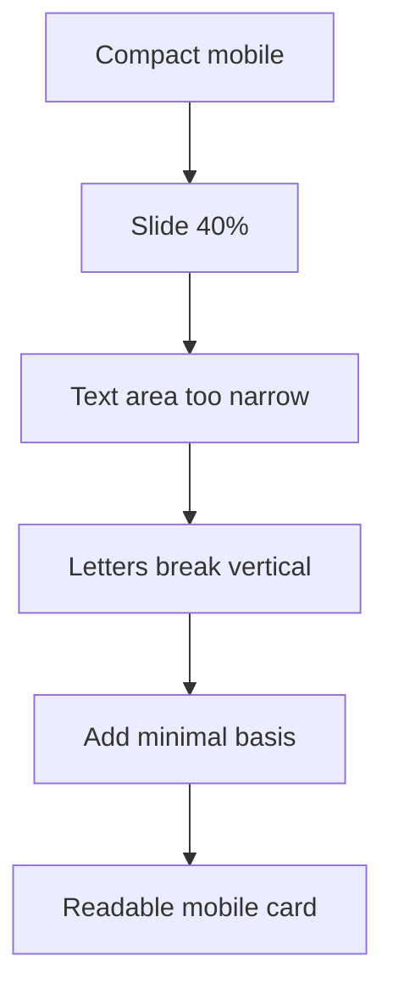

# I. Primer

## 1. TL;DR kiểu Feynman

- Compact List preview mobile bị lỗi vì mỗi card đang quá hẹp.
- Card Compact List là layout ngang: icon bên trái + chữ bên phải. Nếu slide chỉ rộng `40%` của khung mobile 375px, phần chữ chỉ còn một cột rất nhỏ nên chữ bị bẻ gần như từng ký tự.
- Root cause nằm ở `DEFAULT_SLIDE_BASIS_CLASSNAMES.mobile = basis-[40%]` đang được dùng cho `minimal` (Compact List).
- Fix đúng: thêm sizing riêng cho `minimal`, đặc biệt mobile phải rộng hơn như code cũ từng có (`basis-[82%]`), để text có đủ chiều ngang.
- Không commit sau khi sửa; dừng ở working tree để bạn check.

## 2. Elaboration & Self-Explanation

Compact List khác các layout dạng ô vuông/tròn. Nó cần card rộng vì bên trong có:

- ảnh/icon tròn cố định `w-12` hoặc `md:w-14`,
- `gap-3`,
- padding hai bên,
- vùng text có title + product count.

Hiện `STYLE_SLIDE_BASIS_CLASSNAMES` chỉ override cho:

- `carousel` / Book Row
- `cards` / Cover Cards

Compact List (`minimal`) đang fallback về default:

```ts
mobile: 'basis-[40%]'
tablet: 'basis-[28.571%]'
desktop: 'basis-[18.181%]'
```

Trong preview mobile `375px`, `40%` chỉ khoảng `150px`. Trừ padding, icon, gap thì vùng text còn rất hẹp, nên chữ như “Website bán hàng” bị bẻ dọc. Đây đúng với screenshot bạn gửi.

## 3. Concrete Examples & Analogies

Ví dụ tính nhanh:

- Mobile preview width: `375px`.
- Slide `basis-[40%]`: khoảng `150px`.
- Card padding trái/phải: `24px`.
- Icon: `48px`.
- Gap: `12px`.
- Text còn khoảng `66px`, không đủ cho tên danh mục dài.

Nếu đổi Compact List mobile về `basis-[82%]`, slide khoảng `307px`, text còn hơn `220px`, đủ để chữ xuống dòng tự nhiên thay vì bẻ dọc.

Analogy: đang cố nhét một dòng địa chỉ vào cột hẹp bằng ngón tay; chữ bắt buộc rơi từng ký tự. Cần làm cái thẻ rộng hơn, không phải tăng chiều cao.

# II. Audit Summary (Tóm tắt kiểm tra)

## 1. Scope & impacted paths

Sửa dự kiến:

- `app/admin/home-components/product-categories/_components/ProductCategoriesSectionShared.tsx`

Không commit sau khi sửa.

## 2. Source of truth

- Compact List style key là `minimal`.
- Preview truyền `context="preview"` và `device="mobile"` vào `ProductCategoriesSectionShared`.
- Slide width được quyết định bởi `getSlideClassName(currentStyle)`.
- Vì `minimal` chưa có entry trong `STYLE_SLIDE_BASIS_CLASSNAMES`, nó đang dùng default quá hẹp.

## 3. Preview ↔ Site parity map

| Surface | File | Contract cần giữ |
|---|---|---|
| Preview | `ProductCategoriesPreview.tsx` | Không sửa, vẫn truyền đúng `device` |
| Shared UI | `ProductCategoriesSectionShared.tsx` | Thêm style basis riêng cho `minimal` |
| Site | `ComponentRenderer.tsx` | Không sửa, nhận cùng shared renderer nếu dùng responsive thật |
| Git | working tree | Không commit, để user check trước |

## 4. Observation (Bằng chứng quan sát)

- Screenshot preview mobile Compact List: text bị bẻ dọc từng ký tự.
- Code Compact List root: layout ngang `flex items-center gap-3`, có icon cố định `h-12 w-12`, nên cần slide đủ rộng.
- Code slide basis hiện tại: `minimal` dùng default mobile `basis-[40%]`, quá hẹp cho horizontal list.
- Git diff cũ đã cho thấy trước khi refactor, `minimal` từng có sizing riêng: `basis-[82%] sm:basis-[46%] md:basis-[32%] lg:basis-1/6`.

# III. Root Cause & Counter-Hypothesis (Nguyên nhân gốc & Giả thuyết đối chứng)

## 1. Root Cause Confidence (Độ tin cậy nguyên nhân gốc)

**High.**

Lý do:

- Lỗi chữ bẻ dọc là dấu hiệu kinh điển của container text quá hẹp.
- Compact List hiện đang bị ép slide mobile `40%`, trong khi layout ngang cần rộng hơn.
- Old implementation đã từng có basis riêng `82%` cho Compact List mobile, đúng với nhu cầu layout này.

## 2. Trả lời 5/8 câu Audit bắt buộc

1. Triệu chứng expected vs actual:
   - Expected: Compact List mobile hiển thị card ngang, icon bên trái, title/count đọc được bình thường.
   - Actual: title bị bẻ dọc từng ký tự, card hẹp và cao bất thường.

3. Tái hiện tối thiểu:
   - Mở Product Categories preview, chọn Compact List, bật mobile device.

5. Dữ liệu thiếu:
   - Chưa có screenshot site mobile cùng layout, nhưng preview screenshot và code basis đủ để kết luận container quá hẹp.

6. Giả thuyết thay thế:
   - `break-words` góp phần làm chữ bẻ, nhưng nếu bỏ `break-words` mà slide vẫn hẹp thì text sẽ overflow; root vẫn là width.
   - Min-height lớn làm card cao hơn, nhưng không làm chữ bẻ dọc; width mới là nguyên nhân chính.

8. Tiêu chí pass/fail:
   - Pass khi Compact List preview mobile có card đủ rộng, chữ đọc tự nhiên, không bẻ dọc.

# IV. Proposal (Đề xuất)

## 1. Fix chính: thêm style basis riêng cho `minimal`

Trong `STYLE_SLIDE_BASIS_CLASSNAMES`, thêm:

```ts
minimal: {
  mobile: 'basis-[82%]',
  tablet: 'basis-[46%]',
  desktop: 'basis-[32%]',
},
```

Lý do:

- Đây là sizing cũ đã từng tồn tại cho Compact List.
- Mobile đủ rộng để text không bị bóp.
- Tablet/desktop cũng phù hợp hơn với horizontal list so với default quá hẹp.

## 2. Giữ equal-height hiện tại nhưng giảm rủi ro text bị ép

Không cần bỏ `break-words` ngay. Sau khi tăng width, text sẽ có không gian bình thường.

Nếu vẫn còn bẻ dọc sau basis fix, bước phụ mới cân nhắc:

- Chỉ với `minimal`, đổi title class từ `break-words` sang `break-words [overflow-wrap:normal]` hoặc `break-normal` nếu Tailwind hỗ trợ trong project.
- Nhưng không làm bước phụ trước để tránh đổi behavior text dài bất thường.

## 3. Không đụng các layout khác

Không sửa thêm:

- Circle Grid (`grid`)
- Book Row (`carousel`) ngoài code đang có
- Cover Cards (`cards`) ngoài code đang có
- Square Grid (`marquee`) ngoài patch bỏ border preview đã làm
- Premium Grid (`circular`)

## 4. Commit policy

- Không commit.
- Sau khi sửa và typecheck, dừng để bạn check preview.



# V. Files Impacted (Tệp bị ảnh hưởng)

- Sửa: `app/admin/home-components/product-categories/_components/ProductCategoriesSectionShared.tsx`  
  Vai trò hiện tại: shared renderer và slide sizing cho 6 layout Product Categories.  
  Thay đổi: thêm `minimal` vào `STYLE_SLIDE_BASIS_CLASSNAMES` để Compact List có slide width riêng, nhất là mobile.

# VI. Execution Preview (Xem trước thực thi)

1. Patch `STYLE_SLIDE_BASIS_CLASSNAMES` thêm key `minimal`.
2. Không sửa `ProductCategoriesPreview.tsx`.
3. Không sửa site renderer.
4. Chạy `bunx tsc --noEmit`.
5. Chạy `git diff`/`git status` để báo lại.
6. Dừng, không commit.

# VII. Verification Plan (Kế hoạch kiểm chứng)

## 1. Static verification (Kiểm chứng tĩnh)

- `minimal` có basis riêng.
- Default basis vẫn giữ cho các layout còn lại.
- Không có thay đổi mới ngoài `ProductCategoriesSectionShared.tsx`.

## 2. Type verification (Kiểm chứng type)

- Chạy `bunx tsc --noEmit`.
- Không chạy lint/unit test/build theo AGENTS.md.

## 3. Manual verification (Kiểm chứng trực quan)

- Compact List preview mobile: title không còn bẻ dọc.
- Compact List preview tablet/desktop: card không quá hẹp, chiều cao vẫn cân.
- Square Grid preview: vẫn không có border bọc ngoài.
- Site thật: kiểm tra nhanh sau nếu bạn muốn, nhưng agent sẽ không commit trước khi bạn duyệt.

# VIII. Todo

1. Thêm `minimal` style basis.
2. Chạy `bunx tsc --noEmit`.
3. Báo diff/status.
4. Dừng không commit.

# IX. Acceptance Criteria (Tiêu chí chấp nhận)

- Compact List preview mobile không còn chữ bẻ dọc.
- Card Compact List mobile đủ rộng để đọc title/count.
- Không làm hỏng Square Grid preview vừa bỏ border ngoài.
- Không commit khi user chưa check.
- `bunx tsc --noEmit` pass.

# X. Risk / Rollback (Rủi ro / Hoàn tác)

- Risk: Compact List desktop/tablet có thể hiển thị ít item hơn do slide rộng hơn; đây là tradeoff hợp lý vì layout ngang cần đọc được text.
- Rollback: xóa entry `minimal` khỏi `STYLE_SLIDE_BASIS_CLASSNAMES` là quay lại hiện trạng.

# XI. Out of Scope (Ngoài phạm vi)

- Không commit.
- Không sửa data/config/Convex.
- Không redesign Compact List.
- Không sửa các layout khác.

# XII. Open Questions (Câu hỏi mở)

Không có câu hỏi bắt buộc. Lỗi đã đủ rõ: Compact List mobile dùng slide basis quá hẹp.