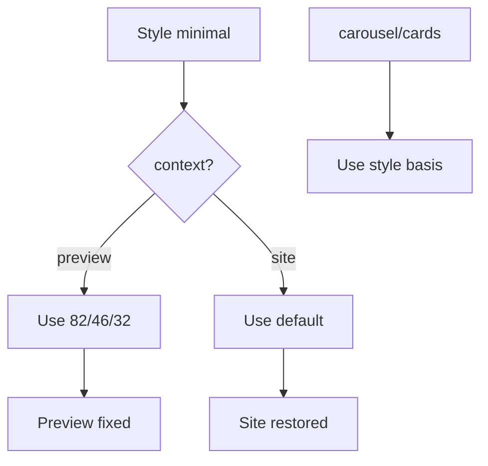

# I. Primer

## 1. TL;DR kiểu Feynman

- Root cause: lần sửa Compact List mobile đã thêm `minimal` vào `STYLE_SLIDE_BASIS_CLASSNAMES`, nhưng helper này đang áp dụng cho **cả preview và site**.
- Preview mobile đúng vì `minimal.mobile = basis-[82%]` giúp card đủ rộng.
- Site sai vì site cũng nhận `minimal` basis mới (`82% / 46% / 32%`) thay vì basis default trước đó (`40% / 28.571% / 18.181%`).
- Fix đúng: tách basis theo context, để `minimal` override **chỉ dùng cho preview**, còn site Compact List quay về default đang ổn.
- Không commit sau khi sửa; dừng ở working tree để bạn check.

## 2. Elaboration & Self-Explanation

Hiện `getSlideClassName(currentStyle)` đang làm như sau:

```ts
const classNames = STYLE_SLIDE_BASIS_CLASSNAMES[currentStyle] ?? DEFAULT_SLIDE_BASIS_CLASSNAMES;

return context === 'preview'
  ? classNames[device]
  : `${classNames.mobile} md:${classNames.tablet} lg:${classNames.desktop}`;
```

Vấn đề là `STYLE_SLIDE_BASIS_CLASSNAMES.minimal` được dùng chung cho cả hai context:

- Preview mobile: dùng `basis-[82%]` → đúng vì text không bị bóp.
- Site desktop/tablet/mobile: cũng dùng `basis-[82%] md:basis-[46%] lg:basis-[32%]` → làm số item/nhịp layout site thay đổi, nên site bị sai.

Vì user xác nhận “preview giờ đúng” và “site render lại sai”, fix không nên rollback toàn bộ. Chỉ cần giới hạn `minimal` override cho preview.

## 3. Concrete Examples & Analogies

Ví dụ hiện tại ở site desktop:

- Trước: Compact List dùng default desktop `basis-[18.181%]`, thấy khoảng 5.5 item/row.
- Sau: Compact List dùng `basis-[32%]`, chỉ còn khoảng 3 item/row, làm site lệch layout.

Analogy: preview mobile cần kính phóng đại riêng để đọc chữ rõ; nhưng đang đưa luôn kính đó ra site desktop, làm mọi thứ phóng to sai.

# II. Audit Summary (Tóm tắt kiểm tra)

## 1. Scope & impacted paths

Sửa dự kiến:

- `app/admin/home-components/product-categories/_components/ProductCategoriesSectionShared.tsx`

Không sửa:

- `ProductCategoriesPreview.tsx`
- `ComponentRenderer.tsx`
- data/config/Convex

Không commit sau khi sửa.

## 2. Source of truth

- `ProductCategoriesSectionShared.tsx` quyết định slide width bằng `getSlideClassName`.
- `context="preview"` đến từ admin preview.
- `context="site"` đến từ site renderer.
- Compact List style key là `minimal`.

## 3. Preview ↔ Site parity map

| Surface | Current behavior | Desired behavior |
|---|---|---|
| Preview Compact mobile | `minimal.mobile = 82%`, đúng | Giữ 82% |
| Preview Compact tablet/desktop | `minimal = 46% / 32%`, có thể vẫn ổn | Giữ preview-specific nếu cần |
| Site Compact | Đang nhận `minimal = 82% / 46% / 32%`, sai | Quay về default site basis |
| Other styles | `carousel/cards` vẫn cần style basis | Giữ nguyên |

## 4. Observation (Bằng chứng quan sát)

- `STYLE_SLIDE_BASIS_CLASSNAMES` hiện có `minimal`.
- `getSlideClassName` dùng cùng map đó cho preview và site.
- Site ProductCategories truyền `context="site"` nhưng vẫn lấy classNames từ `STYLE_SLIDE_BASIS_CLASSNAMES[currentStyle]`.
- User xác nhận preview đúng, site sai sau thay đổi này.

# III. Root Cause & Counter-Hypothesis (Nguyên nhân gốc & Giả thuyết đối chứng)

## 1. Root Cause Confidence (Độ tin cậy nguyên nhân gốc)

**High.**

Lý do:

- Lỗi xuất hiện ngay sau khi thêm `minimal` style basis.
- Code evidence cho thấy style basis được áp dụng cả preview và site.
- Triệu chứng “preview đúng, site sai” khớp chính xác với missing context split.

## 2. Trả lời 5/8 câu Audit bắt buộc

1. Triệu chứng expected vs actual:
   - Expected: preview mobile Compact List rộng đủ; site giữ layout cũ đang ổn.
   - Actual: preview đúng nhưng site bị đổi layout vì dùng cùng basis mới.

3. Tái hiện tối thiểu:
   - Chọn Compact List, xem preview mobile và site thật sau thay đổi `minimal` basis.

5. Dữ liệu thiếu:
   - Chưa có screenshot site mới trong prompt, nhưng code path đủ rõ để xác định context override gây ảnh hưởng.

6. Giả thuyết thay thế:
   - Equal-height/min-height có thể ảnh hưởng chiều cao site, nhưng thay đổi width basis `32%` là nguyên nhân trực tiếp làm layout site sai nhịp.
   - Preview wrapper không gây site sai vì site không dùng wrapper preview.

8. Tiêu chí pass/fail:
   - Pass khi preview mobile Compact List vẫn đúng và site Compact List quay lại nhịp width cũ.

# IV. Proposal (Đề xuất)

## 1. Tách map basis theo context

Đổi từ một map chung:

```ts
STYLE_SLIDE_BASIS_CLASSNAMES
```

thành hai tầng rõ hơn:

```ts
const STYLE_SLIDE_BASIS_CLASSNAMES = {
  carousel: ...,
  cards: ...,
};

const PREVIEW_ONLY_SLIDE_BASIS_CLASSNAMES = {
  minimal: {
    mobile: 'basis-[82%]',
    tablet: 'basis-[46%]',
    desktop: 'basis-[32%]',
  },
};
```

Sau đó trong `getSlideClassName`:

```ts
const classNames = context === 'preview'
  ? PREVIEW_ONLY_SLIDE_BASIS_CLASSNAMES[currentStyle]
    ?? STYLE_SLIDE_BASIS_CLASSNAMES[currentStyle]
    ?? DEFAULT_SLIDE_BASIS_CLASSNAMES
  : STYLE_SLIDE_BASIS_CLASSNAMES[currentStyle]
    ?? DEFAULT_SLIDE_BASIS_CLASSNAMES;
```

Ý nghĩa:

- `minimal` chỉ override preview.
- Site `minimal` fallback default.
- `carousel/cards` vẫn override cả preview và site như trước.

## 2. Không rollback các fix khác

Giữ nguyên:

- `w-full h-full` cho Book Row/Cover Cards.
- Equal-height Book Row/Compact List.
- Square Grid preview bỏ wrapper border.
- Cover Cards width/gap fix.

Chỉ sửa logic chọn basis.

## 3. Không commit

Sau khi sửa:

- chạy `bunx tsc --noEmit`,
- báo `git diff`/`git status`,
- dừng để user check.



# V. Files Impacted (Tệp bị ảnh hưởng)

- Sửa: `app/admin/home-components/product-categories/_components/ProductCategoriesSectionShared.tsx`  
  Vai trò hiện tại: shared renderer và slide basis resolver cho Product Categories.  
  Thay đổi: tách `minimal` basis thành preview-only để site không bị ảnh hưởng.

# VI. Execution Preview (Xem trước thực thi)

1. Thêm `PREVIEW_ONLY_SLIDE_BASIS_CLASSNAMES` chứa `minimal`.
2. Xóa `minimal` khỏi map basis chung.
3. Cập nhật `getSlideClassName` chọn map theo `context`.
4. Chạy `bunx tsc --noEmit`.
5. Chạy `git status` + `git diff`.
6. Dừng, không commit.

# VII. Verification Plan (Kế hoạch kiểm chứng)

## 1. Static verification (Kiểm chứng tĩnh)

- `minimal` không còn nằm trong map áp dụng cho site.
- `minimal` vẫn có preview-only basis.
- Site branch `context !== 'preview'` fallback default cho `minimal`.
- `carousel/cards` không bị đổi behavior.

## 2. Type verification (Kiểm chứng type)

- Chạy `bunx tsc --noEmit`.
- Không chạy lint/unit test/build theo AGENTS.md.

## 3. Manual verification (Kiểm chứng trực quan)

- Preview mobile Compact List: vẫn đúng, chữ không bẻ dọc.
- Site Compact List: quay lại nhịp render đúng như trước.
- Square Grid preview: vẫn bỏ border ngoài.
- Cover Cards/Book Row: không regression.

# VIII. Todo

1. Tách `minimal` basis thành preview-only.
2. Cập nhật resolver `getSlideClassName` theo context.
3. Chạy `bunx tsc --noEmit`.
4. Báo status/diff.
5. Không commit.

# IX. Acceptance Criteria (Tiêu chí chấp nhận)

- Compact List preview mobile vẫn đúng.
- Compact List site không còn dùng `basis-[82%] md:basis-[46%] lg:basis-[32%]`.
- Site Compact List render lại đúng nhịp cũ.
- Không commit khi user chưa check.
- `bunx tsc --noEmit` pass.

# X. Risk / Rollback (Rủi ro / Hoàn tác)

- Risk thấp vì chỉ đổi resolver basis theo context.
- Nếu preview tablet/desktop Compact List bị quá rộng, sau đó có thể chỉ giữ `minimal.mobile` preview-only và cho tablet/desktop fallback default.
- Rollback: xóa `PREVIEW_ONLY_SLIDE_BASIS_CLASSNAMES` và resolver context split.

# XI. Out of Scope (Ngoài phạm vi)

- Không commit.
- Không sửa dữ liệu/config.
- Không redesign Compact List.
- Không sửa các layout khác ngoài resolver basis.

# XII. Open Questions (Câu hỏi mở)

Không có câu hỏi bắt buộc. Root cause rõ: `minimal` basis đang áp dụng nhầm sang site.