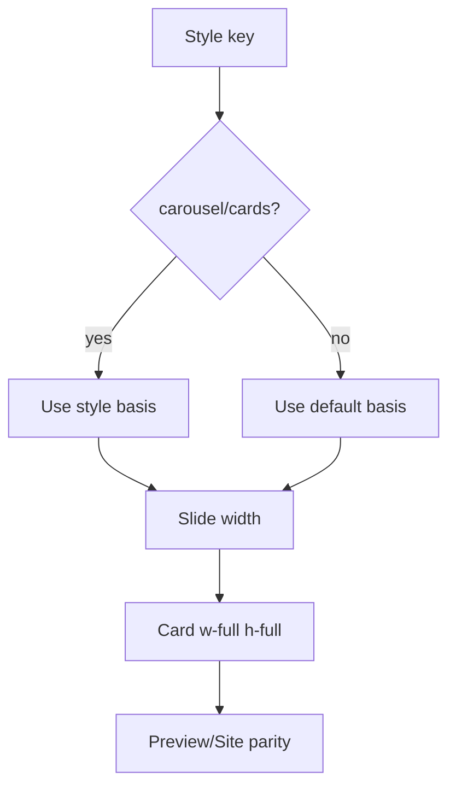

# I. Primer

## 1. TL;DR kiểu Feynman

- Product Categories đang dùng **một công thức width slide chung** cho cả 6 layout.
- Book Row và Cover Cards cần tỉ lệ riêng vì một layout dùng ảnh dọc 3:4, layout kia dùng cover overlay; ép chung làm desktop/tablet dễ lệch height/gap/width.
- Square Grid, Premium Grid, Circle Grid đang ổn vì hợp với sizing chung hiện tại, nên không chạm logic của 3 layout đó.
- Fix an toàn nhất: chỉ thêm sizing override cho `carousel` (Book Row) và `cards` (Cover Cards), đồng thời ép card con `w-full h-full` để luôn fill đúng slide.
- Không dùng inline `flexBasis`/CSS variable phức tạp, vì dễ phá responsive site thật.

## 2. Elaboration & Self-Explanation

Component này có một shared renderer (bộ render dùng chung) là `ProductCategoriesSectionShared.tsx`. Preview admin và site thật đều đi qua file này, nên lỗi ở đây sẽ xuất hiện cả hai nơi.

Hiện `renderSwipeRow()` lấy width slide từ `SLIDE_BASIS_CLASSNAMES` chung:

- mobile: `basis-[40%]`
- tablet: `basis-[28.571%]`
- desktop: `basis-[18.181%]`

Cách này ổn cho các layout dạng ô/icon đều như Circle Grid, Square Grid, Premium Grid. Nhưng Book Row dùng ảnh dọc `aspect-[3/4]` + phần text dưới card; Cover Cards dùng cover image + overlay CTA. Hai layout này nhạy với width hơn: width sai sẽ kéo theo chiều cao ảnh/card, làm thấy lệch height hoặc gap/width ở tablet/desktop.

Git history cũng cho thấy trước đây file này từng có `getSlideClassName(currentStyle)` riêng theo từng style, sau commit `54b90a9d` bị đổi sang một bộ basis chung cho mọi style. Triệu chứng user báo khớp đúng hai layout bị mất sizing riêng nhiều nhất: `carousel` và `cards`.

## 3. Concrete Examples & Analogies

Ví dụ cụ thể trong repo:

- Book Row (`carousel`) trước đây có sizing kiểu `basis-[58%] sm:basis-[34%] md:basis-[24%] lg:basis-1/6`.
- Cover Cards (`cards`) trước đây có sizing kiểu `basis-[76%] sm:basis-[42%] md:basis-[28%] lg:basis-1/6`.
- Hiện cả hai bị ép chung thành tablet `basis-[28.571%]`, desktop `basis-[18.181%]`.

Analogy: giống dùng cùng một khuôn hộp cho sách dọc, poster cover, icon tròn. Icon tròn vẫn đẹp, nhưng sách/poster sẽ bị bóp sai tỉ lệ hoặc khoảng trống nhìn lệch.

# II. Audit Summary (Tóm tắt kiểm tra)

## 1. Scope & impacted paths

Sửa dự kiến chỉ trong:

- `app/admin/home-components/product-categories/_components/ProductCategoriesSectionShared.tsx`

Chỉ đọc/tham chiếu, không sửa:

- `app/admin/home-components/product-categories/_components/ProductCategoriesPreview.tsx`
- `components/site/ComponentRenderer.tsx`
- `app/admin/home-components/product-categories/_lib/constants.ts`

## 2. Source of truth

- `ProductCategoriesSectionShared.tsx` là source of truth UI cho preview và site.
- `ProductCategoriesPreview.tsx` đã truyền `context="preview"` và `device` đúng.
- `ComponentRenderer.tsx` render site bằng cùng `ProductCategoriesSectionShared`, nên fix shared sẽ giữ parity preview/site.
- `constants.ts` xác nhận mapping style:
  - `grid` = Circle Grid
  - `carousel` = Book Row
  - `cards` = Cover Cards
  - `minimal` = Compact List
  - `marquee` = Square Grid
  - `circular` = Premium Grid

## 3. Preview ↔ Site parity map

| Surface | File | Contract cần giữ |
|---|---|---|
| Edit route | `app/admin/home-components/product-categories/[id]/edit/page.tsx` | Load/save config style/categories hiện có, không đổi |
| Preview | `ProductCategoriesPreview.tsx` | Truyền `context`, `device`, `style` vào shared section |
| Shared UI | `ProductCategoriesSectionShared.tsx` | Sizing/height/gap theo từng style, preview/site dùng cùng contract |
| Site | `ComponentRenderer.tsx` | Dùng shared section với `context="site"`, responsive class không bị inline style override |
| Styles | `constants.ts` | Mapping 6 layout không đổi |

## 4. Observation (Bằng chứng quan sát)

- Screenshot Cover Cards tablet: item đầu bị cắt mạnh, các khoảng trắng giữa card tạo cảm giác gap/width lệch.
- Screenshot Book Row: các card có vùng ảnh/text lệch chiều cao rõ ở desktop/tablet; mobile lại đều hơn.
- Code hiện tại: `getSlideClassName()` không nhận `style`, nên mọi layout dùng chung width slide.
- Git diff `9adc22b7..54b90a9d`: code cũ có `getSlideClassName(currentStyle)` riêng cho từng style; code mới thay bằng `SLIDE_BASIS_CLASSNAMES` chung.
- Websearch CSS/Flexbox: flex item sizing phụ thuộc `flex-basis`; với carousel một hàng, width slide và gap phải được kiểm soát rõ. Equal-height cards cần parent/child stretch và card fill width/height ổn định.

# III. Root Cause & Counter-Hypothesis (Nguyên nhân gốc & Giả thuyết đối chứng)

## 1. Root Cause Confidence (Độ tin cậy nguyên nhân gốc)

**High.**

Lý do:

- Evidence trực tiếp từ git history: refactor gần đây đã bỏ per-style basis.
- Triệu chứng khớp đúng hai style nhạy với ratio: Book Row (`carousel`) và Cover Cards (`cards`).
- Ba layout user dặn không phá (`grid`, `marquee`, `circular`) hiện hợp với sizing chung, nên root cause không phải toàn bộ carousel/Embla hỏng.
- Preview và site dùng chung shared renderer, nên lỗi ở shared sizing giải thích được cả hai bề mặt.

## 2. Trả lời 5/8 câu Audit bắt buộc

1. Triệu chứng expected vs actual:
   - Expected: Book Row desktop/tablet card cao đều; Cover Cards tablet gap/width đều.
   - Actual: Book Row lệch height desktop/tablet; Cover Cards lệch gap/width tablet.

3. Tái hiện tối thiểu:
   - Mở route edit Product Categories, chọn Book Row ở desktop/tablet hoặc Cover Cards ở tablet.
   - Dữ liệu có title/ảnh khác nhau sẽ làm lệch dễ thấy hơn.

5. Dữ liệu còn thiếu:
   - Chưa có runtime DOM measurement (do spec mode không thao tác browser/không sửa), nên con số basis tối ưu cuối cùng cần verify trực quan sau khi implement.

6. Giả thuyết thay thế:
   - Preview wrapper sai width: khả năng thấp vì `usePreviewDevice` chỉ set device width và shared section vẫn quyết định slide.
   - Ảnh khác ratio: có ảnh hưởng thị giác nhưng không giải thích việc lỗi tập trung đúng sau thay đổi basis.
   - Embla offset/snap: có thể góp phần gây item bị cắt, nhưng root lớn vẫn là style-specific basis bị mất.

8. Tiêu chí pass/fail:
   - Pass khi Book Row desktop/tablet đều height, Cover Cards tablet đều gap/width, và Circle/Square/Premium không đổi hành vi hiện tại.

## 3. Counter-Hypothesis (Giả thuyết đối chứng)

- Nếu sau khi khôi phục per-style basis mà Cover Cards vẫn bị cắt trái khi đổi tab/device, nguyên nhân phụ là Embla giữ scroll offset cũ. Khi đó thêm reset `emblaApi.scrollTo(0, true)` có điều kiện khi đổi `style/device/items.length`.
- Nếu Book Row vẫn lệch height sau basis riêng, nguyên nhân phụ là link/article thiếu `w-full h-full` hoặc vùng text cần `mt-auto/min-h` nhẹ. Tuy nhiên nên xử lý bằng `w-full h-full` trước, tránh redesign.

# IV. Proposal (Đề xuất)

## 1. Hướng sửa khuyến nghị

Sửa tối thiểu trong `ProductCategoriesSectionShared.tsx`:

1. Giữ `SLIDE_BASIS_CLASSNAMES` hiện tại làm default cho các layout đang ổn.
2. Thêm helper per-style, ví dụ `getSlideBasisClassName(currentStyle)`.
3. Chỉ override cho:
   - `carousel` / Book Row
   - `cards` / Cover Cards
4. `grid`, `marquee`, `circular` giữ nguyên default để không phá 3 layout user nói đang ổn.
5. Thêm `w-full` cho `CategoryLink`/`article` ở Book Row và Cover Cards để card fill đúng slide.
6. Nếu cần, thêm Embla reset nhẹ khi đổi `style/device/items.length`, nhưng không thay Embla architecture.

## 2. Logic cụ thể dự kiến

Không dùng inline `flexBasis`. Dùng Tailwind class để giữ responsive site rõ ràng.

Ví dụ helper:

```ts
const DEFAULT_SLIDE_BASIS_CLASSNAMES: Record<ProductCategoriesDevice, string> = {
  mobile: 'basis-[40%]',
  tablet: 'basis-[28.571%]',
  desktop: 'basis-[18.181%]',
};

const STYLE_SLIDE_BASIS_CLASSNAMES: Partial<Record<ProductCategoriesStyle, Record<ProductCategoriesDevice, string>>> = {
  carousel: {
    mobile: 'basis-[58%]',
    tablet: 'basis-[24%]',
    desktop: 'basis-[18.181%]',
  },
  cards: {
    mobile: 'basis-[76%]',
    tablet: 'basis-[28%]',
    desktop: 'basis-[18.181%]',
  },
};
```

Cần cân nhắc con số tablet:

- Book Row tablet `basis-[24%]`: khôi phục gần code cũ, cho card sách rộng hơn/ổn hơn so với generic nếu container preview tablet hiện quá chật.
- Cover Cards tablet `basis-[28%]`: gần code cũ và không đụng default `28.571%` quá nhiều, rủi ro thấp.

Nếu kiểm tra trực quan thấy Book Row tablet còn quá nhiều item và height vẫn lệch, điều chỉnh rất nhỏ trong phạm vi `carousel` thôi, không chạm default.

## 3. Không làm

- Không sửa Square Grid (`marquee`).
- Không sửa Premium Grid (`circular`).
- Không sửa Circle Grid (`grid`).
- Không đổi dữ liệu danh mục, Convex function, create/edit config.
- Không refactor toàn bộ carousel/gap sang CSS variable hoặc inline `flexBasis`.



# V. Files Impacted (Tệp bị ảnh hưởng)

- Sửa: `app/admin/home-components/product-categories/_components/ProductCategoriesSectionShared.tsx`  
  Vai trò hiện tại: shared renderer cho Product Categories ở preview admin và site thật.  
  Thay đổi: thêm basis theo style cho Book Row/Cover Cards, giữ default cho các layout còn lại, siết `w-full h-full` ở card root của hai layout lỗi, có thể reset Embla khi đổi style/device nếu cần.

# VI. Execution Preview (Xem trước thực thi)

1. Đọc lại vùng helper `SLIDE_BASIS_CLASSNAMES`, `getSlideClassName`, `renderSwipeRow`.
2. Đổi helper để nhận `style` và chọn class theo `STYLE_SLIDE_BASIS_CLASSNAMES[style] ?? DEFAULT`.
3. Cập nhật `renderSwipeRow()` dùng `getSlideClassName(style)` nhưng không thay wrapper/gap hiện tại.
4. Thêm `w-full` cho Book Row `CategoryLink` và `article`.
5. Thêm `w-full` cho Cover Cards `CategoryLink` và `article`.
6. Tự review tĩnh: đảm bảo `grid/marquee/circular` không đổi basis/class ngoài default.
7. Theo AGENTS.md: không tự chạy lint/build; nếu có code TS thay đổi, chỉ chạy `bunx tsc --noEmit` trước commit theo project rule sau khi user approve execution.
8. Commit local sau khi sửa, không push.

# VII. Verification Plan (Kế hoạch kiểm chứng)

## 1. Static verification (Kiểm chứng tĩnh)

- Kiểm tra `getSlideClassName` có branch riêng cho `carousel` và `cards`.
- Kiểm tra default basis của `grid`, `marquee`, `circular` giữ nguyên.
- Kiểm tra Book Row/Cover Cards card root có `w-full h-full`.
- Kiểm tra không có inline `flexBasis`/CSS variable mới gây override breakpoint site.

## 2. Type verification (Kiểm chứng type)

- Sau khi được approve và có sửa code: chạy `bunx tsc --noEmit` theo rule project khi có thay đổi TS.
- Không chạy lint/unit test/build vì AGENTS.md cấm tự chạy lint/unit test và cấm build.

## 3. Manual verification (Kiểm chứng trực quan do tester/user)

- Route: `/admin/home-components/product-categories/js7fb7t74xm1tdsthfaweyk82985h7wc/edit`.
- Book Row:
  - desktop: card height đều trong hàng.
  - tablet: card height đều trong hàng.
  - mobile: vẫn đều như hiện tại.
- Cover Cards:
  - tablet: card width/gap đều, không còn khoảng lệch bất thường.
  - mobile/desktop: vẫn bình thường như trước.
- Regression guard:
  - Circle Grid, Square Grid, Premium Grid vẫn render/swipe như hiện tại.

# VIII. Todo

1. Cập nhật basis helper theo style trong `ProductCategoriesSectionShared.tsx`.
2. Áp override chỉ cho `carousel` và `cards`.
3. Thêm `w-full h-full` cho Book Row và Cover Cards roots.
4. Tự review tĩnh chống ảnh hưởng `grid/marquee/circular`.
5. Chạy `bunx tsc --noEmit` sau khi sửa code.
6. Commit local, không push.

# IX. Acceptance Criteria (Tiêu chí chấp nhận)

- Book Row desktop/tablet không còn lệch độ cao item rõ ràng.
- Cover Cards tablet không còn lệch gap và độ rộng item rõ ràng.
- Mobile của Book Row/Cover Cards không xấu đi.
- Circle Grid, Square Grid, Premium Grid không bị đổi visual/layout hiện đang ổn.
- Preview admin và site thật vẫn dùng chung shared renderer, không tạo fork logic riêng.
- `bunx tsc --noEmit` pass sau khi implement.
- Có commit local chứa thay đổi, không push.

# X. Risk / Rollback (Rủi ro / Hoàn tác)

- Risk: con số basis khôi phục từ code cũ có thể cần tinh chỉnh nhỏ theo screenshot thật, nhất là Book Row tablet.
- Risk: nếu Embla đang giữ offset scroll cũ, basis riêng chưa giải quyết hoàn toàn item bị cắt trái; khi đó thêm reset Embla có điều kiện là bước kế tiếp.
- Rollback: revert commit mới là đủ vì chỉ sửa một shared file.
- Phạm vi ảnh hưởng rộng vừa phải vì shared file dùng cho preview và site, nhưng change được cô lập theo `style === 'carousel' | 'cards'`.

# XI. Out of Scope (Ngoài phạm vi)

- Không đổi schema/config/data Convex.
- Không đổi route edit/create.
- Không redesign lại 6 layout.
- Không sửa Circle Grid, Square Grid, Premium Grid ngoài việc chúng tiếp tục dùng default basis hiện tại.
- Không tự web automation localhost trong spec mode.

# XII. Open Questions (Câu hỏi mở)

Không có câu hỏi bắt buộc. Hướng an toàn nhất là sửa cô lập theo style dựa trên evidence từ code + git history, rồi verify trực quan sau khi approve.