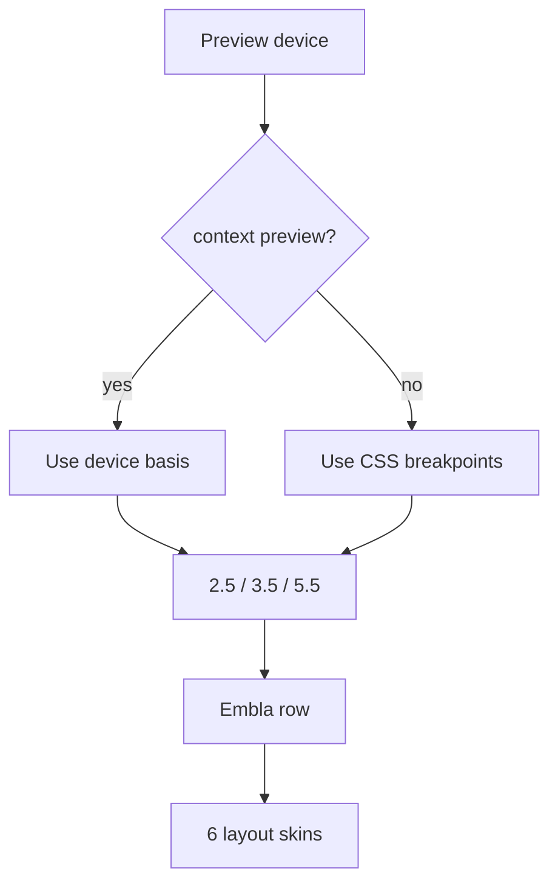

# I. Primer

## 1. TL;DR kiểu Feynman

- Lỗi “nát” ở mobile preview đến từ việc Tailwind `sm/md/lg` đang đo theo viewport trình duyệt thật, không đo theo khung preview mobile.
- Vì vậy trong khung mobile vẫn có thể ăn class desktop `lg:basis-1/6`, làm card quá hẹp, chữ bị dựng dọc.
- Sẽ đổi slide width sang contract rõ: mobile thấy 2.5 item, tablet 3.5 item, desktop 5.5 item.
- Với `context='preview'`, width sẽ lấy theo `device` preview, không dùng breakpoint Tailwind viewport.
- Với site thật, width dùng responsive thật: mobile `40%`, tablet `28.571%`, desktop `18.181%`.
- Đồng thời sửa vuốt mượt hơn bằng Embla API đúng chuẩn, bỏ logic native `document.getElementById(...).scrollBy(...)` còn sót.

## 2. Elaboration & Self-Explanation

Hiện ProductCategories đã dùng Embla nhưng slide width vẫn là chuỗi class kiểu `basis-[82%] sm:basis-[46%] md:basis-[32%] lg:basis-1/6`. Trong preview admin, khung mobile nằm bên trong một viewport desktop rộng. Tailwind `lg:` nhìn viewport desktop bên ngoài, nên nó áp `lg:basis-1/6` ngay cả khi khung preview đang là mobile. Kết quả: trong mobile preview, mỗi item chỉ rộng 1/6 container, quá hẹp, tên danh mục bị bẻ từng chữ xuống dòng.

Cách đúng là tách rõ:
- Preview: width theo `device` state (`mobile/tablet/desktop`) từ `usePreviewDevice`.
- Site: width theo CSS responsive thật.

Ngoài ra Book Row hiện vẫn còn nút prev/next gọi `document.getElementById(carouselId).scrollBy(...)`, trong khi list đã chuyển sang Embla và không còn viewport native id đúng nghĩa. Đây là nguyên nhân vuốt/click không mượt/không nhất quán. Sẽ chuyển sang `emblaApi.scrollPrev()` / `emblaApi.scrollNext()`.

## 3. Concrete Examples & Analogies

Ví dụ trong mobile preview rộng 326px:
- Mong muốn: 2.5 item nghĩa là mỗi item khoảng 40% width, thấy 2 item đầy đủ + nửa item thứ 3 để gợi ý vuốt.
- Hiện lỗi: bị áp desktop 1/6 nên mỗi item khoảng 16.6%, chỉ còn ~54px, chữ “Web…” bị xuống từng ký tự.

Analogy: preview mobile là một cái hộp nhỏ đặt trên bàn desktop. Không thể đo kích thước hộp bằng kích thước cả cái bàn; phải đo đúng cái hộp.

# II. Audit Summary (Tóm tắt kiểm tra)

## 1. Scope & impacted paths

Sửa chính:
- `app/admin/home-components/product-categories/_components/ProductCategoriesSectionShared.tsx`

Có thể không cần sửa:
- `ProductCategoriesPreview.tsx` vì đã truyền `context='preview'` và `device` đúng.
- `ComponentRenderer.tsx` vì site đã dùng shared runtime.
- create/edit form/config vì không liên quan bug layout.

## 2. Source of truth

- Shared runtime: `ProductCategoriesSectionShared.tsx` là source of truth cho 6 layout ở preview + site.
- Preview device state: `ProductCategoriesPreview.tsx` truyền `device` vào shared runtime.
- Slider reference: `TestimonialsSectionShared.tsx` dùng Embla config `align: 'start'`, `containScroll: 'trimSnaps'`, `dragFree: true`, viewport `overflow-hidden`, track `flex touch-pan-y`, slide `flex-none`.

## 3. Preview ↔ Site parity map

| Surface | File | Contract cần giữ |
|---|---|---|
| Preview | `ProductCategoriesPreview.tsx` | truyền `context='preview'` + `device` |
| Shared UI | `ProductCategoriesSectionShared.tsx` | width preview theo device, site theo breakpoints thật |
| Site | `ComponentRenderer.tsx` | dùng shared runtime, không fork logic |
| Styles | `_lib/constants.ts` + style branches | 6 style giữ skin riêng, cùng slider behavior |

## 4. Observation

- `getSlideClassName()` hiện trả class responsive chung như `basis-[82%] sm:basis-[46%] md:basis-[32%] lg:basis-1/6`.
- Trong admin preview mobile, Tailwind breakpoint vẫn dựa vào browser viewport, không dựa vào `BrowserFrame` width.
- Screenshot cho thấy card trong `Compact List` bị hẹp bất thường, chữ bị xuống từng ký tự, đúng dấu hiệu `lg:basis-1/6` đang áp trong khung mobile.
- Book Row còn dùng `document.getElementById(carouselId).scrollBy(...)` cho arrows, trong khi list đã chuyển sang Embla.

## 5. Inference

- Root cause không phải text dài đơn thuần; root cause là slide basis sai trong preview mobile.
- Cần fix ở width contract của slide, không chỉ giảm font hoặc line-height.
- Smoothness cần dùng Embla API thống nhất, không trộn native scroll với Embla.

# III. Root Cause & Counter-Hypothesis (Nguyên nhân gốc & Giả thuyết đối chứng)

Root Cause Confidence (Độ tin cậy nguyên nhân gốc): High.

Lý do:
- Screenshot mobile preview đang hiển thị quá nhiều skinny cards trong một hàng; điều này khớp với `lg:basis-1/6` bị áp sai trong preview.
- Code hiện dùng responsive Tailwind classes trong shared runtime mà không tách preview device.
- Testimonials pattern chỉ dùng fixed basis theo viewport thật, nhưng ProductCategories preview cần thêm layer `context/device` vì user yêu cầu con số rõ 2.5/3.5/5.5.

Counter-Hypothesis:
- “Do font quá lớn” bị loại vì font nhỏ hơn vẫn sẽ bị dựng dọc nếu slide chỉ rộng ~1/6 mobile frame.
- “Do tên danh mục quá dài” chưa đủ, vì item ngắn cũng bị layout skinny.
- “Do Embla không hoạt động” chỉ giải thích vuốt kém, không giải thích item width sai; cần fix cả basis và Embla API.

# IV. Proposal (Đề xuất)

## 1. Width contract mới

Target:
- Mobile: `2.5 item` visible → `basis: 40%`.
- Tablet: `3.5 item` visible → `basis: 28.571%`.
- Desktop: `5.5 item` visible → `basis: 18.181%`.

Implementation:
```ts
const SLIDE_BASIS = {
  mobile: 'basis-[40%]',
  tablet: 'basis-[28.571%]',
  desktop: 'basis-[18.181%]',
};

const getSlideClassName = () => {
  if (context === 'preview') {
    return SLIDE_BASIS[device];
  }
  return 'basis-[40%] md:basis-[28.571%] lg:basis-[18.181%]';
};
```

Quan trọng:
- Không còn style-specific `lg:basis-1/6` làm mobile preview bị hẹp.
- 6 layout dùng cùng width contract, đúng yêu cầu “mọi layout mọi responsive”.
- Skin từng layout vẫn giữ riêng.

## 2. Slider smoothness plan

Hiện tại:
- Embla được gắn ref viewport.
- Book Row buttons vẫn native scroll, không đồng bộ.

Sửa:
```ts
const [emblaRef, emblaApi] = useEmblaCarousel({
  align: 'start',
  containScroll: 'trimSnaps',
  dragFree: true,
  skipSnaps: false,
});

const scrollPrev = () => emblaApi?.scrollPrev();
const scrollNext = () => emblaApi?.scrollNext();
```

Thêm:
- card/slide có `cursor-grab active:cursor-grabbing select-none`.
- track giữ `touch-pan-y` như Testimonials.
- bỏ `carouselId` và `document.getElementById(...).scrollBy(...)`.
- `React.useEffect(() => emblaApi?.reInit(), [emblaApi, items.length, style, device, context])` để remeasure khi đổi style/device.

## 3. Fix layout review / Compact List bị nát

Sau khi basis đúng, Compact List sẽ rộng 40% mobile thay vì 16.6%.

Thêm guard cho text:
- giữ `break-words whitespace-normal`.
- thêm `min-w-0` cho content block.
- không dùng `line-clamp` ở tên danh mục.
- nếu vẫn cần ổn chiều cao: đặt `min-h` hợp lý nhưng không ép card quá hẹp.

## 4. Equal height cho Square Grid / Premium Grid

Giữ/siết lại:
- Slide wrapper: `h-full`.
- Card root: `h-full min-h[...]`.
- Text block: `min-h[...]` cho title/count area.
- Image area fixed dimension/aspect ratio.

Cụ thể:
- Square Grid: card `h-full min-h-[190px] md:min-h-[220px]`, image area fixed, title block `min-h-[3rem]`.
- Premium Grid: giữ `h-full min-h-[220px] md:min-h-[244px]`, title block `min-h-[56px]`.

## 5. Ordered actions

1. Refactor `getSlideClassName()` thành context/device-aware, không còn style-specific responsive basis.
2. Update `renderSwipeRow()` slide wrapper thêm `h-full` và cursor/select classes.
3. Change Embla hook to `[emblaRef, emblaApi]` and add `reInit` effect.
4. Replace Book Row arrow handlers with `emblaApi.scrollPrev/scrollNext`.
5. Remove `carouselId`/native scroll code.
6. Tighten text/card height guards for Compact List, Square Grid, Premium Grid.
7. Static review preview/site parity.
8. Run `bunx tsc --noEmit`.
9. Commit local, không push.



# V. Files Impacted (Tệp bị ảnh hưởng)

- Sửa: `app/admin/home-components/product-categories/_components/ProductCategoriesSectionShared.tsx`  
  Vai trò hiện tại: render shared 6 ProductCategories layouts cho preview/site.  
  Thay đổi: sửa slide basis theo mobile/tablet/desktop target, chuyển arrows sang Embla API, thêm reInit, siết text/card height để không nát preview.

Không sửa dự kiến:
- `ProductCategoriesPreview.tsx`: đã truyền đủ `context` và `device`.
- `ComponentRenderer.tsx`: site dùng shared runtime nên tự nhận fix.
- Auto-generate: task này không đổi tiếp logic sinh nhanh.

# VI. Execution Preview (Xem trước thực thi)

1. Đọc lại đúng block `getSlideClassName`, `renderSwipeRow`, Book Row branch.
2. Patch slide basis contract 40% / 28.571% / 18.181%.
3. Patch Embla API cho arrows và reInit.
4. Patch card/text guard cho Compact List/Square/Premium nếu cần.
5. Typecheck.
6. Commit local.

# VII. Verification Plan (Kế hoạch kiểm chứng)

Static:
- `bunx tsc --noEmit`.
- Search đảm bảo không còn `lg:basis-1/6` trong ProductCategories slider.
- Search đảm bảo không còn `document.getElementById(carouselId).scrollBy` trong Book Row.

Manual:
- Mobile preview: nhìn thấy 2.5 item, không còn chữ dựng dọc.
- Tablet preview: nhìn thấy 3.5 item.
- Desktop preview/site: nhìn thấy khoảng 5.5 item.
- Test cả 6 styles.
- Book Row arrows hoạt động mượt bằng Embla.
- Vuốt kéo bằng chuột/touch mượt, không wrap sang dòng 2.

# VIII. Todo

1. Fix slide basis theo preview device/site breakpoints.
2. Fix Embla smoothness và arrows.
3. Fix guard text/card height cho layout bị nát.
4. Typecheck.
5. Commit local.

# IX. Acceptance Criteria (Tiêu chí chấp nhận)

- Mobile preview hiển thị 2.5 item, không bị card skinny/chữ dọc.
- Tablet preview hiển thị 3.5 item.
- Desktop preview/site hiển thị 5.5 item.
- 6 layout đều một dòng ngang, vuốt/kéo được.
- Book Row controls dùng cùng Embla behavior, không native scroll lẫn lộn.
- Tên danh mục dài xuống dòng bình thường, không `...`, không dựng từng ký tự.
- Square Grid và Premium Grid không lệch chiều cao item rõ rệt.
- `bunx tsc --noEmit` pass.
- Có commit local, không push.

# X. Risk / Rollback (Rủi ro / Hoàn tác)

- Risk: `basis-[28.571%]` và `basis-[18.181%]` là arbitrary Tailwind values; repo đang dùng arbitrary nhiều nên phù hợp, nhưng cần typecheck/build CSS qua Next runtime nếu tester kiểm chứng visual.
- Risk: một số style card như Cover Cards có thể hơi nhỏ ở desktop 5.5; nhưng đây là tradeoff theo yêu cầu ưu tiên danh mục.
- Rollback: revert commit là đủ vì chỉ sửa TSX shared runtime.

# XI. Out of Scope (Ngoài phạm vi)

- Không đổi auto-generate nữa.
- Không đổi style labels.
- Không redesign card skin từng layout.
- Không xóa form columns Desktop/Mobile trong task này.

# XII. Open Questions (Câu hỏi mở)

Không có câu hỏi bắt buộc. Mặc định áp dụng đúng số item user chỉ định: mobile 2.5, tablet 3.5, desktop 5.5 cho cả preview và site.