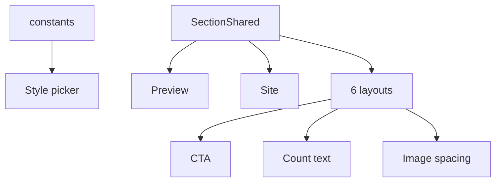

# I. Primer

## 1. TL;DR kiểu Feynman

- ProductCategories đã dùng shared runtime, nên sửa trong `ProductCategoriesSectionShared.tsx` là preview và site cùng đổi.
- Layout 1 sẽ bỏ dòng `x danh mục` ở header, thay bằng nút `View all` đi `/products`.
- Cả 6 layout sẽ có nút `View all` rõ ràng mở `/products`.
- Count sẽ thống nhất `x sản phẩm`, không còn `x` hoặc `x items`.
- 3 layout bị ảnh nhỏ do padding/margin nhiều sẽ giảm spacing để ảnh to hơn.
- Tên style trong picker đổi sang English gọn, không đổi `style id` để không phá dữ liệu cũ.

## 2. Elaboration & Self-Explanation

Hiện source of truth của 6 layout ProductCategories là `ProductCategoriesSectionShared.tsx`; cả create/edit preview và site đều gọi cùng component này. Vì vậy các vấn đề user nêu nên xử lý tại shared runtime để tránh preview đẹp nhưng site lệch.

Có 5 lỗi/chưa hoàn thiện:
1. Layout `grid` đang hiện `${items.length} danh mục` ở header. User muốn bỏ.
2. Chỉ layout `carousel` có link `Xem tất cả`; các layout còn lại thiếu CTA header.
3. Count trong `carousel` chỉ hiện số, layout `marquee` hiện `items`; cần thống nhất `x sản phẩm`.
4. `grid`, `marquee`, `circular` đang có padding/container làm ảnh nhỏ; cần giảm padding và tăng kích thước ảnh/frame.
5. Labels trong `PRODUCT_CATEGORIES_STYLES` đang tiếng Việt dài và một số nghe chưa ổn; đổi sang English ngắn.

## 3. Concrete Examples & Analogies

Ví dụ sau khi sửa:
- `grid` label trong style picker: `Circle Grid`.
- Header của `grid`: title/subtitle + nút `View all`, không còn `8 danh mục`.
- Count dưới category: `12 sản phẩm`.
- `marquee` không còn `12 items`, đổi thành `12 sản phẩm`.

Analogy: 6 layout là 6 kiểu trưng bày cùng một kệ hàng. Nút “View all” là biển chỉ đường chung; count là nhãn sản phẩm chung; spacing là khoảng đệm trong khung ảnh. Sửa ở shared runtime giống đổi quy chuẩn kệ, mọi nơi dùng kệ đó tự đồng bộ.

# II. Audit Summary (Tóm tắt kiểm tra)

## 1. Observation

- `ProductCategoriesSectionShared.tsx` là source render chung cho preview/site.
- `grid` đang render header action:
  - `showProductCount ? ${items.length} danh mục : previewCtaLabel`.
- `carousel` có `CategoryLink href={viewAllHref}` nhưng các layout khác phần lớn gọi `renderHeader()` không truyền CTA.
- Count inconsistency:
  - `grid`, `cards`, `minimal`, `circular`: `x sản phẩm`.
  - `carousel`: chỉ `{item.productCount}`.
  - `marquee`: `{item.productCount} items`.
- Spacing/image size cần chỉnh:
  - `grid`: ảnh frame `max-w-[96/120/132px]`, padding `p-3 md:p-4`.
  - `marquee`: tile `p-4 md:p-6`, image `h-20/w-20 md:h-24/w-24`.
  - `circular`: article `p-4 md:p-5`, image wrapper `p-2`, image `85%`.
- Style labels nằm ở `_lib/constants.ts`:
  - `Tròn tinh tế`, `Sách ngang`, `Ảnh phủ CTA`, `List gọn`, `Ô vuông tối giản`, `Grid premium`.

## 2. Inference

- Vì shared runtime đang được `ProductCategoriesPreview.tsx` và `ComponentRenderer.tsx` dùng chung, sửa một lần sẽ giữ parity.
- Không cần đổi config, type, Convex schema, create/edit save state.
- Không nên đổi style ids (`grid`, `carousel`, `cards`, `minimal`, `marquee`, `circular`) vì dữ liệu đã lưu đang phụ thuộc ids này.

## 3. Decision

- Tạo helper CTA nhỏ trong shared runtime, ví dụ `renderViewAllLink()`.
- Dùng helper đó trong header của cả 6 layout.
- Với `marquee` và `circular` vì có header custom, thêm CTA vào header custom thay vì ép dùng `renderHeader` nếu làm mất style.
- Đổi text CTA sang English gọn `View all`, nhưng href vẫn `/products`.
- Chỉ chỉnh spacing/image sizing đúng 3 layout user chỉ ra; không refactor toàn bộ.

# III. Root Cause & Counter-Hypothesis (Nguyên nhân gốc & Giả thuyết đối chứng)

Root Cause Confidence (Độ tin cậy nguyên nhân gốc): High.

Lý do:
- Evidence trong `ProductCategoriesSectionShared.tsx` cho thấy các layout có header/count/padding khác nhau.
- `PRODUCT_CATEGORIES_STYLES` hiện là nơi duy nhất định nghĩa label picker.
- Do preview/site cùng dùng shared runtime, nguyên nhân không nằm ở create/edit route riêng.

Counter-Hypothesis:
- “Sửa trong edit page cụ thể theo URL” bị loại vì sẽ chỉ fix admin edit, site vẫn lệch.
- “Đổi style id sang English” bị loại vì sẽ phá config cũ; chỉ đổi label hiển thị.
- “Tắt showProductCount toàn cục” bị loại vì user chỉ muốn bỏ `x danh mục` ở header layout 1, không bỏ count sản phẩm từng danh mục.

# IV. Proposal (Đề xuất)

## 1. Scope & impacted paths

Chỉ sửa ProductCategories home-component:
- `app/admin/home-components/product-categories/_components/ProductCategoriesSectionShared.tsx`
- `app/admin/home-components/product-categories/_lib/constants.ts`

Không cần sửa route URL cụ thể vì URL đó dùng cùng edit page + shared runtime.

## 2. Source of truth

| Surface | File | Contract cần giữ |
|---|---|---|
| Create | `create/product-categories/page.tsx` | Không đổi config/state |
| Edit | `[id]/edit/page.tsx` | Không đổi save/load |
| Preview | `ProductCategoriesPreview.tsx` | Vẫn truyền `viewAllHref` default `/products` qua shared runtime |
| Shared UI | `ProductCategoriesSectionShared.tsx` | Fix CTA/count/spacing cho 6 styles |
| Site | `ComponentRenderer.tsx` | Vẫn dùng shared runtime; CTA site là link `/products` |

Preview ↔ Site parity:
- Preview và site đều gọi `ProductCategoriesSectionShared`.
- `CategoryLink` hiện chỉ dùng Next `Link` khi `context === 'site'`; preview CTA sẽ là visual non-navigation div như pattern hiện tại, site CTA sẽ mở `/products`.
- `viewAllHref` default đã là `/products`, site đang truyền `/products` rõ ràng.

## 3. Ordered actions

1. Update labels English trong `_lib/constants.ts`:
   - `Circle Grid`
   - `Book Row`
   - `Cover Cards`
   - `Compact List`
   - `Square Grid`
   - `Premium Grid`

2. Trong `ProductCategoriesSectionShared.tsx`, thêm helper CTA:
   - `renderViewAllLink(className?)`
   - text: `View all`
   - href: `viewAllHref` default `/products`
   - có `ArrowRight` icon đang import sẵn nhưng chưa dùng.
   - dùng `type="button"` không cần vì là Link/div chứ không phải button.

3. Layout `grid`:
   - bỏ `${items.length} danh mục` hoàn toàn.
   - header action luôn là `View all`.
   - giảm padding ảnh từ `p-3 md:p-4` xuống khoảng `p-1.5 md:p-2`.
   - tăng max image frame từ `96/120/132` lên khoảng `112/140/156`.

4. Layout `carousel`:
   - giữ arrows.
   - CTA vẫn `View all`.
   - đổi count từ `{item.productCount}` sang `{item.productCount} sản phẩm`.

5. Layout `cards`:
   - thêm `View all` vào header qua `renderHeader(renderViewAllLink())`.
   - count đã đúng `x sản phẩm`, giữ nguyên.

6. Layout `minimal`:
   - thêm `View all` vào header qua `renderHeader(renderViewAllLink())`.
   - count đã đúng, giữ nguyên.

7. Layout `marquee`:
   - header custom thêm CTA `View all` ở cùng row, vẫn tôn trọng align title/subtitle.
   - đổi `{item.productCount} items` thành `{item.productCount} sản phẩm`.
   - giảm tile padding `p-4 md:p-6` xuống khoảng `p-2 md:p-3`.
   - tăng image `h-20/w-20 md:h-24/w-24` lên khoảng `h-24/w-24 md:h-32/w-32` hoặc `w-[70%] max-w...` để ảnh lớn hơn nhưng không vỡ.

8. Layout `circular` / Premium Grid:
   - header custom thêm CTA `View all`.
   - giảm outer panel padding `p-6 md:p-8` xuống khoảng `p-4 md:p-6`.
   - giảm card padding `p-4 md:p-5` xuống `p-2 md:p-3`.
   - bỏ/reduce image wrapper `p-2`, tăng image từ `85%` lên `95%` hoặc full wrapper.
   - count đã đúng, giữ nguyên.

# V. Files Impacted (Tệp bị ảnh hưởng)

## 1. UI runtime

- Sửa: `app/admin/home-components/product-categories/_components/ProductCategoriesSectionShared.tsx`  
  Vai trò hiện tại: render chung 6 layout cho preview và site.  
  Thay đổi: thêm CTA `View all` cho 6 layout, bỏ `x danh mục` header layout `grid`, thống nhất count `x sản phẩm`, giảm spacing/tăng ảnh cho `grid`, `marquee`, `circular`.

## 2. Constants

- Sửa: `app/admin/home-components/product-categories/_lib/constants.ts`  
  Vai trò hiện tại: label hiển thị trong style picker.  
  Thay đổi: đổi label sang English gọn, giữ nguyên `id` để tương thích dữ liệu cũ.

# VI. Execution Preview (Xem trước thực thi)

1. Chỉnh labels trong constants.
2. Thêm helper `renderViewAllLink` trong shared runtime.
3. Update header action cho `grid/carousel/cards/minimal`.
4. Update header custom cho `marquee/circular`.
5. Normalize count text trong `carousel/marquee`.
6. Reduce spacing/image padding trong `grid/marquee/circular`.
7. Static review parity preview/site, href `/products`, no config break.
8. Chạy `bunx tsc --noEmit` theo rule repo vì sửa TS/TSX.
9. Commit local, không push.

# VII. Verification Plan (Kế hoạch kiểm chứng)

- Static:
  - `bunx tsc --noEmit`.
  - Kiểm tra không đổi `ProductCategoriesStyle` union ids.
  - Kiểm tra không còn text `items` hoặc count-only trong ProductCategories runtime.
  - Kiểm tra layout `grid` không còn `${items.length} danh mục`.
- Manual đề xuất:
  - Mở edit URL user đưa, test 6 style trong preview.
  - Layout 1 không còn `x danh mục`, có `View all`.
  - 6 layout đều có `View all`.
  - Count tất cả là `x sản phẩm`.
  - Ảnh trong `Circle Grid`, `Square Grid`, `Premium Grid` to rõ hơn.
  - Site homepage CTA mở `/products`.

# VIII. Todo

1. Đổi labels style picker sang English.
2. Thêm shared CTA `View all`.
3. Fix header layout 1 bỏ `x danh mục`.
4. Thêm CTA cho đủ 6 layout.
5. Chuẩn hóa count text.
6. Giảm spacing/tăng ảnh ở 3 layout.
7. Typecheck và commit.

# IX. Acceptance Criteria (Tiêu chí chấp nhận)

- Layout 1 không còn hiển thị `x danh mục` ở header.
- Cả 6 layout có CTA `View all` trỏ `/products` ở site.
- Count từng danh mục thống nhất dạng `x sản phẩm`.
- Không còn `x items` hoặc count-only trong ProductCategories layout.
- `Circle Grid`, `Square Grid`, `Premium Grid` có ảnh lớn hơn do giảm padding/spacing.
- Style picker dùng English labels gọn, không còn `Tròn tinh tế`.
- Preview và site vẫn dùng chung runtime, không lệch.
- `bunx tsc --noEmit` pass.
- Có commit local, không push.

# X. Risk / Rollback (Rủi ro / Hoàn tác)

- Risk: CTA ở align center/right có thể cần wrap/stack trên mobile; sẽ giữ helper nhỏ và dùng flex responsive sẵn có.
- Risk: tăng ảnh quá mạnh có thể crop ảnh category xấu; sẽ ưu tiên giảm padding vừa phải, không đổi aspect ratio.
- Rollback: revert commit là đủ vì không đổi schema/data/config.

# XI. Out of Scope (Ngoài phạm vi)

- Không đổi color tokens.
- Không đổi style ids hoặc dữ liệu config đã lưu.
- Không thay đổi category item links (`/products?category=slug`).
- Không thêm setting bật/tắt CTA.

# XII. Open Questions (Câu hỏi mở)

Không có câu hỏi bắt buộc. Mặc định CTA label dùng English `View all` để đồng bộ với yêu cầu label English gọn; href site là `/products`.