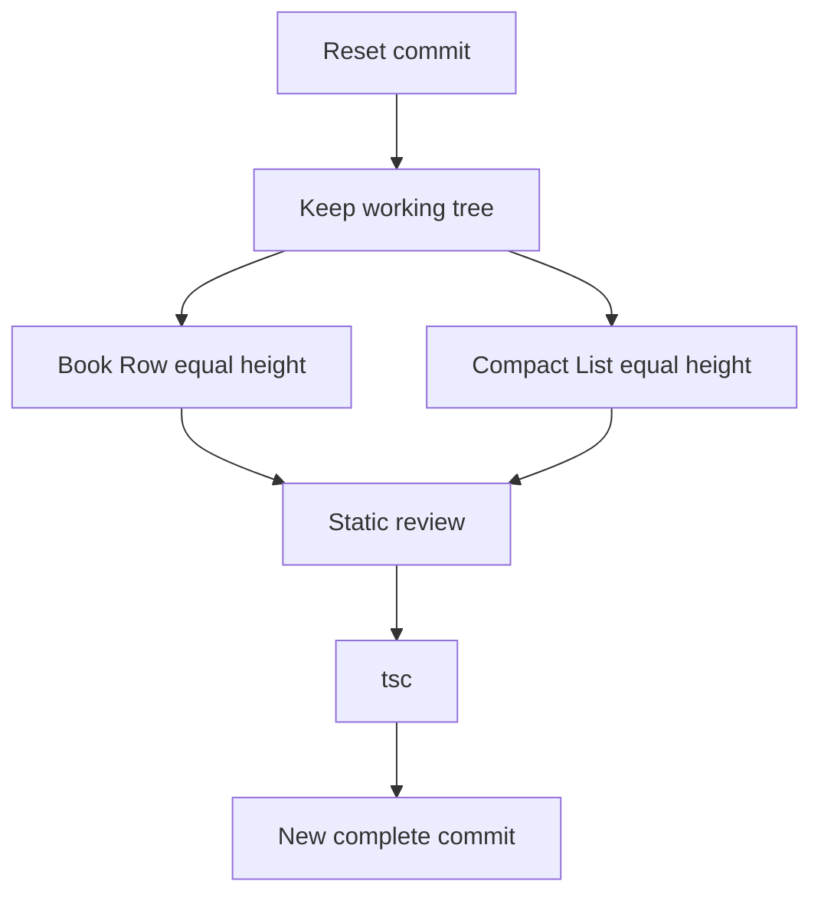

# I. Primer

## 1. TL;DR kiểu Feynman

- Sẽ **xóa commit cuối nhưng giữ nguyên code đang nằm trong working tree** bằng `git reset --soft/mixed HEAD~1` sau khi được approve.
- Lý do: commit hiện tại chưa đủ chuẩn vì Book Row và Compact List vẫn lệch chiều cao item, nên chưa nên để thành commit riêng.
- Không rollback code vừa sửa; giữ lại basis riêng cho Book Row/Cover Cards để tiếp tục hoàn thiện trên cùng working tree.
- Root cause mới: card con đang có `min-height`, nhưng hàng Embla không tạo một “chiều cao chung” cho tất cả slide; item có text dài hơn tự cao hơn item khác.
- Fix an toàn: đặt **min-height theo layout/device đủ lớn và đồng nhất**, thêm `w-full` cho Compact List, và làm vùng text/count co giãn có kiểm soát để mọi item trong cùng layout cao bằng nhau.

## 2. Elaboration & Self-Explanation

Ảnh mới cho thấy hai vấn đề còn lại:

- **Book Row**: item 1/2/4 cao hơn item 3 vì title xuống 2 dòng, trong khi item 3 title ngắn hơn. Dù `article` có `min-h-[220px]`, card vẫn được phép cao hơn nếu content cần thêm chỗ. Khi các card không cùng một chiều cao lock rõ ràng, row nhìn “bậc thang”.
- **Compact List**: item thứ 4 cao hơn vì title nhiều dòng hơn. Link root hiện có `min-h-[108px] md:min-h-[120px]`, nhưng không có `w-full` và không có min-height đủ cho worst-case text, nên card dài tự tăng chiều cao.

Điểm cần sửa không phải layout Square/Premium/Circle. Chỉ Book Row (`carousel`) và Compact List (`minimal`) cần equal-height contract (hợp đồng chiều cao đồng nhất) rõ hơn.

## 3. Concrete Examples & Analogies

Ví dụ Book Row trong screenshot:

- `WEB QUẢN LÝ` ngắn hơn, nên phần text cần ít chiều cao hơn.
- `GIỚI THIỆU SẢN PHẨM` dài hơn, card tự cao hơn.
- Nếu không đặt chiều cao chung đủ rộng cho title 2–3 dòng, hàng card sẽ giống các quyển sách đặt trên bàn nhưng mỗi quyển có chân đế cao thấp khác nhau.

Ví dụ Compact List:

- `Giới thiệu sản phẩm` xuống nhiều dòng hơn `Website bán hàng`, nên card thứ 4 cao hơn.
- Cần đặt card list đủ cao cho title nhiều dòng và count, thay vì để từng card tự nở riêng.

# II. Audit Summary (Tóm tắt kiểm tra)

## 1. Scope & impacted paths

Sửa dự kiến:

- `app/admin/home-components/product-categories/_components/ProductCategoriesSectionShared.tsx`

Git operation dự kiến:

- Xóa commit cuối `a03ac9a1 fix(product-categories): restore style-specific swipe sizing` nhưng giữ code trong working tree để hoàn thiện rồi commit lại một lần.

Spec/doc:

- Giữ spec doc đã được tạo ở `.factory/docs/2026-04-25-fix-productcategories-book-row-v-cover-cards-responsive-parity.md` trong working tree/stage sau reset.

## 2. Source of truth

- `ProductCategoriesSectionShared.tsx` vẫn là shared renderer cho preview và site thật.
- `ProductCategoriesPreview.tsx` không cần sửa vì chỉ truyền `context/device/style`.
- `ComponentRenderer.tsx` không cần sửa vì site dùng shared component.

## 3. Preview ↔ Site parity map

| Surface | File | Contract cần giữ |
|---|---|---|
| Preview | `ProductCategoriesPreview.tsx` | Không đổi, tiếp tục truyền `context='preview'` và `device` |
| Shared UI | `ProductCategoriesSectionShared.tsx` | Equal height theo layout, preview/site cùng dùng |
| Site | `ComponentRenderer.tsx` | Không fork logic site riêng |
| Git | latest commit | Bỏ commit chưa hoàn thiện, giữ code để commit lại sau khi đạt chuẩn |

## 4. Observation (Bằng chứng quan sát)

- Screenshot `183812`: Book Row desktop preview có card cao thấp khác nhau; item title ngắn thấp hơn item title dài.
- Screenshot `183822`: Compact List desktop preview item thứ 4 cao hơn rõ vì title/count chiếm nhiều dòng hơn.
- Code hiện tại:
  - Book Row `article`: `h-full min-h-[220px]`, phần text không có chiều cao ổn định.
  - Compact List `CategoryLink`: `h-full min-h-[108px] md:min-h-[120px]`, thiếu `w-full`, min-height chưa đủ cho title nhiều dòng.
- `Square Grid`, `Premium Grid`, `Circle Grid` không được user báo lỗi mới, nên không đổi logic của chúng.

# III. Root Cause & Counter-Hypothesis (Nguyên nhân gốc & Giả thuyết đối chứng)

## 1. Root Cause Confidence (Độ tin cậy nguyên nhân gốc)

**High.**

Lý do:

- Triệu chứng khớp trực tiếp với content-height: item có title dài cao hơn item title ngắn.
- Cả Book Row và Compact List đều đang dùng `min-height`, không phải fixed/equal layout height đủ rõ.
- `h-full` không tự giải quyết nếu parent/row không có chiều cao chung được xác định trước.

## 2. Trả lời 5/8 câu Audit bắt buộc

1. Triệu chứng expected vs actual:
   - Expected: mỗi item trong Book Row và Compact List cùng chiều cao trong cùng row.
   - Actual: item có title nhiều dòng cao hơn item title ngắn.

3. Tái hiện tối thiểu:
   - Mở preview desktop Book Row/Compact List với các danh mục có title dài ngắn khác nhau.

5. Dữ liệu thiếu:
   - Chưa có measurement DOM chính xác từng card; nhưng screenshot đủ evidence cho content-height mismatch.

6. Giả thuyết thay thế:
   - Embla offset chỉ làm item bị cắt/scroll lệch, không giải thích card cùng hàng cao thấp khác nhau.
   - Ảnh khác ratio ở Book Row có thể ảnh hưởng vùng ảnh, nhưng screenshot Compact List không phụ thuộc ảnh ratio vẫn lệch, nên gốc là content/card height.

8. Tiêu chí pass/fail:
   - Pass khi Book Row và Compact List desktop/tablet/mobile không còn card cao thấp rõ trong cùng row; Cover Cards vẫn giữ fix width/gap; Square/Premium/Circle không đổi visual.

# IV. Proposal (Đề xuất)

## 1. Git step: xóa commit nhưng giữ code

Sau khi approve:

```bash
git reset --soft HEAD~1
```

Hoặc nếu cần giữ code unstaged để review dễ hơn:

```bash
git reset HEAD~1
```

Khuyến nghị dùng `git reset HEAD~1` vì user muốn “xóa commit không xóa code”; cách này bỏ commit cuối, giữ toàn bộ thay đổi trong working tree, dễ tiếp tục chỉnh và commit lại sau.

## 2. Book Row equal-height contract

Trong branch `style === 'carousel'`:

- Giữ basis riêng đã thêm.
- Thêm class full width đã có: `w-full` ở link/article.
- Đổi `article` từ chỉ `min-h-[220px]` sang min-height theo breakpoint đủ chứa title dài:
  - mobile: khoảng `min-h-[236px]`
  - tablet/desktop: khoảng `md:min-h-[284px]` hoặc dùng height cụ thể nếu cần.
- Làm phần body text có vùng ổn định:
  - body: `flex min-h-[92px] flex-col justify-center` hoặc `justify-start` tùy visual.
  - title: `min-h-[2.5rem]` hoặc `line-clamp-2/3` nếu repo có plugin; không thêm plugin mới.

Ưu tiên không dùng `line-clamp` nếu chưa chắc plugin; dùng `min-h` thuần Tailwind arbitrary class an toàn hơn.

## 3. Compact List equal-height contract

Trong branch `style === 'minimal'`:

- Thêm `w-full` vào `CategoryLink` root.
- Tăng min-height để item dài không tự nở riêng:
  - mobile/tablet/desktop: `min-h-[132px] md:min-h-[144px]` hoặc tương đương.
- Đổi layout text để count nằm ổn định:
  - root: `items-center`
  - text wrapper: `flex min-h-[88px] flex-1 flex-col justify-center`
  - title: `min-h-[3.25rem]` cho tối đa nhiều dòng trong screenshot.
- Giữ image/icon size hiện tại để không phá visual.

## 4. Không chạm các layout đang ổn

Không đổi branch:

- `style === 'grid'` / Circle Grid
- `style === 'marquee'` / Square Grid
- fallback `circular` / Premium Grid

Chỉ nếu cần truyền style qua `renderSwipeRow` đã có từ commit trước thì giữ nguyên, không mở rộng thêm.



# V. Files Impacted (Tệp bị ảnh hưởng)

- Sửa: `app/admin/home-components/product-categories/_components/ProductCategoriesSectionShared.tsx`  
  Vai trò hiện tại: render 6 layout Product Categories cho preview và site.  
  Thay đổi: giữ sizing riêng đã thêm, bổ sung equal-height cho Book Row và Compact List bằng `w-full`, min-height theo breakpoint, và vùng text ổn định.

- Git: commit `a03ac9a1`  
  Vai trò hiện tại: commit chưa hoàn thiện.  
  Thay đổi: reset commit khỏi history local nhưng giữ toàn bộ code để tiếp tục hoàn thiện rồi commit lại.

# VI. Execution Preview (Xem trước thực thi)

1. Chạy `git reset HEAD~1` để bỏ commit cuối nhưng giữ code/spec trong working tree.
2. Patch `ProductCategoriesSectionShared.tsx`:
   - Book Row: tăng/ổn định min-height, body/title height.
   - Compact List: thêm `w-full`, tăng/ổn định min-height, text wrapper/title height.
3. Rà tĩnh đảm bảo `grid/marquee/circular` không bị chỉnh thêm.
4. Chạy `bunx tsc --noEmit` vì có đổi TS/TSX.
5. Review `git diff` + `git diff --cached` trước commit, kiểm tra không có secrets.
6. Commit lại một commit hoàn thiện, không push.

# VII. Verification Plan (Kế hoạch kiểm chứng)

## 1. Static verification (Kiểm chứng tĩnh)

- `ProductCategoriesSectionShared.tsx` không còn chỉ dựa vào `h-full + min-h thấp` cho Book Row/Compact List.
- Book Row có body/title min-height ổn định.
- Compact List có `w-full` và text area min-height ổn định.
- Không sửa visual class của Circle Grid/Square Grid/Premium Grid ngoài phần renderSwipeRow style parameter đã có.

## 2. Type verification (Kiểm chứng type)

- Chạy `bunx tsc --noEmit` sau khi sửa.
- Không chạy lint/unit test/build theo AGENTS.md.

## 3. Manual verification (Kiểm chứng trực quan)

- Book Row desktop: 4 item trong screenshot cao đều.
- Book Row tablet: item cao đều.
- Book Row mobile: không xấu đi.
- Compact List desktop: item thứ 4 không cao hơn item còn lại.
- Compact List tablet/mobile: item cùng row cao đều, không overflow text.
- Cover Cards tablet vẫn đều gap/width.
- Square Grid, Premium Grid, Circle Grid vẫn ổn.

# VIII. Todo

1. Reset bỏ commit cuối nhưng giữ code.
2. Sửa Book Row equal-height.
3. Sửa Compact List equal-height.
4. Rà tĩnh không ảnh hưởng layout đang ổn.
5. Chạy `bunx tsc --noEmit`.
6. Commit lại bản hoàn thiện, không push.

# IX. Acceptance Criteria (Tiêu chí chấp nhận)

- Commit `a03ac9a1` không còn là HEAD/history mới nhất sau reset.
- Code từ commit cũ không bị mất, tiếp tục nằm trong working tree và được hoàn thiện.
- Book Row các item cùng hàng cân bằng chiều cao ở desktop/tablet.
- Compact List các item cùng hàng cân bằng chiều cao ở desktop/tablet.
- Cover Cards không bị rollback fix width/gap đã làm.
- Circle Grid, Square Grid, Premium Grid không bị phá.
- `bunx tsc --noEmit` pass.
- Có một commit local mới hoàn thiện hơn, không push.

# X. Risk / Rollback (Rủi ro / Hoàn tác)

- Risk: tăng min-height có thể làm Book Row/Compact List thoáng hơn trước một chút, nhưng đổi này trực tiếp phục vụ equal-height.
- Risk: title quá dài bất thường vẫn có thể làm card nở; nếu cần bước sau mới cân nhắc clamp text.
- Rollback: revert commit mới hoặc reset về `54b90a9d` nếu muốn quay về trước toàn bộ thay đổi.

# XI. Out of Scope (Ngoài phạm vi)

- Không sửa dữ liệu danh mục.
- Không đổi Cover Cards ngoài giữ fix hiện tại.
- Không redesign toàn bộ Product Categories.
- Không sửa route create/edit/config.

# XII. Open Questions (Câu hỏi mở)

Không có câu hỏi bắt buộc. Yêu cầu của user rõ: bỏ commit nhưng giữ code, rồi hoàn thiện trước khi commit lại.