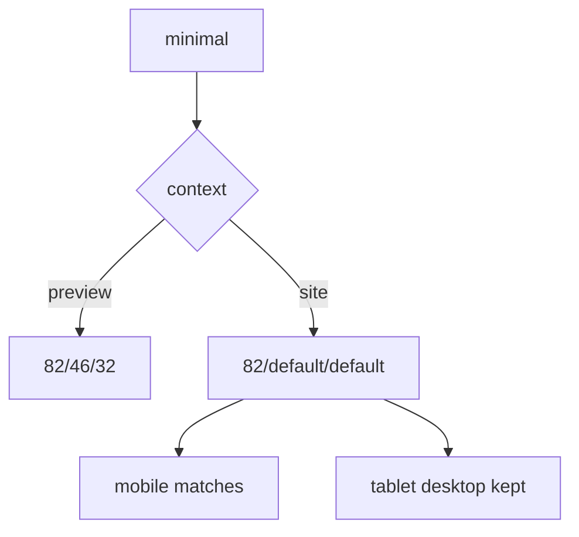

# I. Primer

## 1. TL;DR kiểu Feynman

- Root cause mới: để cứu preview mobile, `minimal` đang có basis `82%` trong preview-only; nhưng site mobile lại fallback về default `40%`.
- Vì vậy preview mobile đúng, còn site mobile khác preview.
- Lần trước site sai vì áp `82% / 46% / 32%` cho cả site mobile/tablet/desktop; fix mới sẽ **chỉ áp mobile site = 82%**, còn tablet/desktop site giữ default cũ.
- Không commit sau khi sửa; chỉ để working tree cho bạn check.
- Không đụng Square Grid border preview, Cover Cards, Book Row, Premium Grid, Circle Grid.

## 2. Elaboration & Self-Explanation

Hiện code chọn slide width bằng `getSlideClassName(currentStyle)`:

- `context === 'preview'`: ưu tiên `PREVIEW_ONLY_SLIDE_BASIS_CLASSNAMES`.
- `context === 'site'`: dùng `STYLE_SLIDE_BASIS_CLASSNAMES` hoặc default.

Sau fix gần nhất, `minimal` chỉ nằm trong preview-only:

```ts
minimal: {
  mobile: 'basis-[82%]',
  tablet: 'basis-[46%]',
  desktop: 'basis-[32%]',
}
```

Nên:

- Preview mobile Compact List dùng `basis-[82%]` → đúng.
- Site mobile Compact List dùng default `basis-[40%]` → khác preview và dễ bóp layout.

Nhưng không nên đưa cả `minimal` trở lại map chung, vì lần trước site tablet/desktop cũng nhận `46% / 32%` và bị sai. Cách đúng là thêm một override riêng cho site chỉ ở breakpoint mobile.

## 3. Concrete Examples & Analogies

Ví dụ:

- Mobile preview width 375px, `basis-[82%]` → card khoảng 307px, title đọc được.
- Mobile site nếu dùng `basis-[40%]` → card khoảng 150px, text bị bóp và khác preview.
- Tablet/desktop site vẫn nên dùng default `28.571% / 18.181%` vì user đã báo site trước đó ổn.

Analogy: preview mobile cần “cỡ thẻ lớn” để chữ đọc được; site mobile cũng cần cùng cỡ thẻ đó. Nhưng tablet/desktop không cần cỡ lớn, nếu áp theo sẽ làm thẻ phình sai.

# II. Audit Summary (Tóm tắt kiểm tra)

## 1. Scope & impacted paths

Sửa dự kiến:

- `app/admin/home-components/product-categories/_components/ProductCategoriesSectionShared.tsx`

Không sửa:

- `ProductCategoriesPreview.tsx`
- `components/site/ComponentRenderer.tsx`
- data/config/Convex

Không commit sau khi sửa.

## 2. Source of truth

- `ProductCategoriesSectionShared.tsx` là shared renderer cho preview và site.
- `ProductCategoriesPreview.tsx` truyền `context="preview"` và `device="mobile"` khi chọn mobile preview.
- `ComponentRenderer.tsx` truyền `context="site"` và tự set `device` theo `window.innerWidth`.
- Compact List style key là `minimal`.

## 3. Preview ↔ Site parity map

| Surface | Hiện tại | Mong muốn |
|---|---|---|
| Preview mobile Compact List | `basis-[82%]`, đúng | Giữ nguyên |
| Site mobile Compact List | default `basis-[40%]`, khác preview | Đổi thành `basis-[82%]` |
| Site tablet Compact List | default `basis-[28.571%]`, site ổn hơn | Giữ default |
| Site desktop Compact List | default `basis-[18.181%]`, site ổn hơn | Giữ default |

## 4. Observation (Bằng chứng quan sát)

- User xác nhận: “preview mới đúng”, “mobile site thực đang khác mobile preview”.
- Code hiện tại có `PREVIEW_ONLY_SLIDE_BASIS_CLASSNAMES.minimal.mobile = basis-[82%]`.
- Site branch không đọc `PREVIEW_ONLY_SLIDE_BASIS_CLASSNAMES`, nên `minimal` site fallback default mobile `basis-[40%]`.
- Lần áp `minimal` chung cho site đã làm site sai, nên cần override mobile-only thay vì style-wide.

# III. Root Cause & Counter-Hypothesis (Nguyên nhân gốc & Giả thuyết đối chứng)

## 1. Root Cause Confidence (Độ tin cậy nguyên nhân gốc)

**High.**

Lý do:

- Mobile preview đúng nhờ `basis-[82%]`.
- Mobile site khác vì không nhận basis này.
- Code path preview/site rõ ràng tách theo `context`.

## 2. Trả lời 5/8 câu Audit bắt buộc

1. Triệu chứng expected vs actual:
   - Expected: Compact List mobile site giống mobile preview đúng.
   - Actual: preview đúng nhưng mobile site khác do width basis khác.

3. Tái hiện tối thiểu:
   - Chọn Compact List trong Product Categories, so sánh preview mobile với site thật ở viewport `<768px`.

5. Dữ liệu thiếu:
   - Chưa có screenshot site mobile mới, nhưng user xác nhận khác biệt và code basis giải thích trực tiếp.

6. Giả thuyết thay thế:
   - `window.innerWidth` detect sai: ít khả năng nếu viewport thật đang mobile.
   - CSS wrapper site khác preview: có thể ảnh hưởng, nhưng khác biệt basis `40%` vs `82%` là nguyên nhân chính đủ mạnh.

8. Tiêu chí pass/fail:
   - Pass khi site mobile Compact List dùng same basis `82%` như preview mobile, còn tablet/desktop site không bị phình lại.

# IV. Proposal (Đề xuất)

## 1. Thêm site mobile-only basis override

Thêm map mới:

```ts
const SITE_MOBILE_SLIDE_BASIS_CLASSNAMES: Partial<Record<ProductCategoriesStyle, string>> = {
  minimal: 'basis-[82%]',
};
```

Hoặc dùng map full device nhưng chỉ override mobile:

```ts
const SITE_SLIDE_BASIS_CLASSNAMES: Partial<Record<ProductCategoriesStyle, Record<ProductCategoriesDevice, string>>> = {
  minimal: {
    mobile: 'basis-[82%]',
    tablet: DEFAULT_SLIDE_BASIS_CLASSNAMES.tablet,
    desktop: DEFAULT_SLIDE_BASIS_CLASSNAMES.desktop,
  },
};
```

Khuyến nghị option 2 vì giữ cùng shape `Record<ProductCategoriesDevice, string>`, ít logic đặc biệt hơn.

## 2. Cập nhật resolver theo context

Logic mới:

```ts
const classNames = context === 'preview'
  ? PREVIEW_ONLY_SLIDE_BASIS_CLASSNAMES[currentStyle]
    ?? STYLE_SLIDE_BASIS_CLASSNAMES[currentStyle]
    ?? DEFAULT_SLIDE_BASIS_CLASSNAMES
  : SITE_SLIDE_BASIS_CLASSNAMES[currentStyle]
    ?? STYLE_SLIDE_BASIS_CLASSNAMES[currentStyle]
    ?? DEFAULT_SLIDE_BASIS_CLASSNAMES;
```

Với `minimal` site, class output sẽ là:

```ts
basis-[82%] md:basis-[28.571%] lg:basis-[18.181%]
```

Nghĩa là:

- mobile site giống preview đúng,
- tablet/desktop site quay về default.

## 3. Không sửa thêm layout khác

Giữ nguyên:

- `carousel` và `cards` trong style-wide map.
- `minimal` preview-only map.
- Square Grid preview no-border wrapper.
- Equal-height classes hiện tại.

## 4. Không commit

Sau khi sửa:

- chạy `bunx tsc --noEmit`,
- báo diff/status,
- dừng để user check.



# V. Files Impacted (Tệp bị ảnh hưởng)

- Sửa: `app/admin/home-components/product-categories/_components/ProductCategoriesSectionShared.tsx`  
  Vai trò hiện tại: shared renderer và resolver slide width cho Product Categories.  
  Thay đổi: thêm site-specific basis cho `minimal` để mobile site giống preview, nhưng tablet/desktop site vẫn giữ default.

# VI. Execution Preview (Xem trước thực thi)

1. Thêm `SITE_SLIDE_BASIS_CLASSNAMES` chứa `minimal` mobile `82%`, tablet/desktop default.
2. Cập nhật `getSlideClassName` để site ưu tiên `SITE_SLIDE_BASIS_CLASSNAMES` trước style-wide/default.
3. Không sửa `ProductCategoriesPreview.tsx` hoặc `ComponentRenderer.tsx`.
4. Chạy `bunx tsc --noEmit`.
5. Báo `git status` + diff summary.
6. Dừng, không commit.

# VII. Verification Plan (Kế hoạch kiểm chứng)

## 1. Static verification (Kiểm chứng tĩnh)

- Site `minimal` output có mobile `basis-[82%]`.
- Site `minimal` tablet/desktop vẫn là default `md:basis-[28.571%] lg:basis-[18.181%]`.
- Preview `minimal` vẫn `82% / 46% / 32%`.
- Không đổi các style khác.

## 2. Type verification (Kiểm chứng type)

- Chạy `bunx tsc --noEmit`.
- Không chạy lint/unit test/build theo AGENTS.md.

## 3. Manual verification (Kiểm chứng trực quan)

- Mobile site Compact List giống preview mobile đúng.
- Tablet/desktop site Compact List không phình sai như lần trước.
- Preview mobile vẫn đúng.
- Square Grid preview vẫn không có border ngoài.

# VIII. Todo

1. Thêm site mobile-only basis cho `minimal`.
2. Cập nhật resolver context.
3. Chạy `bunx tsc --noEmit`.
4. Báo status/diff.
5. Không commit.

# IX. Acceptance Criteria (Tiêu chí chấp nhận)

- Mobile site Compact List dùng `basis-[82%]` như preview mobile.
- Tablet/desktop site Compact List vẫn dùng default basis.
- Preview Compact List không bị rollback.
- Không commit khi user chưa duyệt.
- `bunx tsc --noEmit` pass.

# X. Risk / Rollback (Rủi ro / Hoàn tác)

- Risk: nếu mobile site container khác preview nhiều hơn dự đoán, vẫn có thể cần tinh chỉnh `82%` nhẹ; nhưng preview đã được xác nhận đúng nên đây là baseline tốt nhất.
- Rollback: xóa `SITE_SLIDE_BASIS_CLASSNAMES.minimal` và resolver branch site.

# XI. Out of Scope (Ngoài phạm vi)

- Không commit.
- Không sửa dữ liệu/config.
- Không sửa layout khác.
- Không đổi preview wrapper.

# XII. Open Questions (Câu hỏi mở)

Không có câu hỏi bắt buộc. Hướng fix rõ: site mobile của `minimal` cần dùng cùng mobile basis với preview, nhưng không kéo theo tablet/desktop.