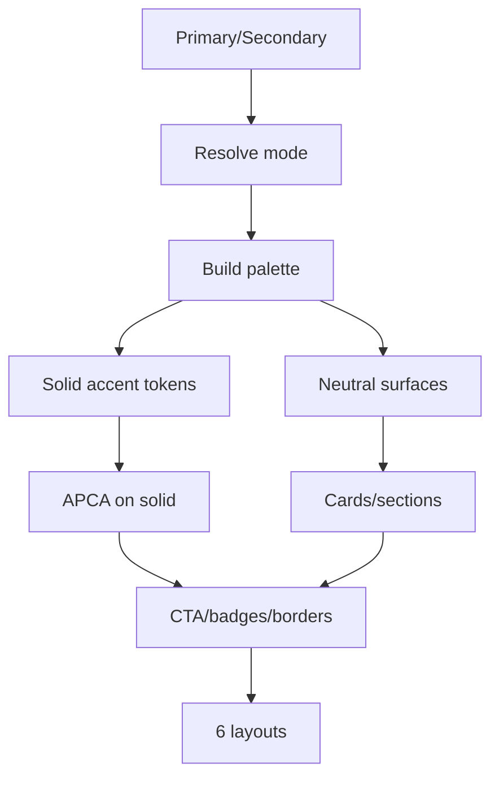

# I. Primer

## 1. TL;DR kiểu Feynman

- Yêu cầu mới là đổi “cách phối màu”, không đổi cấu trúc 6 layout.
- Hiện token ProductCategories vẫn dùng nhiều tint/opacity như `primary 0.08`, `secondary 0.16`, shadow tint nên màu nhìn nhạt.
- Hướng mới: dùng primary/secondary solid đúng màu hơn, đặt cạnh trắng/đen/neutral rõ ràng để tạo Modern + High Contrast Accent như ảnh user gửi.
- Text, border, CTA vẫn đi qua công thức APCA/OKLCH để đọc được, nhưng accent không bị “pha loãng” quá nhiều.
- Áp dụng chung cho create/edit preview và site vì 6 layout đã dùng shared runtime.

## 2. Elaboration & Self-Explanation

Sau commit trước, ProductCategories đã có shared runtime `ProductCategoriesSectionShared.tsx`, nghĩa là create, edit và site đều dùng cùng một bộ layout. Vì vậy muốn chỉnh cả 6 layout theo style high contrast thì trọng tâm là `_lib/colors.ts` và vài chỗ đang dùng màu nhạt trong `ProductCategoriesSectionShared.tsx`.

Hiện tại `getProductCategoriesColors(...)` vẫn sinh nhiều màu kiểu soft/tint: `iconContainerBg`, `pillBg`, `secondaryMuted`, `showcaseBackground`, `cardShadow`, `cardBorder` dựa trên OKLCH alpha/opacity. Điều này đúng với phong cách mềm, nhưng không đúng với yêu cầu “dùng đúng màu chính/phụ luôn, đứng gần trắng/đen rõ hơn”.

Cách xử lý là tái phân phối token theo nguyên tắc Color Adjacency Rule (Quy tắc đặt màu cạnh nhau): màu solid primary/secondary sẽ đứng cạnh nền neutral trắng/đen, không đặt primary solid trên primary tint. Nền/card vẫn ưu tiên trắng hoặc đen/near-black; accent line, CTA, button, border active dùng solid primary/secondary. Text trên nền solid chọn tự động bằng APCA.

## 3. Concrete Examples & Analogies

Ví dụ cụ thể: layout `cards` hiện có overlay gradient đen + CTA primary solid, nhưng count text vẫn white opacity và vài phần khác soft. Sau chỉnh, CTA sẽ dùng `primary.solid`, text CTA dùng `primary.textOnSolid`, overlay dùng một token dark rõ ràng, không opacity decorative nhiều lớp. Layout `minimal` hiện dùng `secondaryMuted` làm nền icon tròn; sẽ đổi thành nền trắng/đen neutral + icon primary/secondary solid, hoặc icon container solid primary với text/icon on-solid nếu cần nổi bật.

Analogy: trước đây màu giống mực cam pha nhiều nước nên an toàn nhưng nhạt. Lần này dùng mực nguyên màu cho các điểm nhấn, nhưng đặt lên giấy trắng/đen phù hợp để nhìn sắc và rõ, không bị chói hoặc mất chữ.

# II. Audit Summary (Tóm tắt kiểm tra)

Observation:
- User muốn “High Contrast Color Scheme hơn”, “Modern + High Contrast Accent”, lấy cảm hứng từ ảnh web có nền trắng/đen và accent cam/đen rõ.
- Route cần áp dụng: `/admin/home-components/product-categories/js7fb7t74xm1tdsthfaweyk82985h7wc/edit` và create route.
- ProductCategories hiện đã có shared runtime:
  - `app/admin/home-components/product-categories/_components/ProductCategoriesSectionShared.tsx`
  - `app/admin/home-components/product-categories/_components/ProductCategoriesPreview.tsx`
  - `components/site/ComponentRenderer.tsx` gọi shared runtime.
- Color helper hiện tại:
  - `app/admin/home-components/product-categories/_lib/colors.ts`
  - Có OKLCH + APCA, nhưng nhiều token đang soft/tint/opacity: `toOklchString(primary, 0.08/0.15)`, `secondaryMuted`, `showcaseBackground`, `cardShadow`.
- Skill `dual-brand-color-system` nhấn mạnh:
  - Single mode: secondary resolve về primary.
  - Site và preview phải dùng cùng helper.
  - Solid primary/secondary nên đứng cạnh neutral, không trên tint cùng family.
  - Text trên solid phải APCA-safe.

Inference:
- Không cần hỏi thêm vì hướng user mô tả khá rõ: tăng contrast và dùng màu solid mạnh hơn, vẫn giữ token system.
- Không nên đổi schema/config/layout id.
- Nên đổi ở token + mapping layout, không hardcode màu cam/đen cụ thể từ ảnh, vì repo phải theo primary/secondary dynamic.

Decision:
- Áp dụng high contrast bằng `getProductCategoriesColors(...)` + shared runtime, không thêm UI config mới.
- Giữ single/dual behavior hiện có.
- Giảm/loại bỏ decorative opacity/shadow nhạt; ưu tiên neutral surfaces + solid accent.

# III. Root Cause & Counter-Hypothesis (Nguyên nhân gốc & Giả thuyết đối chứng)

Root Cause Confidence (Độ tin cậy nguyên nhân gốc): High.

Lý do:
- Evidence trong `colors.ts`: nhiều token đang tạo bằng alpha/opacity từ primary/secondary, làm màu nhạt.
- Evidence trong shared runtime: card borders, icon bg, list icon bg, showcase bg đang dùng các token nhạt đó.
- User mô tả đúng điểm đau: “thay vì dùng màu nhạt của màu chính hoặc phụ thì dùng đúng màu đó luôn”.

Trả lời Audit Protocol:
1. Triệu chứng expected vs actual:
   - Expected: 6 layout có contrast mạnh, accent rõ, primary/secondary solid gần trắng/đen hợp lý.
   - Actual: hệ màu hiện tại thiên soft tint, pastel/nhạt.
2. Phạm vi ảnh hưởng:
   - ProductCategories create/edit preview và homepage/site render.
3. Tái hiện tối thiểu:
   - Mở edit route user đưa, chọn 6 style; quan sát nhiều vùng accent/border/nền vẫn nhạt.
4. Mốc thay đổi gần nhất:
   - Commit `c5c692fe` thay 6 layout và thêm shared runtime.
5. Dữ liệu thiếu:
   - Chưa có palette exact từ ảnh, nhưng không cần vì phải dùng token dynamic primary/secondary.
6. Giả thuyết thay thế:
   - Có thể hardcode cam/đen giống ảnh. Bị loại vì vi phạm dual/single token system và sẽ không theo brand settings.
7. Rủi ro nếu fix sai:
   - Quá nhiều solid color gây chói, giảm premium feel; text có thể fail contrast nếu không APCA guard.
8. Tiêu chí pass/fail:
   - 6 layout nhìn rõ hơn, CTA/accent/border active dùng màu solid; text trên solid đọc được; create/edit/site parity.

# IV. Proposal (Đề xuất)

## 1. Scope & impacted paths

Áp dụng Modern + High Contrast Accent cho ProductCategories:
- Edit route user đưa: `/admin/home-components/product-categories/js7fb7t74xm1tdsthfaweyk82985h7wc/edit`
- Create route: `/admin/home-components/create/product-categories`
- Site renderer qua shared runtime.

## 2. Source of truth

- `getProductCategoriesColors(...)` là source màu duy nhất.
- `ProductCategoriesSectionShared.tsx` là source layout/mapping màu duy nhất.
- Create/edit chỉ truyền primary/secondary/mode từ hệ thống hiện có.

## 3. Color strategy mới

Legend: APCA = công thức chọn màu chữ đủ contrast.

Nguyên tắc:
- Primary solid: heading, CTA chính, underline, active marker, key border.
- Secondary solid: count/data label, secondary border/line, nav arrow/icon hoặc accent phụ ở dual mode.
- Neutral white/near-black: card background, section background, text area, image container.
- Không dùng primary/secondary alpha làm nền chính cho accent nữa.
- Nếu cần nền đậm: dùng `primary.solid` hoặc `secondary.solid` và text `textOnSolid`.
- Nếu cần nền nhẹ: dùng neutral `#ffffff`, `#f8fafc`, `#0f172a`, không dùng tint cùng family.

## 4. Token changes dự kiến

Sửa `ProductCategoriesColors` theo hướng semantic high contrast:
- Giữ token cũ để ít diff, nhưng đổi value:
  - `cardBorder`: neutral dark/light rõ hơn hoặc primary/secondary solid theo layout.
  - `cardBorderHover`: primary solid.
  - `sectionBg`: neutral white hoặc near-black theo layout usage, không tint brand.
  - `linkText`: primary solid hoặc secondary solid tùy mode.
  - `productCountText`: secondary solid trong dual, primary solid trong single.
  - `iconContainerBg`: neutral surface hoặc primary solid tùy usage; nếu solid thì icon/text dùng APCA.
  - `pillBg`: neutral surface, không `${primary}08`.
  - `pillBorder`: secondary solid hoặc primary solid, không alpha.
  - `secondaryMuted`: đổi thành neutral surface/solid accent token rõ, không alpha.
  - `showcaseBackground`: neutral near-white/near-black, không brand tint.
  - `showcaseBorder`: primary/secondary solid.
- Thêm token nếu cần để tránh lạm dụng token cũ sai nghĩa:
  - `darkSurface`, `darkText`, `solidAccentText`, `secondaryTextOnSolid`, `neutralInverse`.

## 5. Layout-level application cho 6 style

| Style | Hiện trạng màu | Đổi sang high contrast |
|---|---|---|
| `grid` Tròn tinh tế | border/shadow tint nhẹ | vòng/card nền trắng, border primary/secondary solid mảnh, heading primary solid, count secondary solid |
| `carousel` Sách ngang | card trắng + border nhạt | card trắng viền neutral rõ, top/bottom divider secondary solid, arrow border primary/secondary solid |
| `cards` Ảnh phủ CTA | overlay đen + CTA primary | giữ đen/trắng rõ, CTA primary solid, count/badge secondary solid nếu dual |
| `minimal` List gọn | icon bg secondaryMuted nhạt | icon chip solid primary/secondary hoặc neutral trắng với icon solid; card border secondary solid rõ hơn |
| `marquee` Ô vuông tối giản | grid bg slate nhạt | border grid neutral rõ, underline primary solid, hover dùng border/label primary solid không tint |
| `circular` Grid premium | showcase bg tint nhạt + shadow | section nền neutral rõ, border-left primary solid, card border secondary/neutral, count secondary solid |

## 6. Files Impacted (Tệp bị ảnh hưởng)

- Sửa: `app/admin/home-components/product-categories/_lib/colors.ts`  
  Vai trò hiện tại: sinh palette OKLCH/APCA và semantic tokens.  
  Thay đổi: tái phối token theo high contrast, giảm tint/opacity decorative, thêm/đổi token APCA cho solid surfaces.

- Sửa: `app/admin/home-components/product-categories/_components/ProductCategoriesSectionShared.tsx`  
  Vai trò hiện tại: render 6 layout chung cho preview/site.  
  Thay đổi: map lại token vào 6 layout: CTA, count, border, underline, icon container, dark/white surfaces.

- Có thể sửa nhỏ: `app/admin/home-components/product-categories/_components/ProductCategoriesPreview.tsx`  
  Vai trò hiện tại: wrapper preview + ColorInfoPanel.  
  Thay đổi: không cần nếu shared runtime đủ; chỉ chỉnh hint nếu cần nói rõ high contrast.

- Không sửa dự kiến: create/edit pages, types, constants, schema.

# VI. Execution Preview (Xem trước thực thi)

1. Đổi `colors.ts`: tạo token high contrast bằng primary/secondary solid + neutral surfaces + APCA text.
2. Update `ProductCategoriesSectionShared.tsx`: thay các vùng đang dùng token nhạt thành token high contrast đúng vai trò.
3. Rà 6 style để không còn `${color}/alpha` decorative hoặc shadow đậm AI-styling không cần thiết.
4. Giữ shared runtime nên create/edit/site tự nhận màu mới.
5. Static self-review: text on solid, border/token mapping, single/dual parity, không đổi config.
6. Theo project rule sau khi implement: chỉ chạy `bunx tsc --noEmit` vì có thay đổi TS/code; không chạy lint/unit test/build.
7. Commit local, không push.

# VII. Verification Plan (Kế hoạch kiểm chứng)

Static verification:
- `bunx tsc --noEmit` sau khi sửa code.
- Kiểm tra `getProductCategoriesColors` không truyền hex trực tiếp vào APCA sai cách.
- Kiểm tra single mode: secondary resolve về primary, không cần secondary riêng.
- Kiểm tra dual mode: primary/secondary đều xuất hiện rõ trong 6 layout.
- Kiểm tra không đổi schema/config/style id.

Manual verification đề xuất:
- Mở edit route user đưa.
- Test cả 6 layout ở Desktop/Tablet/Mobile preview.
- Test create route cùng 6 layout.
- Đổi primary/secondary: ví dụ cam + đen, xanh + cam, single cam.
- Kiểm tra chữ trên button/badge solid đọc rõ, không bị cam trên cam nhạt.
- Kiểm tra homepage/site thật nếu component active.

# VIII. Todo

1. Tái phối token ProductCategories sang high contrast.
2. Áp token mới vào 6 layout shared runtime.
3. Review single/dual color parity và APCA text.
4. Chạy `bunx tsc --noEmit`.
5. Commit local, không push.

# IX. Acceptance Criteria (Tiêu chí chấp nhận)

- 6 layout ProductCategories có accent rõ hơn theo Modern + High Contrast Accent.
- Primary/secondary solid được dùng ở điểm nhấn chính/phụ, không bị pha nhạt quá mức.
- Màu solid đứng cạnh trắng/đen/neutral hợp lý, không primary-on-primary-tint.
- Text trên CTA/badge/solid surface tự chọn màu đọc được bằng APCA.
- Single mode vẫn monochromatic đúng: secondary resolve về primary.
- Dual mode thể hiện rõ cả primary và secondary.
- Create/edit preview và site vẫn parity vì dùng shared runtime.
- Không đổi dữ liệu, schema, style id, route.
- Typecheck pass.

# X. Risk / Rollback (Rủi ro / Hoàn tác)

Rủi ro:
- Nếu dùng quá nhiều solid accent, UI có thể hơi gắt; sẽ giới hạn solid ở CTA, border active, label/count và accent lines.
- Một số brand color quá sáng có thể cần APCA fallback text màu đen thay vì trắng.
- Ảnh nền tối trong layout cards cần overlay đủ rõ nhưng tránh decorative opacity quá nhiều.

Rollback:
- Không đổi data/schema, rollback bằng revert commit code.
- Vì create/edit/site dùng shared runtime, rollback trả về hệ màu trước ở một chỗ.

# XI. Out of Scope (Ngoài phạm vi)

- Không đổi 6 layout/bố cục đã làm.
- Không thêm color mode mới trong UI.
- Không hardcode palette cam/đen từ ảnh; vẫn theo primary/secondary của hệ thống.
- Không đổi Convex data hoặc product/category queries.

# XII. Open Questions (Câu hỏi mở)

Không có câu hỏi bắt buộc. Sẽ áp dụng theo hướng mặc định: dynamic primary/secondary solid + neutral white/black, không hardcode màu ảnh mẫu.