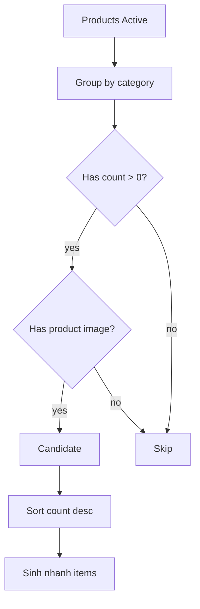

# I. Primer

## 1. TL;DR kiểu Feynman

- Danh mục khác các section khác: nên show nhiều item một hàng, đặc biệt desktop nên thấy khoảng 6 danh mục trước mắt.
- Cả 6 layout ProductCategories sẽ chuyển phần danh sách item sang 1 hàng ngang có thể vuốt/kéo, học pattern slider của Testimonials.
- Desktop nếu có hơn 6 danh mục cũng kéo ngang cùng behavior; mobile/tablet cũng vuốt ngang.
- Không còn cắt danh mục bằng `visibleLimit`; mọi danh mục config đều render trong slider.
- `Sinh nhanh` sẽ không cap 6 nữa: tạo tất cả danh mục hợp lệ có sản phẩm và có ít nhất 1 thumbnail sản phẩm.

## 2. Elaboration & Self-Explanation

Hiện ProductCategories đang có nhiều kiểu layout dạng grid/list và có `visibleItems = items.slice(0, visibleLimit)`, nghĩa là dữ liệu nhiều nhưng UI vẫn cắt bớt. Với danh mục sản phẩm, user muốn ưu tiên cho khách “lướt danh mục” như slider, luôn 1 dòng để dễ vuốt, thay vì grid nhiều hàng.

Testimonials có pattern tốt: dùng Embla Carousel với `dragFree`, `containScroll: 'trimSnaps'`, track `flex`, slide `flex-none basis[...]`, hỗ trợ preview/site cùng shared runtime. ProductCategories hiện cũng đã có shared runtime nên nên sửa ở `ProductCategoriesSectionShared.tsx`, giữ skin từng layout nhưng thay container list thành one-row swipe shell dùng chung.

Auto-generate hiện đã được thêm nhưng còn cap 6. Theo yêu cầu mới, khi sinh nhanh phải tạo hết danh mục hợp lệ: category active có `productCount > 0` và có ít nhất một product image để làm thumbnail. Danh mục có sản phẩm nhưng không có ảnh sản phẩm sẽ không sinh.

## 3. Concrete Examples & Analogies

Ví dụ có 18 danh mục hợp lệ, trong đó 2 danh mục có sản phẩm nhưng toàn bộ product không có ảnh:
- `Sinh nhanh` sẽ tạo 16 danh mục.
- Desktop hiển thị khoảng 6 item đầu trên cùng một hàng, kéo ngang để xem tiếp.
- Mobile hiển thị ít item hơn theo chiều ngang, vuốt để xem tiếp.

Analogy: danh mục giống kệ ngang ở siêu thị. Desktop thấy nhiều món cùng lúc, mobile thì vuốt sang ngang. Không nên xếp xuống nhiều hàng vì làm mất cảm giác “lướt nhanh”.

# II. Audit Summary (Tóm tắt kiểm tra)

Observation:
- Testimonials source:
  - `TestimonialsSectionShared.tsx` dùng `useEmblaCarousel`.
  - Embla config: `align: 'start'`, `containScroll: 'trimSnaps'`, `dragFree: true`.
  - Slider shell: viewport `overflow-hidden`, track `flex ... touch-pan-y`, item `flex-none basis[...]`.
- ProductCategories hiện tại:
  - `ProductCategoriesSectionShared.tsx` có `getVisibleLimit()` + `items.slice(0, visibleLimit)` làm cắt dữ liệu.
  - 6 layout đang render grid/list/manual scroll khác nhau.
  - `carousel` dùng native scroll + `document.getElementById(...).scrollBy(...)` thay vì Embla.
- Auto-generate hiện tại:
  - `useProductCategoriesAutoGenerate.ts` gọi query với `limit: 6`.
  - `auto-generate.ts` đang `.slice(0, 6)`.
  - `listActiveAutoFillCandidates` đang chọn `representativeProductId` ngay cả khi `product.image` rỗng, và slice theo limit.

Inference:
- Source of truth render nên vẫn là `ProductCategoriesSectionShared.tsx` để preview/site parity.
- Cần giữ 6 style visual khác nhau, nhưng dùng chung một slider shell.
- `columnsDesktop/columnsMobile` có thể không còn điều khiển grid row nữa; nên dùng chúng nhẹ để tính slide basis nếu cần, nhưng default desktop target là thấy 6 item.

Decision:
- Dùng Embla cho ProductCategories shared runtime.
- Bỏ `visibleLimit` khỏi render list; dùng toàn bộ `items`.
- Tạo helper `renderSwipeRow(...)` dùng chung cho 6 layout.
- Mỗi layout truyền card renderer riêng vào helper.
- Auto-generate trả tất cả eligible categories, filter bắt buộc có `representativeImage` và `representativeProductId`.

# III. Root Cause & Counter-Hypothesis (Nguyên nhân gốc & Giả thuyết đối chứng)

Root Cause Confidence (Độ tin cậy nguyên nhân gốc): High.

Lý do:
- Evidence trực tiếp: ProductCategories hiện có `visibleItems = items.slice(...)` và nhiều grid/list block.
- Testimonials có slider reference sẵn trong repo, khớp yêu cầu “học layout slider testimonials”.
- Auto-generate helper/hook/query hiện có cap 6 rõ ràng.

Counter-Hypothesis:
- “Chỉ tăng desktop columns lên 6” không đủ vì mobile/tablet vẫn không cùng swipe behavior và dữ liệu vẫn có thể bị cắt.
- “Chỉ sửa carousel layout” không đủ vì user yêu cầu cả 6 layout.
- “Sinh nhanh lấy mọi category có productCount > 0” chưa đủ vì user yêu cầu product phải có ít nhất 1 ảnh đại diện.

# IV. Proposal (Đề xuất)

## 1. Scope & impacted paths

### UI runtime
- `app/admin/home-components/product-categories/_components/ProductCategoriesSectionShared.tsx`

### Auto-generate
- `convex/productCategories.ts`
- `app/admin/home-components/product-categories/_lib/auto-generate.ts`
- `app/admin/home-components/product-categories/_lib/useProductCategoriesAutoGenerate.ts`
- `app/admin/home-components/product-categories/_components/ProductCategoriesForm.tsx`

Không đổi:
- style ids
- create/edit config contract
- ComponentRenderer wiring

## 2. Source of truth

| Surface | File | Contract cần giữ |
|---|---|---|
| Create | `create/product-categories/page.tsx` | form state không đổi, preview nhận full item list |
| Edit | `[id]/edit/page.tsx` | dirty-state vẫn dựa categories array |
| Preview | `ProductCategoriesPreview.tsx` | dùng shared section với `context='preview'` |
| Shared UI | `ProductCategoriesSectionShared.tsx` | one-row swipe cho 6 styles |
| Site | `ComponentRenderer.tsx` | dùng cùng shared section, full list |
| Data | `convex/productCategories.ts` | auto-generate all eligible categories có ảnh |

## 3. Slider shared shell

Thêm import:
```ts
import useEmblaCarousel from 'embla-carousel-react';
```

Trong component:
```ts
const [emblaRef] = useEmblaCarousel({
  align: 'start',
  containScroll: 'trimSnaps',
  dragFree: true,
});
```

Helper đề xuất:
```tsx
const renderSwipeRow = ({ items, slideClassName, children }) => (
  <div className="overflow-hidden w-full pb-3" ref={emblaRef}>
    <div className="flex backface-hidden -ml-3 md:-ml-4 touch-pan-y items-stretch">
      {items.map(item => (
        <div className={cn('flex-none pl-3 md:pl-4 min-w-0', slideClassName)}>
          {children(item)}
        </div>
      ))}
    </div>
  </div>
)
```

Cần lưu ý: 1 Embla ref chỉ nên gắn vào một viewport render tại một thời điểm. Vì runtime chỉ render 1 style branch tại một thời điểm nên dùng 1 ref là ổn.

## 4. Slide width / responsive target

Mục tiêu:
- Desktop: thấy khoảng 6 item cho category compact layouts.
- Mobile: swipe rõ, mỗi item đủ rộng để tap.
- Tất cả layout: item nằm trên 1 dòng, không wrap.

Slide basis đề xuất theo style:
- `grid` / Circle Grid: `basis-[34%] sm:basis-[24%] md:basis-[18%] lg:basis-1/6`
- `carousel` / Book Row: `basis-[58%] sm:basis-[34%] md:basis-[24%] lg:basis-1/6`
- `cards` / Cover Cards: `basis-[76%] sm:basis-[42%] md:basis-[28%] lg:basis-1/6`
- `minimal` / Compact List: `basis-[82%] sm:basis-[46%] md:basis-[32%] lg:basis-1/6`
- `marquee` / Square Grid: `basis-[48%] sm:basis-[30%] md:basis-[22%] lg:basis-1/6`
- `circular` / Premium Grid: `basis-[48%] sm:basis-[30%] md:basis-[22%] lg:basis-1/6`

Nếu style quá hẹp ở desktop, vẫn giữ `lg:basis-1/6` theo yêu cầu “desktop grid 6”.

## 5. Layout conversion plan

- Remove/ignore `visibleLimit`, `remainingCount`, `getGridColumnsClassName` usage in render.
- Replace each grid/list map:
  - `visibleItems.map(...)` → `items.map(...)` inside `renderSwipeRow`.
- Keep visual card content per style:
  - Circle Grid vẫn avatar tròn border primary.
  - Book Row vẫn book card border đen, có arrows nếu cần, nhưng swipe chính là Embla.
  - Cover Cards vẫn image cover CTA card.
  - Compact List vẫn card ngang border đen.
  - Square Grid vẫn square tile border đen.
  - Premium Grid vẫn premium card.
- Header CTA stays separated row as current fix.

## 6. Auto-generate all eligible

### Convex
Update `listActiveAutoFillCandidates`:
- remove required `limit` behavior or allow no limit.
- product loop:
  - always count product per category.
  - only set representative product when `product.image` exists.
- candidate filter:
  - category active
  - `productCount > 0`
  - `representativeImage` truthy
  - `representativeProductId` truthy
- sort by `productCount desc`, tie by first product image time.
- do not slice unless optional `limit` explicitly passed; hook will not pass limit.

### Hook/helper
- `useProductCategoriesAutoGenerate`: remove `limit: 6`.
- `auto-generate.ts`: remove `.slice(0, 6)` and require `representativeImage`.
- Form copy: đổi text từ “tối đa 6” sang “tất cả danh mục đủ điều kiện”.



# V. Files Impacted (Tệp bị ảnh hưởng)

## 1. UI runtime
- Sửa: `app/admin/home-components/product-categories/_components/ProductCategoriesSectionShared.tsx`  
  Vai trò hiện tại: render 6 layout ProductCategories cho preview/site.  
  Thay đổi: thêm Embla slider shell dùng chung, chuyển 6 layout sang one-row swipe, bỏ cắt item bằng visible limit.

## 2. Auto-generate data
- Sửa: `convex/productCategories.ts`  
  Vai trò hiện tại: query category stats và auto-fill candidates.  
  Thay đổi: auto-fill trả tất cả category active có productCount > 0 và có representative product image.

- Sửa: `app/admin/home-components/product-categories/_lib/auto-generate.ts`  
  Vai trò hiện tại: build items auto-generated.  
  Thay đổi: bỏ cap 6, filter bắt buộc có representative image/product id.

- Sửa: `app/admin/home-components/product-categories/_lib/useProductCategoriesAutoGenerate.ts`  
  Vai trò hiện tại: hook gọi query auto-fill.  
  Thay đổi: bỏ `limit: 6`.

- Sửa: `app/admin/home-components/product-categories/_components/ProductCategoriesForm.tsx`  
  Vai trò hiện tại: nút Sinh nhanh và mô tả.  
  Thay đổi: copy thành “tất cả danh mục đủ điều kiện”, không nói tối đa 6.

# VI. Execution Preview (Xem trước thực thi)

1. Import `useEmblaCarousel` vào ProductCategories shared runtime.
2. Thêm Embla instance và helper `renderSwipeRow`.
3. Bỏ `visibleItems` slice và đổi 6 layout render list sang one-row slider.
4. Preserve card skin hiện có của từng layout.
5. Sửa auto-generate query: all eligible + thumbnail required.
6. Sửa hook/helper/form copy bỏ cap 6.
7. Static review preview/site parity.
8. Chạy `bunx tsc --noEmit`.
9. Commit local, không push.

# VII. Verification Plan (Kế hoạch kiểm chứng)

Static:
- `bunx tsc --noEmit`.
- Kiểm tra `ProductCategoriesSectionShared` không còn `items.slice(0, visibleLimit)`.
- Kiểm tra 6 branches dùng slider row / flex-nowrap, không grid wrap.
- Kiểm tra auto-generate không còn `.slice(0, 6)` hoặc `limit: 6`.
- Kiểm tra query filter representative image.

Manual:
- Create ProductCategories: test 6 style ở desktop/tablet/mobile preview, danh mục cùng 1 dòng và vuốt được.
- Nếu có >6 categories, desktop kéo ngang được.
- Site homepage render cùng behavior.
- Bấm `Sinh nhanh`: sinh tất cả category có sản phẩm + có thumbnail.
- Category có product nhưng không product nào có ảnh không được sinh.

# VIII. Todo

1. Chuyển shared runtime sang Embla one-row swipe.
2. Refactor 6 layout dùng chung slider shell.
3. Bỏ visible limit/cắt item.
4. Sửa auto-generate all eligible + thumbnail required.
5. Typecheck.
6. Commit local.

# IX. Acceptance Criteria (Tiêu chí chấp nhận)

- Cả 6 layout ProductCategories luôn render danh mục trên 1 dòng ngang.
- Desktop thấy khoảng 6 item và nếu >6 thì kéo/vuốt ngang được.
- Mobile/tablet vuốt ngang được theo pattern Testimonials.
- Preview và site dùng cùng behavior.
- Không còn giới hạn render theo `visibleLimit`.
- `Sinh nhanh` sinh tất cả danh mục đủ điều kiện, không cap 6.
- Danh mục có sản phẩm nhưng không có thumbnail sản phẩm không được sinh.
- `bunx tsc --noEmit` pass.
- Có commit local, không push.

# X. Risk / Rollback (Rủi ro / Hoàn tác)

- Risk: ép cả 6 style về one-row slider sẽ làm một số card rất nhỏ nếu giữ visual phức tạp; sẽ dùng basis riêng per style để vẫn đọc được.
- Risk: Form `columnsDesktop/columnsMobile` trở nên ít ý nghĩa hơn; không xóa field để tránh scope rộng, nhưng runtime có thể ưu tiên slider basis cố định.
- Risk: Preview count hiện vẫn dựa `products.listPublicResolved(limit:100)` nên count hiển thị có thể lệch khi data lớn; task này không đổi preview data source.
- Rollback: revert commit là đủ, không đổi schema.

# XI. Out of Scope (Ngoài phạm vi)

- Không xóa setting cột Desktop/Mobile khỏi form.
- Không đổi labels style picker.
- Không redesign lại từng card layout.
- Không đổi ProductCategoriesPreview data source ngoài auto-generate.

# XII. Open Questions (Câu hỏi mở)

Không có câu hỏi bắt buộc. Mặc định tất cả layout sẽ dùng một-row swipe shell, giữ skin từng layout hiện tại, và auto-generate sinh tất cả category đủ điều kiện.