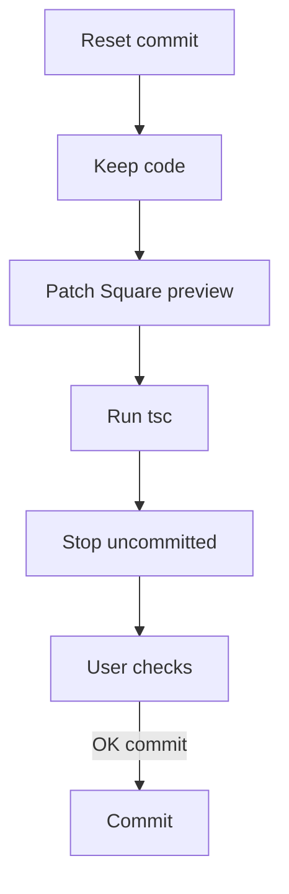

# I. Primer

## 1. TL;DR kiểu Feynman

- Sẽ xóa commit cuối `102e1d0e` nhưng **không xóa code**, để thay đổi quay lại working tree cho user check trước.
- Từ giờ không commit vội nữa; sau khi sửa xong sẽ dừng ở trạng thái uncommitted để bạn kiểm tra preview/site.
- Vấn đề mới: site thật Square Grid và Compact List đang ổn, nhưng preview responsive chưa giống site.
- Yêu cầu rõ nhất: Square Grid preview phải **bỏ border bọc toàn bộ danh mục** — tức bỏ khung ngoài đang nằm quanh cả row Square Grid trong preview.
- Hướng sửa an toàn: chỉ condition theo `context === 'preview'` trong branch `style === 'marquee'` (Square Grid), không đụng site thật.

## 2. Elaboration & Self-Explanation

Hiện commit mới nhất là `102e1d0e fix(product-categories): balance swipe card heights`. User yêu cầu xóa commit này nhưng giữ code, nên bước đầu tiên sau khi approve sẽ là `git reset HEAD~1`. Lệnh này bỏ commit khỏi lịch sử local, nhưng giữ tất cả thay đổi code/spec trong working tree.

Trong code Square Grid (`style === 'marquee'`), đang có một wrapper:

```tsx
<div className="rounded-lg border" style={{ borderColor: '#111111' }}>
  {renderSwipeRow('marquee', ...)}
</div>
```

Wrapper này tạo border bọc toàn bộ danh mục. User nói site thực Square Grid oke nhưng preview responsive chưa giống, và muốn bỏ hết border bọc toàn bộ danh mục. Vì site thật đang ổn, không nên xóa border này cho mọi context. Thay vào đó, chỉ bỏ wrapper border khi `context === 'preview'`, còn site giữ nguyên.

## 3. Concrete Examples & Analogies

Ví dụ cụ thể:

- Preview Square Grid hiện giống một khay lớn có viền đen bọc quanh tất cả ô danh mục.
- Site thật không cần thay, hoặc đang nhìn đúng theo user.
- Fix preview-only sẽ làm preview bỏ cái “khay viền ngoài”, nhưng mỗi item bên trong vẫn giữ layout/spacing hiện có nếu cần.

Analogy: giống bỏ viền của cái hộp lớn bên ngoài, không tháo từng món hàng bên trong hộp.

# II. Audit Summary (Tóm tắt kiểm tra)

## 1. Scope & impacted paths

Sửa dự kiến:

- `app/admin/home-components/product-categories/_components/ProductCategoriesSectionShared.tsx`

Git operation dự kiến:

- `git reset HEAD~1` để bỏ commit cuối nhưng giữ code.

Không commit sau khi sửa, trừ khi user yêu cầu rõ.

## 2. Source of truth

- `ProductCategoriesSectionShared.tsx` là shared renderer cho preview và site.
- `context` hiện có hai giá trị: `preview` và `site`.
- `ProductCategoriesPreview.tsx` đã truyền `context="preview"`.
- `ComponentRenderer.tsx` dùng `context="site"`.

## 3. Preview ↔ Site parity map

| Surface | File | Contract cần giữ |
|---|---|---|
| Preview | `ProductCategoriesPreview.tsx` | Không sửa, vẫn truyền context preview |
| Shared UI | `ProductCategoriesSectionShared.tsx` | Thêm preview-only branch cho Square Grid border wrapper |
| Site | `ComponentRenderer.tsx` | Không sửa, site giữ nguyên visual đang ổn |
| Git | commit `102e1d0e` | Reset khỏi history, giữ code trong working tree |

## 4. Observation (Bằng chứng quan sát)

- `git log`: HEAD hiện là `102e1d0e fix(product-categories): balance swipe card heights`.
- `git status`: chỉ còn 2 docs untracked cũ ngoài commit.
- Code Square Grid nằm ở `style === 'marquee'`.
- Border bọc toàn bộ danh mục nằm tại `ProductCategoriesSectionShared.tsx` quanh line `481`: `className="rounded-lg border"`.
- Preview và site dùng chung file, nên nếu xóa border trực tiếp sẽ ảnh hưởng site thật; cần dùng `context === 'preview'` để cô lập.

# III. Root Cause & Counter-Hypothesis (Nguyên nhân gốc & Giả thuyết đối chứng)

## 1. Root Cause Confidence (Độ tin cậy nguyên nhân gốc)

**High** cho phần Square Grid border wrapper.

Lý do:

- User mô tả đúng một element rõ ràng: border bọc toàn bộ danh mục.
- Code có đúng wrapper `rounded-lg border` bọc `renderSwipeRow('marquee')`.
- Vì user nói site thật oke, root issue nằm ở khác biệt mong muốn giữa preview và site, không phải data/config.

## 2. Trả lời 5/8 câu Audit bắt buộc

1. Triệu chứng expected vs actual:
   - Expected: Square Grid preview không có border bọc toàn bộ danh mục.
   - Actual: Square Grid preview đang có wrapper border bọc cả row.

3. Tái hiện tối thiểu:
   - Mở Product Categories edit, chọn Square Grid ở preview responsive.

5. Dữ liệu thiếu:
   - Chưa có screenshot mới riêng cho Square Grid sau lần commit cuối, nhưng code evidence đủ rõ cho border wrapper.

6. Giả thuyết thay thế:
   - Border từng item cũng có thể tạo cảm giác nhiều viền, nhưng user nói “boder bọc toàn bộ danh mục”, khớp wrapper ngoài hơn item border.
   - Compact List responsive preview chưa giống site có thể do basis/min-height vừa thay đổi, nhưng user chưa chỉ rõ thao tác cụ thể; không nên sửa rộng hơn khi chưa có evidence.

8. Tiêu chí pass/fail:
   - Pass khi Square Grid preview không còn khung border ngoài bọc cả danh mục; site Square Grid vẫn không bị đổi ngoài ý muốn.

# IV. Proposal (Đề xuất)

## 1. Reset commit giữ code

Sau khi approve:

```bash
git reset HEAD~1
```

Kết quả mong muốn:

- Commit `102e1d0e` không còn là HEAD.
- Code đã sửa vẫn còn trong working tree.
- Không commit lại cho đến khi user check và yêu cầu commit.

## 2. Square Grid preview-only border removal

Trong branch `style === 'marquee'`, đổi wrapper border theo context.

Hiện tại:

```tsx
<div className="rounded-lg border" style={{ borderColor: '#111111' }}>
  {renderSwipeRow('marquee', ...)}
</div>
```

Đề xuất:

```tsx
<div
  className={cn(context === 'preview' ? 'rounded-lg' : 'rounded-lg border')}
  style={context === 'preview' ? undefined : { borderColor: '#111111' }}
>
  {renderSwipeRow('marquee', ...)}
</div>
```

Hoặc đơn giản hơn:

```tsx
{context === 'preview' ? (
  renderSwipeRow('marquee', ...)
) : (
  <div className="rounded-lg border" style={{ borderColor: '#111111' }}>
    {renderSwipeRow('marquee', ...)}
  </div>
)}
```

Khuyến nghị option 1 vì ít duplicate `renderSwipeRow` hơn.

## 3. Compact List responsive preview/site

Hiện user nói Compact List site thật oke nhưng preview responsive chưa giống, chưa chỉ rõ khác biệt nào sau ảnh vừa gửi. Trong scope này:

- Không sửa thêm Compact List nếu không có evidence cụ thể ngoài phần equal-height đã nằm trong working tree.
- Sau khi bỏ commit và sửa Square Grid border, dừng lại để user check.
- Nếu Compact List preview vẫn lệch, xin user chỉ rõ screenshot/điểm lệch tiếp theo trước khi chỉnh tiếp.

## 4. Commit policy mới theo yêu cầu user

- Không commit sau khi sửa.
- Chỉ để working tree có thay đổi để user check.
- Chỉ commit khi user nói rõ “commit” hoặc “ok commit”.



# V. Files Impacted (Tệp bị ảnh hưởng)

- Sửa: `app/admin/home-components/product-categories/_components/ProductCategoriesSectionShared.tsx`  
  Vai trò hiện tại: render Product Categories cho preview và site.  
  Thay đổi: Square Grid (`marquee`) bỏ border wrapper ngoài khi `context === 'preview'`, giữ site như hiện tại.

- Git: commit `102e1d0e`  
  Vai trò hiện tại: commit local mới nhất nhưng user chưa check.  
  Thay đổi: reset commit khỏi history local, giữ code trong working tree.

# VI. Execution Preview (Xem trước thực thi)

1. Chạy `git reset HEAD~1`.
2. Patch wrapper Square Grid `rounded-lg border` thành preview-only no-border.
3. Không sửa site renderer, không sửa data/config.
4. Chạy `bunx tsc --noEmit` vì có đổi TSX.
5. Chạy `git status` + `git diff` để báo trạng thái.
6. Dừng, không commit.

# VII. Verification Plan (Kế hoạch kiểm chứng)

## 1. Static verification (Kiểm chứng tĩnh)

- `style === 'marquee'` không còn border wrapper khi `context === 'preview'`.
- `context === 'site'` vẫn giữ `rounded-lg border` wrapper.
- Không có thay đổi mới ở `grid`, `cards`, `circular`.

## 2. Type verification (Kiểm chứng type)

- Chạy `bunx tsc --noEmit`.
- Không chạy lint/unit test/build theo AGENTS.md.

## 3. Manual verification (Kiểm chứng trực quan)

- Preview Square Grid: không còn border bọc toàn bộ danh mục.
- Site Square Grid: vẫn oke như trước.
- Compact List site: vẫn oke.
- Compact List preview: user kiểm tra tiếp, nếu còn lệch sẽ xử lý sau với evidence cụ thể.

# VIII. Todo

1. Reset commit cuối nhưng giữ code.
2. Bỏ border wrapper Square Grid chỉ trong preview.
3. Chạy `bunx tsc --noEmit`.
4. Báo `git status` và diff summary.
5. Dừng, không commit.

# IX. Acceptance Criteria (Tiêu chí chấp nhận)

- Commit `102e1d0e` bị xóa khỏi HEAD local.
- Code không bị mất, vẫn nằm trong working tree.
- Square Grid preview không còn border bọc toàn bộ danh mục.
- Square Grid site giữ visual hiện tại.
- Không commit mới khi user chưa check.
- `bunx tsc --noEmit` pass.

# X. Risk / Rollback (Rủi ro / Hoàn tác)

- Risk: nếu user muốn bỏ cả border từng item, patch này chưa làm vì câu “bọc toàn bộ danh mục” ưu tiên wrapper ngoài.
- Risk: preview-only khác site có chủ ý; nhưng user đã nói site thực oke, preview cần chỉnh.
- Rollback: revert hunk Square Grid wrapper hoặc dùng `git restore` file trước khi commit.

# XI. Out of Scope (Ngoài phạm vi)

- Không commit.
- Không sửa data/Convex/config.
- Không redesign Square Grid.
- Không sửa Compact List thêm khi chưa có mô tả lệch cụ thể ngoài “responsive preview chưa giống”.

# XII. Open Questions (Câu hỏi mở)

Không có câu hỏi bắt buộc trước khi làm. Điểm rõ nhất là reset commit giữ code và bỏ border wrapper ngoài của Square Grid trong preview.