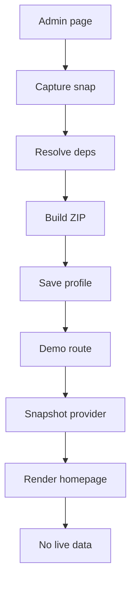
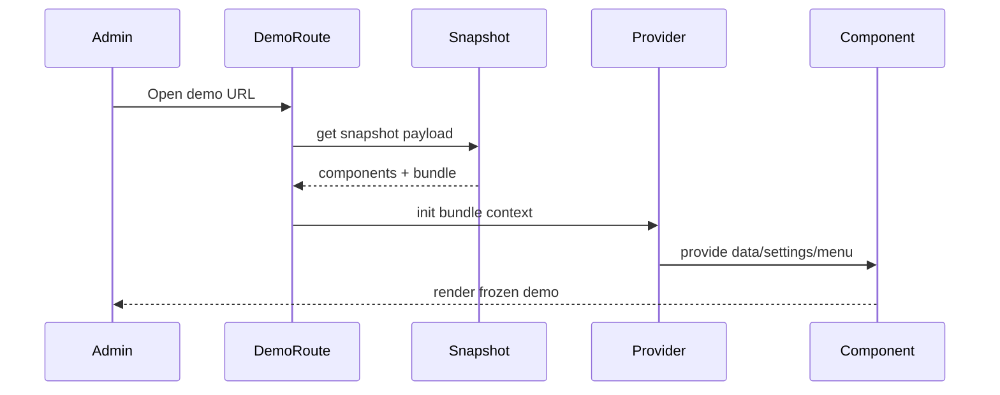
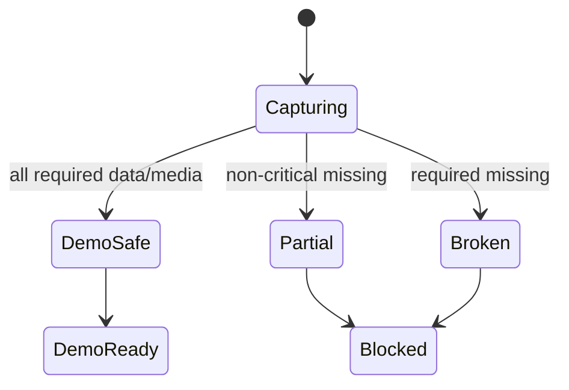

# I. Primer

## 1. TL;DR kiểu Feynman

- Mục tiêu không phải “import lại sản phẩm/dịch vụ thật”, mà là lưu một **bản demo đông lạnh**: cái gì đang thấy thì snapshot giữ nguyên cái đó.
- A' chốt theo lựa chọn của bạn: **demo route riêng**, **media đóng gói trong ZIP**, **thiếu dữ liệu chính thì chặn**, **settings chỉ dùng trong runtime demo, không ghi vào settings thật**.
- Snapshot sẽ chứa home-components + dữ liệu phụ thuộc vừa đủ: sản phẩm/dịch vụ/danh mục/bài viết/menu/settings đang cần để render demo, không kéo dư cả kho.
- Khi sản phẩm thật bị xóa, demo snapshot vẫn xem được vì nó đọc từ bundle frozen, không query bảng `products` thật.
- Luồng hiện tại `/admin/home-components` vẫn là nơi tạo/lưu/chọn snapshot, nhưng cần thêm chế độ “Xem demo snapshot” thay vì chỉ `replace_all` vào trang thật.

## 2. Elaboration & Self-Explanation

Hiện tại snapshot trong repo đã có nền tốt: có ZIP, có `homeComponents`, có media refs, có một số fallback tĩnh. Nhưng nó chưa đủ mạnh cho mục tiêu “demo spa vẫn đúng khi site thật đã đổi sang bất động sản”, vì nhiều component runtime vẫn tự query dữ liệu thật như `products`, `services`, `productCategories`, `settings`, `menus`.

A' sẽ biến snapshot thành **Demo Bundle (Gói demo)**. Bundle này là một nguồn dữ liệu độc lập cho route demo. Khi xem demo, runtime không hỏi dữ liệu thật nữa cho các phần đã đóng gói. Nó dùng:

- component config trong snapshot
- media đã upload từ ZIP
- settings snapshot trong bundle
- menu snapshot trong bundle
- dependency snapshot theo đúng những item đang render

Điểm khác biệt lớn nhất: `Apply snapshot` không còn là cách duy nhất. Ta thêm hướng **preview/demo route riêng**, ví dụ `/admin/home-components/snapshots/[id]/demo` hoặc route public-token sau này nếu cần gửi khách. Route này render bundle mà không ghi đè homepage thật và không sửa settings thật.

## 3. Concrete Examples & Analogies

Ví dụ cụ thể bám repo:

- Bạn dựng homepage spa có `ProductList` đang hiện 8 sản phẩm spa.
- Khi lưu snapshot, hệ thống không chỉ lưu `selectedProductIds` hoặc `itemCount`.
- Nó lưu 8 item đã resolve:
  - tên sản phẩm
  - ảnh
  - giá
  - mô tả/excerpt nếu UI dùng
  - category label/slug nếu link dùng
  - href hoặc route metadata
- Sau này bảng `products` bị đổi sang bất động sản, demo spa vẫn render 8 sản phẩm spa từ bundle.

Analogy đời thường:

- Snapshot yếu giống “ghi địa chỉ nhà hàng”. Nếu nhà hàng đóng cửa hoặc đổi menu thì bạn mất bữa ăn cũ.
- Snapshot mạnh giống “đóng hộp nguyên bữa ăn lúc nó đang ngon”. Sau này mở hộp ra vẫn đúng món đó, không phụ thuộc nhà hàng còn bán hay không.

# II. Audit Summary (Tóm tắt kiểm tra)

## 1. Observation (Quan sát)

- `components/modules/homepage/HomepageSnapshotDialog.tsx` hiện có UI `Tạo nhanh`, export/import ZIP, lưu profile, apply profile.
- `convex/homepageSnapshots.ts` hiện capture `homeComponents`, media URL trong config, `dependencies` hạn chế và `systemStyle`.
- `lib/homepage-snapshot/types.ts` hiện payload có:
  - `homepage.components`
  - `homepage.dependencies`
  - `homepage.systemStyle`
  - `index.mediaIndex`
- `lib/homepage-snapshot/client.ts` đã biết split ZIP thành JSON files và media files.
- Các component động vẫn query live data:
  - `components/site/ProductListSection.tsx`
  - `components/site/ServiceListSection.tsx`
  - `components/site/BlogSection.tsx`
  - `components/site/HomepageCategoryHeroSection.tsx`
  - `components/site/ComponentRenderer.tsx` cho `ProductCategories`/`CategoryProducts`
  - `components/site/ContactSection.tsx`
  - `components/site/DynamicFooter.tsx` / `Footer.tsx`

## 2. Gap (Khoảng thiếu)

Snapshot hiện tại chưa đảm bảo “demo độc lập” vì:

- chưa capture đủ settings site/contact/social/header-footer menu
- dependencies hiện còn dạng fallback chung và chưa phải resolved render payload đầy đủ
- import/apply hiện có xu hướng tạo lại `homeComponents` vào dữ liệu thật, chưa có demo route riêng
- runtime component chưa có cơ chế đọc bundle snapshot thay cho `useQuery` live data

## 3. Decision (Quyết định)

Chọn A': **Strong Demo Snapshot Bundle (Gói snapshot demo mạnh)**:

- không recreate dữ liệu thật `products/services/posts/categories`
- không ghi settings thật khi xem demo
- media đóng gói trong ZIP và upload lại khi import
- thiếu data/media chính thì chặn import hoặc chặn demo eligibility
- thêm demo runtime/route riêng đọc bundle frozen

# III. Root Cause & Counter-Hypothesis (Nguyên nhân gốc & Giả thuyết đối chứng)

## 1. Root Cause Confidence (Độ tin cậy nguyên nhân gốc)

**High**.

Lý do: evidence từ code cho thấy snapshot hiện chỉ lưu một phần fallback, trong khi runtime của nhiều home-component vẫn tự query dữ liệu thật. Vì vậy nếu dữ liệu thật đổi ngành từ spa sang bđs, component có thể hiện layout snapshot nhưng data lại lấy từ bảng thật hiện tại, gây lệch ảnh/tên/mô tả.

## 2. Câu hỏi root cause bắt buộc

1. Triệu chứng quan sát được là gì?
   - Expected: snapshot spa mở lại vẫn thấy đúng ảnh/tên/mô tả spa.
   - Actual hiện tại có rủi ro: component động query live data nên có thể hiện dữ liệu bđs sau khi site đổi ngành.

3. Có tái hiện ổn định không?
   - Có thể tái hiện bằng cách snapshot một homepage có `ProductList/ServiceList`, sau đó đổi/xóa records thật rồi apply/xem lại snapshot.

5. Dữ liệu nào đang thiếu để kết luận chắc chắn?
   - Cần audit runtime đầy đủ từng style của `Blog`, `Contact`, `Footer`, `HomepageCategoryHero` khi implement để chốt exact field cần capture.

6. Có giả thuyết thay thế hợp lý nào chưa bị loại trừ?
   - Có: sửa từng component để hỗ trợ `embedded-demo` trong `config`. Hướng này đúng nhưng xâm lấn rộng hơn.

7. Rủi ro nếu fix sai nguyên nhân là gì?
   - Snapshot ZIP to hơn nhưng demo vẫn query live data, dẫn tới vẫn lệch dữ liệu.

8. Tiêu chí pass/fail sau khi sửa?
   - Pass: snapshot spa vẫn render đầy đủ trên demo route sau khi products/services thật bị đổi hoặc xóa.
   - Fail: demo route còn hiện dữ liệu live hoặc thiếu ảnh/tên/mô tả đã thấy lúc capture.

## 3. Counter-Hypothesis (Giả thuyết đối chứng)

### a) Chỉ cần tạo lại products/services khi import

Không recommend. Tạo lại dữ liệu thật sẽ gây trùng, bẩn source of truth và biến demo snapshot thành import dữ liệu kinh doanh.

### b) Chỉ cần lưu fallbackProducts/fallbackServices như hiện tại

Không đủ. Fallback hiện chưa bao quát settings/menu/contact/social, chưa chụp resolved payload theo component, và runtime vẫn có thể query live data.

### c) Đổi từng component sang embedded-demo

Đúng về mặt model, nhưng scope rộng vì phải sửa nhiều editor/runtime. A' tốt hơn cho nhu cầu hiện tại vì tận dụng snapshot pipeline đang có.

# IV. Proposal (Đề xuất)

## 1. Tên hướng

**A' — Strong Snapshot Demo Bundle**

## 2. Nguyên tắc thiết kế

- **Demo không ghi dữ liệu thật**: không insert/update `products`, `services`, `posts`, `categories`, `settings`, `menus` khi chỉ xem demo.
- **Frozen render payload**: cái gì đang hiện trong homepage thì snapshot capture đủ field để render lại.
- **Component-scoped dependencies**: dependency gắn theo `componentKey`, không chỉ là danh sách chung toàn homepage.
- **Media self-contained**: media trong snapshot được tải vào ZIP; import upload lại media và rewrite URL trong bundle.
- **Integrity first**: thiếu data/media chính thì blocking.
- **Runtime snapshot-aware**: demo route dùng snapshot data provider, không để component động query live data cho phần snapshot đã capture.

## 3. Flow tổng thể



Ghi chú: “deps” = products/services/posts/categories/menu/settings/media cần để render.

## 4. Snapshot payload mới đề xuất

Giữ contract cũ và thêm trường mới có version rõ:

```ts
homepage: {
  components: SnapshotComponentPayload[];
  componentOrder: string[];
  dependencies: SnapshotDependencyCapture; // legacy compatibility
  systemStyle: SnapshotSystemStylePayload;
  demoBundle: SnapshotDemoBundlePayload;
}
```

```ts
type SnapshotDemoBundlePayload = {
  integrity: {
    level: 'demo-safe' | 'partial' | 'broken';
    requiredMissing: string[];
    warnings: string[];
  };
  settings: {
    site: Record<string, unknown>;
    contact: Record<string, unknown>;
    social: Record<string, unknown>;
    routing: Record<string, unknown>;
    homeComponentStyle: SnapshotSystemStylePayload;
  };
  menus: {
    header?: SnapshotMenuPayload;
    footer?: SnapshotMenuPayload;
  };
  componentData: Record<string, SnapshotComponentResolvedData>;
};
```

`componentData` key là `componentKey` để không lẫn giữa hai component cùng type.

## 5. Component dependency capture theo type

### a) ProductList / ProductGrid

Capture resolved items thực sự render:

```ts
{
  kind: 'product-list';
  items: Array<{
    id: string;
    name: string;
    image?: string;
    images?: string[];
    description?: string;
    price?: number;
    salePrice?: number;
    slug?: string;
    href?: string;
    categoryId?: string;
    categoryName?: string;
    categorySlug?: string;
    hasVariants?: boolean;
  }>;
  categories: Array<{ id: string; name: string; slug?: string; image?: string }>;
  settings: { saleMode?: unknown; defaultImageAspectRatio?: unknown; iaRouteMode?: unknown };
}
```

### b) ServiceList

```ts
{
  kind: 'service-list';
  items: Array<{
    id: string;
    title: string;
    image?: string;
    excerpt?: string;
    price?: number;
    slug?: string;
    href?: string;
    categoryId?: string;
    categoryName?: string;
    categorySlug?: string;
    views?: number;
  }>;
  categories: Array<{ id: string; name: string; slug?: string }>;
  settings: { iaRouteMode?: unknown };
}
```

### c) ProductCategories

```ts
{
  kind: 'product-categories';
  categories: Array<{
    id: string;
    name: string;
    slug?: string;
    image?: string;
    description?: string;
    productCount: number;
    displayImage?: string;
    displayIcon?: string;
  }>;
}
```

### d) CategoryProducts

```ts
{
  kind: 'category-products';
  sections: Array<{
    category: { id: string; name: string; slug?: string; image?: string };
    products: ProductSnapshotItem[];
  }>;
  settings: { saleMode?: unknown; defaultImageAspectRatio?: unknown; iaRouteMode?: unknown };
}
```

### e) HomepageCategoryHero

Capture resolved payload, không raw IDs:

```ts
{
  kind: 'homepage-category-hero';
  categories: Array<...>;
  stats: Array<...>;
  productsByCategory: Array<...>;
  resolvedMenu: Array<...>;
  settings: { iaRouteMode?: unknown; hierarchyEnabled?: boolean };
}
```

### f) Blog

```ts
{
  kind: 'blog';
  posts: Array<{
    id: string;
    title: string;
    excerpt?: string;
    image?: string;
    slug?: string;
    href?: string;
    categoryName?: string;
    categorySlug?: string;
    publishedAt?: number;
  }>;
  categories: Array<{ id: string; name: string; slug?: string }>;
  settings: { iaRouteMode?: unknown };
}
```

### g) Contact

```ts
{
  kind: 'contact';
  settings: {
    phone?: string;
    email?: string;
    address?: string;
    zalo?: string;
    map?: unknown;
    socials?: Array<...>;
  };
}
```

### h) Footer / Header menu if needed

```ts
{
  kind: 'menu-footer';
  menu?: SnapshotMenuPayload;
  site?: { name?: string; logo?: string; description?: string };
  social?: Record<string, unknown>;
}
```

## 6. Runtime demo route

Thêm route nội bộ admin, ví dụ:

- `/admin/home-components/snapshots/[snapshotId]/demo`

Route này:

1. query snapshot by id
2. dựng `SnapshotDemoProvider`
3. render homepage bằng components từ snapshot
4. mọi settings/menu/dependency đọc từ provider thay vì live Convex

Có thể giữ route này admin-only trước. Public share token để gửi khách là ngoài phạm vi phase đầu.

## 7. Data flow khi xem demo



## 8. State machine integrity



# V. Files Impacted (Tệp bị ảnh hưởng)

## 1. Snapshot core

### Sửa: `lib/homepage-snapshot/types.ts`
File này định nghĩa contract snapshot hiện tại. Thay đổi: tăng version snapshot và thêm type cho `demoBundle`, integrity report, component-scoped resolved data, settings/menu subset.

### Sửa: `lib/homepage-snapshot/client.ts`
File này split/parse ZIP. Thay đổi: thêm file JSON mới trong ZIP như `homepage/demo-bundle.json`, `homepage/settings.json`, `homepage/menus.json`, và parse ngược lại.

### Sửa: `convex/homepageSnapshots.ts`
File này capture/import/apply snapshot. Thay đổi: thêm capture demo bundle mạnh, media collection từ bundle, preflight blocking, và query demo snapshot phục vụ route.

## 2. Snapshot UI

### Sửa: `components/modules/homepage/HomepageSnapshotDialog.tsx`
File này là popup `Tạo nhanh`. Thay đổi: hiển thị integrity level, số products/services/posts/categories/media trong bundle, nút “Xem demo” thay vì chỉ “Áp dụng”, và giữ “Apply replace_all” nếu vẫn cần nhưng không dùng cho demo mặc định.

### Sửa: `app/admin/home-components/page.tsx`
File này mở dialog tạo nhanh. Thay đổi nhẹ nếu cần để truyền/điều hướng demo route từ dialog.

## 3. Demo runtime mới

### Thêm: `app/admin/home-components/snapshots/[snapshotId]/demo/page.tsx`
Route admin để xem demo snapshot không ghi dữ liệu thật. Route này đọc snapshot payload và render bằng snapshot provider.

### Thêm: `components/modules/homepage/SnapshotDemoProvider.tsx`
Provider chứa snapshot data/settings/menu/dependencies. Thay đổi data source của homepage runtime trong route demo.

### Thêm: `components/modules/homepage/SnapshotDemoHomePage.tsx`
Wrapper render danh sách home-components từ snapshot payload bằng renderer snapshot-aware.

## 4. Runtime adapters cho component động

### Sửa hoặc Thêm adapter quanh: `components/site/ProductListSection.tsx`
Vai trò hiện tại là query products thật. Thay đổi: trong demo context, nhận product items từ snapshot bundle.

### Sửa hoặc Thêm adapter quanh: `components/site/ServiceListSection.tsx`
Vai trò hiện tại là query services thật. Thay đổi: trong demo context, nhận service items từ snapshot bundle.

### Sửa hoặc Thêm adapter quanh: `components/site/BlogSection.tsx`
Vai trò hiện tại là query posts thật. Thay đổi: trong demo context, nhận post items từ snapshot bundle.

### Sửa hoặc Thêm adapter quanh: `components/site/HomepageCategoryHeroSection.tsx`
Vai trò hiện tại phụ thuộc category stats/products. Thay đổi: trong demo context, dùng `resolvedMenu/categories/stats/productsByCategory` từ snapshot bundle.

### Sửa hoặc Thêm adapter quanh: `components/site/ComponentRenderer.tsx`
Vai trò hiện tại route type sang section. Thay đổi: inject snapshot context/componentKey vào renderer để các section biết lấy đúng bundle theo component.

### Sửa hoặc Thêm adapter quanh: `components/site/ContactSection.tsx`, `components/site/DynamicFooter.tsx`
Vai trò hiện tại fallback settings/menu thật. Thay đổi: trong demo context, dùng settings/menu trong bundle.

## 5. Không sửa trong phase A'

- Không tạo bảng `demoProducts` / `demoServices`.
- Không import snapshot vào bảng thật `products/services/posts/categories`.
- Không ghi `settings` thật khi chỉ xem demo route.

# VI. Execution Preview (Xem trước thực thi)

## 1. Step 1 — Nâng snapshot contract

- Tăng `HOMEPAGE_SNAPSHOT_VERSION`, ví dụ `2026-04-25.v2`.
- Thêm types `SnapshotDemoBundlePayload`, `SnapshotComponentResolvedData`, `SnapshotIntegrityReport`.
- Giữ compatibility với v1 để preflight báo version rõ.

## 2. Step 2 — Capture dependency bundle

- Trong `convex/homepageSnapshots.ts`, thêm builder:
  - `buildSettingsBundle(ctx)`
  - `buildMenuBundle(ctx)`
  - `buildComponentResolvedData(ctx, component)`
  - `buildDemoBundle(ctx, components)`
- Chỉ lấy data cần thiết theo component config.
- Với auto-mode, capture resolved items theo limit đang render, không fetch cả kho.

## 3. Step 3 — Media ZIP mạnh hơn

- `collectUrls` phải quét cả `demoBundle` chứ không chỉ `component.config`.
- `createHomepageSnapshotZip` đóng gói media từ config + bundle.
- Import upload media rồi rewrite URL trong toàn bộ payload, gồm `demoBundle`.

## 4. Step 4 — Preflight integrity

- Blocking nếu:
  - component dynamic thiếu resolved payload cần render
  - media required thiếu trong ZIP khi import
  - snapshot version unsupported
- Warning nếu:
  - optional social/menu missing
  - component không active
  - external URL không fetch được nhưng đã có fallback local/media khác

## 5. Step 5 — Demo route riêng

- Thêm route `/admin/home-components/snapshots/[snapshotId]/demo`.
- Route đọc snapshot payload từ Convex.
- Render components snapshot bằng provider.

## 6. Step 6 — Snapshot-aware runtime

- Thêm context hook kiểu:

```ts
const snapshot = useSnapshotDemoContext();
```

- Component dynamic kiểm tra context:
  - nếu có snapshot data cho `componentKey`: dùng bundle
  - nếu không: fallback live data chỉ khi route không phải strict demo
- Trong demo route strict: thiếu snapshot data là render error state thay vì query live.

## 7. Step 7 — UI popup tạo nhanh

- Thêm badge integrity:
  - `Demo-safe`
  - `Partial`
  - `Broken`
- Hiển thị counts:
  - components
  - products/services/posts/categories bundled
  - media files
  - settings/menu included
- Thêm nút “Xem demo”.
- Giữ import/export ZIP.

# VII. Verification Plan (Kế hoạch kiểm chứng)

## 1. Static review (Review tĩnh)

- Kiểm tra không có mutation nào trong demo route ghi vào:
  - `products`
  - `services`
  - `posts`
  - `productCategories`
  - `serviceCategories`
  - `settings`
  - `menus`
- Kiểm tra import ZIP chỉ upload media và lưu snapshot/profile nếu cần, không restore business records.

## 2. Repro thủ công chính

Scenario spa -> bđs:

1. Tạo homepage spa có `ProductList`, `ServiceList`, `ProductCategories`, `Contact`, `Footer`.
2. Lưu snapshot strong bundle.
3. Đổi/xóa dữ liệu thật products/services/categories sang dữ liệu bđs.
4. Mở demo route snapshot spa.
5. Expected: demo vẫn thấy đúng ảnh/tên/mô tả/giá/category spa.
6. Expected: trang thật không bị đổi settings nếu chỉ xem demo route.

## 3. Integrity test thủ công

- Tạo ZIP thiếu một media required.
- Import/preflight.
- Expected: blocking, không cho demo-safe.

## 4. Regression thủ công

- Export ZIP v2 rồi import lại.
- Mở demo route.
- Expected: media đã rewrite sang URL storage mới.

## 5. Command verification

Theo rule repo: không tự chạy lint/build. Sau khi implement code TypeScript, trước commit chỉ chạy `bunx tsc --noEmit` nếu được phép theo quy trình repo hiện tại.

# VIII. Todo

1. Audit chi tiết shape runtime của từng component dynamic trước khi code.
2. Nâng type snapshot v2 trong `lib/homepage-snapshot/types.ts`.
3. Mở rộng capture bundle trong `convex/homepageSnapshots.ts`.
4. Mở rộng ZIP split/parse trong `lib/homepage-snapshot/client.ts`.
5. Thêm preflight integrity blocking.
6. Thêm demo route riêng cho snapshot.
7. Thêm snapshot demo provider/context.
8. Làm snapshot-aware adapter cho `ProductList/ProductGrid`, `ServiceList`, `ProductCategories`, `CategoryProducts`.
9. Làm snapshot-aware adapter cho `HomepageCategoryHero`, `Blog`, `Contact`, `Footer`.
10. Cập nhật dialog `Tạo nhanh` để hiển thị integrity và mở demo.
11. Review tĩnh không ghi dữ liệu thật khi xem demo.
12. Chạy verify theo kế hoạch phù hợp.

# IX. Acceptance Criteria (Tiêu chí chấp nhận)

## 1. Functional

- Lưu snapshot từ `/admin/home-components` tạo ra bundle v2 có:
  - homeComponents
  - media index
  - demoBundle
  - settings subset
  - menu subset nếu có
  - component-scoped resolved data
- Có route demo riêng mở được snapshot đã lưu.
- Demo route không ghi dữ liệu thật.
- Snapshot spa vẫn render đúng sau khi data thật đổi sang ngành khác.

## 2. Integrity

- Snapshot thiếu dữ liệu chính bị blocking.
- Snapshot thiếu media required bị blocking.
- UI hiển thị được trạng thái `demo-safe`, `partial`, `broken`.

## 3. Data safety

- Không tự tạo lại products/services/posts/categories thật.
- Không patch settings thật khi chỉ xem demo route.
- Không apply menu thật khi chỉ xem demo route.

## 4. Scope

- Tập trung quanh `admin/home-components`, snapshot pipeline và demo runtime.
- Không refactor toàn bộ module products/services/posts.

# X. Risk / Rollback (Rủi ro / Hoàn tác)

## 1. Rủi ro

- Payload snapshot có thể lớn nếu media nhiều.
- Runtime adapters vẫn có thể sót một component đang query live data.
- `HomepageCategoryHero` phức tạp nhất vì phụ thuộc hierarchy/stats/productsByCategory.
- Version migration v1/v2 cần rõ để không import nhầm.

## 2. Giảm rủi ro

- Làm strict demo route: thiếu bundle data thì báo lỗi, không fallback live âm thầm.
- Bắt đầu với components rủi ro cao nhất:
  - ProductList/ProductGrid
  - ServiceList
  - ProductCategories
  - CategoryProducts
- Sau đó mới tới HomepageCategoryHero/Blog/Contact/Footer.
- Giữ v1 import báo unsupported hoặc fallback legacy có warning rõ.

## 3. Rollback

- Vì phase A' chủ yếu thêm route/demo runtime và không ghi dữ liệu thật, rollback là:
  - revert commit code
  - snapshot v2 đã lưu có thể bỏ qua/remove profile
- Không cần rollback products/services/settings thật vì demo route không mutate các bảng đó.

# XI. Out of Scope (Ngoài phạm vi)

- Không tạo lại sản phẩm/dịch vụ/bài viết thật từ snapshot.
- Không xây public share link/token cho khách ở phase đầu.
- Không tạo mini CMS demo riêng.
- Không refactor toàn bộ home-component editor để thêm `embedded-demo` field.
- Không migrate dữ liệu cũ ngoài việc preflight/compat snapshot v1/v2.

# XII. Open Questions (Câu hỏi mở)

Không còn câu hỏi blocker sau lựa chọn của bạn. A' đã chốt:

- demo route riêng
- media đóng gói ZIP
- thiếu dữ liệu chính thì chặn
- settings chỉ dùng trong runtime demo, không ghi settings thật

Nếu approve spec này, bước implementation nên bắt đầu bằng snapshot contract v2 + capture bundle, sau đó mới tới demo runtime adapters.