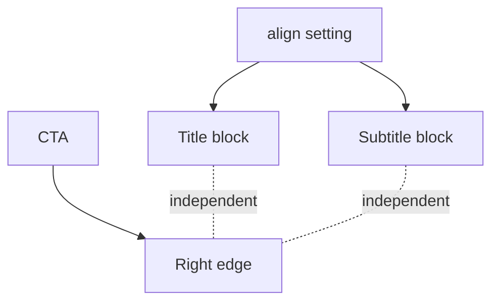

# I. Primer

## 1. TL;DR kiểu Feynman

- Lỗi hiện tại: fix CTA sát phải đã vô tình làm title/subtitle bị kéo theo vị trí CTA.
- Đúng behavior: `Căn lề tiêu đề` chỉ điều khiển title + subtitle; CTA `Xem tất cả` luôn nằm sát phải.
- Sẽ tách header thành 2 lớp độc lập: title block theo `align`, CTA block luôn right edge.
- Không đổi config, không đổi layout ids, không đổi dữ liệu đã lưu.

## 2. Elaboration & Self-Explanation

Hiện `renderHeader()` đang dùng grid columns để đưa CTA sang phải, nhưng đồng thời có logic `sectionAlign === 'center' && md:col-start-2`, làm title/subtitle cũng bị đặt vào cột giữa/right theo cấu trúc header mới. Đây là nguyên nhân user thấy title/subtitle bị kéo theo CTA.

Cách fix đúng là header cần có full-width container. Trong container đó:
- Title/subtitle là một block chiếm full width và tự căn bằng `align` (`left|center|right`).
- CTA là một block riêng được position/flow về mép phải, không ảnh hưởng layout/căn lề của title block.

## 3. Concrete Examples & Analogies

Ví dụ: nếu chọn `Căn lề tiêu đề = center`, title/subtitle vẫn nằm giữa khung preview như trước; nút `Xem tất cả` nằm sát mép phải cùng hàng/độ cao header. Nếu chọn `left`, title/subtitle nằm trái; CTA vẫn phải.

Analogy: title là nội dung chính của bảng hiệu, CTA là nút ở góc phải bảng hiệu. Đẩy nút sang góc phải không được kéo cả chữ bảng hiệu đi theo.

# II. Audit Summary (Tóm tắt kiểm tra)

Observation:
- Sau commit gần nhất, `renderHeader()` đổi từ flex sang grid để đưa CTA sang phải.
- Logic mới có `sectionAlign === 'center' && 'md:col-start-2'`, khiến title block phụ thuộc vào vị trí cột của grid.
- User screenshot xác nhận title/subtitle bị lệch sang phải khi CTA được pin right.

Inference:
- Root issue nằm ở layout structure của shared header, không phải ở config `align` hoặc form UI.
- Vì ProductCategories preview/site dùng chung `ProductCategoriesSectionShared.tsx`, sửa tại shared runtime sẽ fix cả create/edit preview và site.

Decision:
- Không dùng grid column placement cho title block nữa.
- Giữ title/subtitle full-width theo `headerAlignClassName`.
- Đặt CTA absolute/top-right hoặc flex overlay right trong wrapper `relative`, để CTA không ảnh hưởng title alignment.

# III. Root Cause & Counter-Hypothesis (Nguyên nhân gốc & Giả thuyết đối chứng)

Root Cause Confidence (Độ tin cậy nguyên nhân gốc): High.

Lý do:
- Evidence từ screenshot: CTA đã sát phải nhưng title/subtitle bị kéo lệch phải.
- Behavior này khớp với thay đổi header grid vừa làm: title block bị đưa vào cột giữa/right.

Counter-Hypothesis:
- “Do setting Căn lề tiêu đề đang chọn right” chưa đủ vì screenshot title đang lệch theo CTA trong layout center-like; user xác nhận title/subtitle phải theo setting riêng.
- “Do PreviewWrapper width” bị loại vì chỉ phát sinh sau fix CTA header, không phải trước đó.
- “Do subtitle text quá ngắn” bị loại vì cả title lẫn subtitle cùng bị lệch.

# IV. Proposal (Đề xuất)

## 1. Scope & impacted paths

Sửa duy nhất:
- `app/admin/home-components/product-categories/_components/ProductCategoriesSectionShared.tsx`

Không sửa:
- form create/edit
- config schema/type
- constants labels
- site renderer wiring

## 2. Header contract mới

`renderHeader(extraAction)` sẽ thành:

```tsx
<div className="relative mb-5 md:mb-8">
  <div className={cn('flex flex-col', headerAlignClassName)}>
    <h2>...</h2>
    {subtitle ? <p>...</p> : null}
  </div>
  {extraAction ? (
    <div className="mt-3 flex justify-start md:absolute md:right-0 md:top-1 md:mt-0 md:justify-end">
      {extraAction}
    </div>
  ) : null}
</div>
```

Expected behavior:
- `align=center`: title/subtitle center toàn container; CTA sát phải.
- `align=left`: title/subtitle trái; CTA sát phải.
- `align=right`: title/subtitle phải; CTA sát phải.
- Mobile: CTA xuống dưới title/subtitle để tránh chồng chữ.

## 3. Header custom ở Square Grid / Premium Grid

Hai layout này đang có header riêng. Sẽ áp dụng cùng nguyên tắc:
- Wrapper `relative` hoặc flex row nhưng title block không bị column-start bởi CTA.
- Title/subtitle dùng `headerAlignClassName` như cũ.
- CTA wrapper `md:ml-auto` hoặc `md:absolute md:right-0`, không tác động căn lề title.



# V. Files Impacted (Tệp bị ảnh hưởng)

- Sửa: `app/admin/home-components/product-categories/_components/ProductCategoriesSectionShared.tsx`  
  Vai trò hiện tại: shared runtime render 6 ProductCategories layouts cho preview/site.  
  Thay đổi: tách layout title/subtitle khỏi CTA trong `renderHeader()` và header custom của Square Grid/Premium Grid nếu cần.

# VI. Execution Preview (Xem trước thực thi)

1. Revert phần grid-column coupling trong `renderHeader()`.
2. Đổi header wrapper sang `relative` full-width.
3. Đặt CTA ở right edge bằng absolute trên desktop/tablet, stack dưới trên mobile.
4. Kiểm tra Square Grid/Premium Grid header custom không kéo title theo CTA.
5. Chạy `bunx tsc --noEmit`.
6. Commit local, không push.

# VII. Verification Plan (Kế hoạch kiểm chứng)

Static:
- `bunx tsc --noEmit`.
- Kiểm tra không còn `md:col-start-2` hoặc grid placement khiến title phụ thuộc CTA.

Manual:
- Mở ProductCategories edit URL user đang test.
- Với `align=center`: title/subtitle nằm giữa khung, CTA sát phải.
- Với `align=left`: title/subtitle nằm trái, CTA sát phải.
- Với `align=right`: title/subtitle nằm phải, CTA sát phải.
- Test ít nhất Circle Grid, Square Grid, Premium Grid.

# VIII. Todo

1. Tách title/subtitle block khỏi CTA block trong shared header.
2. Fix header custom Square Grid/Premium Grid nếu còn coupling.
3. Typecheck.
4. Commit local.

# IX. Acceptance Criteria (Tiêu chí chấp nhận)

- CTA `Xem tất cả` vẫn sát mép phải.
- Title/subtitle không bị CTA kéo theo.
- `Căn lề tiêu đề` vẫn điều khiển title/subtitle đúng left/center/right.
- Mobile không bị chồng CTA lên title/subtitle.
- Preview và site vẫn parity vì dùng chung shared runtime.
- `bunx tsc --noEmit` pass.
- Có commit local, không push.

# X. Risk / Rollback (Rủi ro / Hoàn tác)

- Risk: nếu title quá dài, CTA absolute có thể đè title trên desktop hẹp; sẽ thêm right padding cho header title container khi có CTA hoặc stack ở breakpoint nhỏ nếu cần.
- Rollback: revert commit là đủ vì chỉ sửa TSX layout, không đổi data/config.

# XI. Out of Scope (Ngoài phạm vi)

- Không đổi text CTA.
- Không đổi labels style picker.
- Không đổi spacing card/category.
- Không đổi color tokens.

# XII. Open Questions (Câu hỏi mở)

Không có câu hỏi bắt buộc. Mặc định giữ CTA sát phải, còn title/subtitle bám đúng setting `Căn lề tiêu đề`.