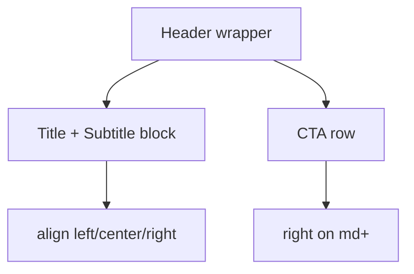

# I. Primer

## 1. TL;DR kiểu Feynman

- Hiện CTA `Xem tất cả` vẫn ở cùng tầng header với title/subtitle nên cảm giác còn “dính” nhau.
- Sẽ tách CTA sang dòng riêng bên dưới header content, nhưng vẫn canh phải.
- Title/subtitle tiếp tục bám `Căn lề tiêu đề`; CTA không còn cùng hàng/index với chúng.
- Chỉ sửa shared runtime ProductCategories, nên preview và site cùng đúng.

## 2. Elaboration & Self-Explanation

Dù đã tách vị trí logic, CTA hiện vẫn được đặt trong cùng khối header bằng absolute/right, nên về cảm nhận thị giác nó vẫn là cùng một hàng với title/subtitle. User muốn tách rõ tầng thông tin: tiêu đề là một block, CTA là block khác.

Cách xử lý phù hợp là render header theo 2 block dọc:
1. Block 1: title + subtitle, căn theo `align`.
2. Block 2: CTA row riêng, luôn `justify-end` trên desktop và vẫn ổn trên mobile.

Như vậy hierarchy sẽ rõ hơn: mắt đọc title/subtitle trước, sau đó mới thấy CTA ở dòng dưới.

## 3. Concrete Examples & Analogies

Ví dụ mong muốn:
- Dòng 1: `Danh mục sản phẩm`
- Dòng 2: `Khám phá các bộ sưu tập nổi bật...`
- Dòng 3: `Xem tất cả ->` nằm sát phải

Analogy: giống card header có phần nội dung ở trên và action bar riêng ở dưới; action không chen ngang tiêu đề.

# II. Audit Summary (Tóm tắt kiểm tra)

Observation:
- `renderHeader()` hiện dùng wrapper `relative` + CTA `absolute right/top`.
- Về layout logic thì title/subtitle không còn bị kéo theo.
- Nhưng về visual hierarchy, CTA vẫn nằm “ngang hàng” với title block.

Inference:
- Root issue còn lại là presentation hierarchy, không phải alignment logic.
- Chỉ cần đổi structure header từ overlay sang stacked blocks.

Decision:
- Chuyển `renderHeader()` sang layout dọc: content block trước, CTA row sau.
- Square Grid và Premium Grid header custom cũng áp dụng nguyên tắc tương tự.

# III. Root Cause & Counter-Hypothesis (Nguyên nhân gốc & Giả thuyết đối chứng)

Root Cause Confidence (Độ tin cậy nguyên nhân gốc): High.

Lý do:
- User feedback trực tiếp nói CTA “vẫn đang nằm cùng 1 hàng”.
- Điều này đúng với implementation absolute hiện tại: khác logic alignment nhưng chưa khác visual row.

Counter-Hypothesis:
- “Chỉ cần thêm margin-top nhỏ” không đủ, vì CTA vẫn thuộc cùng overlay layer.
- “Đổi z-index” không giải quyết hierarchy.
- “Do subtitle dài” không phải gốc vấn đề; kể cả subtitle ngắn CTA vẫn cùng hàng về cảm nhận.

# IV. Proposal (Đề xuất)

## 1. Scope & impacted paths

Sửa duy nhất:
- `app/admin/home-components/product-categories/_components/ProductCategoriesSectionShared.tsx`

## 2. Header structure mới

`renderHeader(extraAction)` sẽ thành 2 block:

```tsx
<div className="mb-5 md:mb-8">
  <div className={cn('min-w-0 flex flex-col', headerAlignClassName)}>
    <h2>...</h2>
    {subtitle ? <p>...</p> : null}
  </div>
  {extraAction ? (
    <div className="mt-3 flex justify-start md:mt-4 md:justify-end">
      {extraAction}
    </div>
  ) : null}
</div>
```

Behavior:
- Title/subtitle độc lập hoàn toàn.
- CTA luôn ở dòng dưới.
- Desktop/tablet: CTA sát phải.
- Mobile: CTA có thể trái hoặc phải; mặc định sẽ để `justify-start` ở mobile, `justify-end` từ `md` trở lên để dễ đọc và không quá gắt.

## 3. Header custom layouts

`Square Grid` và `Premium Grid` cũng đổi tương tự:
- bỏ `absolute`
- block 1 = title/subtitle
- block 2 = CTA row riêng nằm dưới, `md:justify-end`



# V. Files Impacted (Tệp bị ảnh hưởng)

- Sửa: `app/admin/home-components/product-categories/_components/ProductCategoriesSectionShared.tsx`  
  Vai trò hiện tại: shared runtime render 6 layouts ProductCategories cho preview/site.  
  Thay đổi: chuyển CTA từ overlay/cùng hàng sang dòng riêng dưới title/subtitle trong shared header và header custom liên quan.

# VI. Execution Preview (Xem trước thực thi)

1. Refactor `renderHeader()` thành 2 rows.
2. Refactor header custom của Square Grid.
3. Refactor header custom của Premium Grid.
4. Static review đảm bảo `align` chỉ áp lên title/subtitle.
5. Chạy `bunx tsc --noEmit`.
6. Commit local, không push.

# VII. Verification Plan (Kế hoạch kiểm chứng)

Static:
- `bunx tsc --noEmit`.
- Kiểm tra CTA không còn `absolute` trong các header đã sửa.

Manual:
- Preview ProductCategories: CTA xuống dòng riêng dưới title/subtitle.
- `align=center/right/left`: title/subtitle vẫn đúng.
- Square Grid + Premium Grid: CTA ở dòng dưới, canh phải trên desktop.
- Site parity giữ đúng vì dùng shared runtime.

# VIII. Todo

1. Tách CTA sang dòng riêng trong shared header.
2. Tách CTA sang dòng riêng trong Square Grid/Premium Grid header custom.
3. Typecheck.
4. Commit local.

# IX. Acceptance Criteria (Tiêu chí chấp nhận)

- CTA `Xem tất cả` không còn ở cùng hàng với title/subtitle.
- Title/subtitle vẫn bám đúng `Căn lề tiêu đề`.
- CTA nằm ở dòng riêng và canh phải từ desktop trở lên.
- Preview/site parity vẫn giữ.
- `bunx tsc --noEmit` pass.
- Có commit local, không push.

# X. Risk / Rollback (Rủi ro / Hoàn tác)

- Risk: header sẽ cao hơn một chút do CTA xuống dòng; chấp nhận được vì hierarchy rõ hơn.
- Rollback: revert commit là đủ.

# XI. Out of Scope (Ngoài phạm vi)

- Không đổi text CTA.
- Không đổi spacing card/category.
- Không đổi labels style picker.
- Không đổi color/token.

# XII. Open Questions (Câu hỏi mở)

Không có câu hỏi bắt buộc. Mặc định CTA xuống dòng riêng để tách hierarchy rõ nhất.