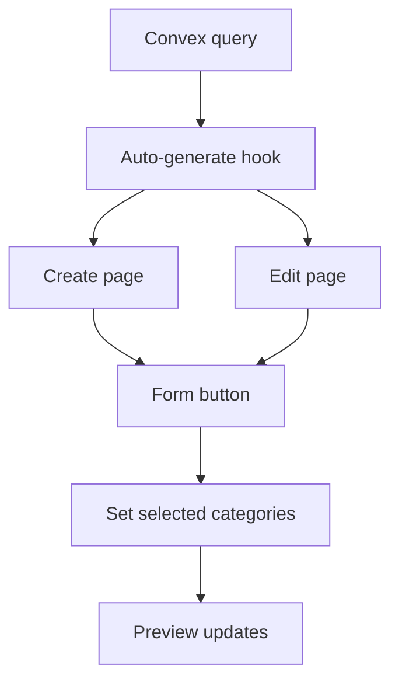

# I. Primer

## 1. TL;DR kiểu Feynman

- Sẽ thêm nút `Sinh nhanh` cho cả trang create và edit của ProductCategories.
- Khi bấm, hệ thống sẽ lấy tối đa 4 danh mục active có `productCount > 0`, ưu tiên số lượng sản phẩm nhiều nhất.
- Mỗi danh mục được set ảnh mặc định là ảnh sản phẩm đầu tiên của chính danh mục đó.
- Để làm đúng contract hiện tại, cần bổ sung query Convex trả thêm `representativeProductId` thay vì chỉ trả URL ảnh.
- Create và edit sẽ dùng chung một helper/hook để tránh lệch parity.

## 2. Elaboration & Self-Explanation

Hiện ProductCategories đã có form chọn thủ công danh mục, nhưng chưa có cách “điền nhanh”. Yêu cầu mới là bấm một nút rồi auto-fill các danh mục đang thật sự có sản phẩm, lấy khoảng 4 danh mục mạnh nhất.

Vấn đề quan trọng nhất là trường ảnh hiện tại của ProductCategories đang hỗ trợ mode `product-image` theo format `customImage = 'product:<productId>'`. Trong khi query đang có (`listActiveWithStats`) mới chỉ trả `representativeImage`, chưa trả `productId` của ảnh đại diện. Nếu chỉ ghi URL ảnh thẳng vào `customImage` với mode `url` thì UI vẫn hiện đúng ảnh, nhưng không còn đúng semantics “ảnh sản phẩm đầu tiên” theo contract hiện có.

Vì vậy hướng đúng là thêm query Convex nhỏ trả đủ:
- category id/name
- productCount
- representativeProductId
- representativeImage
rồi create/edit dùng cùng logic generate item với `imageMode: 'product-image'`.

## 3. Concrete Examples & Analogies

Ví dụ nếu dữ liệu thật đang có:
- Áo nam: 120 sản phẩm
- Váy nữ: 95 sản phẩm
- Giày chạy: 40 sản phẩm
- Túi xách: 12 sản phẩm
- Kính mát: 0 sản phẩm

Bấm `Sinh nhanh` sẽ auto chọn 4 danh mục đầu tiên có count > 0:
1. Áo nam
2. Váy nữ
3. Giày chạy
4. Túi xách

Mỗi item sẽ tự gắn ảnh sản phẩm đầu tiên của danh mục đó bằng `product:<id>`.

Analogy: giống nút “lấy đề xuất tốt nhất” trong form. Thay vì người dùng tự chọn tay từng danh mục, hệ thống nhìn dữ liệu thật và điền sẵn top phù hợp nhất.

# II. Audit Summary (Tóm tắt kiểm tra)

## 1. Observation

- `ProductCategoriesForm.tsx` hiện chỉ có nút `Thêm`, chưa có quick generate.
- `create/product-categories/page.tsx` và `product-categories/[id]/edit/page.tsx` đều giữ state riêng cho `selectedCategories` / `productCategoriesItems`.
- `convex/productCategories.ts` có `listActiveWithStats`, đã trả:
  - `productCount`
  - `representativeImage`
  - nhưng chưa có `representativeProductId`.
- Pattern auto-generate tốt nhất đã có ở:
  - `app/admin/home-components/homepage-category-hero/_lib/useHomepageCategoryHeroAutoGenerate.ts`
- `CategoryImageSelector` / ProductCategories config hiện bám pattern:
  - `imageMode: 'product-image'`
  - `customImage: 'product:<productId>'`

## 2. Inference

- Không nên generate từ `ProductCategoriesPreview.tsx` vì preview đang dùng `products.listPublicResolved({ limit: 100 })`, dễ lệch dữ liệu thật.
- Source of truth đúng phải nằm ở Convex query cho category stats.
- Nếu chỉ sửa create mà quên edit sẽ lệch behavior; cần chung helper/hook.

## 3. Decision

- Thêm query Convex riêng cho ProductCategories auto-generate.
- Query trả top categories có `productCount > 0`, sort desc theo count, take 4.
- Query trả thêm `representativeProductId` để set đúng mode `product-image`.
- Create + edit dùng chung helper/hook local trong ProductCategories domain.

# III. Root Cause & Counter-Hypothesis (Nguyên nhân gốc & Giả thuyết đối chứng)

Root Cause Confidence (Độ tin cậy nguyên nhân gốc): High.

Lý do:
- Chưa có UI trigger `Sinh nhanh`.
- Chưa có query trả đủ `productId` đại diện để auto-fill đúng contract ảnh.
- Create/edit đang duplicate state nên cần shared generate path để parity.

Counter-Hypothesis:
- “Dùng luôn `representativeImage` với mode `url`” có thể chạy, nhưng không bám đúng flow `product-image` hiện tại.
- “Generate từ preview products query” bị loại vì query preview có limit 100, không đáng tin làm source dữ liệu chuẩn.
- “Chỉ thêm cho create” bị loại vì user yêu cầu cả create và edit URL cụ thể.

# IV. Proposal (Đề xuất)

## 1. Scope & impacted paths

### Convex
- `convex/productCategories.ts`

### ProductCategories admin
- `app/admin/home-components/product-categories/_components/ProductCategoriesForm.tsx`
- `app/admin/home-components/create/product-categories/page.tsx`
- `app/admin/home-components/product-categories/[id]/edit/page.tsx`
- `app/admin/home-components/product-categories/_lib/auto-generate.ts` (thêm mới)
- `app/admin/home-components/product-categories/_lib/useProductCategoriesAutoGenerate.ts` (thêm mới)

## 2. Data contract đề xuất

### Query mới
Tạo query kiểu:
```ts
productCategories.listActiveAutoFillCandidates
```
trả về:
```ts
{
  categories: Array<{
    categoryId: Id<'productCategories'>;
    name: string;
    image?: string;
    productCount: number;
    representativeImage?: string;
    representativeProductId?: Id<'products'>;
  }>;
}
```

Rule:
- chỉ lấy category active
- chỉ lấy products active
- filter `productCount > 0`
- sort desc theo `productCount`
- tie-break bằng `_creationTime` hoặc order scan hiện có
- `slice(0, 4)`

### Generate result cho form
```ts
Array<{
  id: number;
  categoryId: string;
  customImage?: string;
  imageMode?: 'product-image';
}>
```

Mapping:
```ts
customImage = `product:${representativeProductId}`
imageMode = 'product-image'
```

## 3. UI plan

Trong `ProductCategoriesForm.tsx`:
- thêm nút `Sinh nhanh` cạnh nút `Thêm`
- disabled khi:
  - đang loading query
  - không có candidate nào hợp lệ
- có thể thêm text phụ nhỏ:
  - `Tự động chọn tối đa 4 danh mục có nhiều sản phẩm nhất.`

## 4. Shared generate helper plan

### File mới: `_lib/auto-generate.ts`
Pure function:
```ts
buildAutoGeneratedProductCategoriesItems(candidates)
```
- nhận list candidates đã sort
- lọc `productCount > 0`
- lấy tối đa 4
- tạo mảng item với `id` tuần tự từ 1
- bỏ candidate thiếu `representativeProductId`

### File mới: `_lib/useProductCategoriesAutoGenerate.ts`
Hook:
- gọi query Convex candidates
- expose:
  - `isAutoGenerateLoading`
  - `isAutoGenerateReady`
  - `generateFromRealData()`

Create/edit chỉ cần gọi hook và khi bấm nút thì:
```ts
const result = generateFromRealData()
if (result.status === 'success') setProductCategoriesItems(result.items)
```



# V. Files Impacted (Tệp bị ảnh hưởng)

## 1. Convex
- Sửa: `convex/productCategories.ts`  
  Vai trò hiện tại: query category active và stats.  
  Thay đổi: thêm query trả candidate auto-fill gồm `productCount`, `representativeImage`, `representativeProductId`.

## 2. ProductCategories shared logic
- Thêm: `app/admin/home-components/product-categories/_lib/auto-generate.ts`  
  Vai trò mới: pure helper build danh sách category items auto-generated.
- Thêm: `app/admin/home-components/product-categories/_lib/useProductCategoriesAutoGenerate.ts`  
  Vai trò mới: hook lấy dữ liệu thật từ Convex và expose generate handler cho create/edit.

## 3. ProductCategories form/page
- Sửa: `app/admin/home-components/product-categories/_components/ProductCategoriesForm.tsx`  
  Vai trò hiện tại: form chọn category thủ công.  
  Thay đổi: thêm nút `Sinh nhanh` và props liên quan.
- Sửa: `app/admin/home-components/create/product-categories/page.tsx`  
  Vai trò hiện tại: giữ state create + preview.  
  Thay đổi: dùng hook auto-generate và nối handler vào form.
- Sửa: `app/admin/home-components/product-categories/[id]/edit/page.tsx`  
  Vai trò hiện tại: giữ state edit + dirty tracking + preview.  
  Thay đổi: dùng cùng hook auto-generate và cho phép overwrite selection hiện tại.

# VI. Execution Preview (Xem trước thực thi)

1. Thêm query Convex trả auto-fill candidates.
2. Thêm helper pure build items.
3. Thêm hook `useProductCategoriesAutoGenerate`.
4. Update `ProductCategoriesForm` thêm nút `Sinh nhanh`.
5. Nối create page với hook + handler set state.
6. Nối edit page với hook + handler set state.
7. Kiểm tra dirty-state edit vẫn nhận thay đổi khi bấm `Sinh nhanh`.
8. Chạy `bunx tsc --noEmit`.
9. Commit local, không push.

# VII. Verification Plan (Kế hoạch kiểm chứng)

Static:
- `bunx tsc --noEmit`.
- Kiểm tra query trả đúng `representativeProductId` optional.
- Kiểm tra generate helper chỉ lấy categories `productCount > 0`.
- Kiểm tra create/edit dùng chung hook.

Manual:
- Mở create ProductCategories, bấm `Sinh nhanh`.
- Hệ thống chọn tối đa 4 category có sản phẩm nhiều nhất.
- Nếu chỉ có 3 category hợp lệ thì chỉ tạo 3.
- Mỗi item preview hiển thị ảnh từ product đầu tiên của category.
- Mở edit URL user đưa, bấm `Sinh nhanh`, state được cập nhật đúng.
- Save edit xong reload lại vẫn giữ config đúng.

# VIII. Todo

1. Thêm query Convex auto-fill candidates cho ProductCategories.
2. Thêm helper/hook auto-generate dùng chung.
3. Thêm nút `Sinh nhanh` vào form.
4. Nối create/edit với handler generate.
5. Typecheck.
6. Commit local.

# IX. Acceptance Criteria (Tiêu chí chấp nhận)

- Create ProductCategories có nút `Sinh nhanh`.
- Edit ProductCategories cũng có nút `Sinh nhanh`.
- Bấm nút sẽ auto chọn tối đa 4 category có `productCount > 0`, ưu tiên nhiều sản phẩm nhất.
- Nếu số category hợp lệ ít hơn 4 thì chỉ sinh đúng số đó.
- Ảnh mỗi item được set theo sản phẩm đầu tiên của category.
- Preview cập nhật ngay sau khi generate.
- Edit dirty-state nhận thay đổi khi generate.
- `bunx tsc --noEmit` pass.
- Có commit local, không push.

# X. Risk / Rollback (Rủi ro / Hoàn tác)

- Risk: “ảnh sản phẩm đầu tiên” phụ thuộc thứ tự scan products hiện tại; nếu cần deterministic khác phải định nghĩa rõ hơn sau.
- Risk: nếu candidate thiếu `representativeProductId`, item đó sẽ bị bỏ qua hoặc fallback; sẽ ưu tiên chỉ dùng candidate đủ dữ liệu.
- Rollback: revert commit là đủ; không đổi schema.

# XI. Out of Scope (Ngoài phạm vi)

- Không thêm modal xác nhận trước khi overwrite selection hiện tại.
- Không đổi ProductCategories preview runtime.
- Không đổi style/layout/colors.
- Không thêm config cho số lượng khác ngoài mặc định tối đa 4.

# XII. Open Questions (Câu hỏi mở)

Không có câu hỏi bắt buộc. Mặc định `Sinh nhanh` sẽ overwrite danh sách category hiện tại trong form để phản ánh đúng dữ liệu thật mới nhất.