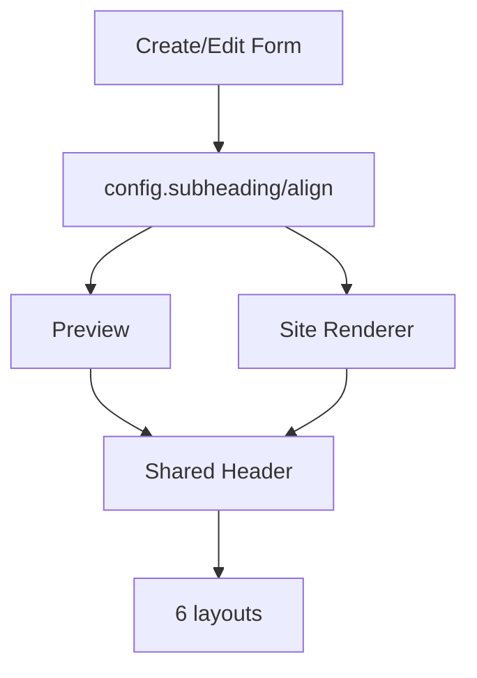

# I. Primer

## 1. TL;DR kiểu Feynman

- Sẽ thêm `Tiêu đề phụ` và `Căn lề tiêu đề` cho ProductCategories giống Partners.
- Nếu `Tiêu đề phụ` trống thì không render ra UI ở cả preview/site.
- Căn lề áp dụng cho header của cả 6 layout: trái, giữa, phải.
- Giữ schema mềm trong `config`, không đổi Convex schema.
- Create/edit cùng lưu/load `subheading` và `align`; shared runtime tự render cho cả 6 layout.

## 2. Elaboration & Self-Explanation

Hiện ProductCategories chỉ có `title` ở cấp component và shared runtime `ProductCategoriesSectionShared.tsx` chỉ nhận `title`. Partners có pattern rõ: `PartnersForm` có card “Phần đầu section” với `Tiêu đề phụ` và `Căn lề tiêu đề`; create page lưu `subheading`/`align` vào config; preview và runtime nhận các prop này để render header.

Với ProductCategories, cách đúng là thêm 2 field vào config: `subheading?: string` và `align?: 'left' | 'center' | 'right'`. Sau đó `ProductCategoriesSectionShared` nhận 2 prop này, render subtitle có điều kiện. Vì ProductCategories đã dùng shared runtime nên chỉ cần nối đúng ở create/edit/site là cả 6 layout cùng có subtitle và alignment.

## 3. Concrete Examples & Analogies

Ví dụ: user nhập `Khám phá các bộ sưu tập nổi bật trong tuần` vào Tiêu đề phụ và chọn `Giữa`. Tất cả layout sẽ render title + dòng subtitle bên dưới, căn giữa. Nếu xóa trống Tiêu đề phụ, UI chỉ còn title chính như hiện tại.

Analogy: Title là tên chương, subtitle là câu mô tả ngắn bên dưới. Nếu không viết câu mô tả thì trang không chừa khoảng trống thừa.

# II. Audit Summary (Tóm tắt kiểm tra)

Observation:
- Partners pattern:
  - `PartnersForm.tsx` có `subheading`, `setSubheading`, `align`, `setAlign`.
  - `create/partners/page.tsx` lưu `subheading: subheading.trim()` và `align` vào config.
  - `PartnersSectionHeader.tsx` render title/subheading + align map `left|center|right`.
- ProductCategories hiện tại:
  - `ProductCategoriesConfig` chỉ có `categories`, `style`, `showProductCount`, `columnsDesktop`, `columnsMobile`.
  - `create/product-categories/page.tsx` không có subtitle/align state.
  - `product-categories/[id]/edit/page.tsx` không load/save subtitle/align và dirty-state chưa track 2 field này.
  - `ProductCategoriesSectionShared.tsx` có helper `renderHeader(extraAction)` nhưng chưa có subtitle/align.
  - `ComponentRenderer.tsx` site chỉ truyền `title`, chưa truyền `config.subheading`/`config.align`.

Inference:
- Có thể làm giống Partners nhưng cần ProductCategories-specific type để không import Partners types.
- Vì config là object mềm, không cần migration; component cũ không có field sẽ fallback hợp lệ.
- Shared runtime là điểm tốt nhất để render subtitle cho cả 6 layout.

Decision:
- Thêm type `ProductCategoriesAlign = 'left' | 'center' | 'right'` và defaults.
- Thêm section form “Phần đầu section” vào ProductCategoriesForm hoặc card title hiện có.
- Lưu/load `subheading` và `align` ở create/edit.
- Render subtitle nếu `subheading.trim()` có nội dung.

# III. Root Cause & Counter-Hypothesis (Nguyên nhân gốc & Giả thuyết đối chứng)

Root Cause Confidence (Độ tin cậy nguyên nhân gốc): High.

Lý do:
- Evidence trực tiếp: ProductCategories config/runtime chưa có `subheading`/`align`.
- Partners đã có pattern tương ứng trong repo.
- User yêu cầu rõ “thêm subtitle phụ vào UI cho cả 6 layout”, “học partners”.

Counter-Hypothesis:
- “Chỉ thêm subtitle vào preview” bị loại vì site sẽ thiếu parity.
- “Chỉ dùng title phụ hardcode” bị loại vì user cần UI nhập và ẩn khi trống.
- “Dùng align của Partners type trực tiếp” không nên, vì ProductCategories nên tự có type/default để module độc lập.

# IV. Proposal (Đề xuất)

## 1. Scope & impacted paths

Áp dụng cho ProductCategories create/edit/preview/site:
- `/admin/home-components/create/product-categories`
- `/admin/home-components/product-categories/[id]/edit`
- site renderer qua `ComponentRenderer.tsx`
- 6 layout trong `ProductCategoriesSectionShared.tsx`

## 2. Data/config contract

Thêm optional fields vào config:
```ts
export type ProductCategoriesAlign = 'left' | 'center' | 'right';
export const DEFAULT_PRODUCT_CATEGORIES_ALIGN = 'center';

interface ProductCategoriesConfig {
  categories: CategoryConfigItem[];
  style: ProductCategoriesStyle;
  showProductCount: boolean;
  columnsDesktop: number;
  columnsMobile: number;
  subheading?: string;
  align?: ProductCategoriesAlign;
}
```

Backward compatibility:
- Component cũ không có `subheading` → render không có subtitle.
- Component cũ không có `align` → fallback `center`.

## 3. UI form plan

Thêm trong `ProductCategoriesForm.tsx` card “Phần đầu section”, giống Partners:
- Input `Tiêu đề phụ`
  - placeholder: `Ví dụ: Khám phá các bộ sưu tập nổi bật trong tuần.`
- Select `Căn lề tiêu đề`
  - Trái / Giữa / Phải

Có thể đặt card này trước “Cấu hình hiển thị” để đúng pattern Partners.

## 4. Runtime/header plan

Cập nhật `ProductCategoriesSectionShared.tsx`:
- Props mới: `subheading?: string`, `align?: ProductCategoriesAlign`.
- `renderHeader(extraAction)` sẽ:
  - tính `hasSubheading = subheading.trim().length > 0`.
  - align wrapper theo left/center/right.
  - render title và subtitle trong cùng block.
  - extra action như count/view-all vẫn đặt hợp lý; với mobile có thể stack.
- 6 layout vẫn gọi `renderHeader(...)`, nên subtitle áp dụng đồng loạt.
- Layout `marquee` và `circular` hiện có header riêng style-specific; sẽ chuyển sang dùng cùng logic hoặc bổ sung subtitle/align vào header riêng đó để không lệch.



## 5. Files Impacted (Tệp bị ảnh hưởng)

- Sửa: `app/admin/home-components/product-categories/_types/index.ts`  
  Vai trò hiện tại: định nghĩa style/config/item.  
  Thay đổi: thêm `ProductCategoriesAlign`, default align nếu đặt ở constants/types, và optional `subheading`, `align` vào config.

- Sửa: `app/admin/home-components/product-categories/_lib/constants.ts`  
  Vai trò hiện tại: style labels.  
  Thay đổi: thêm `DEFAULT_PRODUCT_CATEGORIES_ALIGN` nếu không đặt trong types.

- Sửa: `app/admin/home-components/product-categories/_components/ProductCategoriesForm.tsx`  
  Vai trò hiện tại: form cấu hình cột/count/category.  
  Thay đổi: thêm input Tiêu đề phụ và select Căn lề tiêu đề theo pattern Partners.

- Sửa: `app/admin/home-components/create/product-categories/page.tsx`  
  Vai trò hiện tại: create state + submit config + preview.  
  Thay đổi: thêm state `subheading`, `align`; save vào config; truyền vào form/preview.

- Sửa: `app/admin/home-components/product-categories/[id]/edit/page.tsx`  
  Vai trò hiện tại: edit load/save/dirty state + preview.  
  Thay đổi: load config `subheading/align`, track dirty, save lại, truyền vào form/preview.

- Sửa: `app/admin/home-components/product-categories/_components/ProductCategoriesPreview.tsx`  
  Vai trò hiện tại: wrapper preview + resolve data.  
  Thay đổi: truyền `config.subheading` và `config.align` xuống shared runtime.

- Sửa: `app/admin/home-components/product-categories/_components/ProductCategoriesSectionShared.tsx`  
  Vai trò hiện tại: render 6 layout.  
  Thay đổi: thêm shared header support subtitle/align cho cả 6 layout.

- Sửa: `components/site/ComponentRenderer.tsx`  
  Vai trò hiện tại: resolve ProductCategories data và gọi shared runtime.  
  Thay đổi: đọc `config.subheading`, `config.align` và truyền vào shared runtime.

# VI. Execution Preview (Xem trước thực thi)

1. Thêm type/default align và config fields.
2. Update ProductCategoriesForm props + card “Phần đầu section”.
3. Update create page state/submit/preview.
4. Update edit page state/load/save/dirty-state/preview.
5. Update preview wrapper truyền config mới.
6. Update shared runtime header render subtitle/align.
7. Update site renderer truyền config mới.
8. Static review: field trống ẩn subtitle, fallback align, không vỡ dữ liệu cũ.
9. Chạy `bunx tsc --noEmit` theo rule repo vì có code TS.
10. Commit local, không push.

# VII. Verification Plan (Kế hoạch kiểm chứng)

Static verification:
- `bunx tsc --noEmit`.
- Kiểm tra `subheading.trim()` khi save.
- Kiểm tra dirty-state edit gồm `subheading`/`align`.
- Kiểm tra preview và site cùng nhận config.

Manual verification đề xuất:
- Create ProductCategories: nhập subtitle, chọn align trái/giữa/phải, test 6 layout.
- Xóa trống subtitle: subtitle biến mất khỏi UI, không còn khoảng trống thừa.
- Edit route existing component: component cũ không có subtitle vẫn load bình thường.
- Lưu edit: reload lại subtitle/align vẫn đúng.
- Site homepage: header 6 layout khớp preview.

# VIII. Todo

1. Thêm type/default config subtitle/align.
2. Thêm UI form Tiêu đề phụ + Căn lề tiêu đề.
3. Nối create/edit save-load-dirty state.
4. Nối preview/site shared runtime.
5. Typecheck và commit.

# IX. Acceptance Criteria (Tiêu chí chấp nhận)

- ProductCategories create có input `Tiêu đề phụ` và select `Căn lề tiêu đề`.
- ProductCategories edit có cùng UI và load/save đúng.
- Subtitle xuất hiện ở cả 6 layout khi có nội dung.
- Subtitle trống thì ẩn khỏi UI, không tạo khoảng trống thừa.
- Align trái/giữa/phải áp dụng cho header cả 6 layout ở preview và site.
- Component cũ không có field mới vẫn render bình thường.
- `bunx tsc --noEmit` pass.
- Có commit local, không push.

# X. Risk / Rollback (Rủi ro / Hoàn tác)

Rủi ro:
- Header một số layout có cấu trúc riêng (`marquee`, `circular`) có thể cần chỉnh nhẹ để align không phá layout.
- Extra action như “Xem tất cả” có thể khó căn phải khi align center/right; sẽ ưu tiên title/subtitle align đúng và action vẫn dễ đọc.

Rollback:
- Không đổi schema, chỉ thêm optional config fields; revert commit code là đủ.

# XI. Out of Scope (Ngoài phạm vi)

- Không thêm rich text cho subtitle.
- Không thêm toggle ẩn title chính.
- Không đổi layout/card/category behavior.
- Không đổi màu/token trong task này.

# XII. Open Questions (Câu hỏi mở)

Không có câu hỏi bắt buộc. Mặc định subtitle là text thường, align default `center`, trống thì ẩn.