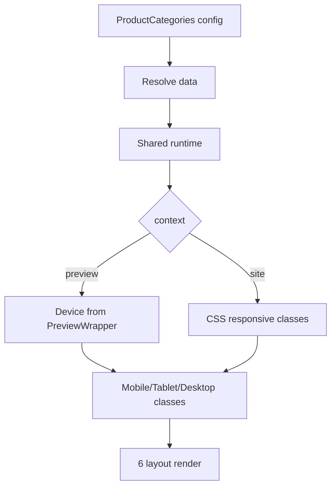

# I. Primer

## 1. TL;DR kiểu Feynman

- `danhmucnoibat` có 6 layout đẹp hơn: tròn tinh tế, grid ô vuông, card ảnh phủ, pill/list y khoa, carousel sách đứng, grid lớn premium.
- ProductCategories hiện tại đã có 6 style nhưng preview và site đang render lặp ở 2 nơi, dễ lệch khi sửa mobile/tablet.
- Hướng an toàn: tạo renderer chung cho ProductCategories, để create/edit preview và homepage dùng cùng 1 “xương” layout.
- Giữ `style` id cũ (`grid`, `carousel`, `cards`, `minimal`, `marquee`, `circular`) để không vỡ dữ liệu cũ, nhưng đổi UI bên trong theo 6 layout mới.
- Mobile/tablet sẽ không bê nguyên desktop: mỗi layout có grid/scroll/padding/text riêng để dễ dùng bằng một tay, không tràn ngang, touch target đủ lớn.
- Font mặc định giữ Be Vietnam Pro qua `font-active`/font system hiện có; không tự hardcode font khác.

## 2. Elaboration & Self-Explanation

Vấn đề chính không chỉ là “copy 6 layout mới vào preview”. Home-component này có 2 bề mặt quan trọng: admin preview tại `/admin/home-components/create/product-categories` và site thật qua `components/site/ComponentRenderer.tsx`. Hiện 2 nơi đang có logic render riêng, nên nếu chỉnh một bên rất dễ tạo lỗi kiểu preview đẹp nhưng homepage lệch.

Cách xử lý tốt hơn là gom phần render ProductCategories thành một shared runtime/component. Create page, edit page và site renderer cùng truyền config, data đã resolve, màu token và context (`preview` hoặc `site`) vào component chung. Khi đó sửa responsive mobile/tablet chỉ cần sửa ở một chỗ.

6 layout từ `C:\Users\VTOS\Downloads\danhmucnoibat\components\CategoryLayouts.tsx` sẽ được chuyển vào hệ thống hiện tại, nhưng không lấy y nguyên màu hardcode như `#1e4b8f`, `#8cc63f`, `#e04523`, `#fdfaf5`. Các màu đó sẽ được map sang token `primary/secondary/neutral` để hỗ trợ cả single và dual brand. Desktop đang ổn theo mẫu user đưa, nên ưu tiên preserve desktop feel và tối ưu riêng mobile/tablet.

## 3. Concrete Examples & Analogies

Ví dụ cụ thể: layout 1 trong `danhmucnoibat` là grid danh mục hình tròn `grid-cols-3 sm:grid-cols-4 md:grid-cols-6 lg:grid-cols-8`. Khi đưa vào repo, mobile sẽ giữ 3 cột nếu tên ngắn, nhưng cần clamp tên 2 dòng, giảm padding vòng tròn, giữ ảnh `object-contain`/icon centered và count text nhỏ để không vỡ chiều cao. Tablet sẽ dùng 4–6 cột tùy container, desktop giữ cảm giác 6–8 cột thoáng.

Analogy: hiện ProductCategories giống hai người thợ cùng sơn một căn nhà: một người sơn bản preview, một người sơn site thật. Nếu đưa bảng màu mới cho cả hai mà không có mẫu chung, mỗi người dễ sơn lệch. Shared runtime là “bản thiết kế chung”, cả preview và site cùng nhìn vào một bản.

# II. Audit Summary (Tóm tắt kiểm tra)

Observation:
- Đã đọc 6 layout ở `C:\Users\VTOS\Downloads\danhmucnoibat\components\CategoryLayouts.tsx`.
- ProductCategories hiện có module riêng:
  - `app/admin/home-components/create/product-categories/page.tsx`
  - `app/admin/home-components/product-categories/[id]/edit/page.tsx`
  - `app/admin/home-components/product-categories/_components/ProductCategoriesPreview.tsx`
  - `app/admin/home-components/product-categories/_components/ProductCategoriesForm.tsx`
  - `app/admin/home-components/product-categories/_lib/colors.ts`
  - `app/admin/home-components/product-categories/_lib/constants.ts`
  - `app/admin/home-components/product-categories/_types/index.ts`
- Site runtime hiện nằm trực tiếp trong `components/site/ComponentRenderer.tsx`, function `ProductCategoriesSection`, style keys: `grid | carousel | cards | minimal | marquee | circular`.
- ProductCategories preview và site cùng dùng `getProductCategoriesColors(...)`, cùng dedupe category, cùng xử lý `imageMode`, nhưng render UI bị duplicate.
- Commit gần đây của blog cho thấy các lỗi đã sửa xoay quanh parity/responsive/pagination: `72172db8 fix(blog): unify preview breakpoints`, `87d4a5c7 fix(blog): equalize layout 6 card heights`, `648deaf5 fix(blog): use real categories and wire view-all links`.
- Pattern tốt trong repo:
  - Blog dùng `BlogSectionRuntime.tsx` để share preview/site và có `context` + breakpoint helper.
  - FAQ dùng `FaqSectionShared.tsx` với container/breakpoint guard và token màu.
  - Partners tách 6 style thành shared components nhỏ, dễ maintain.
- WebSearch 2026 về ecommerce navigation/mobile category UX củng cố các nguyên tắc: clear navigation, mobile tap target, category grouping rõ, không bắt pinch/zoom, horizontal scroll phải có affordance và không gây overflow.

Inference:
- Nếu chỉ sửa trực tiếp `ProductCategoriesPreview.tsx` và `ComponentRenderer.tsx`, rủi ro drift cao.
- Config hiện tại đủ cho yêu cầu thay layout: `categories`, `style`, `showProductCount`, `columnsDesktop`, `columnsMobile`; chưa cần đổi schema.
- Nên giữ style id cũ để backward compatible với component đã lưu.

Decision:
- Refactor nhẹ theo hướng shared runtime cho ProductCategories, sau đó thay 6 layout trong shared runtime.
- Không đổi schema/Convex data model.
- Không thêm field mới như subtitle vì ProductCategories hiện chỉ có `title`; subtitle trong demo `danhmucnoibat` sẽ không đưa vào scope trừ khi user yêu cầu sau.

# III. Root Cause & Counter-Hypothesis (Nguyên nhân gốc & Giả thuyết đối chứng)

Root Cause Confidence (Độ tin cậy nguyên nhân gốc): High.

Lý do:
- Evidence trực tiếp: `ProductCategoriesPreview.tsx` render 6 styles riêng; `ComponentRenderer.tsx` cũng render 6 styles riêng trong `ProductCategoriesSection`.
- Commit blog gần đây cho thấy duplicate/breakpoint drift là nguyên nhân thường gặp khi layout preview và site không được unify.
- Demo `danhmucnoibat` có 6 layout desktop tốt nhưng responsive mobile/tablet còn generic; cần adaptive rules theo repo preview device.

Trả lời Audit Protocol:
1. Triệu chứng expected vs actual:
   - Expected: 6 layout mới đẹp hơn thay layout hiện tại, preview/create/edit/site đồng bộ, mobile/tablet tốt.
   - Actual: ProductCategories hiện có 6 layout cũ và preview/site duplicate, responsive phụ thuộc hai implementation.
2. Phạm vi ảnh hưởng:
   - Admin create/edit ProductCategories, preview admin, site homepage renderer, color tokens của ProductCategories.
3. Tái hiện/điều kiện tối thiểu:
   - Chọn style ProductCategories trong create/edit; so sánh preview với homepage sau khi lưu. Rủi ro lệch vì render logic khác file.
4. Mốc thay đổi gần nhất:
   - Blog component có chuỗi commit fix parity/responsive/pagination; ProductCategories chưa được nâng lên shared runtime như blog.
5. Dữ liệu thiếu:
   - Chưa có ảnh chụp desktop “ưng rồi” từ user, nhưng source code `danhmucnoibat` đã đủ để map 6 layout.
6. Giả thuyết thay thế:
   - Có thể chỉ cần copy layout demo vào 2 file không refactor. Bị loại một phần vì rủi ro drift cao và trái pattern blog/faq/partners gần đây.
7. Rủi ro nếu fix sai nguyên nhân:
   - Preview đẹp nhưng site lệch; mobile bị overflow; saved component cũ mất style mapping; màu dual không nhất quán.
8. Tiêu chí pass/fail:
   - 6 style render đúng ở create/edit và site; mobile/tablet không overflow; style id cũ vẫn load được; single/dual color token áp dụng đồng nhất.

Counter-Hypothesis (Giả thuyết đối chứng):
- “Chỉ cần thay CSS trong preview” không đủ, vì homepage dùng `ComponentRenderer.tsx` riêng.
- “Nên rename style thành layout1-layout6” không nên làm mặc định, vì sẽ vỡ hoặc cần migration dữ liệu cũ.
- “Nên thêm subtitle/showSubtitle như demo” chưa cần, vì yêu cầu chỉ thay 6 layout và tối ưu responsive/màu; thêm config mới sẽ mở rộng scope.

# IV. Proposal (Đề xuất)

## 1. Scope & impacted paths

Sửa ProductCategories home-component, bao gồm create/edit preview và site render:
- Admin create: `/admin/home-components/create/product-categories`
- Admin edit: `/admin/home-components/product-categories/[id]/edit`
- Site render: homepage qua `ComponentRenderer.tsx`

## 2. Source of truth

Source of truth mới:
- Data/config source: Convex `homeComponents.config` hiện có.
- Layout source: shared ProductCategories runtime mới trong module product-categories.
- Color source: `getProductCategoriesColors(...)` mở rộng semantic tokens.
- Font source: `font-active`/font override hiện có, default Be Vietnam Pro từ `app/layout.tsx`.

## 3. Preview ↔ Site parity map

| Surface | File | Contract cần giữ |
|---|---|---|
| Create | `app/admin/home-components/create/product-categories/page.tsx` | State style/config, submit giữ config cũ, truyền font/color vào preview |
| Edit | `app/admin/home-components/product-categories/[id]/edit/page.tsx` | Load/save/build config giữ backward compatibility |
| Preview | `ProductCategoriesPreview.tsx` | Chỉ làm wrapper: resolve data preview, device switch, style switch, info panel |
| Shared UI | `ProductCategoriesSectionShared.tsx` (thêm) | Render 6 layout mới, nhận `context`, `device`, `items`, `tokens`, link renderer |
| Site | `components/site/ComponentRenderer.tsx` | Resolve data thật, gọi shared runtime, link thật `/products?category=...` |
| Colors | `product-categories/_lib/colors.ts` | Token single/dual, APCA text, semantic colors cho 6 layout |
| Constants/types | `constants.ts`, `types/index.ts` | Giữ style id cũ, cập nhật label nếu cần |

## 4. Mapping 6 layout mới vào 6 style cũ

Giữ id cũ để không migration:

| Style hiện tại | Layout mới từ `danhmucnoibat` | Nhãn đề xuất | Ghi chú responsive |
|---|---|---|---|
| `grid` | Layout 1: hình tròn tinh tế | Tròn tinh tế | Mobile 3 cột, tablet 4–6 cột, desktop 6–8 cột; clamp tên 2 dòng |
| `carousel` | Layout 5: sách/box đứng horizontal | Sách ngang | Mobile/tablet horizontal snap, desktop scroll/peek; nút arrows chỉ khi cần |
| `cards` | Layout 3: card đè ảnh có CTA | Ảnh phủ CTA | Mobile 1 cột, tablet 2 cột, desktop 3–4 cột; overlay text contrast cao |
| `minimal` | Layout 4: pill/box list nhẹ | List gọn | Mobile 1 cột, tablet 2 cột, desktop 3–4 cột; touch target >=44px |
| `marquee` | Layout 2: grid ô vuông tối giản | Ô vuông tối giản | Đổi từ marquee animation sang grid tinh gọn; tránh auto-scroll gây khó dùng mobile |
| `circular` | Layout 6: grid lớn premium | Grid premium | Mobile 2 cột, tablet 3 cột, desktop 4 cột; card equal height |

Lưu ý: dù `marquee` id cũ không còn auto-marquee, vẫn giữ id để dữ liệu cũ không lỗi. Nếu muốn label phản ánh UI mới, chỉ đổi `PRODUCT_CATEGORIES_STYLES` label, không đổi id.

## 5. Responsive plan mobile/tablet

Legend: Shared runtime = component render chung cho preview và site.

Mobile rules:
- Section padding: `px-3/4`, `py-6/8`, không dùng desktop spacing quá lớn.
- Heading: `text-xl` hoặc `text-2xl`, `leading-tight`, không uppercase quá dày nếu dễ vỡ tiếng Việt.
- Touch target: link/card/button tối thiểu khoảng 44px chiều cao.
- Horizontal scroll: dùng `snap-x`, `overflow-x-auto`, hidden scrollbar đầy đủ WebKit/Firefox, có end spacer, không gây body horizontal scrollbar.
- Text: `line-clamp-1/2`, `min-w-0`, `truncate`, count text nhỏ; tên dài không phá grid.
- Image: placeholder/icon fallback giữ aspect ratio, `object-contain` cho layout tròn/ô vuông, `object-cover` cho card ảnh phủ.

Tablet rules:
- Không chỉ lấy desktop thu nhỏ. Tablet dùng 2–4 cột tùy layout:
  - circular/grid tinh tế: 4–6 cột.
  - cards ảnh phủ: 2–3 cột.
  - list gọn: 2 cột.
  - premium grid: 3 cột.
  - carousel sách: card width vừa đủ, có peek để biết vuốt.

Desktop rules:
- Preserve feel từ demo `danhmucnoibat` vì user đã ưng desktop.
- Chỉ thay hardcoded colors/fonts sang token repo.

## 6. Color/token plan single + dual

Mở rộng `getProductCategoriesColors(...)` theo semantic tokens, vẫn dùng OKLCH + APCA hiện có:
- `primary`: CTA, active underline, hover text, accent border.
- `secondary`: soft background, secondary badge, active surface, decorative bar trong dual mode.
- `neutral`: card bg, border, text, muted, overlay.
- `onPrimary`: text trên primary theo APCA.
- `overlayText`: luôn APCA-safe trên ảnh tối.
- `imageBg`: soft tint từ primary/secondary.
- `cardShadow`: tint theo secondary ở dual, primary ở single.

Single mode:
- `secondaryResolved = primary` nhưng token surface dùng tint/shade khác nhau để vẫn có phân cấp.

Dual mode:
- Primary dùng cho CTA/text active.
- Secondary dùng cho section surface, badges, border accent hoặc tab underline phụ.
- Nếu secondary quá gần primary, fallback vẫn đọc được nhờ APCA; không thêm warning UI trừ khi cần.

## 7. UX/SaaS inspiration applied

Từ các best practices ecommerce navigation 2026:
- Category cần scan nhanh: hình ảnh/icon + tên ngắn + count tùy chọn.
- Mobile không được bắt người dùng zoom/pinch; card phải đủ lớn để tap.
- Category hierarchy rõ hơn decoration: hover/animation nhẹ, không làm mất readability.
- Horizontal category row nên có snap/peek/arrow affordance, không autoplay bắt buộc.
- “Xem tất cả” giữ rõ ở header hoặc cuối section, nhưng preview context không navigate thật.

# V. Files Impacted (Tệp bị ảnh hưởng)

## UI / Admin preview

- Sửa: `app/admin/home-components/product-categories/_components/ProductCategoriesPreview.tsx`  
  Vai trò hiện tại: wrapper + render trực tiếp 6 style cũ trong preview.  
  Thay đổi: rút render layout sang shared runtime, giữ PreviewWrapper/device/style/info/color panel.

- Sửa: `app/admin/home-components/product-categories/_components/ProductCategoriesForm.tsx`  
  Vai trò hiện tại: form chọn category, cột desktop/mobile, show count.  
  Thay đổi: chỉ chỉnh label/help text nếu cần để phản ánh layout mới; không đổi behavior chính.

- Sửa: `app/admin/home-components/create/product-categories/page.tsx`  
  Vai trò hiện tại: create route, quản lý state và gọi preview.  
  Thay đổi: truyền config/font/color vào preview như cũ; có thể bỏ duplicate form logic nếu tận dụng `ProductCategoriesForm` nhưng chỉ làm nếu diff nhỏ.

- Sửa: `app/admin/home-components/product-categories/[id]/edit/page.tsx`  
  Vai trò hiện tại: edit route, load/save config và preview sticky.  
  Thay đổi: giữ load/save config cũ; preview dùng shared runtime sau refactor.

## Shared / Runtime

- Thêm: `app/admin/home-components/product-categories/_components/ProductCategoriesSectionShared.tsx`  
  Vai trò hiện tại: chưa có.  
  Thay đổi: render 6 layout mới, nhận `context`, `device`, `items`, `title`, `config`, `tokens`, `renderImage`, `getItemHref`.

- Thêm: `app/admin/home-components/product-categories/_lib/resolve.ts` hoặc helper cùng file nếu nhỏ  
  Vai trò hiện tại: logic resolve/dedupe/imageMode đang lặp ở preview và site.  
  Thay đổi: gom phần normalize item dùng chung nếu không tạo abstraction quá lớn; ưu tiên KISS.

## Colors / Types / Constants

- Sửa: `app/admin/home-components/product-categories/_lib/colors.ts`  
  Vai trò hiện tại: tạo token màu ProductCategories với APCA cơ bản.  
  Thay đổi: thêm semantic token cho 6 layout mới; loại hardcode màu từ demo; giữ single/dual behavior.

- Sửa: `app/admin/home-components/product-categories/_lib/constants.ts`  
  Vai trò hiện tại: label 6 style cũ.  
  Thay đổi: cập nhật label theo layout mới, giữ id cũ.

- Sửa: `app/admin/home-components/product-categories/_types/index.ts`  
  Vai trò hiện tại: type style/config/item.  
  Thay đổi: giữ union style cũ; thêm shared item/runtime prop type nếu cần.

## Site

- Sửa: `components/site/ComponentRenderer.tsx`  
  Vai trò hiện tại: chứa `ProductCategoriesSection` render trực tiếp 6 style cũ.  
  Thay đổi: giảm logic render inline, resolve data thật rồi gọi `ProductCategoriesSectionShared`; giữ ComponentRenderer wiring type `ProductCategories`.

# VI. Execution Preview (Xem trước thực thi)

1. Đọc kỹ lại đoạn `ProductCategoriesSection` trong `ComponentRenderer.tsx` để tách phần data resolving khỏi render UI.
2. Tạo shared item type và shared runtime `ProductCategoriesSectionShared.tsx`.
3. Port 6 layout từ `danhmucnoibat` vào shared runtime, map style id cũ sang layout mới.
4. Thay hardcoded colors trong demo bằng `getProductCategoriesColors(...)` semantic tokens.
5. Thêm helper responsive theo `context/device`, học pattern `BlogSectionRuntime.getResponsiveClassName`.
6. Update `ProductCategoriesPreview.tsx` để chỉ resolve preview data và gọi shared runtime trong `BrowserFrame`.
7. Update `ComponentRenderer.tsx` để site gọi shared runtime, giữ link thật và product count thật.
8. Update labels/info text/image size recommendations theo 6 layout mới.
9. Static self-review: type/null safety, fallback image/icon, long text, buttons `type="button"`, no overflow, fallback style cuối.
10. Theo project rule: không tự chạy lint/unit test/build. Nếu có thay đổi TS/code và được phép sau khi implement, trước commit chỉ chạy `bunx tsc --noEmit`; tuy nhiên AGENTS ghi cấm tự chạy lint/unit test.
11. Commit sau khi hoàn tất theo rule repo, không push.

# VII. Verification Plan (Kế hoạch kiểm chứng)

Không tự chạy lint/unit test/build theo `AGENTS.md`.

Static verification sẽ làm:
- Kiểm tra TypeScript bằng đọc code và import/type references.
- Kiểm tra style ids đủ 6 và fallback cuối.
- Kiểm tra preview buttons có `type="button"`.
- Kiểm tra `ProductCategoriesPreview` và site cùng gọi shared runtime.
- Kiểm tra image/icon fallback không null crash.
- Kiểm tra mobile/tablet classes không tạo horizontal overflow rõ ràng.
- Kiểm tra config cũ load/save không đổi field.

Manual verification đề xuất cho tester/user:
- Mở `/admin/home-components/create/product-categories`.
- Chọn từng layout, test Desktop/Tablet/Mobile trong PreviewWrapper.
- Lưu component, mở edit `/admin/home-components/product-categories/[id]/edit`, kiểm tra style/data còn đúng.
- Mở homepage/site thật, so sánh từng style với preview.
- Test single mode và dual mode màu; đổi primary/secondary để kiểm tra contrast.
- Test categories có ảnh, icon, product-image, upload/url, missing image.
- Test tên danh mục dài tiếng Việt và 1/2/3/8/12 danh mục.

# VIII. Todo

1. Refactor ProductCategories sang shared runtime preview/site.
2. Port 6 layout từ `danhmucnoibat` vào shared runtime.
3. Tối ưu responsive mobile/tablet cho từng layout.
4. Chuẩn hóa token màu single/dual và remove hardcoded demo colors.
5. Update create/edit preview labels/info và preserve config cũ.
6. Static self-review + commit, không push.

# IX. Acceptance Criteria (Tiêu chí chấp nhận)

- Có đúng 6 style ProductCategories, style id cũ vẫn hoạt động: `grid`, `carousel`, `cards`, `minimal`, `marquee`, `circular`.
- 6 style mới tương ứng 6 layout trong `danhmucnoibat`, desktop giữ tinh thần mẫu user đưa.
- Create và edit đều preview đúng layout mới.
- Site homepage render cùng layout với preview, không copy drift.
- Mobile không overflow ngang; tablet không bị desktop thu nhỏ xấu.
- Single color và dual color dùng token hợp lý, không còn màu demo hardcode làm vỡ brand.
- Font mặc định/override giữ theo hệ thống, Be Vietnam Pro là default.
- Không đổi schema Convex, không mất dữ liệu component cũ.
- Buttons tương tác trong preview có `type="button"`.
- Empty/missing image/long text/duplicate category được xử lý an toàn như hiện tại hoặc tốt hơn.

# X. Risk / Rollback (Rủi ro / Hoàn tác)

Rủi ro:
- `ComponentRenderer.tsx` lớn, tách ProductCategories có thể gây import/circular dependency nếu đặt file sai.
- Giữ id `marquee` nhưng UI thành grid ô vuông có thể gây hơi lệch kỳ vọng tên cũ; label sẽ được đổi để user hiểu.
- Product count site đang lấy từ `products.listPublicResolved`; nếu data lớn, hiện đã có rủi ro bandwidth. Scope này không đổi query để tránh mở rộng, nhưng có thể ghi nhận tối ưu riêng sau.
- Nếu shared runtime import admin image component vào site không đúng, cần tách `renderImage` prop như Blog/Partners.

Rollback:
- Vì giữ config/schema cũ, rollback chỉ cần revert commit code.
- Không có data migration, nên rủi ro rollback thấp.

# XI. Out of Scope (Ngoài phạm vi)

- Không thêm subtitle/showSubtitle config mới như demo `danhmucnoibat`.
- Không đổi Convex schema hoặc mutation.
- Không refactor toàn bộ `ComponentRenderer.tsx` ngoài ProductCategories.
- Không tối ưu database query product count trong task này, trừ khi phát hiện bug bắt buộc.
- Không chạy lint/unit test/build theo project instruction.

# XII. Open Questions (Câu hỏi mở)

Không có câu hỏi bắt buộc trước khi implement. Đề xuất mặc định là giữ style id cũ và thay UI bên trong để an toàn dữ liệu.