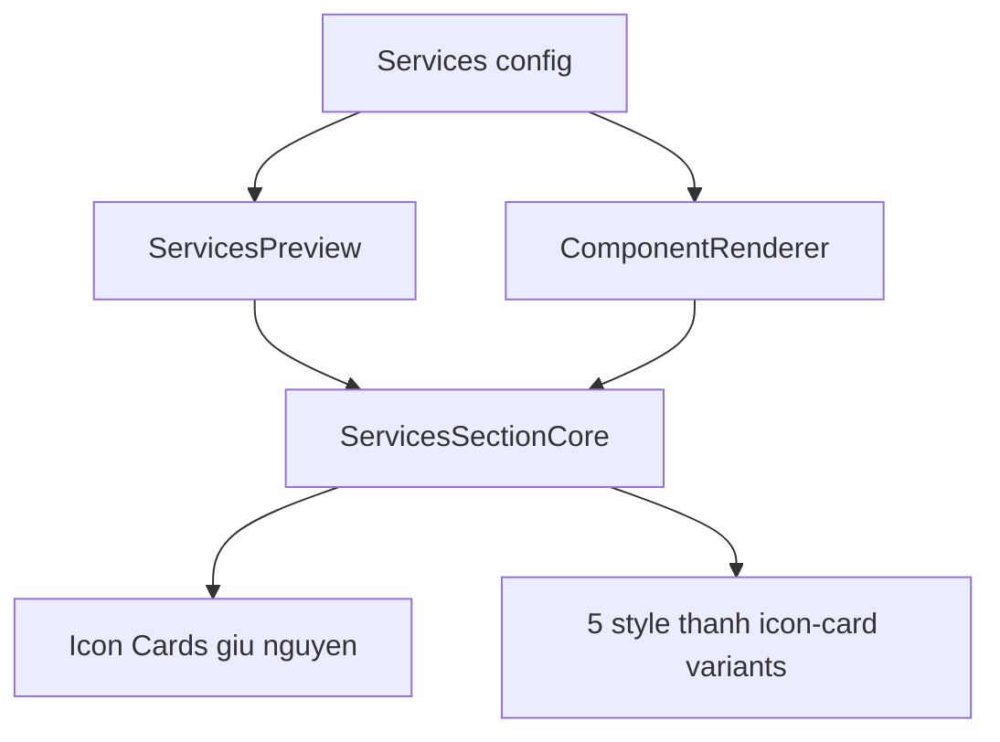

# I. Primer

## 1. TL;DR kiểu Feynman
- User muốn giữ layout `Icon Cards` hiện tại làm chuẩn thiết kế cho Services.
- 5 layout còn lại (`Elegant Grid`, `Modern List`, `Big Number`, `Carousel`, `Timeline`) đang đi xa hướng này: có số thứ tự, timeline, carousel, accent bar... nên cần đổi về các dải icon-card giống 5 ảnh mẫu.
- Không đổi contract dữ liệu: vẫn dùng `items`, `style`, `mediaPlacement`, `mediaAlign`, `desktopColumns`, `showTitle`, `showSubtitle`.
- Chỉ sửa renderer chung `ServicesSectionCore` để preview và site cùng thay đổi, tránh lệch preview/site.
- Không tự chạy lint/build theo rule repo; sau khi user approve sẽ tự review tĩnh và chạy `bunx tsc --noEmit` trước commit vì có đổi TS/TSX.

## 2. Elaboration & Self-Explanation
Hiện Services đã có 6 style trong `ServicesPreview.tsx`: `Elegant Grid`, `Modern List`, `Big Number`, `Icon Cards`, `Carousel`, `Timeline`. Trong đó `Icon Cards` ở `components/site/ServicesSectionCore.tsx` là hướng đúng: mỗi item là một card có icon/ảnh, title, description, dùng màu brand, và cùng một component render cho admin preview lẫn site thật.

Yêu cầu mới là biến 5 style còn lại thành 5 biến thể icon-card giống các screenshot: dải nền xanh/đậm có icon trắng, thanh ngang icon đỏ trên nền trắng, card navy bo góc, v.v. Nghĩa là `style` vẫn tồn tại để người dùng chọn, nhưng mỗi style phải là một biến thể cùng family với Icon Cards thay vì layout quá khác như timeline/carousel/big number.

## 3. Concrete Examples & Analogies
- Ví dụ bám repo: `style === 'bigNumber'` hiện đang hiển thị số `01`, `02` lớn và item đầu dùng nền primary. Sau sửa, nó sẽ trở thành một dải icon-card nền đậm/tương phản giống screenshot màu xanh tím, không còn nhấn bằng số thứ tự.
- Analogy: coi `Icon Cards` là “đồng phục chính”. 5 layout còn lại không bị xóa tên, nhưng được may lại thành 5 kiểu áo cùng đồng phục: khác màu/nền/khoảng cách, nhưng vẫn cùng ngôn ngữ icon + title + mô tả.

# II. Audit Summary (Tóm tắt kiểm tra)
- Observation: `ServicesPreview.tsx` import trực tiếp `ServicesSectionCore`, nên sửa core sẽ tự đồng bộ preview admin.
- Observation: `ComponentRenderer.tsx` cũng gọi `ServicesSectionCore` cho site runtime, nên sửa core là đúng source of truth.
- Observation: `ServicesSectionCore.tsx` hiện có đủ 6 branches: `elegantGrid`, `modernList`, `bigNumber`, `cards`, `carousel`, fallback `timeline`.
- Observation: `cards` hiện là layout Icon Cards chuẩn, có support `mediaPlacement`, `mediaAlign`, `desktopColumns`, image/icon fallback, remaining count runtime.
- Inference: 5 style còn lại nên được thay trong cùng file core, không cần đổi schema/config/edit page.
- Gap: chưa đọc được trực tiếp route localhost do spec mode; đã dùng screenshot và code route tương ứng để lập plan.

# III. Root Cause & Counter-Hypothesis (Nguyên nhân gốc & Giả thuyết đối chứng)
- Triệu chứng: 5 layout Services hiện khác hệ thiết kế Icon Cards; expected là 5 biến thể card icon như ảnh, actual là grid chữ, list số, big-number, carousel, timeline.
- Phạm vi: Services home-component ở admin preview và site runtime; không ảnh hưởng module services CRUD.
- Tái hiện: chọn các style khác `Icon Cards` trong `/admin/home-components/services/[id]/edit` sẽ thấy style drift.
- Mốc liên quan: code hiện tại trong `ServicesSectionCore.tsx` đang hardcode từng style với visual pattern riêng.
- Thiếu dữ liệu: chưa xác định user muốn mapping chính xác ảnh nào ứng với style nào, nhưng có một hướng hợp lý theo thứ tự 5 ảnh đã gửi.
- Giả thuyết thay thế: có thể chỉ muốn đổi preview không đổi site; loại trừ vì user nói layout của component và repo dùng shared core để parity.
- Rủi ro nếu fix sai: đổi nhầm style mapping làm nội dung đã chọn trong data thật hiển thị khác kỳ vọng.
- Tiêu chí pass/fail: 6 style vẫn chọn được; `Icon Cards` giữ nguyên; 5 style còn lại đều là icon-card family và giống tinh thần từng screenshot.

Root Cause Confidence (Độ tin cậy nguyên nhân gốc): High — evidence nằm ở `components/site/ServicesSectionCore.tsx`, nơi 5 style đang render các pattern khác hẳn Icon Cards, và cả preview/site đều dùng file này.

# IV. Proposal (Đề xuất)
Sửa `components/site/ServicesSectionCore.tsx` theo hướng surgical:

- Giữ nguyên style key và label hiện tại để không phá dữ liệu cũ.
- Giữ nguyên branch `style === 'cards'` càng ít đổi càng tốt vì user yêu cầu “dĩ nhiên giữ Icon Cards”.
- Thay UI của 5 branch còn lại thành 5 biến thể icon-card:
  - `elegantGrid`: card band xanh rêu/đậm, chia 4 cột, icon trắng trên đầu, title uppercase, text centered giống ảnh `122202`.
  - `modernList`: horizontal strip nền cyan, 3 item lớn, icon trong ô viền trắng, text trái giống ảnh `122245`.
  - `bigNumber`: strip nền trắng, icon đỏ/brand trái, chia cột bằng border dọc, title/description inline giống ảnh `122238`.
  - `carousel`: strip nền xanh tím/primary, icon trắng trên đầu, title uppercase, text centered giống ảnh `122229`; vẫn giữ nút carousel nếu cần nhưng visual card sẽ không còn lệch khỏi icon-card family.
  - `timeline` fallback: card navy bo góc, 4 item ngang, icon trái, text phải giống ảnh `122217`; fallback style vẫn nằm cuối như guard yêu cầu.
- Tạo helper nhỏ trong cùng file nếu cần để giảm lặp: render media/icon surface, grid class theo device, text fallback; không thêm abstraction lớn.
- Bổ sung iconMap nếu screenshot/user data dùng icon đã có ở form nhưng site core chưa map đủ (`Truck`, `Receipt`, `MessagesSquare`, `HandCoins`, v.v.) để tránh chọn icon trong admin nhưng site rơi về `Star`.

# V. Files Impacted (Tệp bị ảnh hưởng)
- Sửa: `components/site/ServicesSectionCore.tsx` — file source of truth render Services cho cả preview và site; thay 5 style drift thành 5 biến thể icon-card và mở rộng icon map nếu cần.
- Không sửa: `app/admin/home-components/services/_components/ServicesPreview.tsx` — giữ style labels và wiring hiện tại vì đã gọi shared core đúng.
- Không sửa: `components/site/ComponentRenderer.tsx` — giữ runtime wiring vì đã dùng shared core đúng.
- Không sửa: `app/admin/home-components/services/[id]/edit/page.tsx` — không đổi form/config save-load.
- Không sửa: `app/admin/home-components/services/_types/index.ts` — không đổi union type để giữ backward compatibility.

# VI. Execution Preview (Xem trước thực thi)
1. Đọc kỹ toàn bộ `ServicesSectionCore.tsx`, đặc biệt helper media, grid class, remaining runtime.
2. Mở rộng `lucide-react` imports và `iconMap` cho các icon đã có trong form nhưng core đang thiếu nếu cần.
3. Thêm helper class/layout nhỏ cho dải icon cards để 5 branch dùng nhất quán.
4. Sửa từng branch `elegantGrid`, `modernList`, `bigNumber`, `carousel`, fallback `timeline` theo 5 screenshot.
5. Giữ `cards` branch nguyên về behavior, chỉ chỉnh nếu helper chung yêu cầu tối thiểu.
6. Tự review tĩnh: type props, fallback title/description, image/icon render, preview device desktop/tablet/mobile, runtime remaining count.
7. Chạy `bunx tsc --noEmit` theo rule repo vì có đổi TS/TSX, rồi commit toàn bộ thay đổi code.

# VII. Verification Plan (Kế hoạch kiểm chứng)
- Static review: kiểm tra không đổi public config contract (`ServicesStyle`, `ServicesConfig`).
- Static review: đảm bảo preview và site đều đi qua `ServicesSectionCore`.
- Static review: đảm bảo fallback style `timeline` vẫn là return cuối.
- Static review: đảm bảo button trong carousel vẫn `type="button"`.
- Typecheck: chạy `bunx tsc --noEmit` trước commit theo AGENTS.md.
- Manual visual pass/fail cho tester: mở `/admin/home-components/services/js7am7fvd66csm32tx7mtsnrkx85gwb4/edit`, chuyển lần lượt 6 style; `Icon Cards` giữ nguyên, 5 style còn lại cùng ngôn ngữ icon-card và bám 5 screenshot.

# VIII. Todo
- [ ] Sửa `ServicesSectionCore.tsx` cho 5 variants.
- [ ] Kiểm tra static parity preview/site trong code.
- [ ] Chạy `bunx tsc --noEmit`.
- [ ] Commit thay đổi, không push.

# IX. Acceptance Criteria (Tiêu chí chấp nhận)
- `Icon Cards` vẫn render như hiện tại, không bị xóa/đổi label.
- 5 layout còn lại không còn dùng pattern số lớn/list số/timeline truyền thống làm hướng chính.
- Mỗi layout còn lại là một biến thể icon-card rõ ràng, bám màu/nền/spacing của 5 screenshot.
- Preview admin và site runtime dùng cùng logic, không lệch layout.
- Không đổi schema, không đổi saved config, không cần migrate dữ liệu cũ.
- Typecheck pass trước commit.

# X. Risk / Rollback (Rủi ro / Hoàn tác)
- Risk: người dùng cũ đang dùng `timeline`/`carousel` thật sẽ thấy visual thay đổi mạnh dù style key không đổi; đây là đúng theo yêu cầu thay layout.
- Risk: nếu mapping ảnh-to-style không đúng ý, chỉ cần chỉnh lại từng branch trong `ServicesSectionCore.tsx`, không cần đổi dữ liệu.
- Rollback: revert commit sau khi hoàn tất sẽ khôi phục toàn bộ visual cũ.

# XI. Out of Scope (Ngoài phạm vi)
- Không đổi dữ liệu thật trong Convex.
- Không thêm style key mới hoặc đổi label UI.
- Không refactor toàn bộ Services admin form.
- Không sửa Product List file đang dirty sẵn trong git status.

# XII. Open Questions (Câu hỏi mở)
Không cần hỏi thêm để triển khai vì user đã đưa 5 ảnh và yêu cầu rõ: giữ `Icon Cards`, thay 5 layout còn lại theo hướng 5 ảnh. Mapping sẽ theo thứ tự style hiện có và thứ tự ảnh đã gửi như trong Proposal.