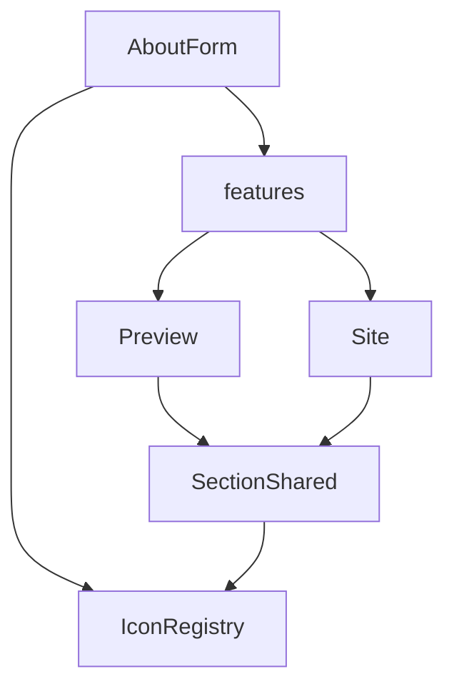

# I. Primer

## 1. TL;DR kiểu Feynman

- Form `Điểm nổi bật` đang bị “lặp thông tin”: icon hiện ở preview nhỏ, nút `Icon`, và combobox; title cũng dễ bị cảm giác lặp vì layout item đang chia 2 tầng.
- Preview layout 1/3/5 không ăn đúng icon vì renderer About chỉ import/map một nhóm icon nhỏ, trong khi form cho chọn nhiều icon hơn.
- Cách fix đúng là gom icon registry (danh sách icon) dùng chung cho Form và Renderer, rồi render media từ đúng source này.
- Form mỗi item sẽ còn 1 dòng chính: kéo/số thứ tự, chọn Icon/Ảnh, combobox hoặc upload, title, xoá.
- Không đổi dữ liệu thật, chỉ sửa UI form + renderer About để preview/site parity đúng.

## 2. Elaboration & Self-Explanation

Hiện lỗi có 2 lớp. Lớp đầu là UI form: một item đang hiển thị media ở nhiều nơi cùng lúc. `FeatureMediaPreview` render icon ở đầu dòng, nút `Icon` cũng có biểu tượng ngôi sao, combobox lại render selected icon. Do đó nhìn như icon lặp 3 lần. Với title cũng vậy, form trước đó từng có 2 input title; hiện code đã giảm nhưng layout vẫn chưa “1 dòng gọn” đúng ý.

Lớp thứ hai là renderer: `AboutForm` có danh sách icon lớn hơn, nhưng `AboutSectionShared` chỉ map một số icon như `Award`, `Heart`, `Medal`, `Sparkles`, `Star`, v.v. Khi chọn `Anchor`, renderer không biết `Anchor`, nên fallback về `CheckCircle2`. Vì vậy preview không thể thấy đúng icon ngay.

## 3. Concrete Examples & Analogies

Ví dụ cụ thể: trong form chọn `Anchor`. Form combobox biết `Anchor`, nhưng `AboutSectionShared.renderIcon()` không có key `Anchor`, nên preview layout 1 hiển thị icon mặc định. Đây là mismatch giữa “người bán hàng có danh mục 100 món” và “kho chỉ nhận diện 10 món”.

Analogy: Form là menu gọi món, Preview là bếp. Nếu menu ghi “Anchor” mà bếp không có công thức Anchor, bếp sẽ nấu món mặc định. Cần dùng chung một cuốn menu/công thức.

# II. Audit Summary (Tóm tắt kiểm tra)

- Observation: `AboutForm.tsx` hiện có `FeatureMediaPreview`, toggle `Icon/Ảnh`, và `IconCombobox`; cả 3 đều có khả năng hiển thị icon/media.
- Observation: `AboutForm.tsx` định nghĩa `ABOUT_ICON_COMPONENTS` riêng, có nhiều icon như `Anchor`, `Activity`, `AirVent`, v.v.
- Observation: `AboutSectionShared.tsx` định nghĩa `renderIcon()` riêng, chỉ map một tập icon nhỏ, thiếu nhiều icon form cho chọn.
- Observation: layout 1 (`classic`), layout 3 (`minimal`), layout 5 (`timeline`) hiện đã gọi `renderFeatureMedia()`, nhưng function này vẫn dựa vào `renderIcon()` thiếu icon.
- Observation: layout 2 cũng đã dùng `renderFeatureMedia()`, còn layout 4/6 vẫn dùng dot/bullet theo design nên không nhất thiết nhận icon.

# III. Root Cause & Counter-Hypothesis (Nguyên nhân gốc & Giả thuyết đối chứng)

- Triệu chứng quan sát được: chọn icon trong form, preview layout 1/3/5 không hiển thị đúng icon; form item nhìn rối vì icon/text bị lặp.
- Phạm vi ảnh hưởng: About home-component create/edit preview và site renderer vì cùng dùng `AboutSectionShared`.
- Tái hiện tối thiểu: chọn item `Điểm nổi bật`, chọn icon `Anchor`; preview layout 1 vẫn thấy icon fallback thay vì Anchor.
- Mốc thay đổi gần nhất: commit `058ca192` thêm icon/image cho highlight items, commit `84b41f30` gọn form nhưng chưa dùng shared icon registry.
- Dữ liệu thiếu: chưa chạy browser để nhìn trực tiếp trong DOM, nhưng screenshot + code path đủ chỉ ra mismatch icon map.
- Giả thuyết thay thế: lỗi do state không update. Không phù hợp vì form combobox hiển thị đúng selected value, còn renderer thiếu key nên fallback.
- Rủi ro nếu fix sai: import quá nhiều icon thủ công làm file phình và dễ lệch lần nữa; form vẫn có thể lặp nếu giữ preview icon đầu dòng.
- Tiêu chí pass/fail: chọn icon nào trong combobox thì layout 1/3/5 preview đổi đúng ngay; form mỗi item chỉ có một nơi hiển thị icon/media và một input title.

Độ tin cậy nguyên nhân gốc: High. Evidence từ `AboutForm.tsx` và `AboutSectionShared.tsx`: 2 registry icon tách rời, renderer thiếu các icon form cho chọn.

# IV. Proposal (Đề xuất)

## a) Fix shared icon registry

Tạo hoặc cập nhật shared helper nội bộ About, ví dụ:

- `app/admin/home-components/about/_lib/iconRegistry.tsx`
  - export `ABOUT_ICON_NAMES`
  - export `ABOUT_ICON_COMPONENTS`
  - export `getAboutIconComponent(iconName)`
  - export `ABOUT_ICON_OPTIONS`

Form và Renderer sẽ cùng import từ file này, tránh drift.

## b) Fix form item 1 dòng

Trong `AboutForm.tsx`, mỗi item `Điểm nổi bật` sẽ thành một hàng gọn:

- Drag handle
- `#n`
- Segmented control `Icon | Ảnh` dạng text-only hoặc icon rất tối giản, không lặp selected icon
- Nếu `Icon`: hiện 1 combobox duy nhất có icon selected + tên icon
- Nếu `Ảnh`: hiện upload ảnh duy nhất
- Input title duy nhất
- Delete button

Bỏ `FeatureMediaPreview` ở đầu dòng để không lặp icon/media.

## c) Fix renderer layout 1/3/5

Trong `AboutSectionShared.tsx`:

- Bỏ local `renderIcon()` tự map ít icon.
- Dùng `getAboutIconComponent()` từ shared registry.
- `renderFeatureMedia()` nhận `feature.mediaType`:
  - `image` + có `image` → render ảnh.
  - còn lại → render đúng icon component theo `feature.iconName`.
- Layout 1/3/5 sẽ dùng `renderFeatureMedia()` như hiện tại nhưng source icon sẽ đúng.

## d) Optional cleanup nhỏ

- Sửa type lỗi thừa trong `AboutEditorStat` hiện đang có `stats?: AboutPersistStat[]` không hợp lý, vì đây là field lạc vào type stat.
- Không xoá toàn bộ stat legacy nếu không cần; chỉ không dùng trong form/render.

# V. Files Impacted (Tệp bị ảnh hưởng)

- Thêm: `app/admin/home-components/about/_lib/iconRegistry.tsx` — chứa danh sách icon và component map dùng chung cho form + renderer.
- Sửa: `app/admin/home-components/about/_components/AboutForm.tsx` — bỏ preview icon đầu dòng, bỏ lặp title, dùng shared icon combobox registry, item nằm gọn trên 1 dòng.
- Sửa: `app/admin/home-components/about/_components/AboutSectionShared.tsx` — dùng shared icon registry để layout 1/3/5 render đúng icon đã chọn.
- Sửa: `app/admin/home-components/about/_types/index.ts` — cleanup type `AboutEditorStat` nếu cần, không đổi shape config chính.

# VI. Execution Preview (Xem trước thực thi)

1. Tách icon map đang nằm trong `AboutForm.tsx` sang `_lib/iconRegistry.tsx`.
2. Cập nhật `AboutForm` import registry, bỏ `FeatureMediaPreview`, chỉnh row item thành một dòng.
3. Cập nhật `AboutSectionShared` import `getAboutIconComponent`, bỏ local icon map thiếu icon.
4. Review các layout 1/3/5 đảm bảo dùng `renderFeatureMedia()`.
5. Chạy `bunx tsc --noEmit` theo rule repo.
6. Commit thay đổi, không push.

# VII. Verification Plan (Kế hoạch kiểm chứng)

- Static review:
  - Form không còn `FeatureMediaPreview` đầu dòng.
  - Chỉ còn 1 input title trong mỗi feature item.
  - Form và renderer import cùng `getAboutIconComponent`.
  - `Anchor` và các icon trong combobox có trong renderer map.
- Typecheck:
  - Chạy `bunx tsc --noEmit`.
- Visual check đề xuất cho tester:
  - Chọn layout 1, đổi icon `Anchor` → preview item đổi sang Anchor.
  - Chọn layout 3 và 5, đổi icon khác → preview đổi ngay.
  - Chọn `Ảnh`, upload ảnh → preview dùng ảnh tại vị trí media nếu layout hỗ trợ media.

# VIII. Todo

- [ ] Tạo shared icon registry cho About.
- [ ] Refactor form item `Điểm nổi bật` về 1 dòng, không lặp icon/title.
- [ ] Refactor renderer layout 1/3/5 dùng shared icon registry.
- [ ] Cleanup type thừa nếu phát hiện an toàn.
- [ ] Chạy `bunx tsc --noEmit`.
- [ ] Commit thay đổi.

# IX. Acceptance Criteria (Tiêu chí chấp nhận)

- Form item `Điểm nổi bật` không còn hiện icon 3 lần.
- Mỗi item chỉ có một input nội dung/title.
- Chọn icon trong combobox thì preview layout 1/3/5 đổi đúng icon ngay.
- Icon options trong form và renderer không lệch nhau.
- Không làm mất khả năng chọn/upload ảnh cho từng item.
- Typecheck pass.

# X. Risk / Rollback (Rủi ro / Hoàn tác)

- Rủi ro: import nhiều icon có thể tăng bundle admin/site cho About. Giảm bằng cách chỉ đưa khoảng 100 icon được chọn, không import toàn bộ lucide.
- Rủi ro: layout 4/6 vẫn dùng bullet dot theo design, nếu muốn chúng cũng nhận icon cần scope riêng.
- Rollback: revert commit fix form/registry, dữ liệu config `features` vẫn giữ nguyên.

# XI. Out of Scope (Ngoài phạm vi)

- Không đổi lại 6 layout About tổng thể.
- Không migrate dữ liệu cũ.
- Không đổi component Services.
- Không pixel-perfect toàn bộ card preview ngoài lỗi form lặp và icon parity.

# XII. Open Questions (Câu hỏi mở)

- Không có câu hỏi bắt buộc. Hướng recommend là dùng shared icon registry vì đây là nguyên nhân trực tiếp làm form và preview lệch.