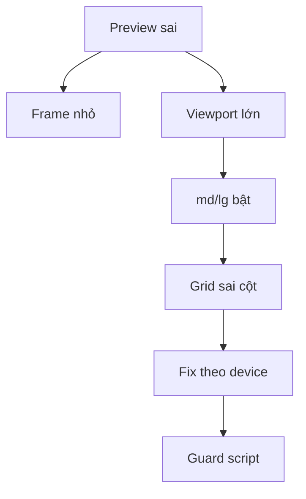

# I. Primer

## 1. TL;DR kiểu Feynman
- Lỗi gốc: preview mobile/tablet chỉ thu nhỏ `div`, còn Tailwind `sm/md/lg/xl` vẫn đo viewport của trang admin.
- Sẽ fix từng component theo cùng một luật: **preview dùng `device` để chọn layout**, site/runtime mới dùng `sm/md/lg`.
- Thứ tự fix: `footer → gallery → product-list → partners → video → trust-badges` đúng như anh yêu cầu.
- Sau đó thêm guard để “code lỗi luôn”: helper dùng chung + script static check bắt layout breakpoint nguy hiểm trong preview.
- Không chỉ comment vì comment không chặn lỗi; comment chỉ là nhắc, còn script mới làm fail khi code sai.

## 2. Elaboration & Self-Explanation
Trong preview, `device='mobile'` nghĩa là khung render rộng khoảng 375px, nhưng browser viewport của admin vẫn có thể đang 1440px. Tailwind class như `md:grid-cols-3` sẽ bật theo viewport 1440px, nên mobile preview vẫn có thể thành 3 cột. Vì vậy mọi class quyết định layout chính trong preview phải được chọn bằng biến `device`, ví dụ `device === 'mobile' ? 'grid-cols-1' : device === 'tablet' ? 'grid-cols-2' : 'grid-cols-3'`.

Để tránh tái diễn, guard nên có 2 tầng:
- Tầng code: helper `getPreviewDeviceClass(...)` để pattern đúng dễ dùng và nhìn ra ngay.
- Tầng bắt lỗi: script scan `*Preview*.tsx` / `*SectionShared*.tsx` và fail nếu thấy layout-critical breakpoint như `md:grid-cols-*`, `lg:w-*`, `md:flex-row`, `md:col-span-*` trong preview mà không có allowlist rõ ràng.

## 3. Concrete Examples & Analogies
Ví dụ sai trong Footer preview: `grid grid-cols-1 md:grid-cols-12`. Khi admin viewport đủ rộng, mobile frame vẫn có thể bật `md:grid-cols-12`.

Ví dụ đúng trong preview: `cn('grid', device === 'mobile' ? 'grid-cols-1' : device === 'tablet' ? 'grid-cols-2' : 'grid-cols-12')`.

Analogy: đặt một mô hình điện thoại nhỏ trên một cái bàn lớn không làm căn phòng nhỏ lại. Tailwind đang đo căn phòng, còn preview chỉ làm mô hình nhỏ đi.

# II. Audit Summary (Tóm tắt kiểm tra)

## 1. Observation (Quan sát)
- `footer`: FAIL rõ, nhiều layout chính dựa `md:` trong preview.
- `gallery`: RISK cao, nhiều style dùng `md:grid`, `md:col-span`, `md:auto-rows` trong preview.
- `product-list`: RISK, có chỗ đã branch theo device nhưng vẫn còn `sm:grid-cols-2` / layout breakpoint trong preview shared.
- `partners`: RISK, `columnsClassName` còn dùng `md/xl/2xl` ngay trong preview.
- `video`: RISK, style split dùng `grid-cols-1 md:grid-cols-2` dù shared đã có `isPreview/device`.
- `trust-badges`: RISK thấp-vừa, có `lg:grid-cols-2` và một số breakpoint layout/cosmetic lẫn nhau.

## 2. Inference (Suy luận)
- Các component này có cùng root cause với Services: preview frame width không điều khiển Tailwind breakpoint.
- Fix nên làm theo pattern tốt đang có ở `team`, `testimonials`, `service-list`, `voucher-promotions`.

## 3. Decision (Quyết định)
- Fix theo thứ tự anh đưa.
- Không đổi business config/data model.
- Không thêm framework mới.
- Thêm guard dạng helper + script static check, không chỉ comment.

# III. Root Cause & Counter-Hypothesis (Nguyên nhân gốc & Giả thuyết đối chứng)

## 1. Root Cause Confidence (Độ tin cậy nguyên nhân gốc)
High.

Lý do:
- Evidence từ `PreviewWrapper`: preview chỉ áp `deviceWidthClass` vào wrapper `div`.
- Tailwind breakpoint mặc định đo viewport, không đo wrapper.
- Services đã tái hiện đúng triệu chứng và hướng fix đúng là branch bằng `isPreview + device`.

## 2. Counter-Hypothesis (Giả thuyết đối chứng)
- Một số `md:` chỉ đổi text/spacing như `md:text-*`, `md:p-*`, `md:gap-*`; các class này có thể không phá layout chính.
- Vì vậy guard sẽ tập trung vào **layout-critical breakpoint**, không cấm tuyệt đối mọi `md:` để tránh false positive quá nhiều.

## 3. Problem Graph

# IV. Proposal (Đề xuất)

## 1. Fix Footer
- Refactor `FooterPreview.tsx` để layout chính dùng helper/device class:
  - Grid 12 cột: mobile `grid-cols-1`, tablet/desktop theo layout mong muốn nhưng không dùng `md:grid-cols-*` trong preview.
  - `flex-col md:flex-row` đổi sang `device === 'mobile' ? 'flex-col' : 'flex-row'`.
  - `grid-cols-2 md:grid-cols-3/4` đổi sang device map.
- Giữ style/visual hiện tại, chỉ sửa responsive decision.

## 2. Fix Gallery
- Refactor các style đang dùng breakpoint layout:
  - Spotlight / mosaic / stories / masonry-like layout: class cột, `col-span`, `row-span`, `auto-rows` chọn bằng `device`.
  - Không đổi số item render trừ khi đang gây overflow rõ.
- Các class text/spacing cosmetic giữ lại nếu không ảnh hưởng layout chính.

## 3. Fix ProductList
- Trong `ProductListSectionShared.tsx`, chỉnh các nhánh preview còn dùng breakpoint layout:
  - `sm:grid-cols-2` trong mobile preview đổi thành device map rõ.
  - Grid/showcase/carousel width trong preview không phụ thuộc `sm/md/lg`.
- Không đổi runtime site classes.

## 4. Fix Partners
- `PartnersPreview.tsx` đổi `columnsClassName` preview thành map thuần theo `device`:
  - mobile: ví dụ `grid-cols-2`
  - tablet: ví dụ `grid-cols-3`
  - desktop: ví dụ `grid-cols-4` hoặc `grid-cols-5` theo style hiện có
- Bỏ `md:`, `xl:`, `2xl:` khỏi class layout preview.

## 5. Fix Video
- Trong `VideoSectionShared.tsx`, style `split` tách class:
  - preview mobile: `grid-cols-1`
  - preview tablet/desktop: `grid-cols-2`
  - site: giữ `grid-cols-1 md:grid-cols-2`
- Các style khác chỉ sửa nếu có layout-critical breakpoint đang ảnh hưởng preview.

## 6. Fix TrustBadges
- Trong `TrustBadgesPreview.tsx`, đổi các grid layout chính còn dùng `lg:grid-cols-2` / breakpoint cột sang device map.
- Phân loại `md:gap`, `md:h` nếu chỉ cosmetic thì giữ; nếu làm đổi số cột/flow/card width thì sửa.

## 7. Guard để code sai thì lỗi
- Thêm helper shared:
  - `app/admin/home-components/_shared/lib/previewResponsive.ts`
  - Export `getPreviewDeviceClass(device, { mobile, tablet, desktop })`.
  - Export optional `getPreviewAwareClass({ isPreview, device, preview, site })` cho shared renderer dùng cả preview/site.
- Thêm comment guard ngắn trong `PreviewWrapper.tsx` ngay trước frame width.
- Thêm static script:
  - `scripts/check-home-preview-breakpoints.mjs`
  - Scan `app/admin/home-components/**/*Preview*.tsx` và `app/admin/home-components/**/*SectionShared*.tsx`.
  - Fail nếu thấy layout-critical responsive tokens trong preview files, ví dụ:
    - `sm:grid-cols-`, `md:grid-cols-`, `lg:grid-cols-`, `xl:grid-cols-`
    - `sm:w-`, `md:w-`, `lg:w-` khi đi với card/carousel width
    - `md:flex-row`, `lg:flex-row`
    - `md:col-span-`, `lg:col-span-`
    - `md:auto-rows-`, `lg:auto-rows-`
    - `columns-*` responsive variants
  - Có allowlist comment dạng `// preview-breakpoint-allow: cosmetic` cho trường hợp thật sự chỉ spacing/text hoặc đã được review.
- Thêm npm/bun script trong `package.json`:
  - `check:home-preview-breakpoints`: chạy script trên.
- Không tự chạy lint/unit test. Sau implement chỉ review diff; nếu chuẩn bị commit code TS thì chạy `bunx tsc --noEmit` theo rule project.

# V. Files Impacted (Tệp bị ảnh hưởng)

## 1. UI preview cần sửa
- Sửa: `app/admin/home-components/footer/_components/FooterPreview.tsx` — preview footer hiện phụ thuộc nhiều vào `md:`; đổi layout chính sang device-aware classes.
- Sửa: `app/admin/home-components/gallery/_components/GalleryPreview.tsx` — preview gallery còn mix `md:` cho grid/col-span/auto-rows; đổi layout chính sang device map.
- Sửa: `app/admin/home-components/product-list/_components/ProductListSectionShared.tsx` — shared renderer có nhánh preview nhưng còn vài breakpoint layout; tách preview/site rõ hơn.
- Sửa: `app/admin/home-components/partners/_components/PartnersPreview.tsx` — columns preview bỏ `md/xl/2xl`, dùng device map.
- Sửa: `app/admin/home-components/video/_components/VideoSectionShared.tsx` — style split đổi layout preview theo device, site giữ breakpoint runtime.
- Sửa: `app/admin/home-components/gallery/_components/TrustBadgesPreview.tsx` — đổi grid layout chính còn breakpoint sang device map.

## 2. Guard shared
- Thêm: `app/admin/home-components/_shared/lib/previewResponsive.ts` — helper chuẩn để chọn class theo preview device.
- Sửa: `app/admin/home-components/_shared/components/PreviewWrapper.tsx` — thêm comment cảnh báo breakpoint đo viewport, không đo frame.
- Thêm: `scripts/check-home-preview-breakpoints.mjs` — static guard để fail khi preview code dùng layout breakpoint nguy hiểm.
- Sửa: `package.json` — thêm script `check:home-preview-breakpoints`.

## 3. Existing uncommitted Services fix
- Giữ nguyên: `components/site/ServicesSectionCore.tsx` đang có fix uncommitted từ bước trước.
- Không commit riêng Services cho đến khi anh xác nhận diff tổng thể.

# VI. Execution Preview (Xem trước thực thi)

## 1. Thứ tự thực hiện
1. Tạo helper `previewResponsive.ts`.
2. Fix `footer` trước vì đang FAIL rõ nhất.
3. Fix `gallery` và `trust-badges` vì cùng domain folder.
4. Fix `product-list`.
5. Fix `partners`.
6. Fix `video`.
7. Thêm comment trong `PreviewWrapper`.
8. Thêm static guard script + package script.
9. Review diff để đảm bảo site/runtime classes không bị đổi ngoài ý muốn.
10. Báo cáo lại các component đã chuyển từ FAIL/RISK sang PASS.

## 2. Nguyên tắc sửa từng file
- Không đổi config schema.
- Không đổi data seed.
- Không đổi style labels.
- Không giảm số item render để “che lỗi”.
- Không dùng wrapper width hack.
- Preview: dùng `device`.
- Site/runtime: giữ responsive classes Tailwind bình thường.

# VII. Verification Plan (Kế hoạch kiểm chứng)

## 1. Static review
- Review diff từng file, kiểm tra không còn layout-critical `sm/md/lg/xl` trong nhánh preview.
- Kiểm tra các class site/runtime vẫn giữ responsive behavior.
- Kiểm tra script guard bắt được pattern nguy hiểm và có allowlist rõ.

## 2. Command verification
- Không chạy lint/unit test theo rule project.
- Chạy static guard mới: `bun run check:home-preview-breakpoints`.
- Nếu có thay đổi TypeScript và chuẩn bị commit: chạy `bunx tsc --noEmit` theo rule project.

## 3. Manual visual verification cần anh/tester check
- Footer mobile/tablet/desktop preview: layout đổi đúng theo device toggle.
- Gallery styles: mobile không bị nhảy layout desktop.
- ProductList styles: mobile/tablet cột đúng, không mất item.
- Partners: số cột preview đúng theo device.
- Video split: mobile 1 cột, tablet/desktop 2 cột.
- TrustBadges: grid chính đúng theo device.

# VIII. Todo
- [ ] Thêm helper preview responsive shared.
- [ ] Fix FooterPreview layout breakpoint.
- [ ] Fix GalleryPreview layout breakpoint.
- [ ] Fix ProductListSectionShared preview breakpoint.
- [ ] Fix PartnersPreview columns preview.
- [ ] Fix VideoSectionShared split layout preview.
- [ ] Fix TrustBadgesPreview layout breakpoint.
- [ ] Thêm comment guard trong PreviewWrapper.
- [ ] Thêm static guard script và package script.
- [ ] Review diff và chạy verification được phép.

# IX. Acceptance Criteria (Tiêu chí chấp nhận)

## 1. Preview parity
- `footer`, `gallery`, `product-list`, `partners`, `video`, `trust-badges` không còn dùng layout-critical viewport breakpoint trong preview path.
- Mobile preview không bị bật layout tablet/desktop chỉ vì admin viewport rộng.
- Runtime site không bị mất responsive behavior.

## 2. Guard
- Có helper chuẩn cho preview device class.
- Có comment cảnh báo ngay tại shared preview frame.
- Có command `check:home-preview-breakpoints` để fail khi preview code dùng layout breakpoint nguy hiểm.
- Script có allowlist rõ cho case cosmetic đã review.

## 3. Scope control
- Không đổi schema/config/data.
- Không fix ngoài 6 component đã nêu + guard shared.
- Không push.

# X. Risk / Rollback (Rủi ro / Hoàn tác)

## 1. Risks
- Static script có thể false positive với class cosmetic hoặc site-only block trong shared file.
- Một số preview hiện cố tình dùng desktop-like layout ở tablet; cần giữ visual intent bằng device map tương đương.
- Touch nhiều file preview nên cần review diff kỹ để tránh đổi runtime site nhầm.

## 2. Mitigation
- Script chỉ bắt layout-critical tokens trước, không cấm toàn bộ `md:`.
- Dùng allowlist comment cho case hợp lệ.
- Mỗi component sửa theo pattern nhỏ, không refactor toàn bộ.

## 3. Rollback
- Rollback từng component bằng git diff theo file.
- Nếu guard script quá noisy, có thể tạm rollback `scripts/check-home-preview-breakpoints.mjs` + script trong `package.json` mà không ảnh hưởng UI fixes.

# XI. Out of Scope (Ngoài phạm vi)
- Không redesign UI.
- Không thay đổi số lượng style hoặc labels.
- Không thêm dependency package bên ngoài.
- Không sửa các component đang PASS như `team`, `testimonials`, `service-list`, `voucher-promotions`.
- Không xử lý toàn bộ mọi `md:text` / `md:p` cosmetic nếu không ảnh hưởng layout chính.

# XII. Open Questions (Câu hỏi mở)
Không còn câu hỏi mở lớn. Mặc định sẽ làm theo hướng mạnh: helper + static guard script để code sai bị fail, không chỉ comment.