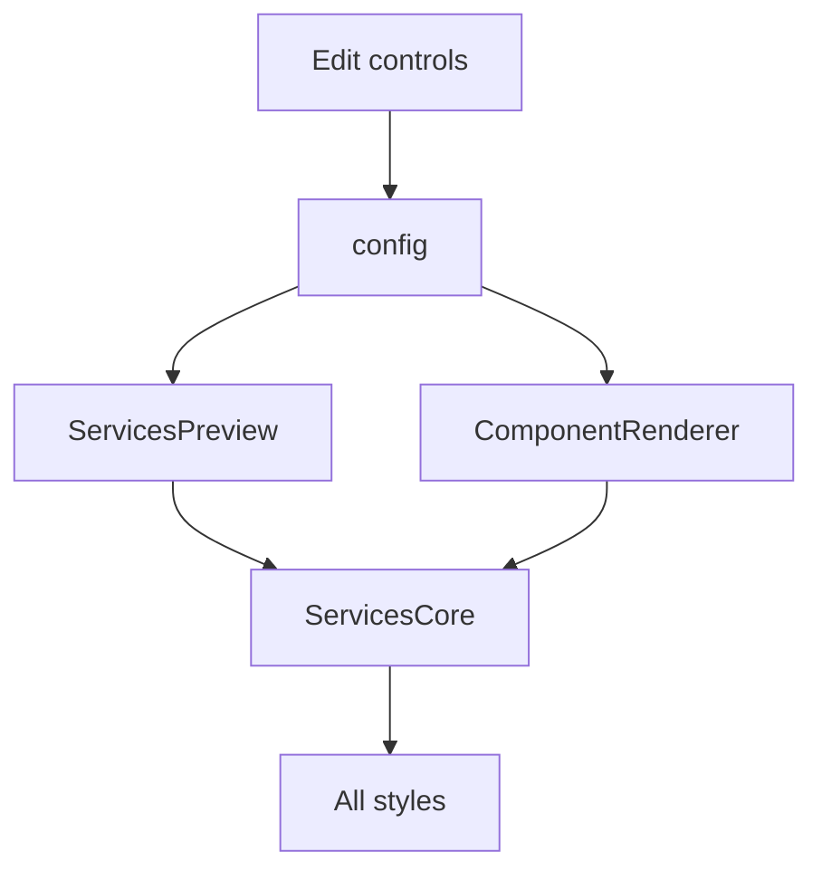

# I. Primer

## 1. TL;DR kiểu Feynman
- Root cause rõ: `Số cột desktop` đang bị bọc điều kiện chỉ hiện khi `style === 'cards' || style === 'carousel'` trong edit page.
- Cần bỏ điều kiện này để control `Số cột desktop` luôn hiện cho mọi layout.
- Ba nhóm setting phải được xem là contract chung của Services: header/subtitle, desktop columns, icon placement/alignment.
- Renderer hiện đã bắt đầu dùng `desktopColumns` cho `Elegant Grid`, `Modern List`, `Big Number`, `Icon Cards`, `Carousel`; cần audit/fix nốt `Timeline` fallback và tránh chỗ nào hardcode 3/4 cột.
- Không đổi schema/config vì các field đã có sẵn và đã lưu/load trong edit page.

## 2. Elaboration & Self-Explanation
Trong form edit Services, `desktopColumns` đã có state, đã load từ config, đã save vào config, và preview/site đều nhận prop này. Lỗi UI là control bị ẩn theo style: chỉ `Icon Cards` và `Carousel` thấy được, nên khi chọn layout khác người dùng tưởng layout đó không support cột.

Về render, các layout dạng strip đã dùng helper `stripGridClassName`. Tuy nhiên để “tôn trọng tuyệt đối” cần đảm bảo mọi style đều đi qua logic chung: `desktopColumns` quyết định 3/4 cột, `headerAlign/showTitle/showSubtitle/subtitle` vẫn được render qua `renderSectionHeader()`, và `mediaPlacement/mediaAlign` phải tác động đúng vị trí icon/ảnh trong từng layout.

## 3. Concrete Examples & Analogies
- Ví dụ: chọn `Modern List` + `4 cột` thì thanh feature phải chia 4 cột desktop giống ảnh logistics; chọn `3 cột` thì chia 3 cột.
- Ví dụ: chọn `Elegant Grid` + icon `Trên` + căn `Phải` thì icon và text trong từng item phải chuyển sang layout dọc và canh phải.
- Analogy: các layout là “áo khoác” khác nhau, nhưng 3 cái núm điều khiển này là “vô lăng/phanh/ga” chung; đổi áo khoác nào cũng vẫn phải lái được.

# II. Audit Summary (Tóm tắt kiểm tra)
- Observation: `app/admin/home-components/services/[id]/edit/page.tsx:337` đang có điều kiện `{(style === 'cards' || style === 'carousel') && (...)}` quanh block `Số cột desktop`.
- Observation: `desktopColumns` đã được load/save trong snapshot/config tại edit page, không thiếu backend/schema.
- Observation: `ServicesForm.tsx` luôn hiển thị `Căn icon/ảnh cho toàn bộ component`; `Căn ngang khi icon nằm trên` chỉ hiển thị khi `mediaPlacement === 'top'`, đúng UX hiện tại.
- Observation: `ServicesSectionCore.tsx` đã có `cardsGridClassName` và `stripGridClassName`, nhưng cần thống nhất mọi style dùng `desktopColumns` và media settings nếu layout có item card/strip.
- Inference: thay đổi chính là bỏ gating UI và audit/fix runtime parity chứ không cần đổi data model.

# III. Root Cause & Counter-Hypothesis (Nguyên nhân gốc & Giả thuyết đối chứng)
- Triệu chứng: chọn layout khác Icon Cards thì không thấy control `Số cột desktop`.
- Phạm vi: admin edit page Services; ảnh hưởng preview UX và khả năng chỉnh config cho mọi layout.
- Tái hiện: vào `/admin/home-components/services/[id]/edit`, đổi style khỏi `cards`/`carousel`, block `Số cột desktop` biến mất.
- Mốc code: điều kiện ở `edit/page.tsx` dòng quanh 337.
- Dữ liệu thiếu: không thiếu; code đã đủ evidence.
- Giả thuyết thay thế: có thể một vài layout không cần cột; hiện user yêu cầu tất cả layout phải tôn trọng, nên loại trừ.
- Rủi ro nếu fix sai: layout như carousel/timeline có thể phản ứng hơi khác; cần dùng helper chung, không hardcode cột.
- Tiêu chí pass/fail: đổi bất kỳ style nào vẫn thấy control `Số cột desktop`; chọn 3/4 cột ảnh hưởng preview/site tương ứng.

Root Cause Confidence (Độ tin cậy nguyên nhân gốc): High — có điều kiện trực tiếp trong `edit/page.tsx` làm ẩn control.

# IV. Proposal (Đề xuất)
Sửa theo hướng nhỏ, đúng scope:

1. `app/admin/home-components/services/[id]/edit/page.tsx`
   - Bỏ wrapper điều kiện `{(style === 'cards' || style === 'carousel') && (...)}` quanh block `Số cột desktop`.
   - Giữ nguyên UI 2 nút `3 cột`/`4 cột`, state `desktopColumns`, save/load hiện tại.

2. `components/site/ServicesSectionCore.tsx`
   - Audit/fix để mọi layout tôn trọng:
     - `showTitle`, `showSubtitle`, `subtitle`, `headerAlign` qua `renderSectionHeader()`.
     - `desktopColumns` qua grid helper chung cho các layout grid/strip.
     - `mediaPlacement`, `mediaAlign` cho layout item có icon/card.
   - Với `Timeline` fallback: nếu còn hardcode `xl:grid-cols-4`, đổi sang helper theo `desktopColumns` hoặc helper phù hợp để chọn 3/4 cột.
   - Với `Big Number`: bỏ `slice(0, 3)` nếu cần để 4 cột thật sự thấy 4 item; nếu vẫn giới hạn featured, giới hạn phải tương thích `desktopColumns`.

3. Không đổi `ServicesForm.tsx` trừ khi phát hiện block căn icon bị ẩn sai; hiện block chính luôn hiển thị, block căn ngang chỉ hiện khi `Trên` là đúng.

# V. Files Impacted (Tệp bị ảnh hưởng)
- Sửa: `app/admin/home-components/services/[id]/edit/page.tsx` — bỏ điều kiện ẩn `Số cột desktop`, để control luôn hiện với mọi style.
- Sửa: `components/site/ServicesSectionCore.tsx` — audit/fix các layout còn hardcode cột hoặc chưa tôn trọng đủ `desktopColumns`/media settings.

# VI. Execution Preview (Xem trước thực thi)
1. Bỏ condition render quanh `Số cột desktop` trong edit page.
2. Kiểm tra lại `ServicesSectionCore` từng branch: `elegantGrid`, `modernList`, `bigNumber`, `cards`, `carousel`, fallback timeline.
3. Chỉnh helper/grid nếu còn hardcode `3`/`4` không theo `desktopColumns`.
4. Static review preview/site parity vì cả hai đều qua `ServicesSectionCore`.
5. Chạy `bunx tsc --noEmit`.
6. Commit local, không push.

# VII. Verification Plan (Kế hoạch kiểm chứng)
- Static: trong edit page không còn `style === 'cards' || style === 'carousel'` quanh block `Số cột desktop`.
- Static: `desktopColumns` vẫn nằm trong snapshot/save config/preview props.
- Static: mọi layout Services trong `ServicesSectionCore` có đường dùng `desktopColumns` hoặc helper dẫn xuất từ nó.
- Typecheck: `bunx tsc --noEmit` pass.
- Manual tester: chọn từng layout, control `Số cột desktop` vẫn hiện; đổi 3/4 cột preview thay đổi.

# VIII. Todo
- [ ] Bỏ điều kiện ẩn `Số cột desktop` ở edit page.
- [ ] Audit/fix renderer để mọi style tôn trọng 3 setting group.
- [ ] Chạy `bunx tsc --noEmit`.
- [ ] Commit local, không push.

# IX. Acceptance Criteria (Tiêu chí chấp nhận)
- `Số cột desktop` luôn hiện bất kể đang chọn layout nào.
- `Tiêu đề hiển thị`, `Hiển thị subtitle`, `Subtitle`, `Căn tiêu đề/subtitle` luôn hoạt động với mọi layout.
- `Căn icon/ảnh`: chọn `Trên`/`Trái` tác động đúng với mọi layout có item icon/ảnh.
- `Căn ngang khi icon nằm trên`: chọn `Trái/Giữa/Phải` tác động đúng khi `mediaPlacement === 'top'`.
- Preview và site runtime đồng bộ.

# X. Risk / Rollback (Rủi ro / Hoàn tác)
- Risk: một số layout đặc thù như carousel/timeline có thể cần mapping riêng để 3/4 cột nhìn đẹp; sẽ giữ logic tối thiểu, không refactor rộng.
- Rollback: revert/amend commit để khôi phục điều kiện cũ và renderer cũ.

# XI. Out of Scope (Ngoài phạm vi)
- Không đổi schema/config data model.
- Không đổi text label hoặc thêm option mới.
- Không sửa file ngoài Services.
- Không xử lý file dirty ngoài scope `product-list`.

# XII. Open Questions (Câu hỏi mở)
Không có; yêu cầu rõ là 3 nhóm control phải luôn hiện/tôn trọng tuyệt đối cho mọi layout.