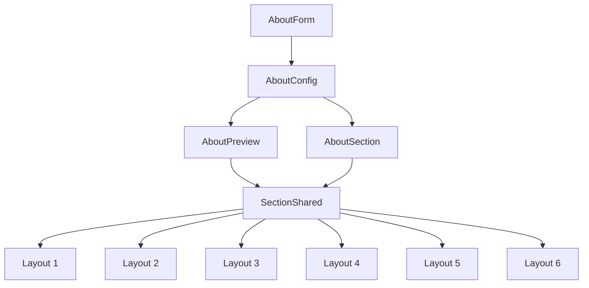

# I. Primer

## 1. TL;DR kiểu Feynman

- About hiện tại là component tĩnh: dữ liệu chỉ nằm trong `config`, không cần query dữ liệu thật đi kèm.
- Repo đang dùng `style` để chọn 6 layout; nên giữ `style`, không chuyển sang field `layout` để tránh preview/site lệch.
- 6 layout mới nằm trong `C:\Users\VTOS\Downloads\vechungtoi\components\AboutLayouts.tsx` và dùng chung data dạng: tagline, title, highlightText, description, phone, ctaText, features, stats, images.
- About hiện tại chưa có `phone`, `highlightText`, `features`, `images[]`; cần thêm tối thiểu vào config/form để 6 layout mới chạy đúng.
- Phần render nên vẫn đi qua `AboutSectionShared` để preview và site dùng chung một source of truth.

## 2. Elaboration & Self-Explanation

About hiện tại đã có kiến trúc tốt cho parity: admin preview và site thật đều render qua `AboutSectionShared`. Vì vậy refactor an toàn nhất là thay 6 hàm render cũ trong file shared này bằng 6 layout mới từ thư mục `vechungtoi`, đồng thời mở rộng config vừa đủ để layout mới có dữ liệu cần dùng.

Các field chung giữa 6 layout mới gồm `subHeading/tagline`, `heading/title`, `description`, `image/images`, `buttonText/ctaText`, `stats`, thêm `phone`, `highlightText`, và `features`. Các khác biệt riêng theo layout chủ yếu là cách layout sử dụng số lượng ảnh/stats/features khác nhau, không nhất thiết phải tạo nhiều object config riêng nếu layout chỉ đọc cùng bộ dữ liệu chung. Field đặc thù thật sự hiện thấy là `highlightText`, `phone`, `features`, và `images[]`; chúng được dùng bởi nhiều layout nên gom chung.

## 3. Concrete Examples & Analogies

Ví dụ bám repo: hiện `AboutForm` chỉ cho nhập một `image`, nhưng layout 3 từ `vechungtoi` dùng `data.images[0]`, `data.images[1]`, `data.images[2]`. Vì vậy nếu chỉ copy markup mà không thêm `images`, layout 3 sẽ chỉ có một ảnh thật và hai ảnh fallback, làm preview/site không phản ánh đúng cấu hình.

Analogy: coi 6 layout như 6 kiểu trưng bày cùng một bộ hồ sơ công ty. Những thông tin như tên, mô tả, số điện thoại là giấy tờ chung; còn layout chỉ quyết định đặt giấy tờ đó ở bên trái, bên phải, dạng card hay dạng ảnh lớn.

# II. Audit Summary (Tóm tắt kiểm tra)

- Observation: `app/admin/home-components/about/_components/AboutSectionShared.tsx` hiện chứa 6 renderer `classic | bento | minimal | split | timeline | showcase` và được dùng bởi cả preview lẫn site.
- Observation: `components/site/AboutSection.tsx` normalize `config.style` rồi gọi `AboutSectionShared context="site"`.
- Observation: `app/admin/home-components/about/_components/AboutPreview.tsx` cũng gọi `AboutSectionShared context="preview"` và dùng `ABOUT_STYLES` làm style switch.
- Observation: source `vechungtoi` có 6 component `Layout1..Layout6`, data chung `AboutData`, `features`, `stats`, `images`, `phone`, `highlightText`, cùng token CSS `--token-primary`, `--token-secondary`, `--token-secondaryText`.
- Gap: `LS` trả về empty directory nhưng `Glob/Read` đọc được file trong `C:\Users\VTOS\Downloads\vechungtoi`; có thể do wrapper list trên Windows path, không ảnh hưởng source evidence vì file đã đọc được.

# III. Root Cause & Counter-Hypothesis (Nguyên nhân gốc & Giả thuyết đối chứng)

- Triệu chứng / nhu cầu: user muốn thay toàn bộ 6 layout About hiện tại bằng 6 layout tĩnh từ `vechungtoi`, đồng thời gom config chung và chỉ tách config riêng nếu layout cần.
- Phạm vi ảnh hưởng: About home-component trong admin create/edit/preview và site renderer; không ảnh hưởng data thật vì component tĩnh.
- Tái hiện tối thiểu: mở route edit About, chọn từng style; hiện render 6 layout cũ thay vì 6 layout từ source `vechungtoi`.
- Mốc liên quan: About đang có contract cũ `style` + `stats/image`, source mới yêu cầu data rộng hơn `features/images/phone/highlightText`.
- Dữ liệu thiếu: chưa có screenshot/runtime visual để so pixel; spec chỉ dựa trên source code layout.
- Giả thuyết thay thế: chỉ copy markup vào `AboutSectionShared` và dùng fallback cứng. Loại này nhanh hơn nhưng không đạt yêu cầu “cấu hình chung/riêng” vì admin không chỉnh được phone/features/images phụ.
- Rủi ro nếu fix sai: lưu field mới sai shape làm component cũ mất dữ liệu hoặc preview/site lệch; đổi `style` keys có thể làm record cũ fallback sai.
- Tiêu chí pass/fail: 6 option style render đúng 6 layout mới; create/edit save/load đủ field mới; site và preview dùng cùng layout shared; record cũ vẫn load được với default an toàn.

Độ tin cậy nguyên nhân gốc: High. Evidence trực tiếp từ `AboutSectionShared.tsx`, `AboutForm.tsx`, `_types/index.ts`, `_lib/constants.ts`, `components/site/AboutSection.tsx`, và source `vechungtoi/components/AboutLayouts.tsx`.

# IV. Proposal (Đề xuất)

## a) Hướng triển khai đề xuất

Giữ contract `AboutStyle` hiện tại để không phá dữ liệu cũ, nhưng đổi nhãn 6 style thành 6 layout mới:

- `classic` → `Mẫu Spa (Layout 1)`
- `bento` → `Mẫu Xây dựng 1 (Layout 2)`
- `minimal` → `Mẫu Xây dựng 2 (Layout 3)`
- `split` → `Mẫu Kỹ thuật (Layout 4)`
- `timeline` → `Mẫu Thời trang (Layout 5)`
- `showcase` → `Mẫu Sản phẩm (Layout 6)`

Lý do giữ key cũ: records đang lưu `config.style`; đổi union sang `layout1..layout6` sẽ cần migration hoặc fallback phức tạp hơn.

## b) Data/config chung

Thêm vào About config/editor:

- `highlightText: string` — chữ nhấn cạnh tiêu đề, dùng nhiều layout.
- `phone: string` — layout 1/2 dùng rõ, các layout khác có thể không hiển thị.
- `features: AboutPersistFeature[]` — danh sách điểm nổi bật có `title`, `iconName`, optional `description`.
- `images: string[]` — 3 ảnh cho layout 3, ảnh đầu cho các layout còn lại.

Giữ field cũ:

- `subHeading`, `heading`, `description`, `image`, `imageCaption`, `buttonText`, `buttonLink`, `stats`, `style`.
- `image` sẽ được dùng làm alias/backward-compatible cho `images[0]` khi load record cũ.

## c) Config riêng theo layout

Không tạo object riêng cho từng layout trong lần này vì source `vechungtoi` dùng cùng `AboutData` cho cả 6 layout. Chỉ áp dụng điều kiện UI theo layout nếu cần:

- Layout 3 cần đủ 3 ảnh → form hiển thị nhóm `images[0..2]` chung, nhưng helper text nói layout 3 dùng cả 3 ảnh.
- Layout 1/2 dùng `phone` → field phone nằm trong thông tin chung.
- Layout 5 dùng tối đa 3 stats; layout 2 dùng nhiều stats; layout 3 dùng stat đầu; vẫn lưu chung `stats` với giới hạn hiện tại 1–6.
- `imageCaption` hiện chỉ cho Bento cũ; nếu layout mới không dùng, có thể giữ để backward-compatible nhưng không ưu tiên hiển thị riêng.

## d) Preview ↔ Site parity map

| Surface | File | Contract cần giữ |
|---|---|---|
| Create | `app/admin/home-components/create/about/page.tsx` | submit đủ field chung mới, giữ `style` |
| Edit | `app/admin/home-components/about/[id]/edit/page.tsx` | normalize record cũ, save field mới, snapshot detect change |
| Form | `app/admin/home-components/about/_components/AboutForm.tsx` | nhập phone/highlight/features/images, buttons `type="button"` |
| Preview | `app/admin/home-components/about/_components/AboutPreview.tsx` | truyền đủ config vào shared, style switch 1-1 |
| Shared UI | `app/admin/home-components/about/_components/AboutSectionShared.tsx` | chứa 6 layout mới, context preview/site chỉ khác Link/img |
| Site | `components/site/AboutSection.tsx` | normalize field mới và gọi cùng shared section |

# V. Files Impacted (Tệp bị ảnh hưởng)

- Sửa: `app/admin/home-components/about/_types/index.ts` — hiện định nghĩa `AboutConfig`, `AboutEditorState`, `AboutStyle`; sẽ thêm feature/image/phone/highlight types và fields.
- Sửa: `app/admin/home-components/about/_lib/constants.ts` — hiện chứa default, normalize style/stats; sẽ thêm default data từ `vechungtoi`, normalize features/images và đổi label style.
- Sửa: `app/admin/home-components/about/_components/AboutForm.tsx` — hiện form chỉ có heading/image/stats/button; sẽ thêm field phone, highlightText, images 1–3, features editor.
- Sửa: `app/admin/home-components/about/_components/AboutSectionShared.tsx` — hiện render 6 layout cũ; sẽ thay bằng 6 layout mới, dùng token màu hiện có thay vì CSS var rời.
- Sửa: `app/admin/home-components/about/_components/AboutPreview.tsx` — hiện truyền config cũ; sẽ truyền field mới vào shared.
- Sửa: `app/admin/home-components/create/about/page.tsx` — hiện submit config cũ; sẽ submit field mới.
- Sửa: `app/admin/home-components/about/[id]/edit/page.tsx` — hiện normalize/save/snapshot config cũ; sẽ bổ sung load/save/snapshot field mới.
- Sửa: `components/site/AboutSection.tsx` — hiện normalize config cũ; sẽ normalize field mới và preserve backward compatibility.

# VI. Execution Preview (Xem trước thực thi)

1. Cập nhật type và constants trước để có contract rõ: feature, images, phone, highlightText, default, normalize.
2. Cập nhật create/edit load-save để dữ liệu mới được persist đúng vào `config`.
3. Cập nhật `AboutForm` theo nhóm field chung: thông tin chung, ảnh, features, stats.
4. Thay renderer trong `AboutSectionShared` bằng 6 layout mới, dùng helper chung `getIcon`, `AboutImage`, `AboutButton`, `renderEmptyImage`.
5. Cập nhật site adapter và preview adapter để truyền đủ props.
6. Tự review tĩnh theo checklist parity, typing, null-safety, fallback dữ liệu cũ.
7. Commit thay đổi sau khi user approve và code xong, theo rule repo; không push.

# VII. Verification Plan (Kế hoạch kiểm chứng)

- Không tự chạy lint/unit/build theo `AGENTS.md` vì repo cấm tuyệt đối tự chạy lint/unit test và chỉ cho `bunx tsc --noEmit` trước commit khi có thay đổi TS.
- Sau implement sẽ chạy `bunx tsc --noEmit` trước commit nếu user approve code changes, vì đây là rule riêng của repo trước commit.
- Static review bắt buộc:
  - `AboutStyle` vẫn đủ 6 key và fallback cuối vẫn an toàn.
  - `AboutPreview` và `AboutSection` đều gọi cùng `AboutSectionShared`.
  - Record cũ không có `features/images/phone/highlightText` vẫn render bằng default/fallback.
  - Nút trong form/preview không vô tình submit form.
  - `style` không đổi sang `layout`, tránh phá dữ liệu cũ.

# VIII. Todo

- [ ] Mở rộng `AboutConfig` / `AboutEditorState` cho data chung của layout mới.
- [ ] Thêm normalize/default cho `features`, `images`, `phone`, `highlightText`.
- [ ] Cập nhật create/edit save-load-snapshot.
- [ ] Cập nhật form để chỉnh cấu hình chung và danh sách feature/image.
- [ ] Thay 6 renderer About bằng layout từ `vechungtoi` trong shared section.
- [ ] Cập nhật preview/site adapter để giữ parity.
- [ ] Review tĩnh, chạy typecheck trước commit, commit thay đổi.

# IX. Acceptance Criteria (Tiêu chí chấp nhận)

- Route `http://localhost:3000/admin/home-components/about/js75jdyvwv8p7dy0c5wqrnxfs185hb0w/edit` có 6 style tương ứng 6 layout từ `vechungtoi`.
- Đổi style trong preview render đúng layout mới, không còn layout Classic/Bento/Minimal/Split/Timeline/Showcase cũ về mặt giao diện.
- Các field chung `phone`, `highlightText`, `features`, `images`, `stats`, `buttonText`, `buttonLink` load/save được trong edit.
- Site runtime render cùng markup với preview qua `AboutSectionShared`.
- Record cũ thiếu field mới vẫn không crash và có fallback hợp lý.
- Không đổi schema Convex, không thêm data thật, không query thêm dữ liệu runtime.

# X. Risk / Rollback (Rủi ro / Hoàn tác)

- Rủi ro: thêm nhiều field vào form có thể làm UI admin dài hơn; giảm bằng cách nhóm field rõ ràng và giữ giới hạn hiện có.
- Rủi ro: iconName nhập sai sẽ fallback về icon mặc định; đây là hành vi chấp nhận được như source `vechungtoi`.
- Rủi ro: source layout dùng `--token-secondaryText` còn repo token hiện tại không có tên này; sẽ map sang `tokens.secondary` hoặc text token rõ ràng trong shared renderer.
- Rollback: revert commit refactor About; vì không đổi schema và giữ `style`, dữ liệu cũ vẫn nằm trong config.

# XI. Out of Scope (Ngoài phạm vi)

- Không migrate dữ liệu hàng loạt trong Convex.
- Không thay đổi home-component khác.
- Không thêm API/query/mutation mới.
- Không pixel-perfect theo screenshot nếu không có ảnh so sánh runtime.
- Không refactor màu toàn hệ thống ngoài token cần dùng cho About.

# XII. Open Questions (Câu hỏi mở)

- Không có câu hỏi bắt buộc trước khi implement. Quyết định recommend là giữ `style` key cũ để an toàn dữ liệu và chỉ thay label/render của 6 layout.