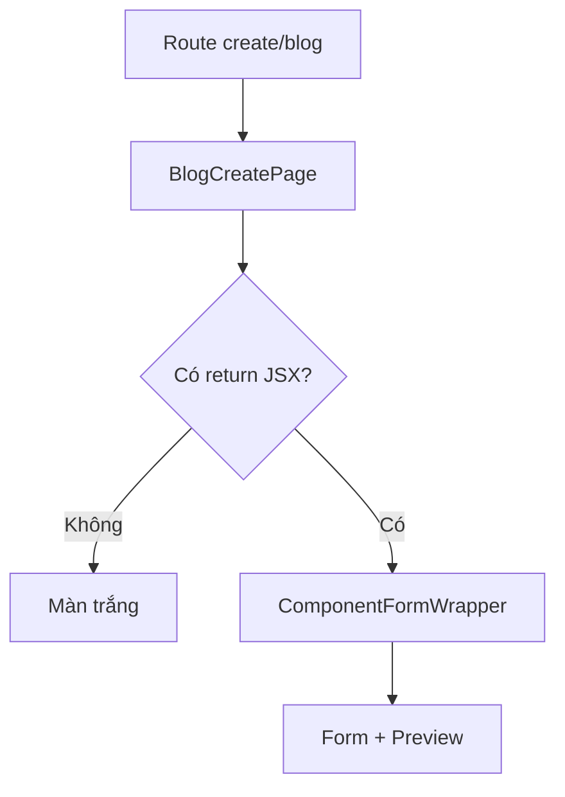

# I. Primer

## 1. TL;DR kiểu Feynman
- Route `http://localhost:3000/admin/home-components/create/blog` bị trắng vì file page hiện tại dừng giữa chừng: chỉ khai báo state/query rồi kết thúc, không `return` JSX.
- Đây không giống lỗi data hay Convex; nó là lỗi code-level của route component.
- Pattern tương tự xuất hiện ở nhiều create page khác: file mở đầu đúng, có state/validation, nhưng không render `ComponentFormWrapper` hay bất kỳ JSX nào.
- Nói ngắn: trang không hiện gì vì component create “chưa hoàn thành implementation” hoặc bị cắt cụt sau merge/chỉnh tay.

## 2. Elaboration & Self-Explanation
Ở Next.js App Router, một page client component phải trả về JSX để React render UI. File `app/admin/home-components/create/blog/page.tsx` hiện:
- import đúng,
- gọi `useComponentForm`, `useQuery`, `useState`, `useMemo`,
- tạo `categoryMap`,
- rồi hết file.

Không có:
- `const onSubmit = ...`
- `return (...)`
- `<ComponentFormWrapper>`

Khi route chạy, component không render ra cấu trúc form nào cả. Với ảnh bạn gửi, breadcrumb và layout shell vẫn hiện, chứng tỏ layout cha vẫn hoạt động; phần content trắng là do page con không xuất ra UI hợp lệ.

Các file create khác cũng có cùng mùi lỗi: chỉ chuẩn bị state/validation rồi kết thúc. Đây thường là hậu quả của:
- merge conflict giải quyết dở,
- copy từ edit page/create shared nhưng chưa dán phần render,
- hoặc file bị truncate/cắt mất đoạn cuối.

## 3. Concrete Examples & Analogies
- Ví dụ cụ thể ở `create/blog/page.tsx`: file dừng ngay sau `const categoryMap = useMemo(...)`, không có `return <ComponentFormWrapper ...>` như các route create bình thường (`services`, `video`, `stats`, `about`...).
- Analogy: giống như dựng khung nhà, kéo điện nước xong nhưng quên lắp cửa và sàn; vào địa chỉ thì vẫn tới đúng lô đất, nhưng không có gì để dùng.

# II. Audit Summary (Tóm tắt kiểm tra)
- Observation: `app/admin/home-components/create/blog/page.tsx` có đầy đủ setup state/query nhưng file kết thúc ngay sau `categoryMap`; không có `return` JSX.
- Observation: `app/admin/home-components/blog/[id]/edit/page.tsx` là file đầy đủ và hoạt động theo pattern chuẩn: load config → xử lý preview → `return` UI hoàn chỉnh.
- Observation: `app/admin/home-components/create/product-list/_shared.tsx` là shared create flow chuẩn cho `ProductList`/`ServiceList`, có `onSubmit` và `return <ComponentFormWrapper>...` đầy đủ.
- Observation: `app/admin/home-components/create/shared.tsx` định nghĩa `ComponentFormWrapper` chuẩn dùng cho các create page; route create bình thường đều render wrapper này.
- Observation: các file sau đọc trực tiếp đều có pattern giống `blog` — chỉ khai báo state/validation rồi hết file, chưa render UI:
  - `app/admin/home-components/create/career/page.tsx`
  - `app/admin/home-components/create/testimonials/page.tsx`
  - `app/admin/home-components/create/voucher-promotions/page.tsx`
  - `app/admin/home-components/create/benefits/page.tsx`
  - `app/admin/home-components/create/pricing/page.tsx`
  - `app/admin/home-components/create/contact/page.tsx`
- Observation: các route create khỏe mạnh như `services`, `video`, `stats`, `about`, `product-grid`, `service-list`, `product-list` đều có evidence rõ của `return (...)`, `ComponentFormWrapper`, hoặc `void handleSubmit(...)` trong file.

# III. Root Cause & Counter-Hypothesis (Nguyên nhân gốc & Giả thuyết đối chứng)
- Triệu chứng quan sát được là gì?
  - Expected: vào `/admin/home-components/create/blog` phải thấy form create Blog.
  - Actual: shell admin hiện nhưng vùng nội dung trắng.
- Phạm vi ảnh hưởng?
  - Ảnh hưởng các create page bị cắt cụt; không thấy evidence ảnh hưởng edit page tương ứng.
- Có tái hiện ổn định không?
  - Có, vì evidence nằm ngay trong source file route.
- Mốc thay đổi gần nhất?
  - Chưa truy commit-level trong spec này, nhưng dấu hiệu là file source hiện tại bị incomplete/truncated.
- Dữ liệu nào đang thiếu?
  - Không thiếu để kết luận root cause ở mức code path.
- Giả thuyết thay thế hợp lý?
  - Có thể do CSS khiến form invisible, hoặc query treo loading vô hạn.
  - Nhưng bị loại trừ phần lớn vì file `create/blog/page.tsx` không hề có khối `return` để render loading/form.
- Rủi ro nếu fix sai nguyên nhân?
  - Nếu chỉ sửa CSS/data sẽ không giải quyết được vì route thiếu JSX nền tảng.
- Tiêu chí pass/fail sau khi sửa?
  - Route create hiện form hoàn chỉnh; preview và submit path xuất hiện trở lại.

Root Cause Confidence (Độ tin cậy nguyên nhân gốc): High — source file của `create/blog` đang thiếu phần render/submit hoàn chỉnh.

## Problem Graph
1. [Màn trắng create blog] <- depends on 1.1, 1.2
   1.1 [Route page không render JSX] <- depends on 1.1.1
      1.1.1 [ROOT CAUSE] File `create/blog/page.tsx` bị truncate / incomplete
   1.2 [Các create page khác cùng pattern] <- depends on 1.2.1
      1.2.1 [ROOT CAUSE CLASS] Nhiều file create bị cắt mất đoạn `onSubmit` + `return`

# IV. Proposal (Đề xuất)

## 1. Kết luận nguyên nhân lỗi blog
Root cause trực tiếp của `create/blog` là file route không trả JSX vì implementation bị cắt cụt.

## 2. Các home-component có vấn đề tương tự
### High confidence — đã đọc file và thấy cùng pattern incomplete
- `app/admin/home-components/create/blog/page.tsx`
- `app/admin/home-components/create/career/page.tsx`
- `app/admin/home-components/create/testimonials/page.tsx`
- `app/admin/home-components/create/voucher-promotions/page.tsx`
- `app/admin/home-components/create/benefits/page.tsx`
- `app/admin/home-components/create/pricing/page.tsx`
- `app/admin/home-components/create/contact/page.tsx`

### Low/Not indicated — đã có evidence render path tồn tại
- `services`
- `video`
- `stats`
- `about`
- `hero`
- `gallery`
- `service-list`
- `product-list`
- `product-grid`
- `product-categories`
- `process`
- `partners`
- `faq`
- `cta`
- `countdown`
- `clients`
- `category-products`
- `case-study`
- `homepage-category-hero`
- `trust-badges`
- `speed-dial`

## 3. Hướng xử lý đề xuất
Sửa theo hướng nhỏ, đúng pattern sẵn có:
1. Khôi phục mỗi create page bị lỗi thành page hoàn chỉnh.
2. Với mỗi page:
   - thêm `onSubmit`
   - render `ComponentFormWrapper`
   - gắn form/editor component tương ứng
   - gắn preview component tương ứng
3. Ưu tiên dùng edit page tương ứng hoặc pattern create page lành mạnh làm source of truth.
4. Review cả nhóm file create để tránh sửa từng route lẻ rồi sót route khác.

# V. Files Impacted (Tệp bị ảnh hưởng)
- Sửa: `app/admin/home-components/create/blog/page.tsx`
  - Vai trò hiện tại: route create cho Blog.
  - Thay đổi dự kiến: khôi phục phần `onSubmit` và `return` để render form/preview.

- Sửa: `app/admin/home-components/create/career/page.tsx`
  - Vai trò hiện tại: route create cho Career.
  - Thay đổi dự kiến: hoàn thiện phần render còn thiếu.

- Sửa: `app/admin/home-components/create/testimonials/page.tsx`
  - Vai trò hiện tại: route create cho Testimonials.
  - Thay đổi dự kiến: hoàn thiện flow submit + render wrapper.

- Sửa: `app/admin/home-components/create/voucher-promotions/page.tsx`
  - Vai trò hiện tại: route create cho VoucherPromotions.
  - Thay đổi dự kiến: hoàn thiện flow submit + preview render.

- Sửa: `app/admin/home-components/create/benefits/page.tsx`
  - Vai trò hiện tại: route create cho Benefits.
  - Thay đổi dự kiến: hoàn thiện flow create page còn thiếu.

- Sửa: `app/admin/home-components/create/pricing/page.tsx`
  - Vai trò hiện tại: route create cho Pricing.
  - Thay đổi dự kiến: khôi phục form + preview render.

- Sửa: `app/admin/home-components/create/contact/page.tsx`
  - Vai trò hiện tại: route create cho Contact.
  - Thay đổi dự kiến: khôi phục render và wiring create flow.

# VI. Execution Preview (Xem trước thực thi)
1. Đọc đầy đủ từng create page lỗi + edit page tương ứng.
2. Xác định source pattern gần nhất cho từng component.
3. Khôi phục `onSubmit` và `return <ComponentFormWrapper>` cho từng file.
4. Soát lại preview props, config payload và default state.
5. Static review tránh lệch contract create/edit.
6. Chạy `bunx tsc --noEmit`.
7. Commit local, không push.

# VII. Verification Plan (Kế hoạch kiểm chứng)
- Static verify:
  - mỗi create page lỗi phải có `return` JSX rõ ràng.
  - có `ComponentFormWrapper` hoặc shared create wrapper hợp lệ.
  - có đường submit `handleSubmit(...)` hợp lệ.
- Typecheck:
  - `bunx tsc --noEmit` pass.
- Manual verify:
  - mở `/admin/home-components/create/blog` thấy form + preview.
  - lặp lại cho `career`, `testimonials`, `voucher-promotions`, `benefits`, `pricing`, `contact`.

# VIII. Todo
- [ ] Đọc đầy đủ 7 create page lỗi và edit/page source tương ứng.
- [ ] Khôi phục flow render + submit cho từng create page.
- [ ] Review các prop preview/form để khớp contract hiện tại.
- [ ] Chạy `bunx tsc --noEmit`.
- [ ] Commit local, không push.

# IX. Acceptance Criteria (Tiêu chí chấp nhận)
- `create/blog` không còn trắng, hiển thị form create đầy đủ.
- 6 route create lỗi tương tự còn lại cũng hiển thị UI thay vì trắng.
- Không có create page nào trong nhóm bị thiếu `return` hoặc thiếu wrapper render.
- TypeScript không phát sinh lỗi mới từ các file được khôi phục.

# X. Risk / Rollback (Rủi ro / Hoàn tác)
- Rủi ro: nếu khôi phục sai theo pattern cũ, preview/config create có thể lệch nhẹ so với edit page.
- Giảm rủi ro: bám edit page và shared create wrappers hiện hành, không invent API mới.
- Rollback: revert commit vì thay đổi chỉ ở các route create.

# XI. Out of Scope (Ngoài phạm vi)
- Không sửa business logic blog/site runtime.
- Không đụng Convex schema/query nếu không cần.
- Không mở rộng thêm feature mới cho create pages ngoài việc khôi phục UI/submit.

# XII. Open Questions (Câu hỏi mở)
Không có ở mức audit root cause. Nếu bạn muốn, bước tiếp theo là khôi phục luôn cả nhóm 7 route bị incomplete theo đúng pattern hiện tại.