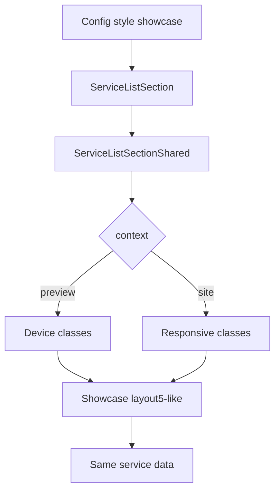

# I. Primer

## 1. TL;DR kiểu Feynman
- Component `ServiceList` đang có style `showcase` kiểu 1 item lớn + 4 item nhỏ, nhìn khác hẳn `Blog layout5`.
- Sẽ chỉ đổi “khung UI” của `showcase` để giống `Blog layout5`: hộp trắng bo nhẹ, header + nút chuyển trang, grid 4 cột desktop / 3 tablet / 2 mobile, card ảnh 16:10 + tên + giá.
- Dữ liệu giữ nguyên: vẫn dùng `items`, `name`, `image`, `price`, `description`, `tag`, `href`, `selectedServiceIds`, `itemCount`, `sortBy` như hiện tại.
- Create và edit đều dùng chung `ServiceListPreview` + `ServiceListSectionShared`, nên sửa đúng shared renderer là cả create/edit/site cùng đổi.
- Không đổi key style `showcase`, tránh phá dữ liệu cũ đang lưu trong Convex.

## 2. Elaboration & Self-Explanation
Yêu cầu là “layout showcase của service-list xấu, đổi layout và logic giống blog layout 5, giữ dữ liệu cũ”. Audit cho thấy `ServiceList` có source-of-truth chính ở `ServiceListSectionShared.tsx`; cả preview admin và site runtime đều gọi component này. Vì vậy hướng an toàn nhất là thay implementation của `renderShowcase()` bằng pattern của `Blog layout5`, thay vì tạo style mới hoặc đổi schema/config.

“Logic giống layout 5” ở đây hiểu là logic hiển thị/pagination của layout 5: lấy danh sách item theo page size 8, hiển thị dạng grid, có nút prev/next khi nhiều hơn 8 item. Với service data, phần card sẽ map tương đương: blog `title` → service `name`, blog `thumbnail` → service `image`, blog `date` → service `price`, CTA `Xem tất cả` vẫn trỏ `/services` ở site.

## 3. Concrete Examples & Analogies
- Ví dụ cụ thể: service `Thiết kế Nội thất Penthouse` đang là featured card to đè overlay trong `showcase`; sau đổi, nó sẽ thành một card trong grid layout 5 với ảnh 16:10, tên bên dưới, giá/dòng meta bên dưới, cùng nằm trong một khung trắng giống Blog layout 5.
- Analogy: thay “kệ trưng bày” của dịch vụ từ một quầy spotlight lộn xộn sang cùng loại “kệ báo/tin tức layout 5”; hàng hóa vẫn là dịch vụ cũ, chỉ đổi cách xếp kệ.

# II. Audit Summary (Tóm tắt kiểm tra)

## 1. Observation
- `app/admin/home-components/service-list/_components/ServiceListSectionShared.tsx` chứa `renderShowcase()` và fallback cuối: nếu không phải `grid/bento/list/carousel/minimal` thì render `showcase`.
- `app/admin/home-components/blog/_components/BlogSectionRuntime.tsx` chứa `layout5`: page size 8, wrapper `rounded-md border bg-white shadow-sm`, responsive grid `desktop 4 / tablet 3 / mobile 2`, card ảnh `aspect-[16/10]`, title, date/meta, view-all button.
- `app/admin/home-components/service-list/_components/ServiceListPreview.tsx` dùng `ServiceListSectionShared` nên preview create/edit sẽ ăn theo shared UI.
- `components/site/ServiceListSection.tsx` cũng dùng `ServiceListSectionShared`, nên site thật sẽ đồng bộ nếu sửa shared.
- `app/admin/home-components/create/service-list/page.tsx` gọi shared create form qua `ProductListCreateShared`; create preview vẫn dùng `ServiceListPreview`.

## 2. Inference
- Không cần đổi Convex schema, không cần đổi config shape, không cần tạo style mới.
- Sửa `renderShowcase()` là đủ để đổi cả create/edit/site cho style `showcase`.
- Nếu chỉ sửa preview mà không sửa site, sẽ lệch parity; do đó phải sửa shared section.

# III. Root Cause & Counter-Hypothesis (Nguyên nhân gốc & Giả thuyết đối chứng)

## 1. Root Cause Confidence (Độ tin cậy nguyên nhân gốc: High)
- High vì evidence trực tiếp: `showcase` hiện tại hardcode layout featured/overlay tại `ServiceListSectionShared.tsx`, trong khi blog layout 5 có pattern mong muốn tại `BlogSectionRuntime.tsx`.
- Triệu chứng: UI `showcase` service-list không cùng cấu trúc với blog layout 5; actual là featured card + grid nhỏ, expected là grid card trong wrapper như blog layout 5.
- Phạm vi: admin create, admin edit, preview, và site section khi config style là `showcase`.
- Tái hiện: mở URL edit service-list có style showcase hoặc chọn style Showcase trong create/edit preview.
- Dữ liệu thiếu: chưa có screenshot runtime do spec mode/read-only; implementation sẽ cần user/tester xem trực quan sau khi sửa.
- Giả thuyết thay thế: có thể user chỉ muốn đổi preview admin, không đổi site; nhưng câu “cả create” và parity home-component khiến shared site/preview là hướng an toàn hơn.
- Rủi ro nếu fix sai: đổi style khác hoặc đổi config key có thể làm dữ liệu cũ không render đúng.
- Tiêu chí pass/fail: style `showcase` service-list nhìn cùng khung/layout với blog `layout5`, dữ liệu service cũ vẫn hiển thị đúng.

## 2. Counter-Hypothesis
- Không phải lỗi data: service items vẫn map đủ `name/image/price/description/tag`.
- Không phải lỗi route edit/create riêng lẻ: cả create và edit đi qua shared preview/runtime.
- Không phải thiếu style option: `SERVICE_LIST_STYLES` đã có `showcase`.

# IV. Proposal (Đề xuất)

## 1. Decision
Đổi implementation của `showcase` hiện tại thành layout kiểu Blog `layout5`, giữ nguyên style key `showcase` và giữ toàn bộ config/data hiện tại.

## 2. Preview ↔ Site parity map
| Surface | File | Contract cần giữ |
|---|---|---|
| Create | `app/admin/home-components/create/product-list/_shared.tsx` | Không đổi form/config; preview style `showcase` vẫn lưu cùng key |
| Create route | `app/admin/home-components/create/service-list/page.tsx` | Không đổi route; vẫn dùng shared create |
| Edit | `app/admin/home-components/service-list/[id]/edit/page.tsx` | Không đổi load/save config; `style: 'showcase'` vẫn giữ nguyên |
| Preview | `app/admin/home-components/service-list/_components/ServiceListPreview.tsx` | Vẫn truyền `context="preview"`, `device`, `items`, `tokens` vào shared section |
| Shared UI | `app/admin/home-components/service-list/_components/ServiceListSectionShared.tsx` | Sửa `renderShowcase()` theo Blog layout 5; thêm state/page logic nếu cần |
| Site | `components/site/ServiceListSection.tsx` | Không đổi data query/map; runtime tự ăn shared UI mới |

## 3. Logic đề xuất
- `showcasePageSize = 8`.
- `showcaseItems = items` khi style là `showcase`, sau đó slice theo trang hiện tại.
- `showcaseCanPaginate = items.length > 8`.
- Header giống Blog layout 5: title trái, prev/next phải khi có nhiều trang.
- Grid responsive:
  - preview: dùng helper theo `device` để ép đúng mobile/tablet/desktop.
  - site: class responsive `grid-cols-2 md:grid-cols-3 lg:grid-cols-4`.
- Card service:
  - image/fallback `aspect-[16/10] rounded-md`.
  - title `line-clamp-2`.
  - price/meta dùng `formatServicePrice(item.price)` thay blog date.
  - badge `hot/new` giữ nếu có, đặt overlay nhỏ trên ảnh.
- `Xem tất cả` giữ theo `showViewAll`/`viewAllHref`, site dùng `Link`, preview dùng non-link wrapper như hiện tại.

# V. Files Impacted (Tệp bị ảnh hưởng)

## 1. UI / Shared renderer
- Sửa: `app/admin/home-components/service-list/_components/ServiceListSectionShared.tsx` — hiện là source-of-truth render 6 style service-list. Thay `renderShowcase()` hiện tại bằng layout giống Blog layout 5 và thêm state/derived values cho pagination showcase.

## 2. Không sửa dự kiến
- Không sửa: `app/admin/home-components/service-list/_types/index.ts` — union `showcase` đã tồn tại, không cần thêm key.
- Không sửa: `app/admin/home-components/service-list/_lib/constants.ts` — label `Showcase` giữ nguyên để không ảnh hưởng dữ liệu cũ.
- Không sửa: `app/admin/home-components/service-list/[id]/edit/page.tsx` — load/save config hiện đã lưu `style` và dữ liệu cần thiết.
- Không sửa: `app/admin/home-components/create/product-list/_shared.tsx` — create service-list đã truyền style/items đúng vào preview.
- Không sửa: `components/site/ServiceListSection.tsx` — site đã gọi shared section đúng source-of-truth.

# VI. Execution Preview (Xem trước thực thi)

## 1. Ordered actions
- Đọc lại vùng `renderShowcase()` và import hiện có để tránh unused/missing import.
- Thêm state/derived logic cho showcase page: page size, total pages, paged items, reset/clamp page khi đổi style/items.
- Thay markup `renderShowcase()` bằng wrapper/grid/card tương đương Blog layout 5, nhưng map dữ liệu service.
- Giữ fallback style cuối như hiện tại: `return renderShowcase()`.
- Static self-review: types, unused imports, button `type="button"`, preview/site responsive, empty/image fallback, long text.
- Theo project rule sau khi user duyệt và code xong: chạy `bunx tsc --noEmit` trước commit nếu có thay đổi TS/code; không chạy lint/unit test/build.
- Commit local, không push.

# VII. Verification Plan (Kế hoạch kiểm chứng)

## 1. Static verification
- Kiểm tra `ServiceListSectionShared.tsx` không có import thừa, state hook hợp lệ, dependency `useEffect/useMemo` đúng.
- Kiểm tra mọi button trong preview/shared có `type="button"`.
- Kiểm tra fallback empty state và image fallback vẫn còn.
- Kiểm tra `showcase` là fallback cuối, không phá 5 style còn lại.

## 2. Type verification
- Sau khi được phép implement: chạy `bunx tsc --noEmit` theo rule repo cho thay đổi TS/code.

## 3. Visual verification do tester/user
- Mở `http://localhost:3000/admin/home-components/service-list/js79an6ms44jpcna3wteqfj9xh85gmvj/edit` và chọn/giữ `Showcase`.
- Mở create service-list và chọn `Showcase`.
- So sánh với `http://localhost:3000/admin/home-components/blog/js76rwn3mcdvhxfkn4yygz032985hjnb/edit` layout 5: wrapper, grid, card, pagination phải cùng logic/hướng nhìn.

# VIII. Todo

- [ ] Sửa `renderShowcase()` service-list theo Blog layout 5.
- [ ] Thêm pagination logic cho `showcase` page size 8.
- [ ] Tự review parity create/edit/site và responsive preview.
- [ ] Chạy `bunx tsc --noEmit` sau khi có code change.
- [ ] Commit local, không push.

# IX. Acceptance Criteria (Tiêu chí chấp nhận)

- Style `Showcase` của service-list trong edit nhìn giống Blog `Layout 5` về khung, grid, card và nút điều hướng trang.
- Create service-list khi chọn `Showcase` cũng dùng layout mới.
- Dữ liệu service cũ không mất: tên, ảnh, giá, badge, link chi tiết vẫn render.
- Config cũ có `style: 'showcase'` không cần migration và vẫn hoạt động.
- Preview và site dùng cùng shared layout, không lệch cấu trúc chính.
- Typecheck pass sau khi implement.

# X. Risk / Rollback (Rủi ro / Hoàn tác)

- Rủi ro: Blog layout 5 có field date, service không có date; sẽ map bằng price/meta để giữ dữ liệu service có ý nghĩa.
- Rủi ro: Nếu user muốn đổi preview-only thì shared change sẽ đổi cả site; tuy nhiên parity home-component và URL admin create/edit cho thấy shared change là đúng hướng.
- Rollback: revert commit hoặc khôi phục riêng `renderShowcase()` cũ trong `ServiceListSectionShared.tsx`; không cần rollback dữ liệu vì không đổi schema/config.

# XI. Out of Scope (Ngoài phạm vi)

- Không đổi 5 style còn lại của service-list.
- Không đổi dữ liệu Convex, selection mode, sort, itemCount, selectedServiceIds.
- Không redesign toàn bộ form create/edit.
- Không đổi Blog layout 5.
- Không push remote.