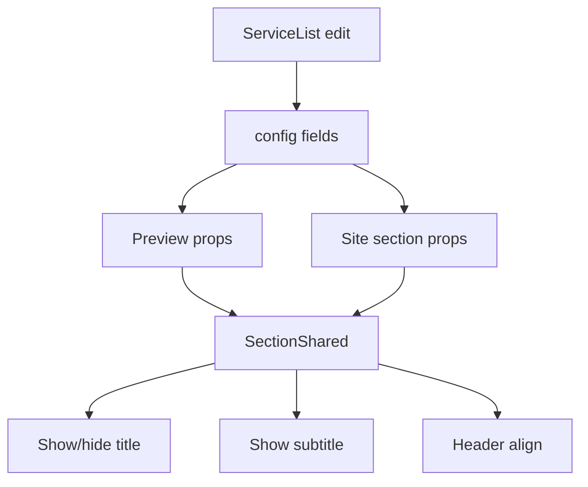

# I. Primer

## 1. TL;DR kiểu Feynman
- Trang `services` đã có block điều khiển phần đầu: bật/tắt title, bật/tắt subtitle, nhập subtitle, canh trái/giữa/phải.
- Trang `service-list` hiện chỉ có `Tiêu đề hiển thị` và `Trạng thái`, nên thiếu đúng block mà bạn muốn copy sang.
- Muốn làm đúng scope thì không chỉ thêm UI ở trang edit, mà còn phải nối dữ liệu này vào config + preview/site renderer của `service-list` để nút mới thật sự có tác dụng.
- Đây là thay đổi nhỏ nhưng chạm 4 điểm: `edit page` → `_types` → `preview/site section` → `shared renderer`.

## 2. Elaboration & Self-Explanation
Hiện tại `services` và `service-list` không dùng chung cùng một contract cho phần header.

- `services` edit page đã có state riêng cho `showTitle`, `showSubtitle`, `subtitle`, `headerAlign`.
- `service-list` edit page chưa có các state này.
- `ServiceListConfig` cũng chưa khai báo các field tương ứng.
- `ServiceListPreview` và `components/site/ServiceListSection.tsx` mới chỉ truyền mỗi `title` xuống renderer.
- `ServiceListSectionShared.tsx` hiện render heading cứng từ `sectionTitle`, chưa có khái niệm ẩn title / hiện subtitle / canh header.

Nói ngắn gọn: ở `service-list`, block này chưa tồn tại cả ở tầng dữ liệu lẫn tầng hiển thị. Nếu chỉ copy UI form thì bấm toggle xong cũng không ảnh hưởng preview/site.

## 3. Concrete Examples & Analogies
- Ví dụ mong muốn sau khi sửa:
  - Tắt `Hiển thị title` ở `/admin/home-components/service-list/.../edit` thì preview `Danh sách Dịch vụ` không còn dòng tiêu đề lớn.
  - Bật `Hiển thị subtitle`, nhập `ok`, chọn `Giữa` thì preview/site hiện subtitle nằm giữa ngay dưới title.
- Analogy: hiện `service-list` mới có cái “vỏ công tắc” cho title chính; việc cần làm là lắp đủ dây điện phía sau để 4 control mới thật sự bật/tắt được đèn.

# II. Audit Summary (Tóm tắt kiểm tra)
- Observation: `app/admin/home-components/services/[id]/edit/page.tsx:273-323` đã có block đầy đủ gồm `Hiển thị title`, `Hiển thị subtitle`, `Subtitle`, `Căn tiêu đề / subtitle`.
- Observation: `app/admin/home-components/service-list/[id]/edit/page.tsx:257-281` hiện chỉ có input `Tiêu đề hiển thị` và toggle `Trạng thái`.
- Observation: `app/admin/home-components/service-list/_types/index.ts:19-25` chưa có `showTitle`, `showSubtitle`, `subtitle`, `headerAlign` trong `ServiceListConfig`.
- Observation: `app/admin/home-components/service-list/_components/ServiceListPreview.tsx` chỉ nhận `title?: string`.
- Observation: `components/site/ServiceListSection.tsx` chỉ truyền `sectionTitle={title}` vào `ServiceListSectionShared`.
- Observation: `app/admin/home-components/service-list/_components/ServiceListSectionShared.tsx` đang render heading từ `sectionTitle` ở nhiều layout branch, chưa có contract header linh hoạt.

# III. Root Cause & Counter-Hypothesis (Nguyên nhân gốc & Giả thuyết đối chứng)
- Triệu chứng quan sát được: route `service-list` edit không có block header controls giống `services`; route `services` thì có.
- Phạm vi ảnh hưởng: admin editor `service-list`, preview của `service-list`, và runtime site render `service-list`.
- Tái hiện: vào `/admin/home-components/service-list/[id]/edit` sẽ không thấy `Hiển thị title`, `Hiển thị subtitle`, `Subtitle`, `Căn tiêu đề / subtitle`.
- Mốc thay đổi gần nhất: không thấy field tương ứng trong `ServiceListConfig` nên đây là thiếu implementation chứ không phải bug dữ liệu runtime.
- Dữ liệu đang thiếu để kết luận chắc chắn: không thiếu; code hiện tại đủ evidence.
- Giả thuyết thay thế: có thể `service-list` cố tình tối giản không hỗ trợ subtitle/header align; tuy nhiên user yêu cầu rõ là muốn parity với `services`, nên giả thuyết này không còn là hướng phù hợp.
- Rủi ro nếu fix sai nguyên nhân: chỉ thêm form mà không nối config/render sẽ tạo UI “giả”, người dùng tưởng hoạt động nhưng preview/site không đổi.
- Tiêu chí pass/fail sau khi sửa: các control mới xuất hiện ở edit page và thay đổi của chúng phản ánh đúng trên preview/site.

Root Cause Confidence (Độ tin cậy nguyên nhân gốc): High — thiếu cả UI state, type config và render wiring ở nhánh `service-list`.

# IV. Proposal (Đề xuất)

## 1. Hướng triển khai được đề xuất
Áp dụng parity tối thiểu từ `services` sang `service-list`, không mở rộng thêm behavior mới ngoài 4 control bạn nêu.

### a) Sửa `app/admin/home-components/service-list/_types/index.ts`
Thêm các field mới vào `ServiceListConfig`:
- `showTitle?: boolean`
- `showSubtitle?: boolean`
- `subtitle?: string`
- `headerAlign?: 'left' | 'center' | 'right'`

Lý do: `service-list` hiện chưa có nơi lưu contract này.

### b) Sửa `app/admin/home-components/service-list/[id]/edit/page.tsx`
- Thêm state local cho 4 field trên.
- Khi load `component.config`, map default tương tự pattern của `services`:
  - `showTitle`: mặc định `true`
  - `showSubtitle`: mặc định `true` hoặc `Boolean(subtitle cũ)` tùy pattern đang có ở `services`; khi code sẽ đọc file để match đúng style hiện hữu.
  - `subtitle`: mặc định `''`
  - `headerAlign`: mặc định `'left'`
- Thêm block UI ngay sau input `Tiêu đề hiển thị`, bám sát markup/pattern toggle/button group của `services`.
- Cập nhật `toSnapshot`, `initialSnapshot`, `currentSnapshot`, `handleSubmit` để 4 field này được lưu đúng vào `config`.
- Truyền 4 field xuống `ServiceListPreview`.

### c) Sửa `app/admin/home-components/service-list/_components/ServiceListPreview.tsx`
Mở rộng props để nhận:
- `showTitle?: boolean`
- `showSubtitle?: boolean`
- `subtitle?: string`
- `headerAlign?: 'left' | 'center' | 'right'`

Sau đó truyền tiếp xuống `ServiceListSectionShared`.

### d) Sửa `components/site/ServiceListSection.tsx`
- Đọc 4 field mới từ `config`.
- Apply default an toàn nếu dữ liệu cũ chưa có field.
- Truyền tiếp xuống `ServiceListSectionShared`.

### e) Sửa `app/admin/home-components/service-list/_components/ServiceListSectionShared.tsx`
Tạo contract render header chung cho các layout của `service-list`:
- nếu `showTitle !== false` thì render `sectionTitle`
- nếu `showSubtitle === true` và `subtitle` có nội dung thì render subtitle
- apply class canh lề theo `headerAlign`

Vì file này đang có nhiều branch layout, sẽ chọn cách thay đổi tối thiểu:
- thêm props mới cho component
- tạo helper/class chung cho header alignment
- thay chỗ render heading hiện tại bằng header block dùng chung ở các layout đang có title

Không đụng phần card/list/carousel item nếu không liên quan.

# V. Files Impacted (Tệp bị ảnh hưởng)
- Sửa: `app/admin/home-components/service-list/[id]/edit/page.tsx`
  - Vai trò hiện tại: trang chỉnh sửa admin cho home-component `service-list`.
  - Thay đổi: thêm block UI parity với `services`, load/save 4 field header mới vào config.

- Sửa: `app/admin/home-components/service-list/_types/index.ts`
  - Vai trò hiện tại: định nghĩa type config/style cho `service-list`.
  - Thay đổi: bổ sung 4 field header để config có contract rõ ràng.

- Sửa: `app/admin/home-components/service-list/_components/ServiceListPreview.tsx`
  - Vai trò hiện tại: preview admin của `service-list`.
  - Thay đổi: nhận và forward các prop header mới xuống shared renderer.

- Sửa: `components/site/ServiceListSection.tsx`
  - Vai trò hiện tại: wrapper runtime site, đọc data thực và render `service-list`.
  - Thay đổi: đọc 4 field từ config và truyền cho shared renderer.

- Sửa: `app/admin/home-components/service-list/_components/ServiceListSectionShared.tsx`
  - Vai trò hiện tại: renderer dùng chung cho preview/site của `service-list`.
  - Thay đổi: hỗ trợ show/hide title, subtitle và align header cho các style hiện có.

# VI. Execution Preview (Xem trước thực thi)
1. Đọc lại pattern default/state ở `services` để bám đúng convention.
2. Mở rộng `ServiceListConfig` cho 4 field header.
3. Gắn state + snapshot + submit wiring ở `service-list` edit page.
4. Truyền props mới qua `ServiceListPreview` và `ServiceListSection`.
5. Cập nhật `ServiceListSectionShared` để render header theo contract mới.
6. Static review nhanh toàn bộ đường đi config → preview/site.
7. Chạy `bunx tsc --noEmit`.
8. Commit local, không push.

# VII. Verification Plan (Kế hoạch kiểm chứng)
- Static verify:
  - `service-list` edit page có 4 control mới.
  - `ServiceListConfig` có đủ 4 field mới.
  - preview và site đều truyền đủ prop header xuống `ServiceListSectionShared`.
  - renderer không còn phụ thuộc title cứng duy nhất.
- Typecheck:
  - chạy `bunx tsc --noEmit`.
- Manual verify cho tester:
  - tại `/admin/home-components/service-list/.../edit`, thấy `Hiển thị title`, `Hiển thị subtitle`, `Subtitle`, `Căn tiêu đề / subtitle`.
  - tắt title thì preview không hiện title.
  - bật subtitle + nhập text thì preview hiện subtitle.
  - đổi trái/giữa/phải thì heading block đổi canh lề tương ứng.
  - save xong reload trang, state vẫn giữ nguyên.

# VIII. Todo
- [ ] Thêm 4 field header vào `ServiceListConfig`.
- [ ] Thêm block controls parity vào `service-list` edit page và nối snapshot/save.
- [ ] Truyền props header mới qua preview/site wrappers.
- [ ] Cập nhật `ServiceListSectionShared` để render header theo config.
- [ ] Chạy `bunx tsc --noEmit`.
- [ ] Commit local, không push.

# IX. Acceptance Criteria (Tiêu chí chấp nhận)
- Route `/admin/home-components/service-list/[id]/edit` có đầy đủ block:
  - `Hiển thị title`
  - `Hiển thị subtitle`
  - `Subtitle`
  - `Căn tiêu đề / subtitle`
- 4 control trên lưu được vào config của `service-list`.
- Preview phản ánh đúng việc ẩn/hiện title, subtitle và canh lề.
- Site runtime của `service-list` cũng phản ánh cùng behavior, không chỉ preview.
- Dữ liệu cũ không vỡ: nếu config cũ chưa có field mới thì component vẫn render an toàn với default hợp lý.

# X. Risk / Rollback (Rủi ro / Hoàn tác)
- Rủi ro chính: `ServiceListSectionShared.tsx` có nhiều layout branch, nên nếu thay sai chỗ có thể làm lệch header spacing ở một số style.
- Cách giảm rủi ro: chỉ chạm phần header wrapper, không đụng item layout.
- Rollback: revert commit là đủ vì thay đổi nằm gọn trong 5 file, không đổi schema backend.

# XI. Out of Scope (Ngoài phạm vi)
- Không thêm control `desktopColumns`, `mediaPlacement`, `mediaAlign` cho `service-list`.
- Không refactor toàn bộ `service-list` renderer.
- Không đổi style system, màu sắc, data query, hoặc logic chọn dịch vụ.
- Không sửa các home-component khác ngoài `service-list`.

# XII. Open Questions (Câu hỏi mở)
Không có. Yêu cầu đã đủ rõ: thêm đúng block header controls của `services` sang `service-list` và làm cho nó hoạt động thật ở preview/site.