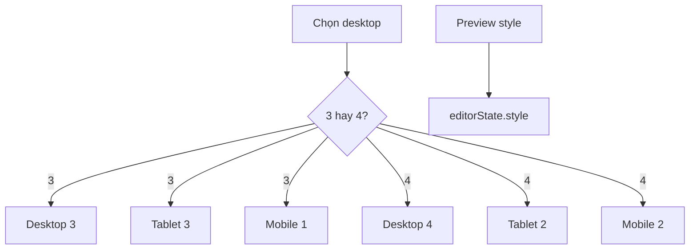

# I. Primer

## 1. TL;DR kiểu Feynman

- Benefits hiện còn `Style`, `Grid desktop`, `Grid mobile` trong `Cấu hình hiển thị`.
- Bạn muốn bỏ `Style` khỏi form vì style đã chọn ở thanh preview rồi.
- Bạn muốn bỏ `Grid desktop` + `Grid mobile`, thay bằng 1 control `Số cột desktop` giống Services.
- Mapping mới: desktop 4 → tablet 2, mobile 2; desktop 3 → tablet 3, mobile 1.
- Plan: chỉ để user chọn desktop 3/4; code tự suy ra tablet/mobile ở preview và site.

## 2. Elaboration & Self-Explanation

Hiện `BenefitsForm` đang quản lý cả 3 thứ:

- `Style`: select Cards/List/Bento/... nhưng preview cũng đã có style switch.
- `Grid desktop`: select 3/4 cột.
- `Grid mobile`: select 1/2 cột.

Điều này làm form hơi thừa và user phải tự chọn mobile dù đã có rule rõ ràng. Pattern Services dùng UI gọn hơn: chỉ một block `Số cột desktop` với 2 button `3 cột` và `4 cột`.

Với Benefits, rule mới nên là:

- `gridColumnsDesktop = 4`:
  - desktop: 4 cột
  - tablet: 2 cột
  - mobile: 2 cột
- `gridColumnsDesktop = 3`:
  - desktop: 3 cột
  - tablet: 3 cột
  - mobile: 1 cột

Như vậy `gridColumnsMobile` vẫn có thể tồn tại trong config để tương thích dữ liệu cũ, nhưng UI mới không cho chỉnh trực tiếp nữa.

## 3. Concrete Examples & Analogies

Ví dụ:

- User chọn `Số cột desktop = 4 cột` trong Benefits.
- Preview desktop hiện 4 card/hàng.
- Preview tablet hiện 2 card/hàng.
- Preview mobile hiện 2 card/hàng.

Nếu chọn `3 cột`:

- Preview desktop hiện 3 card/hàng.
- Preview tablet hiện 3 card/hàng.
- Preview mobile hiện 1 card/hàng.

Analogy: thay vì bắt người dùng chỉnh 3 cần số riêng, chỉ cần chọn “mode chính” là 3 hay 4 cột; hệ thống tự sang số phù hợp cho tablet/mobile.

# II. Audit Summary (Tóm tắt kiểm tra)

Observation / Evidence:

- `app/admin/home-components/benefits/_components/BenefitsForm.tsx`:
  - Đang import `BENEFITS_STYLES`, `BENEFITS_GRID_COLUMNS_DESKTOP`, `BENEFITS_GRID_COLUMNS_MOBILE`.
  - Đang render `Style`, `Grid desktop`, `Grid mobile` trong `Cấu hình hiển thị`.
  - CTA timeline phụ thuộc `state.style === 'timeline'`, nên vẫn giữ state style nhưng không cần form select.
- `app/admin/home-components/create/benefits/page.tsx` và `benefits/[id]/edit/page.tsx`:
  - Preview đã dùng `selectedStyle={editorState.style}` và `onStyleChange`, nên style switch ở preview là source-of-truth thao tác style.
- `app/admin/home-components/services/[id]/edit/page.tsx`:
  - Pattern `Số cột desktop` dùng 2 button `[3,4]`, class selected/unselected qua `cn`, label `{option} cột`.
- `BenefitsSectionShared.tsx`:
  - Preview hiện tablet luôn `grid-cols-2`.
  - Site hiện tablet luôn `md:grid-cols-2` rồi desktop `lg:grid-cols-3/4`.
  - Mobile hiện dựa `gridColumnsMobile`.

Inference:

- Bỏ Style khỏi form chỉ cần xóa UI/import/updateStyle; state style vẫn giữ để preview switch + CTA timeline hoạt động.
- Bỏ Grid mobile khỏi UI cần đổi render grid để suy ra mobile/tablet từ desktop columns, nếu không config cũ `gridColumnsMobile` vẫn chi phối mobile.

# III. Root Cause & Counter-Hypothesis (Nguyên nhân gốc & Giả thuyết đối chứng)

Root Cause Confidence: High.

1. Triệu chứng expected vs actual:
   - Expected: form Benefits gọn như Services, chỉ chọn `Số cột desktop`; style chọn ở preview.
   - Actual: form vẫn có `Style`, `Grid desktop`, `Grid mobile`.
2. Phạm vi ảnh hưởng:
   - Create/edit Benefits form, Benefits preview, Benefits site runtime grid classes.
3. Tái hiện tối thiểu:
   - Mở create/edit Benefits thấy các field thừa trong `Cấu hình hiển thị`.
4. Mốc thay đổi gần nhất:
   - Sau các commit dọn duplicate header và mở style switch, style switch preview đã đủ để thay thế field Style trong form.
5. Dữ liệu thiếu:
   - Chưa runtime test browser do đang ở spec mode; evidence từ source code.
6. Giả thuyết thay thế:
   - Có thể giữ `Grid mobile` để user tùy biến sâu hơn. Nhưng yêu cầu đã nêu mapping cụ thể, nên hướng đúng là bỏ control mobile và tự suy ra.
7. Rủi ro fix sai:
   - Nếu chỉ bỏ UI mà không đổi `BenefitsSectionShared`, preview/site vẫn có thể dùng `gridColumnsMobile` cũ và không theo rule mới.
8. Tiêu chí pass/fail:
   - Pass khi form không còn Style/Grid mobile, chỉ còn `Số cột desktop`; preview/site grid đúng mapping 3/4.

# IV. Proposal (Đề xuất)

Legend: `Preview style` = thanh Cards/List/Bento/Row/Carousel/Timeline trong preview.

## 1. BenefitsForm

- Xóa import không còn dùng:
  - `BENEFITS_STYLES`
  - `BENEFITS_GRID_COLUMNS_MOBILE`
  - `BenefitsStyle` nếu chỉ dùng cho `updateStyle`.
- Xóa function `updateStyle`.
- Xóa UI `Style` select.
- Xóa UI `Grid mobile` select.
- Đổi `Grid desktop` thành UI button giống Services:
  - Label: `Số cột desktop`.
  - 2 button: `3 cột`, `4 cột`.
  - Khi chọn `3`: set `gridColumnsDesktop: 3`, đồng thời set `gridColumnsMobile: 1` để payload mới nhất nhất quán.
  - Khi chọn `4`: set `gridColumnsDesktop: 4`, đồng thời set `gridColumnsMobile: 2`.

## 2. BenefitsSectionShared grid mapping

- Thêm helper suy ra responsive columns từ desktop:
  - `toGridColumnsMobileByDesktop(3) => 1`, `toGridColumnsMobileByDesktop(4) => 2`.
  - `toPreviewGridClass('tablet', 3) => 'grid-cols-3'`.
  - `toPreviewGridClass('tablet', 4) => 'grid-cols-2'`.
- Site classes:
  - Desktop 3: `grid-cols-1 md:grid-cols-3 lg:grid-cols-3` hoặc equivalent để tablet 3.
  - Desktop 4: `grid-cols-2 md:grid-cols-2 lg:grid-cols-4`.
- Áp dụng cho cả `cards` và `row` grid vì cả hai đang dùng cùng grid class.
- `gridColumnsMobile` giữ trong config/type để tương thích, nhưng rule mới ưu tiên `gridColumnsDesktop`.

## 3. Persist/config compatibility

- Không xóa `gridColumnsMobile` khỏi type/config để tránh phá dữ liệu cũ và payload hiện có.
- `toPersistConfig` vẫn có thể lưu `gridColumnsMobile` theo state đã tự sync từ desktop.
- `toEditorState` vẫn đọc `gridColumnsMobile` cũ, nhưng sau khi user đổi desktop thì sẽ sync theo rule mới.
- Không đổi default: hiện default desktop 4/mobile 2 đã khớp rule.

# V. Files Impacted (Tệp bị ảnh hưởng)

- Sửa: `app/admin/home-components/benefits/_components/BenefitsForm.tsx` — bỏ Style/Grid mobile; đổi Grid desktop thành `Số cột desktop` dạng button giống Services.
- Sửa: `app/admin/home-components/benefits/_components/BenefitsSectionShared.tsx` — đổi logic responsive grid để desktop 3 → tablet 3/mobile 1, desktop 4 → tablet 2/mobile 2.
- Có thể sửa nhẹ: `app/admin/home-components/benefits/_lib/constants.ts` — nếu `BENEFITS_GRID_COLUMNS_MOBILE` không còn nơi dùng thì xóa export hoặc để lại nếu muốn tương thích; ưu tiên xóa nếu unused.
- Không cần sửa create/edit page nếu form tự sync `gridColumnsMobile` và preview đã controlled style.

# VI. Execution Preview (Xem trước thực thi)

1. Chỉnh `BenefitsForm` theo pattern Services.
2. Chỉnh `BenefitsSectionShared` helper grid preview/site.
3. Rà constants/types/imports để bỏ unused.
4. Review tĩnh các path create/edit/preview/site.
5. Commit thay đổi; theo repo instruction không tự chạy lint/build/test.

# VII. Verification Plan (Kế hoạch kiểm chứng)

Static verification:

- `BenefitsForm` không còn text `Style`, `Grid desktop`, `Grid mobile`.
- `BenefitsForm` có label `Số cột desktop` và button `3 cột`, `4 cột`.
- `BenefitsSectionShared` tablet preview không còn hardcode `grid-cols-2` cho mọi desktop mode.
- Không còn import unused `BENEFITS_STYLES`, `BENEFITS_GRID_COLUMNS_MOBILE`, `BenefitsStyle` trong `BenefitsForm`.

Manual runtime verification cho tester:

1. Mở create Benefits và edit Benefits.
2. Xác nhận `Cấu hình hiển thị` không còn `Style` và `Grid mobile`.
3. Chọn `3 cột`:
   - Preview desktop 3 cột.
   - Preview tablet 3 cột.
   - Preview mobile 1 cột.
4. Chọn `4 cột`:
   - Preview desktop 4 cột.
   - Preview tablet 2 cột.
   - Preview mobile 2 cột.
5. Bấm style trong preview vẫn đổi layout và lưu đúng.
6. Site thực render theo cùng mapping.

# VIII. Todo

- [ ] Bỏ Style và Grid mobile khỏi BenefitsForm.
- [ ] Thêm control `Số cột desktop` kiểu Services.
- [ ] Sync desktop 3/4 sang mobile 1/2 trong editor state.
- [ ] Đổi BenefitsSectionShared responsive grid mapping cho preview/site.
- [ ] Dọn import/constants unused.
- [ ] Review tĩnh và commit.

# IX. Acceptance Criteria (Tiêu chí chấp nhận)

- Create và edit Benefits không còn field `Style` trong form.
- Style vẫn đổi được qua preview style switch.
- Create và edit Benefits không còn field `Grid mobile`.
- Form chỉ có `Số cột desktop` với `3 cột` và `4 cột`, UI giống Services.
- Desktop 4 → tablet 2, mobile 2.
- Desktop 3 → tablet 3, mobile 1.
- Không phá dữ liệu cũ vì `gridColumnsMobile` vẫn được giữ tương thích.

# X. Risk / Rollback (Rủi ro / Hoàn tác)

Rủi ro:

- Grid row/list style có thể nhìn chật hơn ở tablet 3 cột khi content dài. Nhưng đây là mapping user yêu cầu, nên áp dụng nhất quán.
- Nếu có dữ liệu cũ mobile 1/2 khác rule, sau thay đổi UI/render sẽ ưu tiên desktop mapping thay vì giá trị mobile cũ.

Rollback:

- Revert commit là đủ, không có migration dữ liệu.

# XI. Out of Scope (Ngoài phạm vi)

- Không đổi danh sách 6 style Benefits.
- Không đổi visual card/list/bento/row/carousel/timeline ngoài số cột responsive.
- Không migrate data Convex.
- Không chạy lint/build/test theo instruction repo.