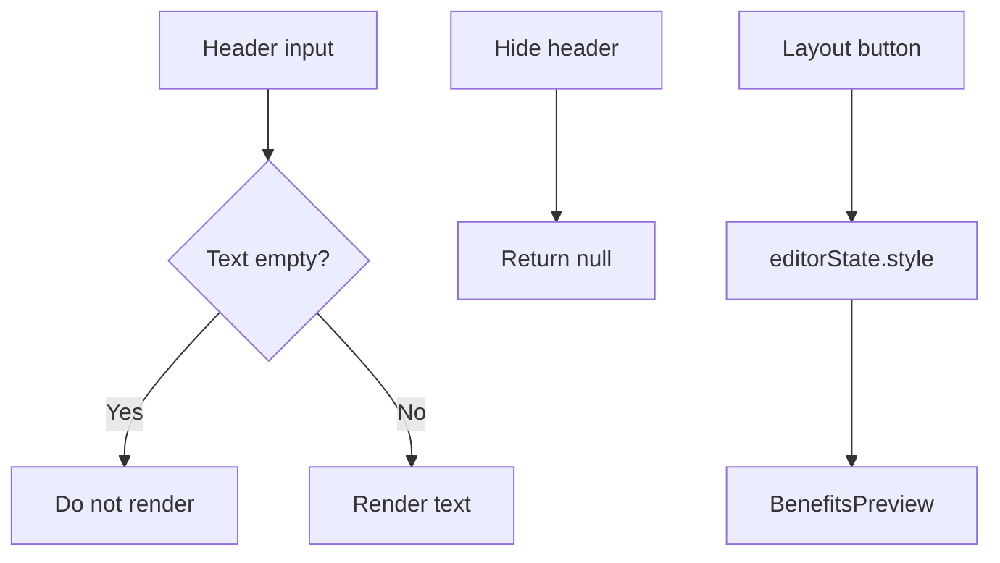

# I. Primer

## 1. TL;DR kiểu Feynman

- Có 2 lỗi thật trong `/admin/home-components/create/benefits` sau lần dọn duplicate.
- Lỗi header: preview đang fallback sang `heading/subHeading` cũ nên title/subtitle rỗng vẫn có thể hiện lại text cũ/default; `SectionHeader` cũng có thể trả wrapper margin dù không có nội dung nếu toggle vẫn bật.
- Lỗi layout bị lock: create page không truyền `selectedStyle` và `onStyleChange` vào `BenefitsPreview`, nên bấm layout chỉ đổi local preview tạm thời nhưng không đổi state thật; render luôn quay về `cards`.
- Plan sửa nhỏ: preview create/edit dùng header mới đúng nghĩa “rỗng là ẩn”, và truyền style state để layout buttons đổi được.

## 2. Elaboration & Self-Explanation

Hiện `BenefitsPreview` đang có logic:

- `previewStyle = selectedStyle ?? 'cards'`.
- Create page không truyền `selectedStyle`, không truyền `onStyleChange`.
- Khi bấm style trong `PreviewWrapper`, callback có gọi `onStyleChange?.(...)`, nhưng vì create page không truyền callback nên không có state nào đổi. Vì vậy `previewStyle` luôn là `cards`.

Header cũng đang bị fallback quá mạnh:

- `title={title || config?.heading || 'Giá trị cốt lõi'}` khiến title trống bị thay bằng `heading` legacy/default.
- `previewSubtitle = subtitle || subHeading` khiến subtitle trống bị thay bằng `subHeading` legacy/default.
- `previewBadgeText = badgeText || subHeading` cũng tương tự.
- `SectionHeader` chỉ return null nếu `hideHeader` hoặc tất cả toggle đều false. Nếu toggle bật nhưng text rỗng, wrapper vẫn có `mb-8 md:mb-12`, tạo spacing rỗng.

Do yêu cầu của bạn là “Subtitle hay title nếu trống thì ẩn khỏi preview và site thực” và “Ẩn toàn bộ header mất hết, không chiếm spacing”, source-of-truth nên là text mới trong `HeaderConfigSection`; fallback legacy chỉ nên dùng khi record cũ thật sự chưa có shared header config, không dùng trong create form mới.

## 3. Concrete Examples & Analogies

Ví dụ create Benefits:

- Nếu `Tiêu đề hiển thị = ''`, preview/site không được hiện `Giá trị cốt lõi` nữa.
- Nếu `Subtitle = ''`, preview/site không được hiện `Vì sao chọn chúng tôi?` nữa.
- Nếu bật `Ẩn toàn bộ header`, preview/site chỉ còn cards/list/bento..., không còn khoảng trống header.
- Nếu bấm `List`, `Bento`, `Row`, `Carousel`, `Timeline`, preview phải đổi layout ngay và lưu theo layout đó.

Analogy: trước đó preview giống như “ô trống thì tự điền đáp án mẫu”. Yêu cầu mới là “ô trống nghĩa là không hiển thị”, nên phải bỏ auto-fill ở create/edit mới.

# II. Audit Summary (Tóm tắt kiểm tra)

Observation / Evidence:

- `app/admin/home-components/benefits/_components/BenefitsPreview.tsx`:
  - `previewStyle = selectedStyle ?? 'cards'`.
  - `setPreviewStyle` chỉ gọi `onStyleChange?.(...)`.
  - Header đang dùng `title || config?.heading || 'Giá trị cốt lõi'` và subtitle/badge fallback sang `subHeading`.
- `app/admin/home-components/create/benefits/page.tsx`:
  - `<BenefitsPreview ...>` không truyền `selectedStyle={editorState.style}` và không truyền `onStyleChange`.
- `app/admin/home-components/_shared/components/SectionHeader.tsx`:
  - Nếu `showTitle/showSubtitle/showBadge` vẫn true nhưng text đều rỗng, component vẫn return wrapper `
`, gây spacing rỗng.
- `components/site/ComponentRenderer.tsx` và `components/site/home/sections/BenefitsRuntimeSection.tsx`:
  - Subtitle site đang dùng `headerConfig.subtitle || benefitsConfig.subHeading`, có thể làm subtitle trống vẫn fallback về legacy subHeading.

Inference:

- Layout bị lock ở create là do thiếu controlled style props.
- Header rỗng vẫn hiển thị/chiếm spacing là do fallback legacy/default và `SectionHeader` chưa null khi không có nội dung thực.

# III. Root Cause & Counter-Hypothesis (Nguyên nhân gốc & Giả thuyết đối chứng)

Root Cause Confidence: High.

1. Triệu chứng expected vs actual:
   - Expected: title/subtitle trống thì ẩn; hideHeader không chiếm spacing; layout buttons đổi preview.
   - Actual: header có thể fallback text cũ/default hoặc spacing rỗng; layout create bị giữ ở cards.
2. Phạm vi ảnh hưởng:
   - Benefits create preview, Benefits edit preview, Benefits site runtime qua `ComponentRenderer`/`BenefitsRuntimeSection`; `SectionHeader` shared có thể ảnh hưởng các component khác nếu sửa trực tiếp.
3. Tái hiện tối thiểu:
   - Mở create Benefits, bấm List/Bento/... preview vẫn Cards.
   - Xóa title/subtitle hoặc bật hide header, preview vẫn có fallback/spacing rỗng tùy trạng thái.
4. Mốc thay đổi gần nhất:
   - Commit vừa rồi chuyển Benefits sang shared `SectionHeader`, nhưng chưa chỉnh style controlled props và empty-header semantics.
5. Dữ liệu thiếu:
   - Chưa runtime test browser do spec mode/read-only; evidence đang từ source code.
6. Giả thuyết thay thế:
   - Có thể `heading/subHeading` fallback được thiết kế cho legacy data; vẫn hợp lý cho record cũ, nhưng không hợp lý cho create mới khi user cố tình để trống.
7. Rủi ro fix sai:
   - Nếu bỏ fallback toàn cục quá mạnh, record cũ có thể mất subtitle. Giải pháp là chỉ fallback khi không có shared header config, hoặc chỉ dùng fallback ở site legacy path có điều kiện.
8. Tiêu chí pass/fail:
   - Pass khi create preview đổi layout được; title/subtitle/badge rỗng không render và không chiếm spacing; hideHeader remove toàn bộ header; site không double/blank spacing.

# IV. Proposal (Đề xuất)

Legend: `Header input` = title/subtitle/badge trong `HeaderConfigSection`; `editorState.style` = state layout của Benefits.

## 1. Sửa layout switch bị lock

- Trong `create/benefits/page.tsx`, truyền vào `BenefitsPreview`:
  - `selectedStyle={editorState.style}`
  - `onStyleChange={(style) => setEditorState(prev => ({ ...prev, style }))}`
- Như edit page đang làm, nhưng áp dụng cho create.

## 2. Sửa empty header không render và không chiếm spacing

Sửa ở `SectionHeader` shared theo hướng an toàn:

- Trim text trước khi render:
  - `const cleanTitle = title?.trim() ?? ''`
  - `const cleanSubtitle = subtitle?.trim() ?? ''`
  - `const cleanBadgeText = badgeText?.trim() ?? ''`
- Tính nội dung thực:
  - `hasTitle = showTitle && cleanTitle.length > 0`
  - `hasSubtitle = showSubtitle && cleanSubtitle.length > 0`
  - `hasBadge = showBadge && cleanBadgeText.length > 0`
- Nếu `hideHeader || (!hasTitle && !hasSubtitle && !hasBadge) return null`.
- Như vậy wrapper `mb-8 md:mb-12` cũng biến mất khi không có nội dung thật.

Đây là sửa shared nhưng behavior đúng với tên component: header không có phần tử nào thì không nên chiếm layout spacing.

## 3. Sửa fallback legacy trong Benefits preview/site

- Trong `BenefitsPreview`, không fallback title/subtitle/badge sang `heading/subHeading` cho create/edit mới khi prop title/subtitle/badge được truyền.
- `title` nên dùng đúng `title?.trim()`; nếu rỗng thì không render title.
- `subtitle` dùng đúng `config.subtitle`; nếu rỗng thì không render subtitle.
- `badgeText` dùng đúng `config.badgeText`; nếu rỗng thì không render badge.

Với site:

- Trong `BenefitsRuntimeSection.tsx` và inline `BenefitsSection` trong `ComponentRenderer.tsx`, đổi `subtitle={headerConfig.subtitle || benefitsConfig.subHeading}` thành logic có điều kiện:
  - Nếu config có shared header fields (`subtitle`, `badgeText`, `showTitle`, `showSubtitle`, `showBadge`, `hideHeader`) thì dùng shared header đúng nghĩa, không fallback khi rỗng.
  - Nếu record cũ không có shared header fields thì mới fallback `benefitsConfig.subHeading` để không phá dữ liệu cũ.

# V. Files Impacted (Tệp bị ảnh hưởng)

- Sửa: `app/admin/home-components/create/benefits/page.tsx` — hiện preview không nhận controlled style props. Sẽ truyền `selectedStyle` và `onStyleChange`.
- Sửa: `app/admin/home-components/benefits/_components/BenefitsPreview.tsx` — hiện fallback header sang legacy/default. Sẽ dùng header text mới đúng semantics “trống là ẩn”.
- Sửa: `app/admin/home-components/_shared/components/SectionHeader.tsx` — hiện có thể chiếm margin khi text rỗng. Sẽ return null nếu không có nội dung thực.
- Sửa: `components/site/home/sections/BenefitsRuntimeSection.tsx` — hiện subtitle fallback legacy vô điều kiện. Sẽ fallback có điều kiện để create mới để trống thì site cũng ẩn.
- Sửa: `components/site/ComponentRenderer.tsx` — inline BenefitsSection có cùng fallback legacy; sẽ đồng bộ với runtime section.
- Có thể sửa: `app/admin/home-components/benefits/[id]/edit/page.tsx` nếu cần truyền flag/metadata phân biệt shared header config, nhưng ưu tiên xử lý trong preview/runtime bằng kiểm tra field tồn tại.

# VI. Execution Preview (Xem trước thực thi)

1. Thêm controlled style props cho `BenefitsPreview` ở create page.
2. Cập nhật `SectionHeader` để trim text và return null khi không có nội dung thật.
3. Cập nhật `BenefitsPreview` bỏ fallback default/legacy cho title/subtitle/badge trong preview mới.
4. Thêm helper nhỏ tại runtime Benefits để phát hiện config có shared header hay chưa.
5. Áp dụng helper cho `BenefitsRuntimeSection.tsx` và `ComponentRenderer.tsx` để giữ legacy fallback có điều kiện.
6. Review tĩnh: check imports, optional fields, no spacing header, no double header, layout switch flow.
7. Commit thay đổi sau khi user duyệt; theo repo instruction không tự chạy lint/build/test.

# VII. Verification Plan (Kế hoạch kiểm chứng)

Static verification:

- `create/benefits/page.tsx` có `selectedStyle={editorState.style}` và `onStyleChange`.
- `SectionHeader` có `return null` khi không có title/subtitle/badge thực.
- `BenefitsPreview` không còn fallback `|| 'Giá trị cốt lõi'` cho title khi người dùng để trống.
- Site Benefits không còn `subtitle={headerConfig.subtitle || benefitsConfig.subHeading}` fallback vô điều kiện.

Manual runtime verification cho tester:

1. Mở `/admin/home-components/create/benefits`.
2. Bấm từng layout `Cards/List/Bento/Row/Carousel/Timeline`, preview phải đổi ngay.
3. Xóa title: preview không hiện title.
4. Xóa subtitle: preview không hiện subtitle.
5. Xóa badge: preview không hiện badge.
6. Bật `Ẩn toàn bộ header`: header biến mất hoàn toàn, không còn khoảng trống phía trên layout.
7. Lưu component và xem site thực: behavior giống preview.

# VIII. Todo

- [ ] Truyền `selectedStyle/onStyleChange` ở create Benefits.
- [ ] Sửa `SectionHeader` để không render wrapper khi text rỗng.
- [ ] Sửa `BenefitsPreview` bỏ fallback title/subtitle/badge cho create/edit mới.
- [ ] Sửa runtime Benefits fallback legacy có điều kiện.
- [ ] Review tĩnh và commit.

# IX. Acceptance Criteria (Tiêu chí chấp nhận)

- Ở create Benefits, bấm layout nào preview đổi layout đó, không bị lock ở Cards.
- Title trống thì không hiển thị title trong preview/site.
- Subtitle trống thì không hiển thị subtitle trong preview/site.
- Badge trống thì không hiển thị badge trong preview/site.
- `Ẩn toàn bộ header` làm mất toàn bộ header và không chiếm spacing.
- Dữ liệu Benefits legacy chưa có shared header config vẫn có fallback hợp lý, không mất nội dung cũ ngoài ý muốn.

# X. Risk / Rollback (Rủi ro / Hoàn tác)

Rủi ro:

- Sửa `SectionHeader` là shared change, có thể làm các component khác không còn spacing header rỗng. Đây thường là behavior đúng, nhưng vẫn là ảnh hưởng rộng nhẹ.
- Legacy fallback có điều kiện cần viết cẩn thận để record cũ không mất subtitle.

Rollback:

- Revert commit là đủ, không có migration dữ liệu.

# XI. Out of Scope (Ngoài phạm vi)

- Không đổi thiết kế visual của các layout Benefits.
- Không migrate database hàng loạt.
- Không sửa các component khác ngoài tác động tự nhiên của `SectionHeader` empty-state.
- Không chạy lint/build/test theo instruction repo.