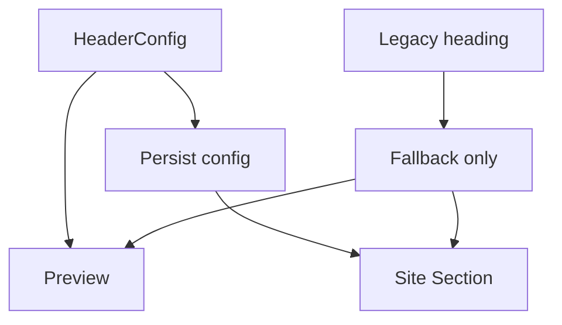

# I. Primer

## 1. TL;DR kiểu Feynman

- Đúng là Benefits đang có 2 nơi cùng cấu hình header: `Tiêu đề & Mô tả` và một phần trong `Cấu hình hiển thị`.
- Trùng chính: `Badge text`, `Tiêu đề chính`, và `Căn badge + tiêu đề` trong `BenefitsForm` đang overlap với `HeaderConfigSection`.
- Preview create hiện đang lấy header từ field cũ `heading/subHeading`, nên chỉnh ở `Tiêu đề & Mô tả` không phản ánh đúng preview.
- Site runtime mới hơn đang dùng `SectionHeader` và có `skipHeader`, nên phần header source-of-truth nên là `HeaderConfigSection`.
- Plan: bỏ các field header cũ khỏi UI form, map preview sang header config mới, giữ backward compatibility khi record cũ còn `heading/subHeading`.

## 2. Elaboration & Self-Explanation

Benefits có 2 lớp header cùng tồn tại:

- `HeaderConfigSection`: quản lý `title`, `subtitle`, `badgeText`, `showTitle`, `showSubtitle`, `showBadge`, `headerAlign`, `hideHeader`, ... Đây là hệ header shared mới.
- `BenefitsForm` trong card `Cấu hình hiển thị`: vẫn còn `state.subHeading`, `state.heading`, `state.headerAlign`. Đây là cách cũ để render badge/heading nội bộ của `BenefitsSectionShared`.

Vấn đề là người dùng có thể nhập tiêu đề ở `Tiêu đề & Mô tả`, nhưng preview create lại gọi:

- `BenefitsPreview config={toPersistConfig(editorState)}`
- `BenefitsPreview` truyền `title={config?.heading || 'Giá trị cốt lõi'}`
- `BenefitsSectionShared` render header bằng `config.heading/subHeading`

Nên preview có thể không chạy theo section `Tiêu đề & Mô tả`. Trong edit page còn lệch hơn: preview chỉ truyền `heading/subHeading`, không truyền `gridColumnsDesktop/gridColumnsMobile/headerAlign` đầy đủ, nên một phần config hiển thị cũng không phản ánh đủ.

## 3. Concrete Examples & Analogies

Ví dụ trong create Benefits:

- User nhập `Tiêu đề hiển thị = Cam kết của chúng tôi` ở `Tiêu đề & Mô tả`.
- Nhưng `Cấu hình hiển thị > Tiêu đề chính` vẫn là `Giá trị cốt lõi`.
- Preview sẽ hiển thị `Giá trị cốt lõi`, khiến user tưởng phần `Tiêu đề & Mô tả` không hoạt động.

Analogy: như có 2 công tắc cùng điều khiển một bóng đèn, nhưng preview chỉ nghe công tắc cũ. Muốn gọn và đúng thì chỉ giữ 1 công tắc chính, công tắc cũ chỉ dùng để đọc dữ liệu cũ khi cần migrate/fallback.

# II. Audit Summary (Tóm tắt kiểm tra)

Observation / Evidence:

- `app/admin/home-components/create/benefits/page.tsx`: đã render `HeaderConfigSection` với `title/subtitle/badgeText/headerAlign/...` nhưng preview vẫn truyền `config={toPersistConfig(editorState)}` không merge header state mới.
- `app/admin/home-components/benefits/_components/BenefitsForm.tsx`: card `Cấu hình hiển thị` có field `Badge text`, `Tiêu đề chính`, `Căn badge + tiêu đề`.
- `app/admin/home-components/benefits/_components/BenefitsPreview.tsx`: tạo `sectionConfig` từ `config.heading`, `config.subHeading`, `config.headerAlign` rồi render `BenefitsSectionShared` không dùng `SectionHeader` shared mới.
- `app/admin/home-components/benefits/_components/BenefitsSectionShared.tsx`: vẫn có `renderHeader()` riêng, dùng `config.heading/subHeading/headerAlign`, và có `skipHeader` để bỏ header nội bộ.
- `components/site/home/sections/BenefitsRuntimeSection.tsx`: site runtime đã dùng `SectionHeader` ngoài, rồi gọi `BenefitsSectionShared skipHeader={true}`. Đây là hướng đúng hơn cho shared header.
- `components/site/ComponentRenderer.tsx`: vẫn có một `BenefitsSection` cũ render `BenefitsSectionShared` không `skipHeader`, cần audit wiring thực tế để tránh chỉnh một surface mà site vẫn dùng path cũ.

Inference:

- Duplicate không chỉ là UI thừa, mà còn tạo 2 source-of-truth cho header.
- Ảnh hưởng preview rõ nhất ở create page: preview không phản ánh `HeaderConfigSection`.
- Edit page có load/save header config mới, nhưng preview vẫn không dùng đầy đủ header config mới.

# III. Root Cause & Counter-Hypothesis (Nguyên nhân gốc & Giả thuyết đối chứng)

Root Cause Confidence: High.

Lý do: evidence trực tiếp cho thấy Benefits đang được nâng cấp sang shared `HeaderConfigSection`, nhưng `BenefitsForm`, `BenefitsPreview`, và một path runtime cũ vẫn giữ contract header riêng `heading/subHeading/headerAlign`.

Audit root-cause theo checklist:

1. Triệu chứng expected vs actual:
   - Expected: section `Tiêu đề & Mô tả` là nơi duy nhất điều khiển title/subtitle/badge/header align và preview phản ánh đúng.
   - Actual: `Cấu hình hiển thị` còn `Badge text`, `Tiêu đề chính`, `Căn badge + tiêu đề`; preview dùng các field này.
2. Phạm vi ảnh hưởng:
   - `/admin/home-components/create/benefits`, `/admin/home-components/benefits/[id]/edit`, preview Benefits, và site Benefits runtime tùy renderer path.
3. Tái hiện tối thiểu:
   - Mở create Benefits, đổi `Tiêu đề hiển thị` trong `Tiêu đề & Mô tả`, giữ `Tiêu đề chính` trong `Cấu hình hiển thị`; preview vẫn theo `Tiêu đề chính`.
4. Mốc thay đổi gần nhất:
   - Git log gần đây có nhiều commit thêm shared header cho components; Benefits có vẻ đang ở trạng thái rollout chưa dọn field legacy.
5. Dữ liệu thiếu:
   - Chưa xác nhận route site hiện dùng `BenefitsRuntimeSection` hay function `BenefitsSection` trong `ComponentRenderer.tsx` ở mọi path.
6. Giả thuyết thay thế:
   - Có thể `heading/subHeading` được giữ cố ý cho layout-specific heading riêng. Tuy nhiên site runtime mới đã dùng `SectionHeader` và `skipHeader`, nên khả năng này thấp với requirement “gọn gàng hợp lý”.
7. Rủi ro fix sai:
   - Record cũ chỉ có `heading/subHeading` có thể mất header nếu không fallback/migrate mềm.
8. Tiêu chí pass/fail:
   - Pass khi UI không còn field header duplicate trong `Cấu hình hiển thị`, preview phản ánh `Tiêu đề & Mô tả`, và dữ liệu cũ vẫn hiển thị header qua fallback.

# IV. Proposal (Đề xuất)

Đề xuất chọn 1 source-of-truth: `HeaderConfigSection`.

Legend: `HeaderConfig` = title/subtitle/badge/header controls mới; `Legacy heading` = `heading/subHeading` cũ.

Các thay đổi chính:

1. Gỡ duplicate khỏi `BenefitsForm`
   - Bỏ UI `Badge text` (`state.subHeading`).
   - Bỏ UI `Tiêu đề chính` (`state.heading`).
   - Bỏ UI `Căn badge + tiêu đề` (`state.headerAlign`).
   - Giữ các cấu hình thực sự thuộc layout: `Style`, `Grid desktop`, `Grid mobile`, `CTA timeline`, danh sách benefit items.

2. Cập nhật preview dùng shared header config
   - `BenefitsPreview` nhận thêm props/header config hoặc truyền `config` đầy đủ gồm `hideHeader/showTitle/subtitle/showSubtitle/headerAlign/titleColorPrimary/subtitleAboveTitle/uppercaseText/showBadge/badgeText` và `title`.
   - Render `SectionHeader` trong preview, sau đó gọi `BenefitsSectionShared skipHeader={true}` để giống `BenefitsRuntimeSection`.
   - Fallback mềm: nếu `subtitle` rỗng thì có thể dùng `subHeading`; nếu `badgeText` rỗng thì có thể dùng legacy `subHeading` chỉ cho dữ liệu cũ, nhưng không expose input cũ.

3. Cập nhật create page
   - Khi gọi `BenefitsPreview`, truyền config đã merge header state mới, không chỉ `toPersistConfig(editorState)`.
   - Khi submit vẫn lưu header config mới.
   - Cân nhắc set legacy `heading/subHeading` từ title/subtitle hoặc để nguyên default chỉ để backward compatibility. Recommended: không tiếp tục mutate từ UI mới, nhưng giữ type field optional.

4. Cập nhật edit page
   - `BenefitsPreview` trong edit truyền đầy đủ: grid columns, header config mới, title.
   - `toEditorState` vẫn đọc `heading/subHeading` để không phá record cũ, nhưng form không còn cho sửa trực tiếp.
   - Khi save, lưu header config mới; có thể giữ legacy fields trong payload nếu đang có để tránh migration scope lớn, nhưng preview/site ưu tiên header config mới.

5. Audit site renderer path
   - Nếu route đang dùng `BenefitsRuntimeSection`, giữ pattern hiện tại: `SectionHeader` + `BenefitsSectionShared skipHeader`.
   - Nếu `ComponentRenderer.tsx` vẫn dùng inline `BenefitsSection`, cập nhật inline section cho parity: extract header config, render `SectionHeader`, gọi `BenefitsSectionShared skipHeader`.

# V. Files Impacted (Tệp bị ảnh hưởng)

UI / admin:

- Sửa: `app/admin/home-components/benefits/_components/BenefitsForm.tsx` — hiện chứa field cấu hình layout và field header legacy chung một card. Sẽ bỏ 3 field duplicate header khỏi `Cấu hình hiển thị`.
- Sửa: `app/admin/home-components/benefits/_components/BenefitsPreview.tsx` — hiện preview render header nội bộ qua `BenefitsSectionShared`. Sẽ render header theo `SectionHeader` shared và skip header nội bộ.
- Sửa: `app/admin/home-components/create/benefits/page.tsx` — hiện preview không nhận header state mới. Sẽ truyền config/title/header đầy đủ vào preview.
- Sửa: `app/admin/home-components/benefits/[id]/edit/page.tsx` — hiện preview edit không nhận đầy đủ header/grid config mới. Sẽ truyền đủ config để preview đúng với form.

Shared / runtime:

- Sửa nhỏ nếu cần: `app/admin/home-components/benefits/_components/BenefitsSectionShared.tsx` — giữ `skipHeader`, có thể không cần đổi nếu preview chuyển sang `SectionHeader` ngoài.
- Sửa nếu wiring thực tế cần: `components/site/ComponentRenderer.tsx` — inline BenefitsSection cũ cần parity với `BenefitsRuntimeSection` nếu còn được dùng.
- Không ưu tiên sửa: `components/site/home/sections/BenefitsRuntimeSection.tsx` — đã có pattern đúng: `SectionHeader` + `skipHeader`.

Types/constants:

- Sửa nhẹ: `app/admin/home-components/benefits/_types/index.ts` và `_lib/constants.ts` nếu cần đánh dấu `heading/subHeading` là legacy/fallback hoặc ngừng dùng trong default editor state. Không xóa field ngay để tránh phá dữ liệu cũ.

# VI. Execution Preview (Xem trước thực thi)

1. Đọc thêm wiring trong `ComponentRenderer` để xác định Benefits runtime path chính.
2. Chỉnh `BenefitsForm`: bỏ các input duplicate, dọn imports/options không còn dùng.
3. Chỉnh `BenefitsPreview`: nhận `title` + header fields, dùng `SectionHeader`, truyền `skipHeader` cho `BenefitsSectionShared`.
4. Chỉnh create page: build một config preview/persist merge header state mới.
5. Chỉnh edit page: truyền đầy đủ header/grid config vào preview; giữ backward compatibility cho legacy fields.
6. Review tĩnh: kiểm tra type, unused imports, null-safety, fallback dữ liệu cũ, preview/site parity.
7. Commit thay đổi sau khi user duyệt và code hoàn tất; theo instruction repo không tự chạy lint/unit test/build.

# VII. Verification Plan (Kế hoạch kiểm chứng)

Do repo instruction cấm tự chạy lint/unit test, verification sẽ là static review + hướng dẫn tester runtime.

Static verification:

- Không còn `Label>Badge text</Label>`, `Label>Tiêu đề chính</Label>`, `Label>Căn badge + tiêu đề</Label>` trong `BenefitsForm`.
- `BenefitsPreview` có dùng header config mới hoặc `SectionHeader` shared.
- `BenefitsSectionShared` được gọi với `skipHeader={true}` khi header đã render ngoài.
- Create và edit preview đều truyền `gridColumnsDesktop/gridColumnsMobile/headerAlign` đúng nếu còn cần.
- TypeScript imports không dư sau khi bỏ constants/type legacy.

Manual runtime verification cho tester:

1. Mở `http://localhost:3000/admin/home-components/create/benefits`.
2. Đổi title/subtitle/badge trong `Tiêu đề & Mô tả`.
3. Confirm preview đổi theo đúng title/subtitle/badge.
4. Confirm `Cấu hình hiển thị` chỉ còn style/grid/CTA timeline, không còn field header duplicate.
5. Tạo component, mở edit lại, confirm dữ liệu header vẫn đúng.
6. Kiểm tra site render Benefits không bị double header.

# VIII. Todo

- [ ] Xác định Benefits runtime path chính trong `ComponentRenderer` / home sections.
- [ ] Bỏ UI field duplicate khỏi `BenefitsForm`.
- [ ] Đồng bộ `BenefitsPreview` với shared `SectionHeader` và `skipHeader`.
- [ ] Cập nhật create page truyền header config mới vào preview.
- [ ] Cập nhật edit page truyền header/grid config đầy đủ vào preview.
- [ ] Review backward compatibility cho record cũ có `heading/subHeading`.
- [ ] Review tĩnh và commit thay đổi.

# IX. Acceptance Criteria (Tiêu chí chấp nhận)

- `Cấu hình hiển thị` của Benefits không còn các field trùng với `Tiêu đề & Mô tả`: `Badge text`, `Tiêu đề chính`, `Căn badge + tiêu đề`.
- Preview create phản ánh thay đổi từ `Tiêu đề & Mô tả`.
- Preview edit phản ánh thay đổi từ `Tiêu đề & Mô tả` và layout config còn lại.
- Site không render double header.
- Dữ liệu cũ còn `heading/subHeading` không bị trắng header nếu chưa có header config mới.
- Không đổi behavior ngoài Benefits component.

# X. Risk / Rollback (Rủi ro / Hoàn tác)

Rủi ro:

- Nếu xóa hẳn `heading/subHeading` khỏi config/type, record cũ có thể mất heading. Vì vậy plan không xóa schema/config field ngay, chỉ bỏ input duplicate khỏi UI và chuyển sang fallback.
- Nếu `ComponentRenderer.tsx` inline BenefitsSection vẫn được dùng ở site, có thể còn lệch với `BenefitsRuntimeSection`. Cần audit wiring trước khi sửa.
- Nếu preview tự render `SectionHeader` ngoài mà quên `skipHeader`, sẽ double header.

Rollback:

- Revert commit là đủ vì thay đổi dự kiến chỉ nằm ở UI/rendering code, không migrate dữ liệu.
- Vì không xóa legacy fields, rollback không cần khôi phục data.

# XI. Out of Scope (Ngoài phạm vi)

- Không refactor toàn bộ shared header system cho các home-components khác.
- Không migrate database hàng loạt từ `heading/subHeading` sang `subtitle/badgeText`.
- Không đổi style/layout của benefit cards/list/bento/row/carousel/timeline ngoài phần header duplicate.
- Không chạy lint/build/test theo instruction repo.