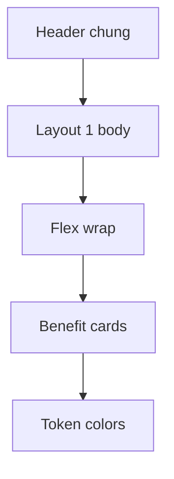

# I. Primer

## 1. TL;DR kiểu Feynman

- Đã đọc source mẫu `C:\Users\VTOS\Downloads\giải-pháp-doanh-nghiệp\app\page.tsx`.
- Mẫu tốt vì card nhỏ, gọn, căn giữa; desktop dùng flex-wrap 5 card, tablet 2/3 card, mobile 2 card mỗi hàng và item thứ 5 full width.
- Sẽ học theo đúng cấu trúc responsive, spacing, shadow, radius, font-size, icon circle, divider, number lớn mờ của mẫu.
- Vẫn giữ hệ thống token màu hiện tại: dùng `tokens.primary`, `tokens.iconSurfaceStrong`, `tokens.neutralText`, `tokens.mutedText`, `tokens.cardBorder`, không hardcode màu tím mẫu.
- Vẫn giữ `Tiêu đề & Mô tả` chung ở ngoài; chỉ đổi UI bên dưới của Layout 1.

## 2. Elaboration & Self-Explanation

Source mẫu render một section chỉ có danh sách 5 feature cards. Mỗi card có: icon circle ở trên, divider nhỏ, title text nhỏ đậm, description text nhỏ, số thứ tự rất lớn mờ nằm absolute đáy trái, border bottom màu primary. Responsive chính không phải grid cố định mà là `flex flex-wrap justify-center` với width theo breakpoint: mobile 2 card/hàng, tablet 2 card/hàng, large 3 card/hàng, xl 5 card/hàng; riêng card thứ 5 full width ở mobile/tablet trước khi về 3/5 columns.

Trong hệ thống hiện tại, layout 1 đang gần nhưng chưa giống vì card quá cao/rộng, icon/typography lớn hơn, dùng grid thay vì flex-wrap, radius quá lớn, shadow/spacing chưa giống mẫu. Hướng sửa sẽ thay nhánh `style === '1'` bằng pattern giống mẫu hơn, nhưng bind data động từ Benefits và dùng token màu của VietAdmin.

## 3. Concrete Examples & Analogies

Ví dụ mapping từ mẫu sang Benefits:
- `feature.title` -> `item.title`
- `feature.desc` -> `item.description`
- `feature.number` -> `(idx + 1).padStart(2, '0')`
- `feature.icon` -> `resolveBenefitsIcon(item.icon)`
- `bg-primary/text-primary/border-b-primary` -> token `tokens.primary` / `tokens.iconTextStrong` / primary border

Analogy: lần trước chỉ “lấy cảm hứng” từ ảnh; lần này sẽ “chép bố cục kỹ thuật” từ component mẫu, rồi thay màu cố định bằng token hệ thống.

# II. Audit Summary (Tóm tắt kiểm tra)

- Observation: mẫu nằm tại `C:\Users\VTOS\Downloads\giải-pháp-doanh-nghiệp\app\page.tsx`.
- Observation: mẫu dùng `flex flex-wrap justify-center gap-3 md:gap-4 lg:gap-6 xl:gap-5`, không dùng grid.
- Observation: card mẫu dùng `rounded-lg`, shadow nhẹ, `border-b-[3px]`, padding rất gọn (`pt-3 sm:pt-4 pb-2 px-3 md:px-4`).
- Observation: typography mẫu nhỏ hơn hiện tại: title `13px/14px`, description `11px/12px`, icon `36px/40px`, number `44px/48px`.
- Observation: hiện tại `BenefitsSectionShared.tsx` layout 1 đã được sửa ở commit trước nhưng vẫn khác mẫu do dùng grid/card lớn/rounded 28/min-height 260.
- Decision: refit layout 1 theo source mẫu, không tiếp tục tinh chỉnh mơ hồ theo ảnh.

# III. Root Cause & Counter-Hypothesis (Nguyên nhân gốc & Giả thuyết đối chứng)

- Root Cause Confidence: High.
- Nguyên nhân: Implementation trước chưa bám source mẫu cụ thể; chỉ phỏng theo ảnh nên sai responsive, spacing, kích thước card, typography và layout flow.
- Counter-hypothesis 1: Chỉ cần giảm kích thước card hiện tại. Không đủ, vì responsive mẫu dùng flex width theo breakpoint và item thứ 5 có rule riêng.
- Counter-hypothesis 2: Cần copy cả màu `#3b28ed/#F0EDFF`. Không chọn vì user yêu cầu vẫn tuân theo token color của web hiện tại.
- Counter-hypothesis 3: Cần đổi logic form/items. Không chọn vì data contract đã đủ; chỉ UI layout 1 sai.

# IV. Proposal (Đề xuất)

1. Sửa lại nhánh `style === '1'` trong `BenefitsSectionShared.tsx` theo source mẫu:
   - wrapper nội dung dùng `flex flex-wrap justify-center`;
   - gap: `gap-3 md:gap-4 lg:gap-6 xl:gap-5` tương đương mẫu;
   - card width:
     - mobile/tablet: 2 card/hàng;
     - item thứ 5 full width trước breakpoint `lg`;
     - `lg`: 3 card/hàng;
     - `xl`: 5 card/hàng;
   - card style: `rounded-lg`, shadow nhẹ, border mảnh, `border-bottom` 3px theo primary token;
   - padding gọn như mẫu.
2. Card content theo mẫu:
   - icon circle căn giữa, kích thước gần `3.8rem/4.2rem`;
   - icon dùng `resolveBenefitsIcon(item.icon)` với màu token;
   - divider nhỏ `w-8 h-[2px]` dùng token primary;
   - title `13px/14px`, bold, center, clamp 2;
   - description `11px/12px`, medium, center, clamp 3 hoặc 4;
   - number absolute bottom-left, font-black, màu primary token opacity thấp hoặc icon surface token để tương tự `#F0EDFF`.
3. Decorative visuals:
   - bỏ arrow SVG lớn đã thêm trước vì source mẫu không có arrow trong code;
   - giữ `showDecorativeVisuals` cho decoration nhẹ trong card nếu cần, nhưng không làm khác mẫu quá nhiều;
   - nếu `showDecorativeVisuals=false`, có thể ẩn vòng decorative phụ, nhưng layout chính vẫn giữ.
4. Token color compliance:
   - không dùng `#3b28ed`, `#F0EDFF`, `#F4F7FF` từ mẫu;
   - dùng `tokens.primary`, `tokens.iconSurfaceStrong`, `tokens.iconTextStrong`, `tokens.neutralText`, `tokens.mutedText`, `tokens.cardBorder`, `tokens.neutralSurface`.
5. Giữ logic header chung:
   - không đổi `BenefitsPreview.tsx`, `BenefitsRuntimeSection.tsx`, `ComponentRenderer.tsx` trừ khi type/layout wrapper bắt buộc;
   - không đổi create/edit form;
   - không đổi layout 2–6.

Legend: `Header chung` = Tiêu đề & Mô tả hiện tại; `Layout 1 body` = phần sẽ sửa.

# V. Files Impacted (Tệp bị ảnh hưởng)

- Sửa: `app/admin/home-components/benefits/_components/BenefitsSectionShared.tsx` — thay lại UI nhánh `style === '1'` để bám source mẫu chính xác hơn.
- Không sửa dự kiến: `app/admin/home-components/benefits/_components/BenefitsPreview.tsx` — vẫn giữ header chung và truyền shared layout như hiện tại.
- Không sửa dự kiến: `app/admin/home-components/create/benefits/page.tsx` — create vẫn dùng `BenefitsPreview` và state hiện tại.
- Không sửa dự kiến: `app/admin/home-components/benefits/[id]/edit/page.tsx` — edit vẫn load/save config như hiện tại.
- Không sửa dự kiến: `components/site/home/sections/BenefitsRuntimeSection.tsx` và `components/site/ComponentRenderer.tsx` — runtime vẫn dùng shared component.

# VI. Execution Preview (Xem trước thực thi)

1. Re-read `BenefitsSectionShared.tsx` nhánh layout 1 sau commit trước.
2. Replace layout 1 grid/arrow/card lớn bằng flex-wrap/card nhỏ theo source mẫu.
3. Map style classes từ mẫu sang token inline styles.
4. Review header không bị đụng và layout 2–6 không đổi.
5. Chạy `bunx tsc --noEmit` vì có đổi TSX; không chạy lint/build.
6. Commit thay đổi mới, không push.

# VII. Verification Plan (Kế hoạch kiểm chứng)

- Static review:
  - only `style === '1'` thay đổi;
  - không hardcode màu mẫu;
  - `SectionHeader` vẫn giữ nguyên;
  - responsive width bám source mẫu.
- Typecheck: chạy `bunx tsc --noEmit`.
- Manual visual check cho tester:
  - edit URL user đưa: Layout 1 body giống source mẫu hơn rõ rệt;
  - create Benefits: layout 1 giống edit;
  - mobile preview: 2 card/hàng, card thứ 5 full width như mẫu;
  - desktop rộng: 5 card/hàng.

# VIII. Todo

- [ ] Refit layout 1 body theo `Downloads/giải-pháp-doanh-nghiệp/app/page.tsx`.
- [ ] Đảm bảo màu dùng token hệ thống, không hardcode màu mẫu.
- [ ] Review header chung không bị thay đổi.
- [ ] Chạy `bunx tsc --noEmit`.
- [ ] Commit thay đổi, không push.

# IX. Acceptance Criteria (Tiêu chí chấp nhận)

- Layout 1 Benefits dùng bố cục flex-wrap và card dimensions giống source mẫu.
- Desktop rộng hiển thị 5 card/hàng; breakpoint nhỏ giống mẫu ở mức class/layout.
- Icon circle, divider, title, description, number lớn mờ, border-bottom giống mẫu về cấu trúc.
- Màu lấy từ token hiện tại, không copy hardcode palette mẫu.
- `Tiêu đề & Mô tả` chung vẫn giữ nguyên logic.
- Layout 2–6 không đổi.

# X. Risk / Rollback (Rủi ro / Hoàn tác)

- Rủi ro: source mẫu dùng Tailwind primary riêng, còn hệ thống token có thể tạo sắc độ khác; nhưng đây là đúng yêu cầu token color.
- Rủi ro: nếu preview container quá hẹp, 2-card mobile có thể chật với text dài; sẽ dùng clamp/padding gọn như mẫu.
- Rollback: revert commit mới hoặc khôi phục nhánh `style === '1'` về commit trước.

# XI. Out of Scope (Ngoài phạm vi)

- Không sửa dữ liệu thật của component ID.
- Không đổi field/config/schema.
- Không đổi layout 2–6.
- Không copy toàn bộ project mẫu vào repo.

# XII. Open Questions (Câu hỏi mở)

- Không có câu hỏi bắt buộc. Vì user đã chỉ rõ source mẫu cần học theo, sẽ bám source đó và thay màu bằng token hệ thống.