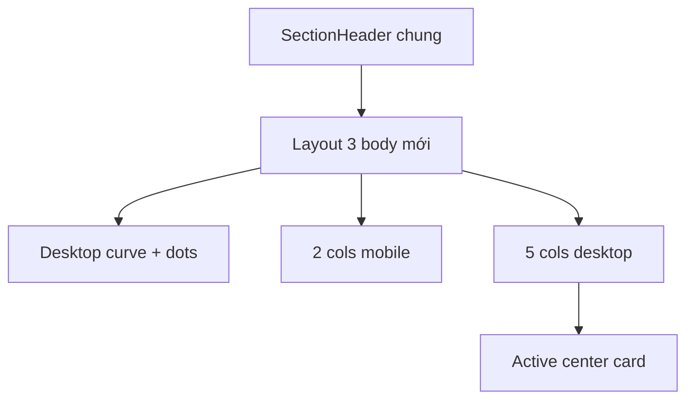

# I. Primer

## 1. TL;DR kiểu Feynman

- Đã đọc source mẫu `C:\Users\VTOS\Downloads\layout-3-benefit\app\page.tsx`.
- Layout 3 hiện tại khác mẫu khá nhiều: đang là split 2 cột với khối text + ảnh bên trái và cards bên phải.
- Mẫu bạn thiết kế là 5 card nổi trên một đường cong nền, card giữa active màu xanh/brand, grid 2 cột ở mobile và 5 cột ở desktop.
- Sẽ refit Layout 3 để giống source mẫu nhất có thể, nhưng vẫn map sang token màu hiện tại của web.
- Preview và site sẽ cùng dùng chung `BenefitsSectionShared`, nên phải giữ parity như các layout trước.

## 2. Elaboration & Self-Explanation

Hiện `style === '3'` trong `BenefitsSectionShared.tsx` đang render một layout business khác hẳn: có một khối visual lớn bên trái, badge số lượng, tiêu đề, mô tả, ảnh minh hoạ; bên phải là grid card. Source mẫu mới thì không có split hero như vậy. Nó là một khối duy nhất gồm:

- nền trắng sạch,
- một hàng 5 card (mobile 2 cột, desktop 5 cột),
- card giữa là active card tô màu primary,
- phía sau có đường cong SVG + 5 dots chỉ hiện desktop,
- mỗi card có số lớn mờ ở góc trên trái,
- icon dạng arc stroke + inner white circle,
- card cuối có star badge nhỏ.

Vì bạn yêu cầu “giống y chang thư mục này”, hướng đúng không phải tinh chỉnh layout cũ mà là thay hoàn toàn nhánh `style === '3'` bằng cấu trúc gần 1-1 theo source mẫu, rồi thay màu hardcode bằng token hệ thống.

## 3. Concrete Examples & Analogies

Ví dụ mapping từ source mẫu sang hệ thống Benefits:
- `feature.number` -> `(idx + 1).toString().padStart(2, '0')`
- `feature.title` -> `item.title`
- `feature.desc` -> `item.description`
- `feature.icon` -> `resolveBenefitsIcon(item.icon)`
- `isActive = i === 2` -> card index 2 hoặc `highlightIndex` nếu muốn bám config hiện có

Analogy: layout cũ giống “hero + list benefits”. Layout mẫu mới giống “5 milestone cards trên một curve”. Đây là thay khung trình bày chính, không phải chỉ đổi màu hay spacing.

# II. Audit Summary (Tóm tắt kiểm tra)

- Observation: source mẫu nằm ở `C:\Users\VTOS\Downloads\layout-3-benefit\app\page.tsx`.
- Observation: source mẫu dùng `grid grid-cols-2 lg:grid-cols-5` với card thứ 5 `col-span-2 lg:col-span-1`.
- Observation: source mẫu có desktop-only background curve SVG + 5 dots ở layer nền.
- Observation: card active là index 2 (`i === 2`) với nền primary, text trắng, shadow mạnh hơn.
- Observation: layout 3 hiện tại trong `BenefitsSectionShared.tsx` là split 2 cột + visual image, không cùng cấu trúc với mẫu.
- Observation: `BenefitsPreview.tsx` đã truyền `previewDevice={device}` nên vẫn có thể làm preview parity theo khung preview khi cần.

# III. Root Cause & Counter-Hypothesis (Nguyên nhân gốc & Giả thuyết đối chứng)

- Root Cause Confidence: High.
- Nguyên nhân: Layout 3 hiện tại được xây theo concept khác hoàn toàn source mẫu, nên không thể “giống hơn” chỉ bằng tweak nhỏ.
- Counter-hypothesis 1: Chỉ cần chỉnh card bên phải của layout cũ. Không đủ vì source mẫu không có split panel trái/phải.
- Counter-hypothesis 2: Chỉ cần đổi responsive. Không đủ vì hierarchy, visual layers, active card, arc icon, curve SVG đều khác.
- Counter-hypothesis 3: Cần tạo component mới. Chưa cần, vì `BenefitsSectionShared` đã là source-of-truth đúng chỗ cho 6 layouts.

# IV. Proposal (Đề xuất)

1. Thay toàn bộ nhánh `style === '3'` trong `BenefitsSectionShared.tsx` bằng cấu trúc gần 1-1 theo source mẫu:
   - outer section sạch, centered;
   - desktop-only curve SVG + 5 dots nằm absolute phía dưới;
   - grid `2 cột mobile / 5 cột desktop`;
   - item cuối `col-span-2` ở mobile/tablet và `col-span-1` ở desktop.
2. Giữ header chung hiện tại:
   - `SectionHeader` bên ngoài vẫn giữ nguyên ở preview/site;
   - layout 3 chỉ đổi UI body bên dưới header.
3. Mapping visual từ mẫu sang token hệ thống:
   - `#1A63F4` -> `tokens.primary`
   - card active background -> `tokens.primary`
   - card active text -> trắng hoặc APCA-safe text tương ứng
   - card thường border/shadow -> `tokens.cardBorder`, `tokens.neutralSurface`
   - số mờ -> màu từ `tokens.iconSurfaceStrong` hoặc tint từ `tokens.primary`
   - curve/dots -> `tokens.primary` với opacity phù hợp
4. Active card behavior:
   - ưu tiên dùng `highlightIndex` hiện có thay vì hardcode index 2, để vẫn bám config hệ thống;
   - nếu `highlightIndex` invalid thì fallback index 2 hoặc clamp hiện có.
5. Icon treatment:
   - render arc stroke SVG quanh icon như source mẫu;
   - inner white circle giữ consistent;
   - item cuối có star badge nhỏ như source mẫu nếu có thể map an toàn theo index cuối.
6. Responsive preview/site parity:
   - preview mobile/tablet phải branch theo `previewDevice`, không phụ thuộc viewport admin;
   - site thật vẫn dùng breakpoint viewport thật.
7. Likely obsolete fields trong layout 3:
   - `visualImage` sẽ không còn dùng trong style 3 mới vì source mẫu không có visual image lớn;
   - field vẫn giữ trong config để tránh breaking data contract, nhưng style 3 có thể bỏ qua nó.

Legend: `SectionHeader chung` = phần tiêu đề/mô tả vẫn giữ nguyên ngoài layout body.

# V. Files Impacted (Tệp bị ảnh hưởng)

- Sửa: `app/admin/home-components/benefits/_components/BenefitsSectionShared.tsx` — thay toàn bộ UI nhánh `style === '3'` để bám source mẫu `layout-3-benefit`.
- Không sửa dự kiến: `app/admin/home-components/benefits/_components/BenefitsPreview.tsx` — vẫn giữ header chung và truyền `previewDevice` như hiện tại.
- Không sửa dự kiến: `components/site/home/sections/BenefitsRuntimeSection.tsx` — runtime dùng shared component nên tự hưởng layout 3 mới.
- Không sửa dự kiến: `components/site/ComponentRenderer.tsx` — giữ wiring hiện tại.
- Không sửa dự kiến: create/edit pages — không cần đổi load/save config vì vẫn dùng `style`, `highlightIndex`, `items` hiện có.

# VI. Execution Preview (Xem trước thực thi)

1. Re-read layout 3 hiện tại trong `BenefitsSectionShared.tsx`.
2. Port cấu trúc JSX từ source mẫu sang nhánh `style === '3'`.
3. Replace màu hardcode bằng token hệ thống.
4. Dùng `highlightIndex` làm active card state.
5. Thêm preview-device branch để mobile/tablet preview giống site.
6. Review tĩnh header chung và layouts 1/2/4/5/6 không đổi.
7. Chạy `bunx tsc --noEmit`.
8. Commit thay đổi, không push.

# VII. Verification Plan (Kế hoạch kiểm chứng)

- Static review:
  - `style === '3'` đã bám source mẫu theo structure chính;
  - không còn split left/right visual image cũ;
  - màu hardcode đã thay bằng token;
  - preview branch đo theo `previewDevice` nếu có class responsive đặc thù.
- Typecheck: chạy `bunx tsc --noEmit`.
- Manual visual check:
  - edit/create Layout 3 giống source mẫu nhất có thể;
  - desktop có curve + dots nền;
  - card active nổi bật đúng giữa/theo highlight index;
  - mobile là 2 cột, card cuối span 2;
  - site thật parity với preview.

# VIII. Todo

- [ ] Refit toàn bộ UI Layout 3 theo `Downloads/layout-3-benefit/app/page.tsx`.
- [ ] Map màu hardcode của mẫu sang token hệ thống.
- [ ] Giữ header chung và parity preview/site.
- [ ] Chạy `bunx tsc --noEmit`.
- [ ] Commit thay đổi, không push.

# IX. Acceptance Criteria (Tiêu chí chấp nhận)

- Layout 3 giống source `layout-3-benefit` ở cấu trúc chính, hierarchy và responsive.
- Desktop có 5 card theo hàng, có curve/dots nền như mẫu.
- Mobile/tablet có 2 cột và card cuối span 2 như mẫu.
- Active card nổi bật bằng primary token, các card còn lại giữ neutral surface.
- Header chung của Benefits không bị đổi logic.
- Preview và site có parity tốt.
- Layout 1/2/4/5/6 không đổi.

# X. Risk / Rollback (Rủi ro / Hoàn tác)

- Rủi ro: source mẫu dùng màu và shadow cứng, khi map sang token hệ thống có thể khác nhẹ về sắc độ nhưng sẽ đúng design system.
- Rủi ro: star badge/card active/index cuối là behavior mang tính presentational; sẽ ưu tiên mapping an toàn theo index/hightlightIndex hiện có.
- Rollback: revert commit mới hoặc khôi phục riêng nhánh `style === '3'`.

# XI. Out of Scope (Ngoài phạm vi)

- Không đổi schema/config fields.
- Không refactor các layout khác.
- Không đổi `PreviewWrapper` global.
- Không tạo asset mới ngoài SVG inline nếu cần cho curve/arc.

# XII. Open Questions (Câu hỏi mở)

- Không có câu hỏi bắt buộc vì bạn đã yêu cầu rất rõ: làm layout 3 giống tối đa source `C:\Users\VTOS\Downloads\layout-3-benefit`. Mặc định mình sẽ dùng `highlightIndex` hiện có làm active card để vẫn hợp logic hệ thống.