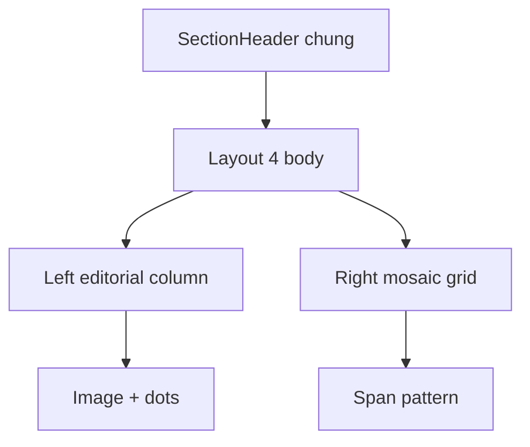

# I. Primer

## 1. TL;DR kiểu Feynman

- Đã đọc source mẫu `C:\Users\VTOS\Downloads\layout-4-benefit\app\page.tsx`.
- Layout 4 hiện tại khác mẫu rõ rệt: đang là split block có visual card gradient bên trái và list rows bên phải.
- Mẫu mới là 2 cột lớn: cột trái chứa eyebrow + line + heading + mô tả + image block; cột phải là grid benefits 2/6 cột với span pattern riêng.
- Sẽ thay toàn bộ nhánh `style === '4'` để bám source mẫu gần 1-1, nhưng dùng token màu hiện tại.
- Header chung của Benefits vẫn giữ nguyên; chỉ đổi body của layout 4.

## 2. Elaboration & Self-Explanation

Source mẫu layout 4 có cấu trúc hoàn toàn khác layout 4 hiện tại:

- **Cột trái**: giống một editorial block với eyebrow xanh, line nhỏ, heading lớn nhiều dòng, mô tả, và image block ở dưới kèm nền chấm xanh.
- **Cột phải**: là grid 6 cột desktop, 2 cột mobile, mỗi item có grid span khác nhau; item không phải list row mà là tile card có border grid rõ.
- Mỗi tile có icon circle xanh nhạt, số benefit màu primary, line nhỏ, title, desc.

Layout 4 hiện tại trong repo thì đang là: card gradient/visual ở trái và danh sách row border ở phải. Vì khác cả information architecture (kiến trúc thông tin) lẫn responsive grid, nên muốn “giống y chang” thì cần thay hẳn nhánh layout 4, không phải tweak layout cũ.

## 3. Concrete Examples & Analogies

Ví dụ mapping từ source mẫu sang Benefits hiện tại:
- eyebrow `Lợi ích vượt trội` -> dùng `sectionSubheading` hoặc fallback text khi không có
- heading lớn -> dùng `sectionHeading`
- đoạn mô tả trái -> ưu tiên `config.subHeading` nếu phù hợp hoặc text chung hiện có của section body
- image block -> dùng `visualImage` nếu có; fallback placeholder nếu không có
- right tiles:
  - number -> `(idx + 1).padStart(2, '0')`
  - title -> `item.title`
  - desc -> `item.description`
  - icon -> `resolveBenefitsIcon(item.icon)`

Analogy: layout hiện tại giống “thẻ giới thiệu + bảng danh sách”. Source mẫu giống “bài landing page editorial + mosaic benefits grid”.

# II. Audit Summary (Tóm tắt kiểm tra)

- Observation: source mẫu nằm tại `C:\Users\VTOS\Downloads\layout-4-benefit\app\page.tsx`.
- Observation: source mẫu dùng outer `flex flex-col lg:flex-row` với trái `38-40%`, phải `60-62%`.
- Observation: source mẫu dùng image block dưới cùng ở cột trái, có dot decoration SVG nằm absolute phía sau.
- Observation: grid phải là `grid-cols-2 lg:grid-cols-6` với span pattern riêng qua `getGridSpan()`.
- Observation: border pattern từng ô được điều khiển bởi `getBorderClasses()`.
- Observation: layout 4 hiện tại trong repo là split khác hẳn, có list row bên phải nên không match source mẫu.

# III. Root Cause & Counter-Hypothesis (Nguyên nhân gốc & Giả thuyết đối chứng)

- Root Cause Confidence: High.
- Nguyên nhân: Layout 4 hiện tại được thiết kế theo pattern khác source mẫu, nên không thể đạt độ giống cao chỉ bằng chỉnh spacing hoặc color.
- Counter-hypothesis 1: Chỉ cần sửa cột phải. Không đủ, vì cột trái source mẫu cũng khác rõ về heading scale, spacing, image placement, dot pattern.
- Counter-hypothesis 2: Chỉ cần sửa responsive. Không đủ, vì span pattern tile và border grid đều khác.
- Counter-hypothesis 3: Cần tạo component mới riêng. Chưa cần, vì shared component đang là nơi chuẩn cho 6 layout.

# IV. Proposal (Đề xuất)

1. Thay toàn bộ nhánh `style === '4'` trong `BenefitsSectionShared.tsx` bằng layout gần 1-1 theo source mẫu:
   - outer wrapper `flex-col lg:flex-row`;
   - trái `lg:w-[38%] xl:w-[40%]`, phải `lg:w-[62%] xl:w-[60%]`;
   - gap `6/8/0` đúng nhịp mẫu.
2. Cột trái:
   - dùng `sectionSubheading` làm eyebrow nếu có, fallback text hiện có;
   - line ngang nhỏ theo primary token;
   - heading lớn dùng `sectionHeading`;
   - body text dùng `subHeading`/mô tả section phù hợp;
   - image block dùng `visualImage`, fallback placeholder nếu không có;
   - dot decoration SVG nền sau image block dùng `tokens.primary` opacity.
3. Cột phải:
   - grid `grid-cols-2 lg:grid-cols-6`;
   - implement helper span/border pattern theo source mẫu:
     - item 1,2,3 = `lg:col-span-2`
     - item 4,5 = `lg:col-span-3`
     - item 5 mobile `col-span-2`
   - border classes theo từng index giống source mẫu.
4. Tile content:
   - icon circle xanh nhạt từ token;
   - number primary;
   - divider nhỏ primary;
   - title/desc center;
   - hover state nhẹ như source mẫu.
5. Preview/site parity:
   - preview mobile/tablet vẫn phải đo theo `previewDevice` nếu cần override layout shell;
   - site thật dùng breakpoint thật;
   - nếu class desktop-only trong preview gây lệch, sẽ branch riêng theo `context === 'preview'`.
6. Giữ logic hệ thống:
   - không đổi `SectionHeader` ngoài layout body;
   - không đổi schema/config;
   - `visualImage` tiếp tục dùng được cho layout 4 mới.

Legend: `SectionHeader chung` = phần title/subtitle/header config vẫn render ngoài body layout 4.

# V. Files Impacted (Tệp bị ảnh hưởng)

- Sửa: `app/admin/home-components/benefits/_components/BenefitsSectionShared.tsx` — thay toàn bộ nhánh `style === '4'` theo source mẫu `layout-4-benefit`.
- Không sửa dự kiến: `app/admin/home-components/benefits/_components/BenefitsPreview.tsx` — vẫn giữ header chung và truyền `previewDevice`.
- Không sửa dự kiến: `components/site/home/sections/BenefitsRuntimeSection.tsx` — runtime tiếp tục dùng shared component.
- Không sửa dự kiến: `components/site/ComponentRenderer.tsx` — giữ wiring hiện tại.
- Không sửa dự kiến: create/edit page logic — vẫn dùng fields hiện có, nhất là `visualImage`.

# VI. Execution Preview (Xem trước thực thi)

1. Re-read nhánh `style === '4'` hiện tại.
2. Port source mẫu `layout-4-benefit/app/page.tsx` sang JSX của layout 4.
3. Thay màu hardcode bằng token hệ thống.
4. Dùng `visualImage` cho image block trái.
5. Implement grid span + border helper theo index.
6. Review preview/site parity và header chung.
7. Chạy `bunx tsc --noEmit`.
8. Commit thay đổi, không push.

# VII. Verification Plan (Kế hoạch kiểm chứng)

- Static review:
  - layout 4 không còn là list rows cũ;
  - span pattern tiles khớp source mẫu;
  - image block trái + dot decoration tồn tại;
  - màu hardcode đã thay bằng token.
- Typecheck: chạy `bunx tsc --noEmit`.
- Manual visual check:
  - create/edit Layout 4 giống source mẫu gần nhất có thể;
  - desktop: trái editorial, phải mosaic grid;
  - mobile: 2 cột bên phải, item cuối span 2;
  - site thật parity với preview.

# VIII. Todo

- [ ] Refit toàn bộ UI Layout 4 theo `Downloads/layout-4-benefit/app/page.tsx`.
- [ ] Map màu hardcode của mẫu sang token hệ thống.
- [ ] Giữ header chung và parity preview/site.
- [ ] Chạy `bunx tsc --noEmit`.
- [ ] Commit thay đổi, không push.

# IX. Acceptance Criteria (Tiêu chí chấp nhận)

- Layout 4 giống source `layout-4-benefit` ở structure chính và responsive.
- Có cột trái editorial với image block + dots.
- Có cột phải grid 2/6 với span pattern giống mẫu.
- Màu dùng token hệ thống, không hardcode palette mẫu.
- Header chung của Benefits không đổi logic.
- Layout 1/2/3/5/6 không đổi.

# X. Risk / Rollback (Rủi ro / Hoàn tác)

- Rủi ro: source mẫu có image URL remote và hover effect; repo hiện tại dùng `visualImage`, nên fallback image có thể không giống 100% nếu chưa nhập ảnh.
- Rủi ro: preview mobile/tablet có thể cần branch riêng nếu viewport admin ảnh hưởng grid shell.
- Rollback: revert commit mới hoặc khôi phục riêng nhánh `style === '4'`.

# XI. Out of Scope (Ngoài phạm vi)

- Không đổi schema/config fields.
- Không refactor layout khác.
- Không đổi `PreviewWrapper` global.
- Không thêm thư viện mới.

# XII. Open Questions (Câu hỏi mở)

- Không có câu hỏi bắt buộc. Mặc định sẽ bám source `C:\Users\VTOS\Downloads\layout-4-benefit` tối đa và dùng `visualImage` hiện có cho image block.